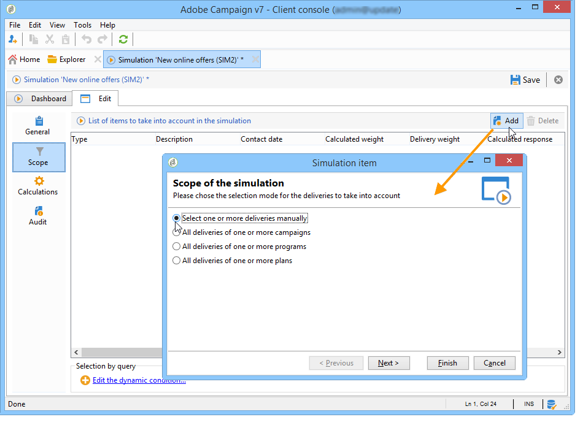
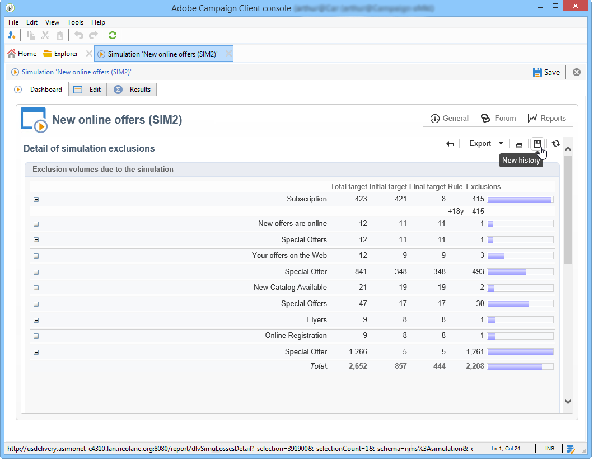

# Campagnesimulaties{#campaign-simulations}

## Informatie over simulaties {#about-simulations}

Met Campagneoptimalisatie kunt u de efficiëntie van een campagneplan testen met behulp van simulaties. Zo kunt u het potentiële succes van een campagne meten: gegenereerde inkomsten, doelvolume op basis van de toegepaste typologische regels, enz.

Met simulatie kunt u het effect van leveringen controleren en vergelijken.

>[!NOTE]
>
>Leveringen die in de testmodus worden voorbereid, hebben geen invloed op elkaar, bijvoorbeeld wanneer een campagne wordt beoordeeld in gedistribueerde marketing, of zolang de leveringen niet in de voorlopige kalender zijn gepland.\
>Dit betekent dat druk- en capaciteitsregels alleen worden toegepast op leveringen in **[!UICONTROL Target estimation and message personalization]** in. Leveringen in **[!UICONTROL Estimation and approval of the provisional target]** en in **[!UICONTROL Target evaluation]** geen rekening wordt gehouden met deze modus.\
>De leveringswijze wordt gekozen in **[!UICONTROL Typology]** subtabblad van de leveringseigenschappen.

## Een simulatie instellen {#setting-up-a-simulation}

### Een simulatie maken {#creating-a-simulation}

Voer de volgende stappen uit om een simulatie te maken:

1. Open de **[!UICONTROL Campaigns]** klikt u op de knop **[!UICONTROL More]** koppeling binnen de **[!UICONTROL Create]** en selecteert u de **[!UICONTROL Simulation]** optie.

   

1. Voer de sjabloon en de naam van de simulatie in. Klikken **[!UICONTROL Save]** om de simulatie te maken.

   

1. Klik op de knop **[!UICONTROL Edit]** gebruiken om het te configureren.

   

1. In de **[!UICONTROL Scope]** , geeft u de leveringen op die u voor deze simulatie wilt overwegen. Om dit te doen, klik **[!UICONTROL Add]** en geeft de wijze van de leveringsselectie aan waarmee rekening moet worden gehouden.

   

   U kunt elke levering één voor één selecteren of ze sorteren op campagne, programma of plan.

   >[!NOTE]
   >
   >Als u leveringen selecteert via een plan, programma of campagne, kan Adobe Campaign de lijst met leveringen automatisch vernieuwen om hiermee rekening te houden wanneer een simulatie wordt gestart. Om dit te doen, controleer **[!UICONTROL Refresh the selection of deliveries each time the simulation is started]** optie.
   >  
   >Als u dit niet doet, zullen om het even welke leveringen die niet beschikbaar in het plan, het programma, of de campagne zijn wanneer de simulatie wordt gecreeerd niet in aanmerking worden genomen: leveringen die later worden toegevoegd, worden genegeerd.

   

1. Selecteer de elementen die u in het simulatiebereik wilt opnemen. Selecteer indien nodig meerdere elementen met de toetsen SHIFT en CTRL.

   

   Klikken **[!UICONTROL Finish]** om de selectie goed te keuren.

   U kunt geselecteerde leveringen en leveringen die bij plannen, programma&#39;s of campagnes horen, handmatig combineren.

   

   Indien nodig kunt u een dynamische voorwaarde gebruiken via de **[!UICONTROL Edit the dynamic condition...]** koppeling.

   Klikken **[!UICONTROL Save]** om deze configuratie goed te keuren.

   >[!NOTE]
   >
   >Alleen leveringen waarvan het doel is berekend, worden in aanmerking genomen bij de berekening van de simulaties (statussen: **Doel gereed** of **Klaar voor levering**).

1. In de **[!UICONTROL Calculations]** , selecteert u bijvoorbeeld een analysedimensie zoals het ontvangende schema.

   

1. Vervolgens kunt u expressies toevoegen.

   

### Instellingen voor uitvoering {#execution-settings}

De **[!UICONTROL General]** tabblad van de simulatie kunt u uitvoeringsinstellingen invoeren:

* De **[!UICONTROL Schedule execution for down-time]** de optie versleept de simulatielancering aan een minder drukke tijdspanne, die op het gekozen niveau van prioriteit wordt gebaseerd. De simulaties gebruiken significante gegevensbestandmiddelen, dat is waarom de niet-urgente simulaties zouden moeten worden gepland om bij nacht, bijvoorbeeld te lopen.
* De **[!UICONTROL Priority]** is het niveau dat op de simulatie wordt toegepast om het teweegbrengen uit te stellen.
* **[!UICONTROL Save SQL queries in the log]**. Met SQL-logboeken kunt u een simulatie diagnosticeren als deze eindigt met fouten. Ze kunnen u ook helpen te achterhalen waarom een simulatie te langzaam is. Deze berichten zullen zichtbaar na de simulatie in **[!UICONTROL SQL logs]** subtabblad van het **[!UICONTROL Audit]** tab.

## Een simulatie uitvoeren {#executing-a-simulation}

### Een simulatie starten {#starting-a-simulation}

Zodra het simulatiewerkingsgebied wordt bepaald, kunt u het uitvoeren.

Open hiertoe het dashboard voor de simulatie en klik op **[!UICONTROL Start simulation]**.

Als de uitvoering is voltooid, opent u de simulatie en klikt u op de knop **[!UICONTROL Results]** om de voor elke levering berekende doelen weer te geven.

1. De **[!UICONTROL Deliveries]** subtabblad bevat een lijst met alle leveringen waarmee de simulatie rekening houdt. Er zijn twee punten:

   * De **[!UICONTROL Initial count]** is het streefcijfer zoals dit werd berekend bij de raming van de levering.
   * De **[!UICONTROL Final count]** is het aantal ontvangers dat na simulatie wordt geteld.

      Het verschil tussen aanvankelijke en definitieve tellingen wijst op de toepassing van de diverse regels of de filters die voorafgaand aan de simulatie worden gevormd.

      Als u meer wilt weten over deze berekening, bewerkt u de **[!UICONTROL Exclusions]** subtab.

1. De **[!UICONTROL Exclusions]** Met de subtab kunt u de uitsplitsing naar uitsluiting weergeven.

   

1. De **[!UICONTROL Alerts]** subtab groepeert alle waarschuwingsberichten die tijdens de simulatie worden gegenereerd. Waarschuwingsberichten kunnen worden verzonden in geval van capaciteitsoverbelasting (als het aantal beoogde ontvangers de ingestelde capaciteit overschrijdt, bijvoorbeeld).
1. De **[!UICONTROL Exploration of the exclusions]** Met het subtabblad kunt u een tabel voor resultaatanalyse maken. De gebruiker moet variabelen in de abscis/ordinates-assen aangeven.

   Voor een voorbeeld van het creëren van een analystabel, verwijs naar het eind van [Resultaten verkennen](#exploring-results).

### Resultaten weergeven {#viewing-results}

#### Audit {#audit}

De **[!UICONTROL Audit]** kunt u de uitvoering van de simulatie controleren. De **[!UICONTROL SQL Logs]** Subtab is handig voor gebruikers met experts. Er worden uitvoerlogbestanden in SQL-indeling weergegeven. Deze logboeken worden alleen weergegeven als de **[!UICONTROL Save SQL queries in the log]** is geselecteerd in het dialoogvenster **[!UICONTROL General]** vóór simulatieuitvoering.

#### Resultaten verkennen {#exploring-results}

De **[!UICONTROL Exploration of the exclusions]** Met de subtab kunt u de gegevens analyseren die het resultaat zijn van een simulatie.

De beschrijvende analyse wordt in [deze sectie](../../reporting/using/about-adobe-campaign-reporting-tools.md).

## Resultaten van een simulatie {#results-of-a-simulation}

De indicatoren in de **[!UICONTROL Log]** en **[!UICONTROL Results]** tabs bieden een eerste overzicht van de simulatieresultaten. Voor een gedetailleerdere weergave van de resultaten opent u het dialoogvenster **[!UICONTROL Reports]** tab.

### Rapporten {#reports}

Om het resultaat van een simulatie te analyseren, geef zijn rapporten uit: zij tonen uitsluitingen en oorzaken .

De volgende rapporten worden standaard geleverd:

* **[!UICONTROL Detail of simulation exclusions]** : dit verslag bevat een gedetailleerd overzicht van de oorzaken van uitsluiting voor alle betrokken leveringen .
* **[!UICONTROL Simulation summary]** : in dit verslag wordt aangegeven welke bevolkingsgroepen gedurende de verschillende leveringen van de simulatie zijn uitgesloten .
* **[!UICONTROL Summary of exclusions linked to the simulation]** : dit verslag bevat een overzicht van de uitsluitingen die door de simulatie worden veroorzaakt , samen met de toegepaste typologische regel en een grafiek met de uitsluitingsverhouding per regel .

>[!NOTE]
>
>U kunt nieuwe rapporten creëren en hen toevoegen aan aangeboden degenen. Raadpleeg [deze sectie](../../reporting/using/about-adobe-campaign-reporting-tools.md) voor meer informatie.

Klik op de knop **[!UICONTROL Reports]** link van de beoogde simulatie via het dashboard .

U kunt rapporten ook bewerken met de opdracht **[!UICONTROL Reports]** verbinding toegankelijk van het simulatiedashboard.

### Simulaties vergelijken {#comparing-simulations-}

Telkens wanneer een simulatie wordt uitgevoerd, vervangt het resultaat om het even welke vorige resultaten: u kunt de resultaten van de ene uitvoering niet weergeven en vergelijken.

Om resultaten te vergelijken, moet u rapporten gebruiken. In Adobe Campaign kunt u zelfs een rapportgeschiedenis opslaan om deze later opnieuw te bekijken. Deze geschiedenis wordt gedurende de levenscyclus van de simulaties bewaard.

**Voorbeeld:**

1. Creeer een simulatie op een levering die typologie **A** wordt toegepast op.
1. In de **[!UICONTROL Reports]** kunt u een van de beschikbare rapporten bewerken, zoals **[!UICONTROL Detail of simulation exclusions]** bijvoorbeeld.
1. Klik in de rechterbovensectie van het rapport op het pictogram om een nieuwe geschiedenis te maken.

   

1. Sluit de simulatie en wijzig de configuratie van de typologie **A**.
1. Voer opnieuw de simulatie uit en vergelijk het resultaat met dat in het rapport wordt getoond waarvoor een geschiedenis werd gecreeerd.

   

   U kunt zoveel rapporthistorie opslaan als nodig is.

### Assen rapporteren {#reporting-axes}

De **[!UICONTROL Calculations]** kunt u rapportassen op het doel definiëren. Deze assen worden tijdens de resultaatanalyse gebruikt (zie [Resultaten verkennen](#exploring-results)).

>[!NOTE]
>
>Wij adviseren bepalende berekeningsassen in de simulatiesjablonen eerder dan individueel voor elke simulatie.\
>Simulatiesjablonen worden opgeslagen in de **[!UICONTROL Resources > Templates > Simulation templates]** knooppunt van de boomstructuur Adobe Campaign.

**Voorbeeld:**

In het onderstaande voorbeeld willen we een extra rapportas maken op basis van de status van de ontvangers (&quot;Klant&quot;, &quot;Vooruitziend&quot; of geen).

1. Als u een rapportas wilt definiëren, selecteert u de tabel met de gegevens die moeten worden verwerkt in het dialoogvenster **[!UICONTROL Analysis dimension]** veld. Deze informatie is verplicht.
1. Hier, willen wij het gebied van het Segment van de ontvankelijke lijst selecteren.

   

1. De volgende opties zijn beschikbaar:

   * **[!UICONTROL Generate target overlap statistics]** laat u alle overlappende statistieken in het simulatierapport terugkrijgen. Overlappingen zijn ontvangers die zijn aangewezen in ten minste twee leveringen binnen één simulatie.

      >[!IMPORTANT]
      >
      >Als u deze optie selecteert, neemt de uitvoeringstijd van de simulatie aanzienlijk toe.

   * **[!UICONTROL Keep the simulation work table]** Hiermee kunt u simulatietraces behouden.

      >[!IMPORTANT]
      >
      >Voor het automatisch opslaan van deze tabellen is een aanzienlijke opslagcapaciteit vereist: zorg ervoor dat de database groot genoeg is.

Wanneer de simulatieresultaten worden weergegeven, wordt de informatie over de geselecteerde expressie weergegeven in het dialoogvenster **[!UICONTROL Overlaps]** subtab.

De doeloverlappingen van de levering geven de beoogde ontvangers aan in ten minste twee leveringen van een simulatie.

>[!NOTE]
>
>Dit subtabblad wordt alleen weergegeven als de **[!UICONTROL Generate target recovery statistics]** is ingeschakeld.

De informatie over rapportageassen kan worden verwerkt in uitsluitingsanalysegerelateerde verslagen die zijn opgesteld in het **[!UICONTROL Exploring exclusions]** subtab. Raadpleeg voor meer informatie hierover [Resultaten verkennen](#exploring-results).
