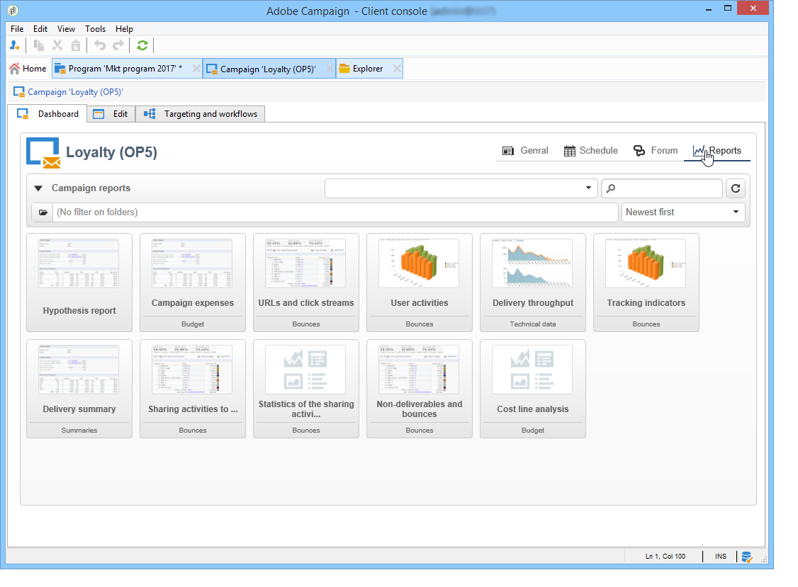

# Toegang tot marketingcampagnes{#accessing-marketing-campaigns}

Met Adobe Campaign kunt u marketingcampagnes maken, configureren, uitvoeren en analyseren. Alle marketing campagnes kunnen van een verenigd controlecentrum worden beheerd.

## Beginselen van de werkruimte {#workspace-basics}

### Startpagina {#home-page}

Zodra u verbinding hebt met Adobe Campaign, wordt de homepage weergegeven.

Klik op de koppelingen in de navigatiebalk voor toegang tot de verschillende universa.

Campagne-elementen bevinden zich in het universum **[!UICONTROL Campaigns]**: Hier ziet u een overzicht van de marketingprogramma&#39;s en -campagnes en de bijbehorende subsets. Een marketingprogramma bestaat uit campagnes die bestaan uit leveringen, taken, gekoppelde middelen, enz. In het kader van het marketingcampagnebeheer met behulp van campagnes zijn de gegevens over leveringen, begrotingen, revisoren en bijbehorende documenten in de campagnes te vinden.

Het navigatieblok van het **[!UICONTROL Campaigns]** universum biedt diverse ingangen aan, afhankelijk van modules die op de instantie worden geïnstalleerd. U hebt bijvoorbeeld toegang tot:

* **Campagnekalender**: tijdschema van de plannen, marketingprogramma&#39;s, leveringen en campagnes. Raadpleeg [Campagne-kalender](#campaign-calendar).
* **Campagnes**: toegang tot de campagnes in alle marketingprogramma&#39;s.
* **Leveringen**: toegang tot de met de campagnes verband houdende leveringen.
* **Webtoepassingen**: toegang tot webtoepassingen (formulieren, enquêtes, enz.).

>[!NOTE]
>
>Raadpleeg [deze sectie](../../platform/using/adobe-campaign-workspace.md) voor meer informatie over de algemene ergonomie van Adobe Campaign, machtigingen en functies voor profielbeheer.
>
>Alle functies die betrekking hebben op kanalen en leveringen worden beschreven in [deze sectie](../../delivery/using/steps-about-delivery-creation-steps.md).

### Campagnekalender {#campaign-calendar}

Elke campagne behoort tot een programma dat op zijn beurt deel uitmaakt van een plan. Plannen, programma&#39;s en campagnes zijn toegankelijk via het menu **[!UICONTROL Campaign calendar]** in het **universum van Campagnes**.

Als u een abonnement, programma, campagne of levering wilt bewerken, klikt u op de naam van het programma in de kalender en vervolgens op **[!UICONTROL Open...]**. Het wordt dan getoond in een nieuw lusje, zoals hieronder getoond:

U kunt de informatie filteren die in de campagnemalender wordt weergegeven. Klik hiertoe op de koppeling **[!UICONTROL Filter]** en selecteer de filtercriteria.

>[!NOTE]
>
>Wanneer u filtert op een datum, worden alle campagnes met een begindatum die later is dan de opgegeven datum en/of met een einddatum die ouder is dan de opgegeven datum, weergegeven. De data moeten worden geselecteerd met de kalenders rechts van elk veld.

U kunt het **[!UICONTROL Search]** gebied ook gebruiken om de getoonde punten te filtreren.

Met de pictogrammen die aan elk item zijn gekoppeld, kunt u de status ervan bekijken: voltooid, bezig, bewerkt, enz.

### Bladeren in een marketingprogramma {#browsing-in-a-marketing-program}

Met campagnes kunt u een reeks programma&#39;s beheren die uit verschillende marketingcampagnes bestaan. Elke campagne bevat leveringen en de bijbehorende processen en middelen.

#### Door een programma {#browsing-a-program} bladeren

Wanneer u een programma bewerkt, gebruikt u de onderstaande tabbladen om door het programma te bladeren en het te configureren.

* Op het tabblad **Planning** wordt de agenda van de programma&#39;s weergegeven voor een maand, week of dag, afhankelijk van het tabblad waarop u klikt in de kalenderkop.

   Indien nodig, kunt u een campagne, een programma, of een taak door deze pagina tot stand brengen.

   

* Met het tabblad **Bewerken** kunt u het programma aanpassen: naam, begin- en einddatum, begroting, bijbehorende documenten, enz.

   

#### Bladeren door campagnes {#browsing-campaigns}

Campagnes zijn toegankelijk via de campagnecalender, het tabblad **[!UICONTROL Schedule]** van het programma of de lijst met campagnes.

1. Selecteer via de campagnecalender de campagne die u wilt weergeven en klik op de koppeling **[!UICONTROL Open]**.

   

   De campagne wordt bewerkt op een nieuw tabblad, zoals hieronder wordt weergegeven:

   

1. Via het tabblad **[!UICONTROL Schedule]** van het programma is de bewerkingsmodus hetzelfde als via de campagnecalender.
1. Klik via de koppeling **[!UICONTROL Campaigns]** van het **[!UICONTROL Campaigns]** universum op de naam van de campagne die u wilt bewerken.

   

### Een campagne besturen {#controlling-a-campaign}

#### Dashboard {#dashboard}

Voor elke campagne worden taken, bronnen en leveringen gecentraliseerd in één scherm, het dashboard, waarmee u marketingacties kunt beheren in samenwerking met anderen.

Het dashboard van een campagne wordt gebruikt als controleinterface. De belangrijkste fasen van het opzetten en het beheer van de campagne zijn rechtstreeks toegankelijk: leveringen, extractiebestanden, meldingen, budgetten, enz.

Met Adobe Campaign kunt u samenwerkingsprocessen instellen voor het maken en goedkeuren van de verschillende stadia van marketing- en communicatiecampagnes: goedkeuring van de begroting, het doel, de inhoud, enz.

>[!NOTE]
>
>De configuratie van campagnemalplaatjes wordt voorgesteld in [de malplaatjes van de Campagne](../../campaign/using/marketing-campaign-templates.md#campaign-templates).

#### Schema {#schedule}

Een campagne centraliseert een reeks leveringen. Voor elke campagne, biedt het programma een globaal overzicht van alle componenten: dit laat u de taken en de leveringen tonen en tot hen gemakkelijk toegang hebben.

#### Forum {#forum}

Voor elke campagne kunnen exploitanten berichten uitwisselen via een speciaal forum.

Raadpleeg [Discussieforums](../../campaign/using/discussion-forums.md) voor meer informatie hierover.

#### Rapporten {#reports}

Met de koppeling **[!UICONTROL Reports]** hebt u toegang tot de campagnerapporten.

>[!NOTE]
>
>Rapporten worden beschreven in [deze sectie](../../reporting/using/about-adobe-campaign-reporting-tools.md).

#### Configuratie {#configuration}

Campagnes worden gemaakt via campagnemalplaatjes. U kunt herbruikbare sjablonen configureren waarvoor sommige opties zijn geselecteerd en andere instellingen al zijn opgeslagen. Voor elke campagne wordt de volgende functionaliteit aangeboden:

* Referentie van documenten en bronnen: u kunt documenten aan de campagne associëren (kort, rapport, beelden, enz.). Alle documentindelingen worden ondersteund. Zie [Gekoppelde documenten beheren](../../campaign/using/marketing-campaign-deliveries.md#managing-associated-documents).
* Vastlegkosten: voor elke campagne kunt u in Adobe Campaign de kostenposten en kostenberekeningsstructuren definiëren die kunnen worden gebruikt bij het maken van de marketingcampagne. Bijvoorbeeld: afdrukkosten, gebruik van een extern bureau, huur van ruimten enz. Zie [Kostencategorieën definiëren](../../campaign/using/providers--stocks-and-budgets.md#defining-cost-categories).
* Definitie van doelstellingen: u kunt kwantificeerbare doelstellingen voor een campagne bepalen, bijvoorbeeld aantal abonnees, bedrijfsvolume, enz. Deze informatie wordt later gebruikt in campagnerapporten.
* Het beheren van zaadadressen (voor meer op dit, verwijs naar [deze sectie](../../delivery/using/about-seed-addresses.md)) en controlegroepen (verwijs naar [Bepalend een controlegroep](../../campaign/using/marketing-campaign-deliveries.md#defining-a-control-group)).
* Goedkeuringen beheren: u kunt kiezen welke behandelingen moeten worden goedgekeurd en, indien nodig, de revisieoperatoren of groepen operatoren selecteren. Zie [Leveringen controleren en goedkeuren](../../campaign/using/marketing-campaign-approval.md#checking-and-approving-deliveries).

>[!NOTE]
>
>Om tot de campagneconfiguraties toegang te hebben en veranderingen in hen aan te brengen, klik **[!UICONTROL Advanced campaign parameters...]** verbinding in **[!UICONTROL Edit]** tabel. Voor meer informatie bij het plaatsen van parameters op campagneniveau zodat erven de leveringen automatisch waarden, zie [onze TechNote](https://helpx.adobe.com/campaign/kb/simplifying-campaign-management-acc.html#Setparametersatthecampaignlevelsodeliveriesinheritvaluesautomatically).

## De webinterface {#using-the-web-interface-} gebruiken

U kunt de Adobe Campaign-consoleschermen openen via een internetbrowser om alle campagnes en leveringen, alsmede rapporten en informatie over de profielen in uw database weer te geven. Met deze toegang kunt u geen records maken. Afhankelijk van de rechten van de operator kunt u de gegevens in de database bekijken en/of bewerken. U kunt bijvoorbeeld de inhoud van de campagne goedkeuren, een levering opnieuw starten of stoppen, enzovoort.

1. Meld u op de gebruikelijke manier aan via https://`<your instance>:<port>/view/home`.
1. Via de menu&#39;s hebt u toegang tot de overzichten.

   

Goedkeuringen (bijvoorbeeld van een doel of een leveringsinhoud) kunnen via webtoegang worden uitgevoerd.

U kunt ook de koppeling gebruiken die zich in de meldingen bevindt. Raadpleeg [Leveringen controleren en goedkeuren](../../campaign/using/marketing-campaign-approval.md#checking-and-approving-deliveries) voor meer informatie.
