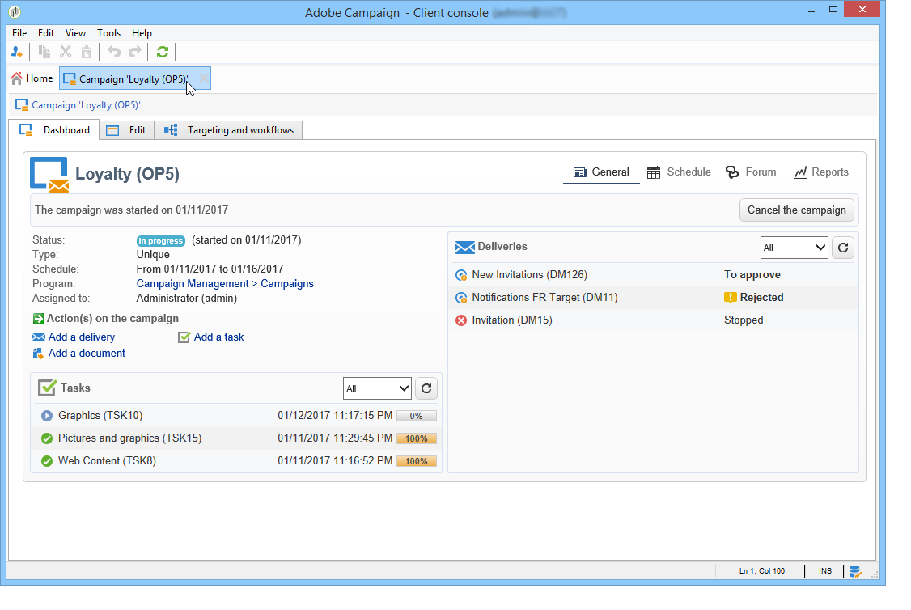

# Toegang tot marketingcampagnes{#accessing-marketing-campaigns}

Met Adobe Campaign kunt u marketingcampagnes maken, configureren, uitvoeren en analyseren. Alle marketing campagnes kunnen van een verenigd controlecentrum worden beheerd.

## Basisbegrippen voor Workspace {#workspace-basics}

### Homepage {#home-page}

Als u eenmaal verbinding hebt met Adobe Campaign, bladert u door de verschillende mogelijkheden via koppelingen in de navigatiebalk.

Campagne-elementen vindt u op het tabblad **[!UICONTROL Campaigns]** . Hier ziet u een overzicht van de marketingprogramma&#39;s, campagnes en de bijbehorende subsets. Een marketingprogramma bestaat uit campagnes die bestaan uit leveringen, taken, gekoppelde middelen, enz. In het kader van het marketingcampagnebeheer met behulp van campagnes worden de gegevens over leveringen, begrotingen, revisoren en bijbehorende documenten in de campagnes gevonden.

Het **[!UICONTROL Browsing]** -blok van het tabblad **[!UICONTROL Campaigns]** biedt verschillende ingangen, afhankelijk van de modules die op de instantie zijn geïnstalleerd. U hebt bijvoorbeeld toegang tot:

* **kalender van de Campagne**: kalender van plannen, marketing programma&#39;s, leveringen, en campagnes. Verwijs naar [ kalender van de Campagne ](#campaign-calendar).
* **Campagnes**: toegang tot de campagnes bevat in alle marketing programma&#39;s.
* **Leveringen**: toegang tot de leveringen verbonden aan de campagnes.
* **Toepassingen van het Web**: toegang tot Webtoepassingen (vormen, landende pagina&#39;s, enz.).

>[!NOTE]
>
>Voor meer op de algemene ergonomie van Adobe Campaign, de toestemmingen en op de functionaliteit van het profielbeheer, verwijs naar [ deze sectie ](../../platform/using/adobe-campaign-workspace.md).
>
>Alle functionaliteiten met betrekking tot kanalen en leveringen zijn gedetailleerd in [ deze sectie ](../../delivery/using/steps-about-delivery-creation-steps.md).

### Campagnekalender {#campaign-calendar}

Elke campagne behoort tot een programma dat op zijn beurt deel uitmaakt van een plan. De plannen, de programma&#39;s, en de campagnes worden betreden via het **[!UICONTROL Campaign calendar]** menu in **Campagnes** tabel.

Als u een abonnement, programma, campagne of levering wilt bewerken, klikt u op de naam van het programma in de kalender en vervolgens op **[!UICONTROL Open...]** . Het wordt dan getoond in een nieuw lusje, zoals hieronder getoond:

U kunt de informatie filteren die in de campagnecalender wordt weergegeven: klik op de koppeling **[!UICONTROL Filter]** en selecteer de filtercriteria.

>[!NOTE]
>
>Wanneer u filtert op een datum, worden alle campagnes met een begindatum die later is dan de opgegeven datum en/of met een einddatum die ouder is dan de opgegeven datum, weergegeven. Selecteer datums met de kalenders rechts van elk veld.

U kunt het veld **[!UICONTROL Search]** ook gebruiken om de weergegeven items te filteren.

Met de pictogrammen die aan elk item zijn gekoppeld, kunt u de status van het item weergeven: voltooid, bezig, bewerkt, enzovoort.

### Bladeren in een marketingprogramma {#browsing-in-a-marketing-program}

Met campagnes kunt u een reeks programma&#39;s beheren die uit verschillende marketingcampagnes bestaan. Elke campagne bevat leveringen en de bijbehorende processen en middelen.

#### Door een programma bladeren {#browsing-a-program}

Wanneer u een programma bewerkt, gebruikt u de onderstaande tabbladen om door het programma te bladeren en het te configureren.

* Het **lusje van het Programma** toont de kalender van programma&#39;s voor een maand, een week, of een dag afhankelijk van welk lusje u in de kalenderkopbal klikt.

  Indien nodig kunt u een campagne, programma of een taak maken via deze pagina.

  

* Het **geeft** lusje uit laat u het programma personaliseren: naam, begin en einddata, begroting, verbonden documenten, enz.

  

#### Browsercampagnes {#browsing-campaigns}

Campagnes zijn toegankelijk via de campagnecalender, het tabblad **[!UICONTROL Schedule]** van het programma of de lijst met campagnes.

1. Selecteer via de campagnecalender de campagne die u wilt weergeven en klik op de koppeling **[!UICONTROL Open]** .

   

   De campagne wordt bewerkt op een nieuw tabblad, zoals hieronder wordt weergegeven:

   

1. Via het tabblad **[!UICONTROL Schedule]** van het programma is de bewerkingsmodus hetzelfde als via de campagnecalender.
1. Klik via de koppeling **[!UICONTROL Campaigns]** op het tabblad **[!UICONTROL Campaigns]** op de naam van de campagne die u wilt bewerken.

   

### Een campagne besturen {#controlling-a-campaign}

#### Dashboard {#dashboard}

Voor elke campagne worden taken, bronnen en leveringen gecentraliseerd in één scherm, het dashboard, waarmee u marketingacties kunt beheren in samenwerking met anderen.

Het dashboard van een campagne wordt gebruikt als controleinterface. De belangrijkste fasen van het maken en het beheer van de campagne worden rechtstreeks door het programma geopend: leveringen, extractiebestanden, meldingen, budgetten, enz.

Met Adobe Campaign kunt u samenwerkingsprocessen opzetten voor het opzetten en goedkeuren van de verschillende stadia van marketing- en communicatiecampagnes: goedkeuring van de begroting, het doel, de inhoud, enz.

>[!NOTE]
>
>De configuratie van campagnemalplaatjes wordt voorgesteld in [ malplaatjes van de Campagne ](../../campaign/using/marketing-campaign-templates.md#campaign-templates).

#### Schema {#schedule}

Een campagne centraliseert een reeks leveringen. Voor elke campagne, biedt het programma een globale mening van alle componenten aan: u kunt de taken en de leveringen tonen, en tot hen gemakkelijk toegang hebben.

#### Forum {#forum}

Voor elke campagne kunnen exploitanten berichten uitwisselen via een speciaal forum.

Leer meer in [ forums van de Bespreking ](../../mrm/using/discussion-forums.md).

#### Rapporten {#reports}

Via de koppeling **[!UICONTROL Reports]** hebt u toegang tot de campagnerapporten.

>[!NOTE]
>
>De rapporten worden gedetailleerd in [ deze sectie ](../../reporting/using/about-adobe-campaign-reporting-tools.md).

#### Configuratie {#configuration}

Campagnes worden gemaakt via campagnemalplaatjes. U kunt herbruikbare sjablonen configureren waarvoor sommige opties zijn geselecteerd en andere instellingen al zijn opgeslagen. Voor elke campagne wordt de volgende functionaliteit aangeboden:

* Verwijzen van [ documenten en middelen ](../../campaign/using/marketing-campaign-deliveries.md#managing-associated-documents): u kunt documenten met de campagne (kort, rapport, beelden, enz.) associëren. Alle documentindelingen worden ondersteund.
* Het bepalen van kosten: voor elke campagne, laat Adobe Campaign u [ kosteningangen en de structuren van de kostenberekening ](../../campaign/using/providers-stocks-and-budgets.md#defining-cost-categories) bepalen die wanneer het creëren van de marketing campagne kunnen worden gebruikt. Bijvoorbeeld: afdrukkosten, gebruik van een externe instantie, huur van ruimte.
* Vaststellen van doelstellingen: u kunt kwantificeerbare doelstellingen voor een campagne bepalen, bijvoorbeeld aantal abonnees, bedrijfsvolume, enz. Deze informatie wordt later gebruikt in campagnerapporten.
* Het leiden [ zaadadressen ](../../delivery/using/about-seed-addresses.md) en [ controlegroepen ](../../campaign/using/marketing-campaign-deliveries.md#defining-a-control-group).
* Goedkeuringen beheren: u kunt de behandelingen selecteren die u wilt goedkeuren en, indien nodig, de revisieoperatoren of -groepen selecteren. [Meer informatie](../../campaign/using/marketing-campaign-approval.md#checking-and-approving-deliveries)

>[!NOTE]
>
>Klik op de koppeling **[!UICONTROL Advanced campaign parameters...]** op het tabblad **[!UICONTROL Edit]** om de campagneconfiguraties te openen en er wijzigingen in aan te brengen.

## De webinterface gebruiken {#using-the-web-interface-}

U kunt de Adobe Campaign-consoleschermen openen via een internetbrowser om alle campagnes en leveringen, alsmede rapporten en informatie over de profielen in uw database weer te geven. Met deze toegang kunt u geen records maken. Afhankelijk van de rechten van de operator kunt u de gegevens in de database bekijken en/of bewerken. U kunt bijvoorbeeld de inhoud van de campagne goedkeuren, een levering opnieuw starten of stoppen, enzovoort.

1. Meld u op de gebruikelijke manier aan via https://`<your instance>:<port>/view/home` .
1. Via de menu&#39;s hebt u toegang tot de overzichten.

   

Naast het navigeren over campagnes en het bekijken van hen, kunt u deze soorten taken uitvoeren:

* De activiteit van de monitor op een geval
* Deelnemen aan validatieprocessen, bijvoorbeeld een leveringsinhoud goedkeuren of afwijzen
* Andere snelle handelingen uitvoeren, bijvoorbeeld een werkstroom pauzeren
* Alle rapportfuncties openen
* Deelnemen aan forumdiscussies

In deze tabel worden de acties samengevat die u kunt uitvoeren op campagnes vanuit een browser:

| Pagina  | Actie |
| --- | --- |
| Lijst met campagnes, leveringen, aanbiedingen, enz. | Een lijstitem verwijderen |
| Campaign | Een campagne annuleren |
| Levering | Goedkeuren de leveringsinhoud en doel   voorleggen de leveringsinhoud   een levering   pauzeren en een levering tegenhouden |
| Webtoepassing | Creeer een Webtoepassing   geeft de toepassingsinhoud en eigenschappen   uit sparen de toepassingsinhoud als malplaatje   publiceren de toepassing |
| Voorstel | Goedkeur de aanbiedingsinhoud en de geschiktheid   onbruikbaar maken een online aanbieding |
| Taak | Voltooi een taak   annuleert een taak |
| Marketingbronnen | Goedkeur een middel   Slot en ontgrendel een middel |
| Campagne | Verzend een pakket voor goedkeuring   goedkeuren of verwerpen een pakket   annuleert een pakket |
| Campagnevolgorde | Creeer een orde   Accepteer of verwerp een orde <!-- Je n'ai pas pu créer de campaign order pour vérifier cela. Peut-on accéder à ces fonctionnalités depuis l'accès web ? --> |
| Voorraad | Een voorraadlijn verwijderen |
| Aanbiedingssimulatie | Een simulatie starten en stoppen |
| Doelworkflow | Een workflow starten, pauzeren en stoppen |
| Rapport | De huidige gegevens opslaan in de rapportgeschiedenis |
| Forum | Voeg een bespreking   Antwoord aan een bericht in een bespreking   toe volgt een bespreking en unsubscript van het |

### Goedkeuringen

Goedkeuringen (bijvoorbeeld van een doel of een leveringsinhoud) kunnen via webtoegang worden uitgevoerd.

U kunt ook de koppeling gebruiken die zich in de meldingen bevindt. Voor meer op dit, verwijs naar [ het Controleren en het goedkeuren van leveringen ](../../campaign/using/marketing-campaign-approval.md#checking-and-approving-deliveries).
