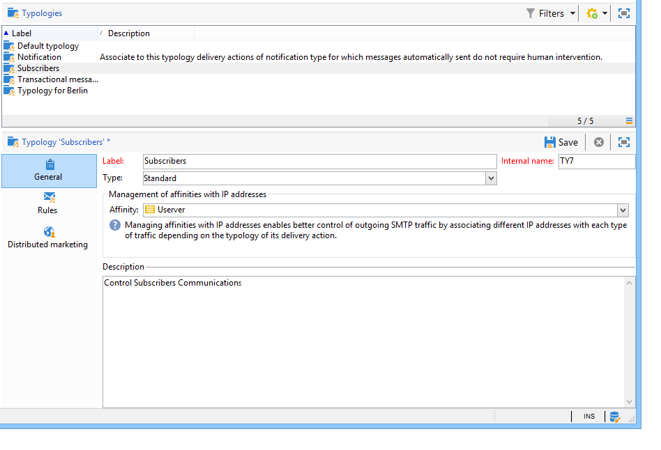

# Toepassingsregels{#applying-rules}

## Een typologie toepassen op een levering {#applying-a-typology-to-a-delivery}

Om de gemaakte typologische regels toe te passen, moet u deze koppelen aan een typologie en vervolgens in de aflevering verwijzen naar deze typologie. Dit doet u als volgt:

1. Maak een campagnetypologie.

   Typologieën zijn toegankelijk via het knooppunt **[!UICONTROL Administration > Campaign Management > Typology management]** > **[!UICONTROL Typologies]** .

1. Ga naar het **[!UICONTROL Rules]** tabblad, klik op de **[!UICONTROL Add]** knop en selecteer de regels die u met deze typologie wilt toepassen.

   

1. Sla de typologie op: wordt toegevoegd aan de lijst van bestaande typologieën.
1. Open de levering waarop u de regels wilt toepassen.
1. Open de leveringseigenschappen en open het **[!UICONTROL Typology]** lusje.
1. Selecteer de typologie in de vervolgkeuzelijst.

   

   >[!NOTE]
   >
   >De typologie kan in het leveringsmalplaatje worden bepaald, dat automatisch op alle leveringen wordt toegepast die gebruikend dit malplaatje worden gecreeerd.

## Toepassingsvoorwaarden definiëren {#defining-application-conditions}

U kunt het toepassingsgebied van een regel afhankelijk van uw behoeften beperken (behalve controleregels).

Het is mogelijk om typologische regels zodanig te configureren dat deze alleen betrekking hebben op bepaalde leveringen die zij aan elkaar koppelen, of op bepaalde ontvangers onder het doel van een levering.

Als u de toepassingsvoorwaarden van een regel wilt definiëren, klikt u op de **[!UICONTROL Edit the rule application conditions...]** koppeling op het **[!UICONTROL General]** tabblad.

Dan gebruik de vraagredacteur om het filtreren voorwaarden te bepalen. In het volgende voorbeeld heeft de capaciteitsregel alleen betrekking op leveringen met het woord &quot;aanbieding&quot; op het etiket of op leveringen die vóór 1 april 2013 zijn gemaakt.

>[!NOTE]
>
>Voor filterregels kunt u de toepassingsvoorwaarde van filtercriteria selecteren: zij kunnen afhangen van de levering of het leveringsoverzicht . Voor meer op dit, verwijs naar het [Conditioning een het filtreren regel](../../campaign/using/filtering-rules.md#conditioning-a-filtering-rule).

## Rekenfrequentie aanpassen {#adjusting-calculation-frequency}

Arbitrages worden elke avond automatisch opnieuw uitgevoerd via de workflow voor het opschonen van databases. Waarden kunnen echter ook na deze periode worden opgeslagen.

Sommige berekeningen gebruiken namelijk waarden die niet dagelijks veranderen. Het zou daarom irrelevant zijn om de gegevens elke dag opnieuw te berekenen en de database voor niets te overladen. Bijvoorbeeld, als een proces het marketing gegevensbestand met klantennestscores verrijkt en informatie op een wekelijkse basis koopt, te hoeven de gegevens die op deze waarden worden gebaseerd niet elke dag opnieuw te worden berekend.

Hiervoor definieert u in het **[!UICONTROL Frequency]** veld van het **[!UICONTROL General]** tabblad een maximumperiode waarin het doel wordt opgeslagen. Standaard geeft de waarde **0** aan dat de berekening geldig blijft tot de volgende uitvoering van de dagelijkse herarbitrage.

Als u de resultaten na deze periode wilt opslaan, geeft u een waarde groter dan 12 op in het **[!UICONTROL Frequency]** veld: zodra deze termijn is verstreken, worden alle regels opnieuw toegepast.

Met de **[!UICONTROL Re-apply the rule at the start of personalization]** optie kunt u de regel automatisch toepassen tijdens de verpersoonlijkingsfase, ook als de in het **[!UICONTROL Frequency]** veld vermelde periode nog geldig is.

## Het selecteren van de fase van de regeltoepassing {#selecting-the-rule-application-phase}

De typologieregels worden in een specifieke volgorde toegepast tijdens de fase waarin de producten waarop zij betrekking hebben, worden gericht, geanalyseerd en gepersonaliseerd.

### Uitvoeringsopdracht {#execution-order}

In de standaardbewerkingsmodus worden de regels in de volgende volgorde toegepast:

1. Controlevoorschriften, als zij bij het begin van het richten worden toegepast.
1. Filterregels:

   * Native toepassingsregels voor adreskwalificatie: gedefinieerd adres / niet-geverifieerd adres / adres / adres op de zwarte lijst / kwaliteit van het quarantaineadres / adres.
   * Filterregels die door de gebruiker zijn gedefinieerd.
   * Deduplicatieregel op het adres of de id (indien nodig toegepast).

1. Drukvoorschriften.
1. Capaciteitsregels.
1. Controlevoorschriften, als zij aan het eind van het richten worden toegepast.
1. Regels van de controle, als zij bij het begin van verpersoonlijking worden toegepast. Als de gebruikersregels (filtreren/druk/capacitief) zijn verlopen en opnieuw moeten worden berekend, zullen zij tijdens deze stap worden toegepast.
1. Controlevoorschriften, als zij aan het eind van verpersoonlijking van toepassing zijn.

>[!NOTE]
>
>Als u met de module van de Interactie van de Campagne werkt, aanbiedingsontvankelijkheidsregels worden toegepast tezelfdertijd zoals het filtreren regels (voor aanbiedingen die in de leveringsoverzichten worden gevonden) of tijdens de verpersoonlijkingsfase, tijdens de vraag aan de aanbiedingsmotor.

U kunt de uitvoeringsopeenvolging van regels aanpassen die het zelfde type hebben gebruikend het aangewezen gebied op het **[!UICONTROL General]** lusje van de regel. Wanneer verscheidene regels tijdens de zelfde fase van de berichtverwerking worden uitgevoerd, kunt u hun uitvoeringsopeenvolging op het **[!UICONTROL Execution sequence]** gebied vormen.

Bijvoorbeeld, zal een drukregel met een uitvoeringsorde van 20 vóór een drukregel met een uitvoeringsorde van 30 worden uitgevoerd.

### Controlevoorschriften {#control-rules}

Voor **[!UICONTROL Control]** regels, kunt u beslissen op welk punt van de leveringslevenscyclus de regel zal worden toegepast (vóór of na het richten, bij het begin van verpersoonlijking, aan het eind van de analyse). Selecteer de waarde die u wilt toepassen in de vervolgkeuzelijst van het **[!UICONTROL Phase]** veld op het **[!UICONTROL General]** tabblad van de typologieregel.

Mogelijke waarden zijn:

* **[!UICONTROL At the start of targeting]**

   Om de verpersoonlijkingsstap te verhinderen in het geval van fouten worden uitgevoerd, kunt u de controleregel hier toepassen.

* **[!UICONTROL After targeting]**

   Als u het volume van het doel moet kennen om de controleregel toe te passen, selecteer deze fase.

   De **[!UICONTROL Check proof size]** besturingsregel geldt bijvoorbeeld na elk doelstadium: deze regel verhindert berichtverpersoonlijking als er teveel proefontvangers zijn.

* **[!UICONTROL At the start of personalization]**

   Deze fase moet worden geselecteerd als de controle de goedkeuring van berichtverpersoonlijking betreft. De personalisatie van berichten wordt uitgevoerd tijdens de analysefase.

* **[!UICONTROL At the end of the analysis]**

   Wanneer een controle berichtverpersoonlijking om vereist te zijn volledig, selecteer deze fase.

## Aanvullende configuraties {#additional-configurations}

### Het uitgaande verkeer SMTP van de controle {#control-outgoing-smtp-traffic}

Als optie, kunt u het **[!UICONTROL Managing affinities with IP addresses]** gebied gebruiken om leveringen aan de leveringsserver (MTA) deze affiniteit te verbinden. Hiermee kunt u het aantal e-mails voor specifieke leveringen beperken tot computers of uitvoeradressen.

>[!NOTE]
>
>Affinity management is niet van toepassing op **[!UICONTROL Filtering]** typologieën.\
>Affinities worden gedefinieerd in het configuratiebestand van de instantie op de Adobe Campagneserver. Zie [deze sectie](../../installation/using/about-initial-configuration.md)voor meer informatie.

### Campagne optimaliseren en Distribueren {#campaign-optimization-and-distributed-marketing}

Op het **[!UICONTROL Distributed Marketing]** tabblad kunt u de typologieën en/of regels opnieuw toewijzen die van toepassing zijn wanneer een gedeelde campagne wordt besteld en/of gereserveerd. Voor een lokale entiteit gedefinieerde typologieën/regels (gekoppeld aan die welke voor de centrale entiteit zijn gedefinieerd) vervangen regels/typologieën die aan de centrale entiteit zijn gekoppeld. Met Opnieuw toewijzen kunt u de regels van de centrale entiteit aanpassen aan de lokale entiteiten die de campagne bestellen.

>[!NOTE]
>
>In typologieën en typologieregels wordt het **[!UICONTROL Distributed Marketing]** tabblad toegevoegd als uw licentie deze optie bevat: gelieve uw vergunningsovereenkomst te controleren.\
>Voor meer informatie over Verdeelde Marketing, verwijs naar [Ongeveer verdeelde marketing](../../campaign/using/about-distributed-marketing.md).

