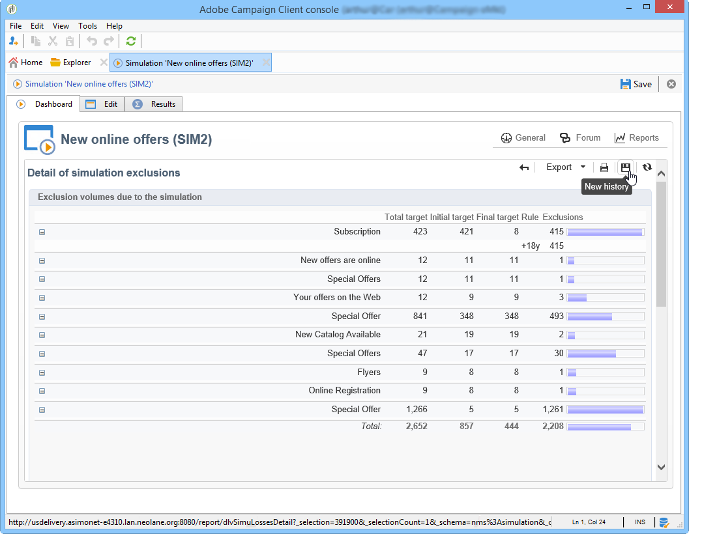
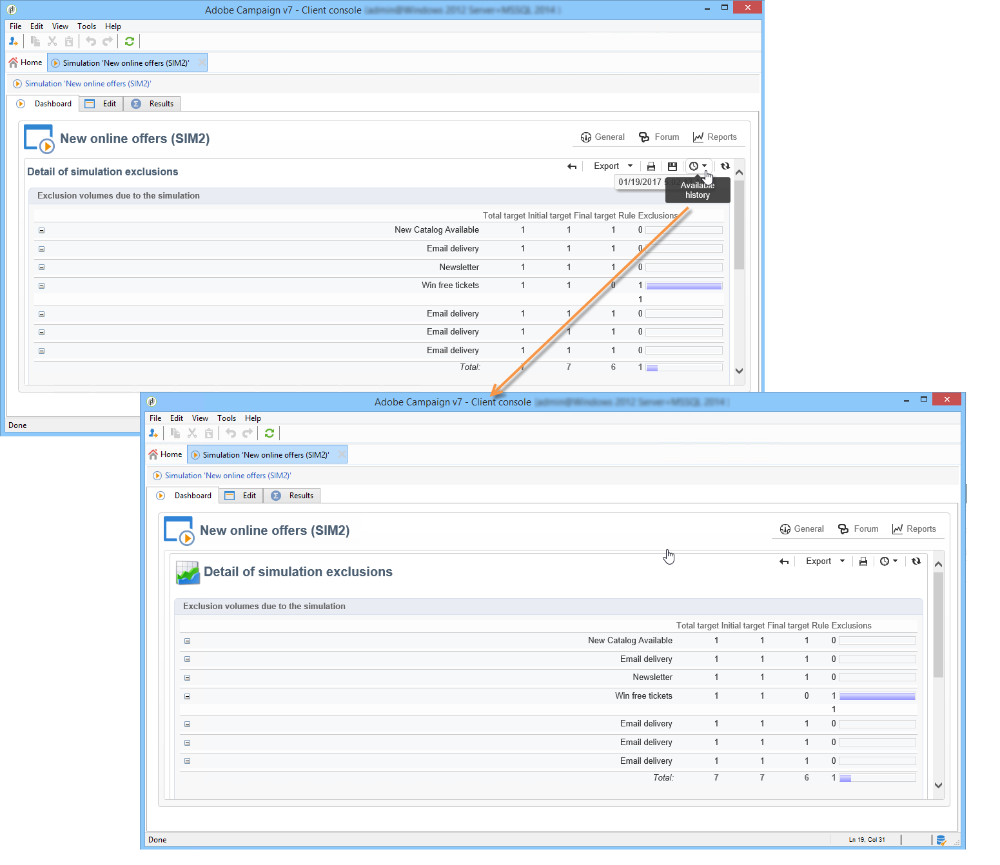

# Campagnesimulaties{#campaign-simulations}

## Informatie over simulaties {#about-simulations}

Met Campagneoptimalisatie kunt u de efficiëntie van een campagneplan testen met behulp van simulaties. Zo kunt u het potentiële succes van een campagne meten: gegenereerde inkomsten, doelvolume op basis van de toegepaste typologische regels, enz.

Met simulatie kunt u het effect van leveringen controleren en vergelijken.

>[!NOTE]
>
>Leveringen die in de testmodus worden voorbereid, hebben geen invloed op elkaar, bijvoorbeeld wanneer een campagne wordt beoordeeld in gedistribueerde marketing, of zolang de leveringen niet in de voorlopige kalender zijn gepland.\
>Dit betekent dat druk- en capaciteitsregels alleen worden toegepast op leveringen in **[!UICONTROL Target estimation and message personalization]** modus. Leveringen in **[!UICONTROL Estimation and approval of the provisional target]** en in de **[!UICONTROL Target evaluation]** modus worden niet in aanmerking genomen.\
>De leveringswijze wordt gekozen op het **[!UICONTROL Typology]** sublusje van de leveringseigenschappen.

## Een simulatie instellen {#setting-up-a-simulation}

### Een simulatie maken {#creating-a-simulation}

Voer de volgende stappen uit om een simulatie te maken:

1. Ga naar het **[!UICONTROL Campaigns]** universum, klik de **[!UICONTROL More]** verbinding binnen de **[!UICONTROL Create]** sectie en selecteer de **[!UICONTROL Simulation]** optie.

   

1. Voer de sjabloon en de naam van de simulatie in. Klik **[!UICONTROL Save]** om de simulatie tot stand te brengen.

   

1. Klik op het **[!UICONTROL Edit]** tabblad om het te configureren.

   

1. Geef op het **[!UICONTROL Scope]** tabblad de leveringen op die u voor deze simulatie wilt gebruiken. Klik hiertoe op de **[!UICONTROL Add]** knop en geef de selectiemodus op waarmee u rekening wilt houden.

   

   U kunt elke levering één voor één selecteren of ze sorteren op campagne, programma of plan.

   >[!NOTE]
   >
   >Als u leveringen selecteert via een plan, programma of campagne, kan Adobe Campaign de lijst met leveringen automatisch vernieuwen om rekening te houden met elke keer dat een simulatie wordt gestart. Schakel de **[!UICONTROL Refresh the selection of deliveries each time the simulation is started]** optie in om dit te doen.
   >  
   >Als u dit niet doet, zullen om het even welke leveringen die niet beschikbaar in het plan, het programma, of de campagne zijn wanneer de simulatie wordt gecreeerd niet in aanmerking worden genomen: leveringen die later worden toegevoegd, worden genegeerd.

   

1. Selecteer de elementen die u in het simulatiebereik wilt opnemen. Selecteer indien nodig meerdere elementen met de toetsen SHIFT en CTRL.

   

   Klik **[!UICONTROL Finish]** om de selectie goed te keuren.

   U kunt geselecteerde leveringen en leveringen die bij plannen, programma&#39;s of campagnes horen, handmatig combineren.

   

   Indien nodig kunt u een dynamische voorwaarde gebruiken via de **[!UICONTROL Edit the dynamic condition...]** koppeling

   Klik **[!UICONTROL Save]** om deze configuratie goed te keuren.

   >[!CAUTION]
   >
   >Alleen leveringen waarvan het doel is berekend, worden in aanmerking genomen bij de berekening van de simulaties (statussen: **Doel (klaar** of **klaar voor levering**).

1. Selecteer op het **[!UICONTROL Calculations]** tabblad bijvoorbeeld een analysedimensie, zoals het ontvangende schema.

   

1. Vervolgens kunt u expressies toevoegen.

   

### Instellingen voor uitvoering {#execution-settings}

Op het **[!UICONTROL General]** tabblad van de simulatie kunt u uitvoeringsinstellingen invoeren:

* De **[!UICONTROL Schedule execution for down-time]** optie versleept de simulatielancering aan een minder drukke tijdspanne, die op het gekozen niveau van prioriteit wordt gebaseerd. De simulaties gebruiken significante gegevensbestandmiddelen, dat is waarom de niet-urgente simulaties zouden moeten worden gepland om bij nacht, bijvoorbeeld te lopen.
* Het niveau **[!UICONTROL Priority]** is het niveau dat op de simulatie wordt toegepast om zijn teweegbrengen uit te stellen.
* **[!UICONTROL Save SQL queries in the log]**. Met SQL-logboeken kunt u een simulatie diagnosticeren als deze eindigt met fouten. Ze kunnen u ook helpen te achterhalen waarom een simulatie te langzaam is. Deze berichten worden weergegeven na de simulatie op het **[!UICONTROL SQL logs]** subtabblad van het **[!UICONTROL Audit]** tabblad.

## Een simulatie uitvoeren {#executing-a-simulation}

### Een simulatie starten {#starting-a-simulation}

Zodra het simulatiewerkingsgebied wordt bepaald, kunt u het uitvoeren.

Open hiertoe het dashboard voor de simulatie en klik op **[!UICONTROL Start simulation]**.

Als de uitvoering is voltooid, opent u de simulatie en klikt u op het **[!UICONTROL Results]** tabblad om de doelen weer te geven die voor elke levering zijn berekend.

1. Het **[!UICONTROL Deliveries]** subtabblad bevat een lijst met alle leveringen die in aanmerking worden genomen door de simulatie. Er zijn twee punten:

   * Het **[!UICONTROL Initial count]** is het streefcijfer zoals het werd berekend bij de schatting van de levering.
   * Het **[!UICONTROL Final count]** is het aantal ontvangers dat na simulatie wordt geteld.

      Het verschil tussen aanvankelijke en definitieve tellingen wijst op de toepassing van de diverse regels of de filters die voorafgaand aan de simulatie worden gevormd.

      Bewerk het **[!UICONTROL Exclusions]** subtabblad voor meer informatie over deze berekening.

1. In het **[!UICONTROL Exclusions]** subtabblad kunt u de onderbreking van de uitsluiting weergeven.

   

1. De **[!UICONTROL Alerts]** subtab groepeert alle waarschuwingsberichten die tijdens de simulatie worden gegenereerd. Waarschuwingsberichten kunnen worden verzonden in geval van capaciteitsoverbelasting (als het aantal beoogde ontvangers de ingestelde capaciteit overschrijdt, bijvoorbeeld).
1. Met het **[!UICONTROL Exploration of the exclusions]** subtabblad kunt u een tabel voor resultaatanalyse maken. De gebruiker moet variabelen in de abscis/ordinates-assen aangeven.

   Voor een voorbeeld van de verwezenlijking van de analystabel, verwijs naar het eind van het [Verkennen van resultaten](#exploring-results).

### Resultaten weergeven {#viewing-results}

#### Audit {#audit}

Op het **[!UICONTROL Audit]** tabblad kunt u de uitvoering van de simulatie controleren. Het **[!UICONTROL SQL Logs]** subtabblad is handig voor ervaren gebruikers. Er worden uitvoerlogbestanden in SQL-indeling weergegeven. Deze logbestanden worden alleen weergegeven als de **[!UICONTROL Save SQL queries in the log]** optie vóór de simulatie is geselecteerd op het **[!UICONTROL General]** tabblad.

#### Resultaten verkennen {#exploring-results}

Met het **[!UICONTROL Exploration of the exclusions]** subtabblad kunt u de gegevens analyseren die het resultaat zijn van een simulatie.

De beschrijvende analyse wordt in [deze paragraaf](../../reporting/using/about-adobe-campaign-reporting-tools.md)beschreven.

## Resultaten van een simulatie {#results-of-a-simulation}

De indicatoren op de tabbladen **[!UICONTROL Log]** en **[!UICONTROL Results]** tabbladen bieden een eerste overzicht van de simulatieresultaten. Open het **[!UICONTROL Reports]** tabblad voor een gedetailleerdere weergave van de resultaten.

### Rapporten {#reports}

Om het resultaat van een simulatie te analyseren, geef zijn rapporten uit: zij tonen uitsluitingen en oorzaken .

De volgende rapporten worden standaard geleverd:

* **[!UICONTROL Detail of simulation exclusions]** : dit verslag bevat een gedetailleerd overzicht van de oorzaken van uitsluiting voor alle betrokken leveringen .
* **[!UICONTROL Simulation summary]** : in dit verslag wordt aangegeven welke bevolkingsgroepen gedurende de verschillende leveringen van de simulatie zijn uitgesloten .
* **[!UICONTROL Summary of exclusions linked to the simulation]** : dit verslag bevat een overzicht van de uitsluitingen die door de simulatie worden veroorzaakt , samen met de toegepaste typologische regel en een grafiek met de uitsluitingsverhouding per regel .

>[!NOTE]
>
>U kunt nieuwe rapporten creëren en hen toevoegen aan aangeboden degenen. Zie [deze sectie](../../reporting/using/about-adobe-campaign-reporting-tools.md)voor meer informatie.

Klik op de **[!UICONTROL Reports]** koppeling van de doelsimulatie via het dashboard om rapporten te openen.

U kunt rapporten ook uitgeven gebruikend de **[!UICONTROL Reports]** verbinding die van het simulatiedashboard toegankelijk is.

### Simulaties vergelijken {#comparing-simulations-}

Telkens wanneer een simulatie wordt uitgevoerd, vervangt het resultaat om het even welke vorige resultaten: u kunt de resultaten van de ene uitvoering niet weergeven en vergelijken.

Om resultaten te vergelijken, moet u rapporten gebruiken. Met Adobe Campaign kunt u zelfs een rapportgeschiedenis opslaan om deze later opnieuw weer te geven. Deze geschiedenis wordt gedurende de levenscyclus van de simulaties bewaard.

**Voorbeeld:**

1. Maak een simulatie op een levering waarop typologie **A** wordt toegepast.
1. Bewerk op het **[!UICONTROL Reports]** tabblad een van de beschikbare rapporten, zoals **[!UICONTROL Detail of simulation exclusions]** bijvoorbeeld.
1. Klik in de rechterbovensectie van het rapport op het pictogram om een nieuwe geschiedenis te maken.

   

1. Sluit de simulatie en wijzig de configuratie van typologie **A**.
1. Voer opnieuw de simulatie uit en vergelijk het resultaat met dat in het rapport wordt getoond waarvoor een geschiedenis werd gecreeerd.

   

   U kunt zoveel rapporthistorie opslaan als nodig is.

### Assen rapporteren {#reporting-axes}

Op het **[!UICONTROL Calculations]** tabblad kunt u rapportassen voor het doel definiëren. Deze assen worden tijdens de resultaatanalyse gebruikt (zie [Resultaten](#exploring-results)verkennen).

>[!NOTE]
>
>Wij adviseren bepalende berekeningsassen in de simulatiesjablonen eerder dan individueel voor elke simulatie.\
>Simulatiesjablonen worden opgeslagen in het **[!UICONTROL Resources > Templates > Simulation templates]** knooppunt van de Adobe Campagne-structuur.

**Voorbeeld:**

In het onderstaande voorbeeld willen we een extra rapportas maken op basis van de status van de ontvangers (&quot;Klant&quot;, &quot;Vooruitziend&quot; of geen).

1. Als u een rapportas wilt definiëren, selecteert u de tabel met de gegevens die in het **[!UICONTROL Analysis dimension]** veld moeten worden verwerkt. Deze informatie is verplicht.
1. Hier, willen wij het gebied van het Segment van de ontvankelijke lijst selecteren.

   

1. De volgende opties zijn beschikbaar:

   * **[!UICONTROL Generate target overlap statistics]** laat u alle overlappende statistieken in het simulatierapport terugkrijgen. Overlappingen zijn ontvangers die zijn aangewezen in ten minste twee leveringen binnen één simulatie.

      >[!CAUTION]
      >
      >Als u deze optie selecteert, neemt de uitvoeringstijd van de simulatie aanzienlijk toe.

   * **[!UICONTROL Keep the simulation work table]** Hiermee kunt u simulatietraces behouden.

      >[!CAUTION]
      >
      >Voor het automatisch opslaan van deze tabellen is een aanzienlijke opslagcapaciteit vereist: zorg ervoor dat de database groot genoeg is.

Wanneer de simulatieresultaten worden weergegeven, wordt de informatie over de geselecteerde expressie weergegeven op het **[!UICONTROL Overlaps]** subtabblad.

De doeloverlappingen van de levering geven de beoogde ontvangers aan in ten minste twee leveringen van een simulatie.

>[!NOTE]
>
>Dit subtabblad wordt alleen weergegeven als de **[!UICONTROL Generate target recovery statistics]** optie is ingeschakeld.

De informatie over rapportageassen kan worden verwerkt in uitsluitingsanalysegerelateerde rapporten die op het **[!UICONTROL Exploring exclusions]** subtabblad worden opgesteld. Raadpleeg [Resultaten](#exploring-results)verkennen voor meer informatie.
