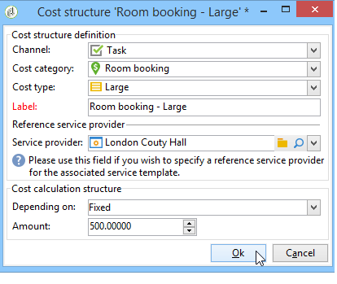
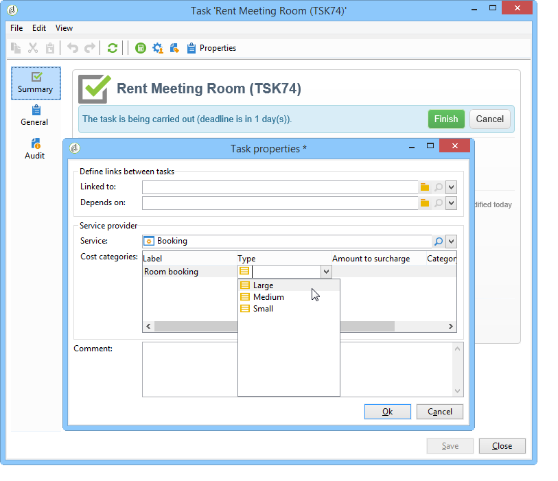

# Controlekosten{#controlling-costs}

## Over kostenbeheersing {#about-cost-control}

Met Adobe Campaign kunt u geplande, geëngageerde en gefactureerde marketingkosten beheren en deze op categorie verdelen met behulp van de module Marketing Resource Management.

De kosten die voor de verschillende processen van een campagne zijn vastgelegd, komen ten laste van een vooraf door de marketingafdeling vastgestelde begroting. De bedragen kunnen in verschillende categorieën worden onderverdeeld om de informatie leesbaarder te maken en om een gedetailleerdere rapportage van de marketinginvesteringen mogelijk te maken.

Het beheer en het bijhouden van budgetten wordt gecentraliseerd in een speciaal knooppunt van de Adobe Campaign-structuur. Hiermee kunt u de toegewezen, gereserveerde, vastgelegde en bestede bedragen vanuit dezelfde visie en voor alle begrotingen controleren.

Voor de uitvoering van het begrotingsbeheer met behulp van MRM moeten de volgende stappen worden genomen:

1. Vaststelling van de begroting

   Zie [Een begroting](#creating-a-budget)maken voor meer informatie.

1. Vaststelling van de kostprijsberekeningsmethode

   Kostenstructuren worden gedefinieerd voor de dienstverleners. Zie Een [serviceprovider en de bijbehorende kostencategorieën](../../campaign/using/providers--stocks-and-budgets.md#creating-a-service-provider-and-its-cost-categories)maken.

1. Campagnekosten definiëren (leveringen/taken)

   De kosten van de leveringen en taken worden individueel of globaal voor het campagnemalplaatje ingevoerd. Zie [Berekening van kosten en voorraden](../../campaign/using/marketing-campaign-deliveries.md#calculation-of-costs-and-stocks).

1. Consolidatie

   Afhankelijk van de stand van de uitvoering van de taken, leveringen en campagne zullen de kosten worden berekend en aan de desbetreffende begroting worden doorberekend.

   Wanneer de campagne voldoende gevorderd is, kan de stand van zaken van de begroting voor de campagne worden gewijzigd in **[!UICONTROL Specified]**. De berekende kosten van het programma worden dan automatisch geboekt met de kosten die op de campagne zijn berekend. Zie [Kostenvastlegging, berekening en toerekening](#cost-commitment--calculation-and-charging).

## Een begroting maken {#creating-a-budget}

Begrotingen worden op de kaart gemaakt, via het **[!UICONTROL Campaign management > Budgets]** knooppunt. Met de **[!UICONTROL New]** knop op de werkbalk kunt u een budget maken.

* Nieuwe begroting toevoegen

   Klik op het **[!UICONTROL New]** pictogram, geef een naam en sla het budget op.

* Invoering van het oorspronkelijke bedrag

   Vermeld het toegewezen bedrag in het desbetreffende veld. De andere bedragen worden automatisch ingevoerd. Zie [Bedragen](#calculating-amounts)berekenen.

* Vaststelling van de geldigheidsperiode

   Geef de begin- en einddatum op. Deze informatie is slechts indicatief.

* Uitgaven

   Maak de uitgavencategorieën waarin de kosten van deze begroting voor campagnes, taken, enz. zijn ondergebracht. kan worden gekoppeld. Zie [Categorieën](#expense-categories)kosten.

   

>[!NOTE]
>
>U kunt een gerelateerd budget selecteren.
>
>Voor meer informatie hierover, verwijs naar het [koppelen van een begroting aan een andere](#linking-a-budget-to-another).

### Berekening van bedragen {#calculating-amounts}

Elke begroting wordt bepaald door een aanvangsbedrag dat wordt afgetrokken van de kosten van de verschillende campagnes, leveringen of taken die ermee verband houden nadat deze gepland of uitgevoerd zijn. De status van de (geplande, gereserveerde, vastgelegde, bestede of gefactureerde bedragen) hangt af van het soort kosten en het niveau van de vastlegging dat in de campagne, levering of taak is gedefinieerd.

>[!NOTE]
>
>De voor de categorieën opgenomen bedragen moeten overeenkomen met de in het **[!UICONTROL Allocated]** veld vastgestelde begrotingsmiddelen.

Voor campagnes kunnen, afhankelijk van het niveau van de verbintenis, kosten worden gepland, vastgelegd of gereserveerd voor een toekomstige actie.

>[!CAUTION]
>
>Wanneer een campagne wordt opgezet, **[!UICONTROL Budget]** moet de status van de vooruitgang in kwestie worden geplaatst **[!UICONTROL Defined]** om de kosten in aanmerking te nemen die bij de uitvoering in aanmerking moeten worden genomen. Als de status is **[!UICONTROL Being edited]**, worden de kosten niet geconsolideerd.
>   
>De optie **[!UICONTROL Commitment level]** is een prognose van de kosten in de toekomst voordat ze ten laste van de begroting komen. Afhankelijk van de voortgang van een campagne, taak of levering, kunt u besluiten een hoger of lager verbintenisniveau toe te wijzen (1). Geplant, 2. Gereserveerd, 3. Toegewezen) gebruikend de combodoos.

De geraamde kosten van een webcampagne bedragen bijvoorbeeld 45.000 euro.

Voor de campagne worden, wanneer de status van begrotingsschepping wordt vastgesteld **[!UICONTROL Defined]**, de werkelijke kosten van de campagne (of, indien dit niet het geval is, de berekende kosten) in de begrotingstotalen opgenomen.

Afhankelijk van het niveau van de vastlegging van de campagnebegroting wordt het bedrag op het **[!UICONTROL Planned]**- **[!UICONTROL Reserved]** of **[!UICONTROL Committed]** werkterrein geboekt.

Het niveau van de verbintenis kan worden gewijzigd:

* op **campagneniveau** , in het **[!UICONTROL Budget]** venster, dat in de **[!UICONTROL Edit]** tabel wordt gevonden. Dit is waar begrotingen, kosten en uitgaven worden gevormd.
* in het **takenniveau** , in het **[!UICONTROL Expenses and revenues]** venster.

Wanneer het budget is **[!UICONTROL Reserved]**, wordt de update automatisch uitgevoerd voor de aangerekende begroting.

De procedure is op taakniveau hetzelfde.

Wanneer een uitgave aanleiding geeft tot een factuur en de factuur wordt betaald, wordt het bedrag ervan in het **[!UICONTROL Invoiced]** veld vermeld.

### Categorieën kosten {#expense-categories}

De bedragen kunnen in verschillende uitgavencategorieën worden verdeeld voor een betere leesbaarheid van de gegevens en voor een gedetailleerdere rapportage van marketinginvesteringen. De uitgavencategorieën worden gedefinieerd tijdens het maken van de begroting, via het **[!UICONTROL Budgets]** knooppunt van de structuur.

Als u een categorie wilt toevoegen, klikt u op de **[!UICONTROL Add]** knop in de onderste sectie van het venster.

U kunt een categorie uit de bestaande categorie selecteren of een nieuwe categorie definiëren door deze rechtstreeks in het veld in te voeren. Wanneer u uw invoer bevestigt, kunt u deze categorie toevoegen aan de lijst met bestaande categorieën en deze indien nodig koppelen aan een Natuur. Deze informatie zal in de begrotingsverslagen worden gebruikt.

### Een begroting koppelen aan een andere begroting {#linking-a-budget-to-another}

U kunt een begroting koppelen aan een hoofdbegroting. Daartoe selecteert u de belangrijkste begroting op het **[!UICONTROL related budget]** gebied van de secundaire begrotingen.

Er wordt een extra tabblad toegevoegd aan de hoofdbegroting om de lijst met verwante budgetten weer te geven.

Deze informatie wordt overgedragen naar de begrotingsverslagen.

## Onkostenlijnen toevoegen {#adding-expense-lines}

De begrotingslijnen worden automatisch toegevoegd. Zij worden gecreeerd tijdens leveringsanalyse en wanneer een taak wordt gebeëindigd.

Voor elke campagne, levering of taak worden de gegenereerde kosten gegroepeerd in de uitgavenposten van de begroting waarvoor ze worden aangerekend. Deze uitgavenlijnen worden gecreëerd op basis van de kostenlijnen van de betrokken dienstverlener en berekend via de bijbehorende kostenstructuren.

Elke uitgavenpost bevat daarom de volgende informatie:

* De campagne en de uitvoering of taak waarmee zij verband houdt
* Het bedrag berekend op basis van de kostenstructuur of de geraamde voorlopige kosten
* Reële kosten van de betrokken levering of taak
* De corresponderende factuurlijn (alleen MRM)
* Lijst van kosten berekend per kostencategorie (indien er een kostenstructuur bestaat)

In het bovenstaande voorbeeld bevat de bewerkte uitgavenlijn de kosten die zijn berekend voor de levering van **nieuwe kaarten** voor de campagne **Loyalty Spring** . Wanneer de levering wordt uitgegeven, laat het **[!UICONTROL Direct Mail]** lusje u zien hoe de uitgavenlijn wordt berekend.

De kostenberekening voor deze levering is gebaseerd op de kostencategorieën die voor de betrokken dienstverlener zijn geselecteerd:

Volgens de gekozen kostencategorieën worden de overeenkomstige kostenstructuren toegepast om de kostenposten te berekenen. In dit voorbeeld zijn de kostenstructuren voor de betrokken dienstverlener als volgt:

>[!NOTE]
>
>De categorieën en de structuren van kosten worden voorgesteld in het [Creëren van een dienstverlener en zijn kostencategorieën](../../campaign/using/providers--stocks-and-budgets.md#creating-a-service-provider-and-its-cost-categories).

## Vastleggingsverplichting, berekening en toerekening van kosten {#cost-commitment--calculation-and-charging}

Kosten kunnen worden vastgelegd voor leveringen en taken. Afhankelijk van de voortgang van het proces waarmee het verband houdt, wordt de status van een kostprijs bijgewerkt.

### Kostprijsberekeningsproces {#cost-calculation-process}

De kosten zijn in drie categorieën onderverdeeld:

1. Geraamde voorlopige kosten

   De geraamde voorlopige kosten zijn een raming van de kosten voor het verloop van de campagne. Zolang deze wordt bewerkt, worden de ingevoerde bedragen niet geconsolideerd. Zij moet de **[!UICONTROL Specified]** status hebben om de bij de berekeningen in aanmerking te nemen bedragen te kunnen berekenen.

   Dit bedrag wordt handmatig ingevoerd en kan worden uitgesplitst in verschillende uitgavencategorieën. Als u de kosten wilt omlaag schuiven, klikt u op de **[!UICONTROL Breakdown...]** koppeling en vervolgens op de **[!UICONTROL Add]** knop om een nieuw bedrag te definiëren.

   

   U kunt elke kosten aan een categorie koppelen zodat de kostenindeling per uitgavencategorie later kan worden bekeken in de desbetreffende begroting en begrotingsrapporten.

1. Berekende kosten

   De berekende kosten zijn afhankelijk van het betrokken element (campagne, levering, taak, enz.) en de status ervan (wordt bewerkt, wordt uitgevoerd, is voltooid). In elk geval, als de reële kosten worden gespecificeerd, zullen de berekende kosten dit bedrag gebruiken.

   Indien de reële kosten niet worden opgegeven, gelden de volgende regels:

   * Voor een campagne die wordt bewerkt, zijn de berekende kosten de geraamde voorlopige kosten van de campagne of, indien deze kosten niet zijn vastgesteld, zijn de berekende kosten de som van alle voorlopige kosten van de leveringen en taken van de campagne. Als de campagne klaar is, zijn de berekende kosten van de campagne de som van alle berekende kosten.
   * Voor een levering die nog niet is geanalyseerd, zijn de berekende kosten de geraamde voorlopige kosten. Als de analyse al is uitgevoerd, zijn de berekende kosten de som van alle kosten die uit de dienst zijn berekend, kostenstructuren en het aantal beoogde ontvangers.
   * Voor een lopende taak maken de berekende kosten gebruik van de geraamde voorlopige kosten. Als de taak is voltooid, zijn de berekende kosten de som van alle kosten die zijn berekend op basis van de kostenstructuur van de dienstverlener en het aantal voltooide dagen.
   * Voor het marketingplan is, net als voor het programma, de berekende kosten de som van de voor de campagnes berekende kosten. Indien deze kosten niet worden gespecificeerd, worden voor de berekening van de kosten de geraamde voorlopige kosten gebruikt.
   >[!NOTE]
   >
   >Met de **[!UICONTROL Breakdown]** koppeling kunt u de details van de berekening en de laatste berekeningsdatum bekijken.

1. Reële kosten

   De werkelijke kosten worden handmatig ingevoerd en worden indien nodig uitgesplitst in verschillende kostencategorieën.

### Berekening en oplegging {#calculation-and-charging}

De kosten worden berekend via kostenstructuren en worden in rekening gebracht op de in de betrokken campagnes, leveringen of taken geselecteerde budgetten.

De bedragen die via de goedkeuring van de begroting voor campagnes zijn vastgelegd, kunnen worden gecontroleerd. Er kunnen extra taken in de vorm van een controlepunt worden gemaakt in een campagne om andere goedkeuringen in te stellen. Zie [Taaktypen](../../campaign/using/creating-and-managing-tasks.md#types-of-task).

### Voorbeeld {#example}

We gaan een campagne opzetten met:

* Een directe postlevering die de kostenstructuren van een dienstverlener gebruikt
* Een taak met vaste kosten
* Een taak met dagelijkse kosten

#### Stap 1 - Het creëren van de begroting {#step-1---creating-the-budget}

Maak een nieuw budget via het **[!UICONTROL Campaign management > Budgets]** knooppunt.

Definieer een begroting van 10.000 euro op het **[!UICONTROL Allocated]** gebied van de **[!UICONTROL Amounts]** sectie. Voeg twee uitgavencategorieën in de onderste sectie van het venster toe:

#### Stap 2 - het Vormen van de dienstverlener en het bepalen van de kostenstructuren {#step-2---configuring-the-service-provider-and-defining-the-cost-structures}

Creeer een dienstverlener en een de dienstmalplaatje met zijn kostenstructuur van de **[!UICONTROL Administration > Campaigns]** knoop.

Voor meer op dit, verwijs naar het [Creëren van een dienstverlener en zijn kostencategorieën](../../campaign/using/providers--stocks-and-budgets.md#creating-a-service-provider-and-its-cost-categories).

* Maak voor direct mailverkeer kostencategorieën **[!UICONTROL Envelopes]** (typen 114x229 en 162x229) **[!UICONTROL Postage]** en **[!UICONTROL Print]** (typen A3 en A4). En creeer dan de volgende kostenstructuren:

   

   Voeg een vaste kostprijs toe (in de kostencategorieën) waarvan de berekening vast is en waarvan het bedrag leeg is (in de desbetreffende kostenstructuur) en die voor elke levering afzonderlijk wordt gespecificeerd.

   

* Voor taken maakt u de volgende twee kostencategorieën:

   1. **[!UICONTROL Room reservation]** (Kleine kamer en Grote kamer), met een **vaste** kostenstructuur van 300 en 500 euro:

      

   1. **[!UICONTROL Creation]** (Sjabloon **voor** inhoud), met een **dagelijkse** kostenstructuur van 300 EUR:

      

#### Stap 3 - De kosten van de begroting in de campagne {#step-3---charging-the-budget-in-the-campaign}

Maak een campagne en selecteer het budget dat in Stap 1 wordt gemaakt.

>[!NOTE]
>
>Standaard wordt het voor het programma geselecteerde budget toegepast op alle campagnes in het programma.

Geef de geraamde voorlopige kosten op, uitgesplitst:

Klik **[!UICONTROL Ok]** en dan **[!UICONTROL Save]** om deze informatie te bevestigen. De berekende kosten van de campagne worden vervolgens bijgewerkt met de geraamde voorlopige kosten.

#### Stap 4 - Het creëren van de directe postlevering {#step-4---creating-the-direct-mail-delivery}

Maak een workflow voor de campagne en plaats de query-activiteiten om het doel te selecteren (waarschuwingsbericht: de geadresseerde postadressen moeten worden opgegeven).

Creeer een directe postlevering en selecteer de dienstverlener die in Stap 2 wordt gecreeerd: de kostencategorieën worden automatisch weergegeven.

Overschrijf de kosten van de enveloppen en voeg vaste kosten toe. Selecteer ook de categorieën waarop deze kosten betrekking hebben.

>[!NOTE]
>
>Als een van de kostencategorieën niet wordt gebruikt, zal dit geen kosten genereren.

Start de workflow die u zojuist hebt gemaakt om de analyse te starten en de kosten te berekenen.

Als voor deze campagne begrotingsgoedkeuring is ingeschakeld, keurt u de begroting van het dashboard goed. Je kunt de goedkeuring van kostencategorieën controleren.

De uitgavenregel voor de levering wordt toegevoegd op het **[!UICONTROL Edit > Budget]** tabblad van de campagne. Bewerk de tabel om de details van de berekening weer te geven.

De voor de levering berekende kosten worden met deze informatie bijgewerkt:

Wanneer u de berekende kosten bewerkt, kunt u de uitsplitsing van de kosten en de status en datum van de kostenberekening controleren.

#### Stap 5 - Taken maken {#step-5---creating-tasks}

Aan deze campagne, zullen wij de twee taken toevoegen waarvoor de kostenstructuren vroeger werden gecreeerd (zie [Stap 2 - het Vormen van de dienstverlener en het bepalen van de kostenstructuren](#step-2---configuring-the-service-provider-and-defining-the-cost-structures)). Klik hiertoe op de **[!UICONTROL Add a task]** knop in het campagnemashboard. Geef een naam op voor de taak en klik op **[!UICONTROL Save]**.

De taak wordt vervolgens toegevoegd aan de takenlijst. U moet het uitgeven om het te vormen.

Selecteer op het **[!UICONTROL Properties]** tabblad de service en de bijbehorende kostencategorie:

Klik vervolgens op het **[!UICONTROL Expenses and revenue]** pictogram van de taak en geef de geschatte voorlopige kosten op.

Wanneer de taak is gered, worden de berekende kosten gespecificeerd met de waarde die voor de geschatte voorlopige kosten wordt ingevoerd.

Wanneer de taak is voltooid (status **[!UICONTROL Finished]** ), worden de berekende kosten automatisch bijgewerkt met de kosten van de grote ruimte zoals die in de kostenstructuur zijn ingevoerd. Deze kosten worden ook in deze categorie in de uitsplitsing weergegeven.

Vervolgens maakt u een tweede taak volgens dezelfde procedure. die langer dan vijf dagen zijn gepland en betrekking hebben op de eerder gemaakte kostenstructuur.

Wanneer de taak is voltooid, worden de berekende kosten gespecificeerd met de waarde van de gerelateerde kostenstructuur, d.w.z. 1500 euro in ons voorbeeld (5 dagen x 300 euro):

#### Stap 6 - De begrotingsstatus van de campagne bijwerken {#step-6---update-the-campaign-budget-status}

Wanneer de campagne wordt gevormd, kan zijn status worden bijgewerkt door het te plaatsen aan **[!UICONTROL Specified]**. De berekende kosten van de campagne vermelden vervolgens de som van de berekende kosten van de levering en de taken van de campagne:

#### Begrotingsgoedkeuring {#budget-approval}

Wanneer goedkeuring wordt geactiveerd, kunt u een speciale koppeling gebruiken om het budget van het campagnesdashboard goed te keuren. Deze koppeling wordt weergegeven wanneer de doelworkflow is gestart en een direct mailbericht moet worden goedgekeurd.

Vervolgens kunt u op de koppeling klikken om goedkeuring te verlenen of af te wijzen, of de koppeling gebruiken in de e-mail met de kennisgeving als er voor deze campagne een melding is geactiveerd.

Wanneer de begroting is goedgekeurd en de levering is voltooid, worden de kosten automatisch geüpload via een speciale technische workflow.

## Orders en facturen {#orders-and-invoices}

In de context van MRM, kunt u orden bij een dienstverlener bewaren en facturen uitgeven. De volledige levenscyclus van deze bestellingen en facturen kan worden beheerd via de Adobe Campagne-interface.

### Maken van bestellingen {#order-creation}

Om een nieuwe orde met een dienstverlener te bewaren, klik de **[!UICONTROL MRM > Orders]** knoop van de boom, en klik dan de **[!UICONTROL New]** knoop.

Vermeld het ordernummer, de betrokken dienstverlener en het totale bedrag van de order.

### Uitreiking en bijhouden van facturen {#issuing-and-tracking-invoices}

Voor elke dienstverlener, kunt u facturen bewaren en hun status en het in rekening gebrachte budget bepalen.

Facturen worden gemaakt en opgeslagen in het **[!UICONTROL MRM > Invoices]** knooppunt van de Adobe Campaign-structuur.

Een factuur bestaat uit factuurlijnen waarvan het totaal automatisch het bedrag kan berekenen. Deze regels worden handmatig gemaakt op basis van het **[!UICONTROL Invoice lines]** tabblad. Zij kunnen met een orde worden geassocieerd om de informatie aan de orden te uploaden.

De facturen van elke dienstverlener worden getoond op het **[!UICONTROL Invoices]** lusje van het profiel:

Op het **[!UICONTROL Details]** tabblad kunt u de inhoud van de factuur weergeven.

Klik **[!UICONTROL Add]** om een nieuwe factuur te maken.
