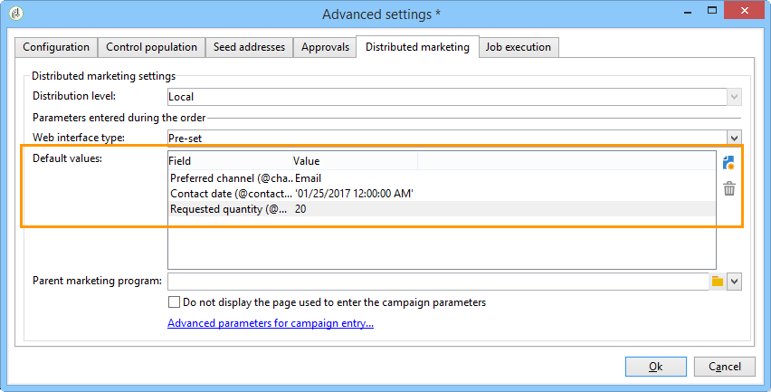
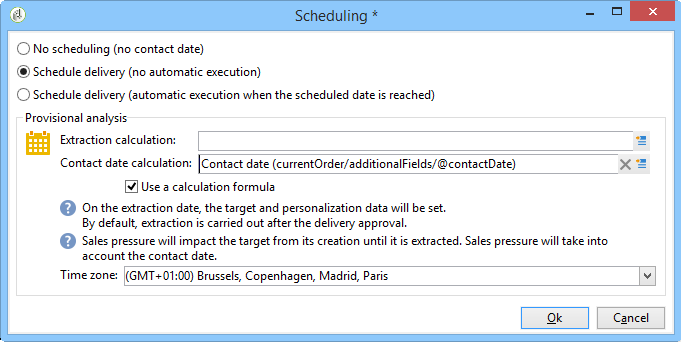
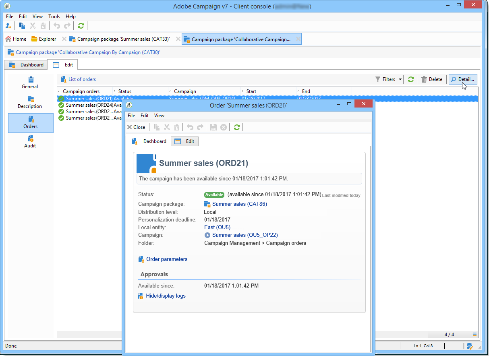

# Een lokale campagne maken{#creating-a-local-campaign}

Een lokale campagne is een instantie die is gemaakt op basis van een sjabloon waarnaar in de lijst van **[!UICONTROL campaign packages]** met een **specifiek uitvoeringsschema** wordt verwezen. Zijn doel is om aan een lokale communicatie behoefte te voldoen gebruikend een campagnemalplaatje dat opstelling en gevormd door de centrale entiteit was. De belangrijkste fasen voor de uitvoering van een lokale actie zijn:

**Voor de centrale entiteit**

1. Een lokale campagnemalplaatje maken.
1. Campagnepakket maken op basis van een sjabloon.
1. Een campagnepakket publiceren.
1. Bevestigingsopdrachten.

**Voor de lokale entiteit**

1. De campagne bestellen.
1. Bezig met uitvoeren van campagnes.

## Een lokale campagnemalplaatje maken {#creating-a-local-campaign-template}

Als u een campagnepakket wilt maken, moet u eerst de **campagnemalplaatje** maken via het **[!UICONTROL Resources > Templates]** knooppunt.

Als u een nieuwe lokale sjabloon wilt maken, dupliceert u de **[!UICONTROL Local campaign (opLocal)]** standaardsjabloon.

Geef uw campagnemalplaatje een naam en vul de beschikbare velden in.

Klik in het campagnevenster op het **[!UICONTROL Edit]** tabblad en klik vervolgens op de **[!UICONTROL Advanced campaign settings...]** koppeling.

### Webinterface {#web-interface}

Op het **Verdeelde marketing** lusje, kunt u het type van de interface van het Web kiezen en de standaardwaarden en parameters specificeren die moeten worden ingegaan wanneer een lokale entiteit een orde plaatst.

De interface van het Web beantwoordt aan een vorm die door de lokale entiteit moet worden ingevuld wanneer het opdracht geven tot van de campagne.

Selecteer het type van de interface van het Web dat op de campagnes moet worden toegepast die van het malplaatje worden gecreeerd:

Er zijn vier types van beschikbare interfaces van het Web:

* **[!UICONTROL By brief]** : de lokale entiteit moet een beschrijving verstrekken waarmee zij de campagneconfiguraties beschrijft. Zodra de orde is goedgekeurd, vormt de centrale entiteit en voert de campagne als geheel uit.

   

* **[!UICONTROL By form]** : de lokale entiteit heeft toegang tot een vorm van het Web waar, afhankelijk van het gebruikte malplaatje, zij de inhoud, het doel, zijn maximumgrootte, evenals verwezenlijking en extractiedata kunnen uitgeven gebruikend verpersoonlijkingsgebieden. De lokale entiteit kan het doel evalueren en inhoud van voorproef van dit formulier van Web.

   

   Het aangeboden formulier wordt opgegeven in een webtoepassing die moet worden geselecteerd in een vervolgkeuzelijst in het **[!UICONTROL Web Interface]** veld in de **[!UICONTROL Advanced campaign settings...]** koppeling van de sjabloon. Zie Een lokale campagne [maken (op formulier)](../../campaign/using/examples.md#creating-a-local-campaign--by-form-).

   >[!NOTE]
   >
   >De toepassing van het Web die in dit voorbeeld wordt gebruikt is een voorbeeld. U moet een specifieke webapp maken om een formulier te kunnen gebruiken. Zie [API](../../configuration/using/about-web-services.md).

   

* **[!UICONTROL By external form]** : de lokale entiteit heeft toegang tot campagneparameters in zijn Extranet (niet de Campagne van Adobe). Deze parameters zijn identiek aan die van een **lokale campagne (door vorm)**.
* **[!UICONTROL Pre-set]** : de lokale entiteit geeft opdracht tot campagne gebruikend het standaardformulier, zonder het te lokaliseren.

   

### Standaardwaarden {#default-values}

Selecteer de code **[!UICONTROL Default values]** die lokale entiteiten moeten invullen. Bijvoorbeeld:

* de datum van contact en extractie;
* doelkenmerken (leeftijdssegment enz.).

Vul de velden **[!UICONTROL Parent marketing program]** en **[!UICONTROL Charge]** velden in.

### Goedkeuringen {#approvals}

Via de **[!UICONTROL Advanced parameters for campaign entry]** koppeling kunt u het maximumaantal revisoren opgeven.

Revisoren worden door de lokale entiteit ingevoerd bij het bestellen van de campagne.

Als u geen controleurs voor een campagne wilt noemen, ga 0 in.

### Documenten {#documents}

U kunt operatoren van lokale entiteiten toestaan om documenten (tekstbestanden, spreadsheets, afbeeldingen, campagnebeschrijvingen enzovoort) te koppelen. aan de lokale campagne wanneer het creëren van de orde. Met de **[!UICONTROL Advanced parameters for campaign entry...]** koppeling kunt u het aantal documenten beperken. U doet dit door het maximum toegestane aantal in te voeren in het **[!UICONTROL Number of documents]** veld.

Als u een campagnepakket bestelt, wordt in het formulier voorgesteld om zoveel documenten te koppelen als in het desbetreffende veld in de sjabloon worden aangegeven.

Als u geen veld voor het uploaden van documenten wilt weergeven, voert u dit veld **[!UICONTROL 0]** **[!UICONTROL Number of documents]** in.

>[!NOTE]
>
>Het **[!UICONTROL Advanced parameters for campaign entry]** kan worden gedeactiveerd door te controleren **[!UICONTROL Do not display the page used to enter the campaign parameters]**.

### Workflow {#workflow}

Maak op het **[!UICONTROL Targeting and workflows]** tabblad de campagneworkflow die de **[!UICONTROL Default values]** opgegeven gegevens in het bestand verzamelt **[!UICONTROL Advanced campaign settings...]** en de leveringen maakt.

Dubbelklik op de **[!UICONTROL Query]** activiteit om deze te configureren volgens de opgegeven **[!UICONTROL Default values]** procedure.

### Aflevering {#delivery}

Klik op het **[!UICONTROL Audit]** tabblad op het **[!UICONTROL Detail...]** pictogram om de **[!UICONTROL Scheduling]** voor de geselecteerde levering te bekijken.

Met het **[!UICONTROL Scheduling]** pictogram kunt u de contactpersoon en uitvoeringsdatum van de levering configureren.

Indien nodig, vorm de maximumgrootte van de levering:

Zoek de HTML van uw levering. Gebruik in **[!UICONTROL Delivery > Current order > Additional fields]****[!UICONTROL Age segment]** het veld bijvoorbeeld om de levering te zoeken op basis van de leeftijd van het doel.

Sla uw campagnemalplaatje op. U kunt het nu gebruiken vanuit de **Campagnepakketweergave** in het **Campagneuniversum** door op de **[!UICONTROL Create]** knop te klikken.

>[!NOTE]
>
>De malplaatjes van de campagne en hun algemene configuratie zijn gedetailleerd in de malplaatjes [van de](../../campaign/using/marketing-campaign-templates.md#campaign-templates)Campagne.

## Het campagnepakket maken {#creating-the-campaign-package}

Het campagnemalplaatje kan alleen beschikbaar worden voor lokale entiteiten als het aan de lijst wordt toegevoegd. Daartoe moet het centrale agentschap een nieuw pakket opstellen.

Voer de volgende stappen uit:

1. Klik in de **[!UICONTROL Navigation]** sectie op de pagina **Campagnes** op de **[!UICONTROL Campaign packages]** koppeling.
1. Klik op de **[!UICONTROL Create]** knop.

   

1. In de sectie boven het venster kunt u de [eerder](#creating-a-local-campaign-template) opgegeven sjabloon voor het campagnepakket selecteren.

   Standaard wordt de **[!UICONTROL New local campaign package (localEmpty)]** sjabloon gebruikt voor lokale campagnes.

1. Geef het label, de map en het uitvoeringsschema voor het campagnemakket op.

### Datums {#dates}

De begin- en einddatum bepalen de zichtbaarheidsperiode van de campagne in de lijst met campagnepakketten.

De beschikbaarheidsdatum is de datum waarop de campagne voor lokale entiteiten (aan orde) beschikbaar zal worden.

>[!CAUTION]
>
>Als een lokale entiteit de campagne niet vóór de deadline reserveert, zal zij deze niet kunnen gebruiken.

Deze informatie is te vinden in het aan lokale agentschappen verzonden kennisgevingsbericht, zoals hieronder wordt getoond:

### Publiek {#audience}

Voor een lokale campagne kan de centrale entiteit de betrokken lokale entiteiten specificeren door het **[!UICONTROL Limit the package to a set of local entities]** te controleren.

### Aanvullende instellingen {#additional-settings}

Nadat het pakket is opgeslagen, kan de centrale entiteit het op het **[!UICONTROL Edit]** tabblad bewerken.

Vanaf het **[!UICONTROL General]** tabblad kan de centrale entiteit:

* de beoordelaar(s) van het campagnepakket configureren via de **[!UICONTROL Approval parameters...]** koppeling;
* het uitvoeringsschema te herzien;
* lokale entiteiten toevoegen of verwijderen.

>[!NOTE]
>
>Standaard kan elke entiteit slechts één keer een **lokale campagne** bestellen.
>   
>Schakel de **[!UICONTROL Enable multiple creation]** optie in als u meerdere lokale campagnes wilt maken op basis van het campagnepakket.

### Meldingen {#notifications}

Wanneer een campagne beschikbaar wordt of wanneer de registratietermijn wordt bereikt, wordt een bericht verzonden naar de exploitanten van de lokale berichtgroep. Raadpleeg [Organisatorische entiteiten](../../campaign/using/about-distributed-marketing.md#organizational-entities)voor meer informatie hierover.

## Een campagne bestellen {#ordering-a-campaign}

Campagnepakketten worden toegankelijk voor lokale entiteiten zodra ze zijn goedgekeurd en de uitvoeringsperiode ervan is begonnen. Lokale entiteiten ontvangen een e-mail met de mededeling dat er een nieuw campagnepakket beschikbaar is (zodra de beschikbaarheidsdatum is bereikt).

>[!NOTE]
>
>Als sommige lokale entiteiten bij het creëren van het campagnepakket werden gespecificeerd, zullen zij de enige zijn om een bericht te ontvangen. Als er geen lokale entiteit is opgegeven, ontvangen alle lokale entiteiten een kennisgeving.

Om een campagne van de centrale entiteit te gebruiken, moet de lokale entiteit het bevel geven.

Een campagne bestellen:

1. Klik **[!UICONTROL Order campaign]** in het berichtbericht, of de overeenkomstige knoop in de Campagne van Adobe.

   Voer uw id en wachtwoord in om de campagne te bestellen. De interface bestaat uit een set pagina&#39;s die zijn gedefinieerd in een webtoepassing.

   >[!NOTE]
   >
   >De toepassingen van het Web zijn gedetailleerd in de [functionaliteitengids](../../web/using/about-web-applications.md) van het Web.

1. Voer de benodigde gegevens in op de eerste pagina (orderlabel en opmerking) en klik op **[!UICONTROL Next]**.

   

1. Voltooi de beschikbare parameters en keur de volgorde goed.

1. Er wordt een kennisgeving verzonden aan de beheerder van de organisatorische entiteit waartoe de lokale entiteit behoort, om deze bestelling goed te keuren.

   

1. De informatie wordt geretourneerd aan de lokale en centrale entiteiten. Hoewel lokale entiteiten alleen hun eigen orders kunnen bekijken, kan de centrale entiteit alle orders van elke lokale entiteit bekijken, zoals hieronder wordt getoond:

   

   Operatoren kunnen ordergegevens weergeven:

   

   Het **[!UICONTROL Edit]** tabblad bevat informatie die de lokale entiteit heeft ingevoerd bij het bestellen van de campagne.

   

1. De order moet door de centrale entiteit worden goedgekeurd.

   

   Raadpleeg de sectie [Goedkeuringsproces](#approval-process) voor meer informatie.

1. De lokale exploitant wordt vervolgens op de hoogte gesteld dat de campagne beschikbaar is: de beschikbaarheid van campagnes is te vinden in de lijst van campagnepakketten binnen het **Campagne** universum. De campagne kan dan worden gebruikt. Raadpleeg [Toegankelijkheidscampagnes](../../campaign/using/accessing-campaigns.md)voor meer informatie.

   Met deze **[!UICONTROL Start targeting with order approval]** optie kan de lokale entiteit de campagne uitvoeren zodra de bestelling is goedgekeurd.

   

## Een bestelling goedkeuren {#approving-an-order}

Om een campagneorder te bevestigen, moet de centrale entiteit het goedkeuren.

Het **[!UICONTROL Campaign orders]** overzicht, dat via het **Campagne** heelal wordt betreden laat u de status van campagneorden bekijken en hen goedkeuren.

>[!NOTE]
>
>Lokale entiteiten kunnen wijzigingen in de bestelling aanbrengen totdat deze is goedgekeurd.

### Goedkeuringsproces {#approval-process}

#### E-mailmelding {#email-notification}

Wanneer een campagne wordt besteld door een lokale entiteit, worden de revisoren hiervan via e-mail op de hoogte gebracht, zoals hieronder wordt getoond:

>[!NOTE]
>
>Het selecteren van revisoren wordt weergegeven in de sectie [Revisoren](#reviewers) . Ze kunnen de bestelling accepteren of afwijzen.

#### Goedkeuren via de Adobe Campaign-console {#approving-via-the-adobe-campaign-console}

De bestelling kan ook worden goedgekeurd via de console, in het overzicht van de campagnevolgorde. Als u een bestelling wilt goedkeuren, selecteert u deze en klikt u op **[!UICONTROL Approve the order]**.

>[!NOTE]
>
>De campagne kan nog worden uitgegeven en worden aangepast tot de datum van de campagnebeschikbaarheid. Lokale entiteiten kunnen de campagne ook afwijzen door op de **[!UICONTROL Cancel]** knop te klikken.

#### Een campagne maken {#creating-a-campaign}

Zodra een campagneorde wordt goedgekeurd, kan het door de lokale entiteit worden gevormd en worden uitgevoerd.

Raadpleeg [Toegankelijkheidscampagnes](../../campaign/using/accessing-campaigns.md)voor meer informatie.

### Afwijzing van een goedkeuring {#rejecting-an-approval}

De met de goedkeuring belaste exploitant kan een bestelling of een campagnepakket afwijzen.

Indien de controleur een bestelling afwijst, wordt de desbetreffende kennisgeving automatisch naar de betrokken lokale entiteiten gezonden: het bevat de opmerking die is ingevoerd door de exploitant die de goedkeuring heeft geweigerd.

De informatie wordt getoond op de lijst van campagnepakketpagina of op de pagina van de campagneorde. Als ze toegang hebben tot de Adobe Campaign-console, worden lokale entiteiten op de hoogte gesteld van deze afwijzing.

Ze kunnen de verwante opmerking weergeven op het **[!UICONTROL Edit]** tabblad van het campagnepakket.

### Revisoren {#reviewers}

Elke keer dat goedkeuring wordt vereist, worden revisoren via e-mail op de hoogte gesteld.

Voor elke lokale entiteit worden revisoren geselecteerd voor goedkeuring van de campagneorder en goedkeuring van de campagne. Raadpleeg [Organisatorische entiteiten](../../campaign/using/about-distributed-marketing.md#organizational-entities)voor meer informatie over het selecteren van lokale revisoren.

>[!NOTE]
>
>Om deze selectie mogelijk te maken, moet de goedkeuring van de bestelling nog niet effectief zijn.

### Een bestelling annuleren {#canceling-an-order}

Het centrale bureau kan een orde annuleren gebruikend de **[!UICONTROL Delete]** knoop, die op het ordedashboard wordt gevestigd.

Hierdoor wordt de campagne in de **[!UICONTROL Campaign orders]** weergave geannuleerd.
