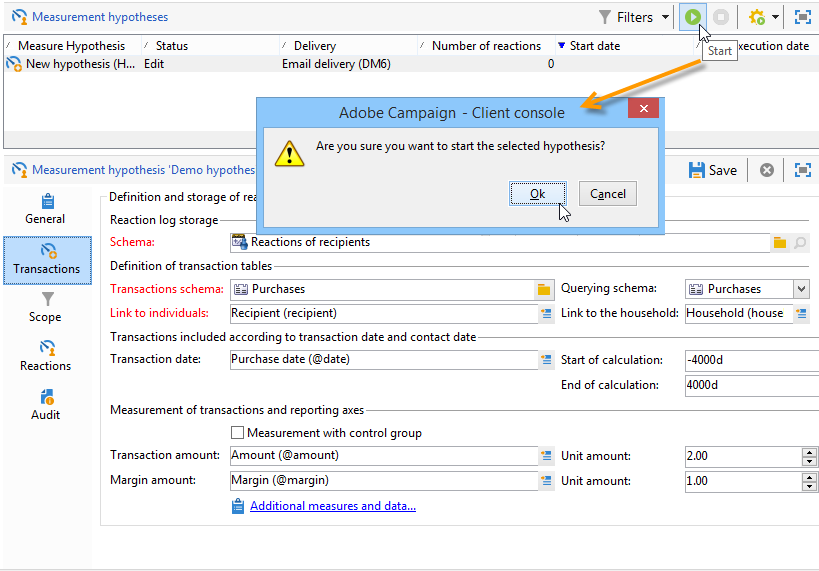
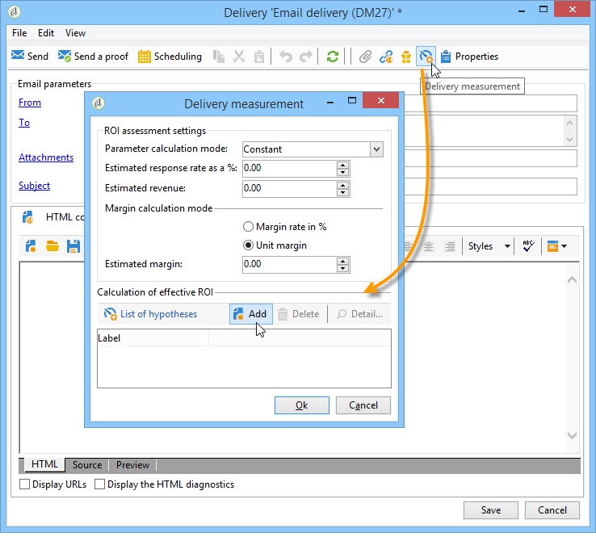
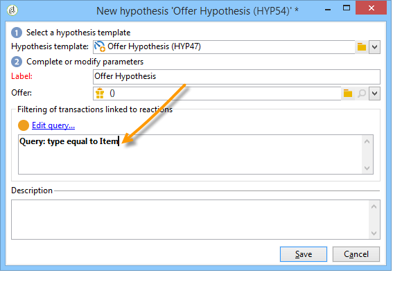

# hypothesen maken{#creating-hypotheses}

Er zijn verschillende mogelijkheden om hypothesen te creëren/te koppelen aan een campagneaanbod of levering:

* Via de **[!UICONTROL Measurement hypotheses]** map kunt u een nieuwe hypothese maken op basis van een bestaande sjabloon en deze koppelen aan een bestaande levering.
* Via het tabblad **[!UICONTROL Edit]** **[!UICONTROL Measurement]** > in een campagne.
* Via de **[!UICONTROL Measurement]** optie van een levering die van een campagne wordt gecreeerd.

Hypothesen kunnen pas worden berekend nadat de marketingcampagne is gestart en de ontvangers de levering hebben ontvangen. Indien de hypothese gebaseerd is op een aanbod-voorstel, moet deze ten minste worden gepresenteerd en nog steeds actief zijn. Aanbiedings- en leveringshypothesen worden gemaakt via de **[!UICONTROL Measurement hypotheses]** map en zijn gebaseerd op een hypothesesjabloon. Het is echter mogelijk om voor het begin van de campagne rechtstreeks naar een hypothese te verwijzen in de uitvoering of de campagne. In dit geval worden de hypothesen automatisch berekend zodra de marketingcampagne wordt gestart, op basis van de instellingen voor de uitvoering (zie voor meer informatie de instellingen [voor de uitvoering van de](../../campaign/using/hypothesis-templates.md#hypothesis-template-execution-settings)Hypothese-sjabloon).

## Een hypothese maken tijdens een levering {#creating-a-hypothesis-on-the-fly-on-a-delivery}

U kunt als volgt een hypothese over een bestaande levering maken:

>[!NOTE]
>
>Deze bewerking is alleen mogelijk voor in behandeling zijnde leveringen.

1. Ga in de Adobe Campaign-structuur naar **[!UICONTROL Campaign management > Measurement hypotheses]**.
1. Klik op de **[!UICONTROL New]** knop of klik met de rechtermuisknop op de lijst met hypothesen en selecteer **[!UICONTROL New]** in de vervolgkeuzelijst.

   

1. Selecteer in het hypothesevenster een eerder gemaakte sjabloon (raadpleeg de sjablonen [voor](../../campaign/using/hypothesis-templates.md)hypotheses).

   

   De hypothesecontext zoals deze in het geselecteerde model is gedefinieerd, wordt weergegeven in het venster.

   >[!NOTE]
   >
   >De instellingen die in de sjabloon zijn gedefinieerd en in deze stap niet zichtbaar zijn, blijven ook in het geheugen staan en worden opnieuw toegewezen aan de hypothese die wordt uitgevoerd.

   

1. Selecteer de levering waarvoor u een hypothese wilt maken.

   

1. U kunt uw hypothese aanpassen door de **[!UICONTROL General]**, **[!UICONTROL Transactions]** en **[!UICONTROL Scope]** lusjes uit te geven. Zie [Een hypothesemodel](../../campaign/using/hypothesis-templates.md#creating-a-hypothesis-model)maken voor meer informatie hierover.
1. Begin de hypothese door op **[!UICONTROL Start]** te klikken.

   Er wordt automatisch een workflow gemaakt om de meting uit te voeren. De naam wordt automatisch bepaald afhankelijk van de hypotheseconfiguratie.

   >[!CAUTION]
   >
   >U kunt deze instelling openen als u het **[!UICONTROL Keep execution workflow]** selectievakje hebt ingeschakeld.\
   >Deze optie moet alleen worden geactiveerd voor foutopsporingsdoeleinden, in het geval van een fout tijdens het uitvoeren van de hypothese. De automatisch gegenereerde workflows worden opgeslagen in de map **[!UICONTROL Administration]** > **[!UICONTROL Production]** > **[!UICONTROL Objects created automatically]** > **[!UICONTROL Campaign workflows]** in de Adobe Campagneverkenner.
   > 
   >Bovendien mogen automatisch gegenereerde workflows niet worden gewijzigd. Eventuele wijzigingen zouden elders niet in aanmerking worden genomen voor latere berekeningen.
   >
   >Als u deze optie hebt ingeschakeld, verwijdert u de workflow nadat deze is uitgevoerd.

   

   Zodra de berekening is voltooid, worden de meetindicatoren automatisch bijgewerkt.

   

1. Wijzig zo nodig de instellingen en start de hypothese opnieuw.

## Verwijzen naar een hypothese in een campagnelevering {#referencing-a-hypothesis-in-a-campaign-delivery}

U kunt in een marketingcampagne naar een hypothese verwijzen voordat deze wordt gestart. In dit geval wordt de hypothese automatisch gestart zodra de levering is verzonden, op basis van de uitvoeringsinstellingen die in de hypothesesjabloon zijn gedefinieerd. U kunt als volgt een hypothese in een levering maken:

1. Afhankelijk van uw behoeften kunt u een of meer **[!UICONTROL Delivery]** typesjablonen maken, zoals beschreven in [Een hypothesemodel maken](../../campaign/using/hypothesis-templates.md#creating-a-hypothesis-model)
1. Maak een marketingcampagne en maak doelgerichte workflows.
1. Klik op het **[!UICONTROL Delivery measurement]** pictogram in het leveringsvenster.
1. Selecteer het hypothesemalplaatje (de vraag die in het model wordt gevormd wordt getoond in het hypothesevenster).

   De hypothese zal automatisch worden berekend zodra de campagne wordt gebeëindigd, gebaseerd op de data die in het model worden gevormd (verwijs naar de montages [van de](../../campaign/using/hypothesis-templates.md#hypothesis-template-execution-settings)de malplaatjeuitvoering van de hypothese).

   

## Een standaardhypothese toevoegen aan leveringen voor een campagne {#adding-a-default-hypothesis-to-deliveries-for-a-campaign}

U kunt rechtstreeks verwijzen naar een hypothese op campagnereniveau. In dit geval zal de hypothese automatisch worden gekoppeld aan alle leveringen die in de campagne worden gemaakt. Dit doet u als volgt:

1. Ga naar het **[!UICONTROL Edit]** tabblad van de campagne.
1. Klik in de sectie Metingen op het **[!UICONTROL Default hypotheses]** tabblad.

   

1. Klik **[!UICONTROL Add]** en selecteer een hypothesesjabloon.

   

   In elke nieuwe levering voor de campagne wordt nu standaard verwezen naar een hypothese op basis van deze sjabloon.

   

De resultaten van de hypothese kunnen op de **[!UICONTROL General]** en **[!UICONTROL Reactions]** tabbladen van de hypothese worden weergegeven (zie [Hypothese bijhouden](../../campaign/using/hypothesis-tracking.md)).

Voor meer informatie kunt u ook naar [Voorbeeld verwijzen: het creëren van een hypothese die verband houdt met een levering](#example--creating-a-hypothesis-linked-to-a-delivery).

## Het creëren van een hypothese over een aanbieding {#creating-a-hypothesis-on-an-offer}

Het creëren van een hypothese over een aanbiedingsvoorstel is vergelijkbaar met het creëren van een hypothese over de levering tijdens de vlucht. De hypothese kan worden uitgevoerd zolang het aanbod actief is. De berekeningsperiode is gebaseerd op de datum van het voorstel. Wanneer de hypothese u een ontvanger aan een aankoop laat verbinden, kan de status van het aanbiedingsvoorstel waarschijnlijk worden goedgekeurd automatisch worden veranderd (voor meer op dit, verwijs naar [Transacties](../../campaign/using/hypothesis-templates.md#transactions)).

1. Maak een of meer **[!UICONTROL Offer]** typemodellen zoals beschreven in [Een hypothesemodel](../../campaign/using/hypothesis-templates.md#creating-a-hypothesis-model)maken.
1. Ga naar het **[!UICONTROL Campaign management > Measurement hypotheses]** knooppunt.
1. Maak een **[!UICONTROL Offers]** typehypothese door het eerder gemaakte model te selecteren.

   

   De query die in het model is gemaakt, wordt in het venster weergegeven.

   

1. Kies het aanbod waarvoor u een hypothese wilt maken.

   

1. Verfijn indien nodig de query.
1. Klik **[!UICONTROL Start]** om de hypothese uit te voeren.
1. De resultaten van de hypothese kunnen op zijn **[!UICONTROL General]** en **[!UICONTROL Reactions]** lusjes worden bekeken (zie [Hypothese tracking](../../campaign/using/hypothesis-tracking.md)).

   Op het **[!UICONTROL Measurement]** tabblad wordt verwezen naar de hypothesen die op een aanbieding zijn aangebracht.

   

   Als de **[!UICONTROL Update offer proposition status]** optie in het hypothesemalplaatje werd toegelaten, wordt de status van het voorstel automatisch veranderd, daardoor verstrekkend terugkoppel op het effect van de campagne (voor meer op dit, verwijs naar [Transacties](../../campaign/using/hypothesis-templates.md#transactions)).

## Voorbeeld: het creëren van een hypothese die verband houdt met de levering {#example--creating-a-hypothesis-linked-to-a-delivery}

In dit voorbeeld willen we een hypothese creëren die gekoppeld is aan een levering. Deze hypothese is gebaseerd op het eerder gemaakte model (zie [Voorbeeld: het creëren van een hypothesemplate op een levering](../../campaign/using/hypothesis-templates.md#example--creating-a-hypothesis-template-on-a-delivery)). Vervolgens wordt de query die van het model is overgenomen, verfijnd en wordt een hypothese gemaakt voor een specifiek artikel van de aankooptabel.

1. Maak een campagne en een levering (zie [Een campagne](../../campaign/using/setting-up-marketing-campaigns.md#creating-a-campaign)maken voor meer informatie).

   In ons voorbeeld, zullen wij een directe posttype levering gebruiken.

1. Vorm een zaadadres: het eerder gecreëerde hypothesemalplaatje werd gevormd om een controlegroep in de reactieresultaten in aanmerking te nemen.

   

   >[!NOTE]
   >
   >Voor meer informatie, verwijs naar het [bepalen van een controlegroep](../../campaign/using/marketing-campaign-deliveries.md#defining-a-control-group).

1. Open het pictogram **[!UICONTROL Direct mail delivery]** en klik op het **[!UICONTROL Delivery measurement]** pictogram en klik vervolgens op **[!UICONTROL Add]**.

   

1. Kies de eerder gemaakte hypothesesjabloon in de vervolgkeuzelijst.

   

   De query die in het model wordt gemaakt, wordt weergegeven.

   

1. Klik op de query **[!UICONTROL Edit query...]** en verfijn deze door het product in te voeren waarop de hypothese betrekking heeft.

   

   U kunt controleren of de hypothese is gekoppeld aan de levering op het tabblad **[!UICONTROL Edit]** > **[!UICONTROL Measurement]** van de campagne.

   

1. Start de doelworkflow en voer de benodigde controles uit totdat de campagne is voltooid (zie voor meer informatie [Een levering](../../campaign/using/marketing-campaign-deliveries.md#starting-a-delivery)starten).

   

1. Ga in de Adobe Campaign-structuur naar het **[!UICONTROL Campaign management > Measurement hypotheses]** knooppunt om de indicatoren te controleren die door de hypothese zijn berekend.

   

