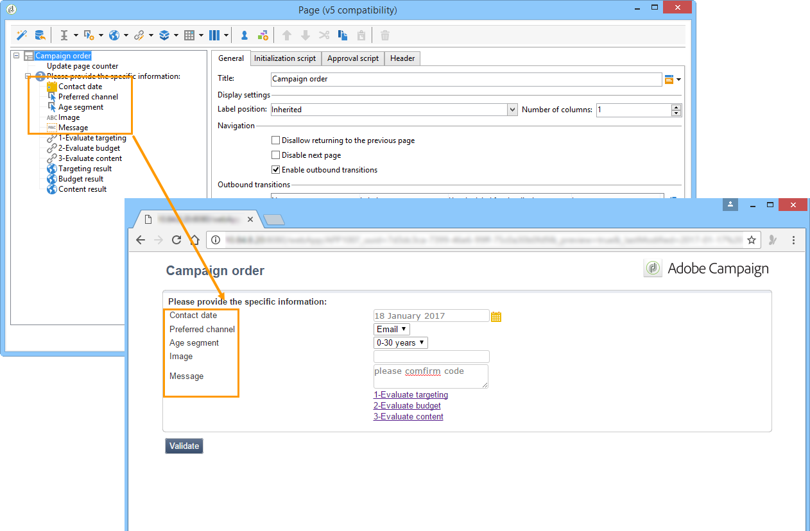
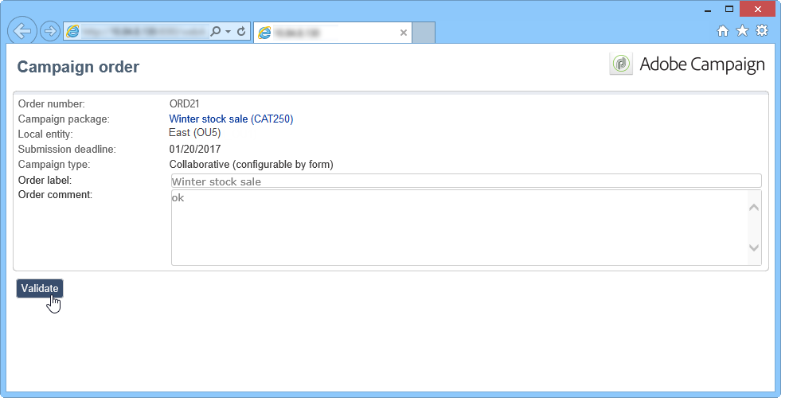

# Voorbeelden{#examples}

## Een lokale campagne maken (op formulier) {#creating-a-local-campaign--by-form-}

De **Op de interface van het vormtype** Web impliceert het gebruiken van een toepassing **van het** Web. Afhankelijk van zijn configuratie, kan deze toepassing van Web om het even welk type van bepaalde gepersonaliseerde elementen bevatten. U kunt bijvoorbeeld koppelingen voorstellen om het doel, het budget, de inhoud, enzovoort te evalueren. via specifieke API&#39;s.

>[!NOTE]
>
>API&#39;s worden beschreven in een speciaal document, waartoe de toegang afhankelijk is van uw contract. Zie [API](../../configuration/using/about-web-services.md).

>[!NOTE]
>
>De webtoepassing die in dit voorbeeld wordt gebruikt, is geen webtoepassing die bij Adobe Campaign van de verkeerde kant op komt. Om een vorm in een campagne te gebruiken, moet u de specifieke toepassing van het Web tot stand brengen.

Wanneer het creëren van het campagnemalplaatje, klik het **[!UICONTROL Zoom]** pictogram binnen de **[!UICONTROL Web interface]** optie van de **[!UICONTROL Advanced campaign settings...]** verbinding aan toegangsdetails van de toepassing van het Web.


>[!NOTE]
>
>De toepassingsparameters van het Web zijn slechts beschikbaar in het campagnemalplaatje.

Selecteer op het **[!UICONTROL Edit]** tabblad de **Campagnevolgordeactiviteit** en open deze om de inhoud te openen.


In dit voorbeeld omvat de activiteit van de **campagnevolgorde** :

* velden die de lokale entiteit tijdens de bestelling moet invoeren;

   

* koppelingen die de lokale entiteit in staat stellen de campagne te evalueren (bijvoorbeeld het doel, het budget, de inhoud, enz.);

   

* scripts waarmee u het resultaat van deze evaluaties kunt berekenen en weergeven.

   

In dit voorbeeld worden de volgende API&#39;s gebruikt:

* Voor de doelevaluatie:

   ```
   var res = nms.localOrder.EvaluateTarget(ctx.localOrder);
   ```

* Voor de begrotingsevaluatie

   ```
   var res = nms.localOrder.EvaluateDeliveryBudget(ctx.@deliveryId, NL.XTK.parseNumber(ctx.@compt));
   ```

* Voor de evaluatie van de inhoud

   ```
   var res = nms.localOrder.EvaluateContent(ctx.localOrder, ctx.@deliveryId, "html", resSeed.@id);
   ```

## Een samenwerkingscampagne maken (door goedkeuring als doel) {#creating-a-collaborative-campaign--by-target-approval-}

### Inleiding {#introduction}

U bent de marketingmanager voor een groot kledingmerk dat een online winkel en verschillende boutiques in de hele VS heeft. Nu de lente is aangekomen, besluit u om een speciale aanbieding te maken die uw beste klanten 50% korting op alle jurken in uw catalogus zal geven.

Dit aanbod is gericht op de beste klanten van je Amerikaanse winkels, dat wil zeggen die meer dan $300 hebben uitgegeven sinds het begin van het jaar.

Daarom besluit u Distributed Marketing te gebruiken om een samenwerkingscampagne (door doelgoedkeuring) te maken waarmee u de beste klanten van uw winkels (gegroepeerd per regio) kunt selecteren, die de e-maillevering met de speciale aanbieding zullen ontvangen.

Het eerste deel van dit voorbeeld illustreert uw lokale entiteiten die het bericht van de campagneverwezenlijking ontvangen, en hoe zij het kunnen gebruiken om de campagne te evalueren en het te bestellen.

In het tweede deel van dit voorbeeld wordt uitgelegd hoe u uw campagne kunt maken.

De stappen zijn als volgt:

**Voor de lokale entiteit**

1. Gebruik het bericht van de campagneverwezenlijking om tot de lijst van contacten toegang te hebben die door de centrale entiteit wordt geselecteerd.
1. Selecteer de contacten en keur participatie goed.

**Voor de centrale entiteit:**

1. Maak een **[!UICONTROL Data distribution]** activiteit.
1. Maak de samenwerkingscampagne.
1. Publiceer de campagne.

### Lokale entiteit {#local-entity-side}

1. De lokale entiteiten die zijn gekozen om deel te nemen aan de campagne ontvangen een e-mailkennisgeving.

   

1. Door op de **[!UICONTROL Access your contact list and approve targeting]** koppeling te klikken krijgt de lokale entiteit toegang (via webbrowser) tot de lijst met clients die voor de campagne zijn geselecteerd.

   

1. De lokale entiteit maakt de controle van bepaalde contacten uit de lijst ongedaan omdat er al sinds het begin van het jaar contact met hen is opgenomen voor een soortgelijk aanbod.

   

Zodra de controles zijn goedgekeurd, kan de campagne automatisch beginnen.

### Centrale entiteitzijde {#central-entity-side}

#### Een activiteit voor gegevensdistributie maken {#creating-a-data-distribution-activity}

1. Als u een samenwerkingscampagne wilt instellen (door goedkeuring als doel), moet u eerst een **[!UICONTROL Data distribution activity]** campagne maken. Klik op het **[!UICONTROL New]** pictogram in het **[!UICONTROL Resources > Campaign management > Data distribution]** knooppunt.

   

1. Op het **[!UICONTROL General]** tabblad moet u het volgende opgeven:

   * de **[!UICONTROL Targeting dimension]**. Hier wordt de **gegevensdistributie** uitgevoerd op de **ontvangers**.
   * de **[!UICONTROL Distribution type]**. U kunt een **Vaste grootte** of een **Grootte als percentage** kiezen.
   * de **[!UICONTROL Assignment type]**. Selecteer de optie **Lokale entiteit** .
   * de **[!UICONTROL Distribution type]**. Hier, is het **[!UICONTROL Origin (@origin)]** gebied aanwezig in de Ontvanger lijst die u de verhouding tussen het contact en de lokale entiteit laat identificeren.
   * Het **[!UICONTROL Approval storage]** veld. Selecteer de optie **Lokale goedkeuring van ontvanger** .

1. Geef op het **[!UICONTROL Breakdown]** tabblad het volgende op:

   * het **[!UICONTROL Distribution field value]** programma , dat overeenkomt met de lokale entiteiten die bij de komende campagne betrokken zijn .
   * de lokale entiteit **[!UICONTROL label]**.
   * de waarde **[!UICONTROL Size]** (vast of als percentage). De standaardwaarde **0** houdt in dat alle ontvangers worden geselecteerd die aan de lokale entiteit zijn gekoppeld.
   

1. Sla de nieuwe gegevensdistributie op.

#### Een samenwerkingscampagne maken {#creating-a-collaborative-campaign}

1. Maak een nieuw knooppunt van het **[!UICONTROL Campaign management > Campaign]** knooppunt **[!UICONTROL collaborative campaign (by target approval)]**.
1. Maak op het **[!UICONTROL Targeting and workflows]** tabblad een workflow voor uw campagne. Dit moet een **Gesplitste** activiteit bevatten waarin de activiteit **[!UICONTROL Record count limitation]** wordt gedefinieerd door de **[!UICONTROL Data distribution]** activiteit.

   

1. Voeg een **[!UICONTROL Local approval]** actie toe waar u kunt specificeren:

   * de inhoud van het bericht die naar de lokale entiteiten in de kennisgeving zal worden verzonden;
   * de goedkeuringsherinnering;
   * de verwachte verwerking van de campagne
   

1. Sla uw record op.

#### De campagne publiceren {#publishing-the-campaign}

U kunt nu een **campagnepakket** toevoegen uit het **Campagneuniversum** .

1. Kies uw **[!UICONTROL Reference campaign]**. Op het **[!UICONTROL Edit]** **[!UICONTROL Approval mode]** tabblad van het pakket kunt u het pad selecteren dat u voor uw campagne wilt gebruiken:

   * in de modus **Handmatig** nemen de lokale entiteiten deel aan de campagne als zij de uitnodiging van de centrale entiteit aanvaarden. Zij kunnen vooraf geselecteerde contacten schrappen als zij willen en goedkeuring van de manager noodzakelijk is om hun deelname aan de campagne te bevestigen.
   * in de modus **Automatisch** moeten de lokale entiteiten deelnemen aan de campagne, tenzij ze zich ervan verwijderen. Ze kunnen contacten verwijderen zonder goedkeuring.
   

1. Op het **[!UICONTROL Description]** tabblad kunt u een beschrijving van de campagne en alle documenten toevoegen die naar de lokale entiteiten moeten worden verzonden.

   

1. Goedkeuren, vervolgens start u de workflow om het pakket te publiceren en ter beschikking te stellen van alle lokale entiteiten in een lijst met pakketten.

   

## Een samenwerkingscampagne maken (op formulier) {#creating-a-collaborative-campaign--by-form-}

### Inleiding {#introduction-1}

U bent de marketingmanager voor een groot make-upmerk met een online winkel en verschillende boutiques in de hele VS. Als u uw wintervoorraad wilt verwijderen en ruimte wilt maken voor uw nieuwe voorraad, kiest u voor een speciale aanbieding die betrekking heeft op twee categorieën klanten: de ouder dan 30 jaar, aan wie je leeftijdsgevoelige huidverzorgingsproducten zult aanbieden, en de jonger dan 30 jaar, aan wie je de meest elementaire huidverzorgingsproducten zult aanbieden.

Daarom besluit u om Distributed Marketing te gebruiken om een samenwerkingscampagne (per formulier) te maken waarmee u clients van uw verschillende winkels kunt selecteren op basis van het leeftijdsbereik. Deze klanten ontvangen een e-maillevering met een speciaal voorstel dat op basis van hun leeftijdsbereik is aangepast.

Het eerste deel van dit voorbeeld illustreert uw lokale entiteiten die het bericht van de campagneverwezenlijking ontvangen, en hoe zij het kunnen gebruiken om de campagne te evalueren en het te bestellen.

In het tweede deel van dit voorbeeld wordt uitgelegd hoe u uw campagne kunt maken.

De stappen zijn als volgt:

**Voor de lokale entiteit**

1. Gebruik het bericht voor het maken van de campagne om het onlineformulier te openen.
1. Pas de campagne aan (doel, inhoud, leveringsvolume).
1. Controleer deze velden en wijzig deze indien nodig.
1. Uw deelname goedkeuren.
1. De manager van de lokale entiteit (of de centrale entiteit) keurt uw configuratie en participatie goed.

**Voor de centrale entiteit:**

1. Maak de samenwerkingscampagne.
1. Configureer de **[!UICONTROL Advanced campaign settings...]** standaardprocedure voor een lokale campagne.
1. Configureer de campagneworkflow en de levering op dezelfde manier als voor een lokale campagne.
1. Het webformulier bijwerken.
1. Maak het campagnepakket en publiceer het.

### Lokale entiteit {#local-entity-side-1}

1. De lokale entiteiten die voor deelname aan de campagne zijn geselecteerd, ontvangen een e-mailbericht waarin ze op de hoogte worden gesteld van hun deelname aan de campagne.

   

1. De lokale entiteiten vullen het gepersonaliseerde formulier in en daarna:

   * het streefcijfer en de begroting te evalueren;
   * een voorvertoning van de inhoud van de levering;
   * hun deelname goedkeuren.

      

1. De exploitant die belast is met het valideren van orders, keurt hun deelname goed.

   

### Centrale entiteitzijde {#central-entity-side-1}

1. Als u een samenwerkingscampagne wilt implementeren (op formulier), moet u een campagne maken met de sjabloon **Samenwerken (op formulier)** .

   

1. In het **[!UICONTROL Edit]** lusje van de campagne, klik de **[!UICONTROL Advanced campaign settings...]** verbinding om het als lokale campagne te vormen. Zie Een lokale campagne [maken (op formulier)](#creating-a-local-campaign--by-form-).

   

1. Configureer de campagneworkflow en het webformulier. Zie Een lokale campagne [maken (op formulier)](#creating-a-local-campaign--by-form-).
1. Maak uw campagnepakket door het uitvoeringsschema en de betrokken lokale entiteiten op te geven.

   

1. Voltooi de pakketconfiguratie door de goedkeuringswijze op het **[!UICONTROL Edit]** lusje te selecteren.

   

1. Via het **[!UICONTROL Description]** tabblad kunt u een beschrijving van het campagnepakket invoeren, een meldingsbericht dat naar lokale entiteiten moet worden verzonden wanneer het pakket wordt gepubliceerd en informatieve documenten aan uw campagnepakket toevoegen.

   

1. Goedkeuren van het pakket om het te publiceren.

   

