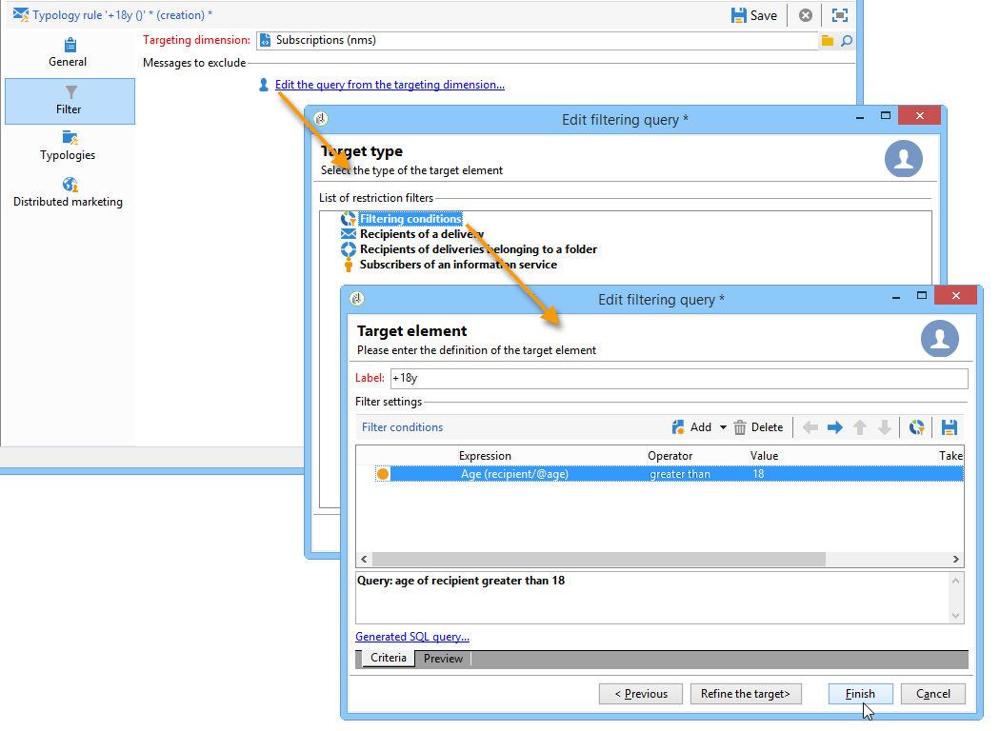

# Filterregels{#filtering-rules}

Met filterregels kunt u de berichten definiëren die u wilt uitsluiten op basis van criteria die in een query zijn gedefinieerd. Deze regels zijn gekoppeld aan een doelgerichte dimensie.

Filterregels kunnen worden gekoppeld aan andere soorten regels (controle, druk, enz.) in typologieën, of gegroepeerd in een specifieke **Filtrerende** typologie. Raadpleeg [Filtertypologie](#creating-and-using-a-filtering-typology)voor meer informatie hierover.

## Filterregels maken {#creating-a-filtering-rule}

Bijvoorbeeld, kunt u uw nieuwsbrief abonnees filtreren om mededelingen te verhinderen worden verzonden naar ontvangers die onderage zijn.

Pas de volgende stappen toe om dit filter te definiëren:

1. Maak een **[!UICONTROL Filtering]** typologieregel die op alle communicatiekanalen van toepassing is.

   

1. Wijzig de standaarddoeldimensie en selecteer de abonnementen (**nms:abonnement**).

   

1. Maak het filter met de **[!UICONTROL Edit the query from the targeting dimension...]** koppeling.

   

1. Koppel deze regel aan een campagnetypologie en sla deze op.

   

Wanneer deze regel in een levering wordt gebruikt, worden minderjarige abonnees automatisch uitgesloten. Een specifiek bericht geeft regeltoepassing aan:

## Een filterregel conditioneren {#conditioning-a-filtering-rule}

U kunt het toepassingsgebied van de het filtreren regel beperken die op de verbonden levering of leveringsoverzicht wordt gebaseerd.

Hiervoor gaat u naar het **[!UICONTROL General]** tabblad van de typologieregel, selecteert u het type beperking dat u wilt toepassen en maakt u het filter, zoals hieronder wordt weergegeven:

In dit geval wordt de regel, zelfs als deze aan alle leveringen is gekoppeld, alleen toegepast op leveringen die aan de criteria van het gedefinieerde filter voldoen.

>[!NOTE]
>
>Typologieën en filterregels kunnen in een werkschema, in de **[!UICONTROL Delivery outline]** activiteit worden gebruikt. Zie [deze sectie](../../workflow/using/delivery-outline.md)voor meer informatie.

## Filtertypologie maken en gebruiken {#creating-and-using-a-filtering-typology}

U kunt **[!UICONTROL Filtering]** typologieën maken: zij bevatten alleen filterregels .

Deze specifieke typologieën kunnen aan een levering worden verbonden wanneer het doel wordt geselecteerd: in de leveringstovenaar, klik de **[!UICONTROL To]** verbinding, dan klik de **[!UICONTROL Exclusions]** tabel.

Selecteer vervolgens de filtertypologie die op de levering moet worden toegepast. Klik hiertoe op de **[!UICONTROL Add]** knop en selecteer de typologieën die u wilt toepassen.

U kunt filterregels ook rechtstreeks via dit tabblad koppelen, zonder ze te groeperen in een typologie. Gebruik hiervoor de onderste sectie van het venster.

>[!NOTE]
>
>* Alleen typologieën en filterregels zijn beschikbaar in het selectievenster.
>* Deze configuraties kunnen in het leveringsmalplaatje worden bepaald dat automatisch op alle nieuwe die leveringen worden toegepast worden gecreeerd gebruikend het malplaatje.
>

## Uitsluitingsregels voor standaardlevering {#default-deliverability-exclusion-rules}

Twee het filtreren regels zijn beschikbaar door gebrek: **[!UICONTROL Exclude addresses]** ( **[!UICONTROL addressExclusions]** ) en **[!UICONTROL Exclude domains]** ( **[!UICONTROL domainExclusions]** ) . Tijdens de e-mailanalyse, vergelijken deze regels de ontvankelijke e-mailadressen met de verboden adressen of domeinnamen in een gecodeerde globale suppressielijst die in de leveringsinstantie wordt beheerd. Als er een gelijke is, wordt het bericht niet verzonden naar die ontvanger.

Dit om te voorkomen dat ze op de zwarte lijst worden gezet vanwege kwaadwillige activiteiten, met name het gebruik van een Spamtrap. Als bijvoorbeeld een spamtrap wordt gebruikt om zich te abonneren via een van uw webformulieren, wordt automatisch een bevestigingsbericht verzonden naar die spamtrap. Hierdoor wordt uw adres automatisch op de zwarte lijst gezet.

>[!NOTE]
>
>De adressen en domeinnamen in de globale suppressielijst worden verborgen. Alleen het aantal uitgesloten ontvangers wordt vermeld in de logboeken van de leveringsanalyse.

