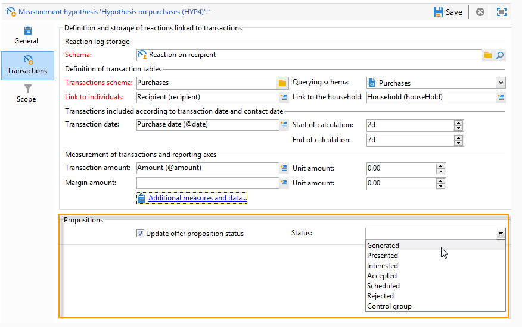

# Hypothesjablonen{#hypothesis-templates}

## Een hypothesemodel maken {#creating-a-hypothesis-model}

Door het samenstellen van de hypothesesjabloon kunt u de context definiëren voor het meten van reacties, of het nu gaat om een levering of een aanbieding. Hier wordt verwezen naar de verschillende meettabellen, waaronder die voor het definiëren van relaties tussen personen, hypothesen en de transactietabel.

Voer de volgende stappen uit om een hypothesesjabloon te maken:

1. Klik in de Adobe Campaign Explorer op **[!UICONTROL Resources>Templates>Hypothesis templates]**.

   

1. Klik **[!UICONTROL New]** of klik met de rechtermuisknop in de lijst met sjablonen en kies **[!UICONTROL New]** in de vervolgkeuzelijst.
1. Voer het hypotheselabel in.
1. Geef aan of de template bestemd is voor hypothesen over aanbiedingen of leveringen via de **[!UICONTROL Hypothesis type]** website.
1. Geef voor **[!UICONTROL Delivery]** typesjablonen aan of metingen met of zonder controlegroep moeten worden uitgevoerd (zie voor meer informatie de [eigenschappen van een hypothesesjabloon](#properties-of-a-hypothesis-template)).
1. Voor **[!UICONTROL Delivery]** typesjablonen kiest u een specifiek kanaal of besluit u de sjabloon toe te passen op alle beschikbare kanalen in Adobe Campagne met behulp van de **[!UICONTROL Channel]** vervolgkeuzelijst (zie [Eigenschappen van een hypothesesjabloon](#properties-of-a-hypothesis-template)voor meer informatie).
1. Selecteer de **[!UICONTROL Execution folder]** waarin u de hypothesen wilt maken en automatisch wilt uitvoeren die op basis van deze sjabloon worden gemaakt.
1. Kies de uitvoeringsinstellingen (zie de instellingen voor [het uitvoeren van](#hypothesis-template-execution-settings)hypothesesjablonen voor meer informatie hierover).
1. Geef de periode voor de berekening van de hypothese op (zie voor meer informatie de instellingen voor de uitvoering van de [hypothesesjabloon](#hypothesis-template-execution-settings)).

   >[!CAUTION]
   >
   >Deze periode wordt bepaald vanaf de contactdatum.

1. Geef op het **[!UICONTROL Transactions]** tabblad de tabellen en velden op die nodig zijn voor de hypotheseverberekening (zie [Transacties](#transactions)voor meer informatie).
1. Als uw malplaatje voor **[!UICONTROL Offer]** typehypothesen wordt gevormd, kunt u de **[!UICONTROL Update offer proposition status]** optie toelaten: in dit geval selecteert u de status van het voorstel dat u wilt wijzigen.
1. Geef de reikwijdte van de hypothesetoepassing op (zie voor meer informatie de omtrek van de [hypothese](#hypothesis-perimeter)).
1. Indien nodig, gebruik een manuscript om het filtreren (voor meer op dit, verwijs naar de omtrek van de [Hypothese](#hypothesis-perimeter)) te voltooien.

### Eigenschappen van een hypothesesjabloon {#properties-of-a-hypothesis-template}

Op het **[!UICONTROL General]** tabblad van de sjabloon kunt u de algemene sjabloonopties opgeven. De beschikbare velden zijn:

* **[!UICONTROL Hypothesis type]**: Hiermee kunt u bepalen of de sjabloon bestemd moet zijn voor hypothesen over leveringen of aanbiedingen.

   U kunt ook een hypothese maken die zowel op leveringen als op aanbiedingen van toepassing is.

   >[!NOTE]
   >
   >Als de sjabloon van toepassing is op aanbiedingen, is de **[!UICONTROL Update offer proposition status]** optie beschikbaar op het **[!UICONTROL Transactions]** tabblad.

* **[!UICONTROL Measurement with control group]**: Hiermee kunt u aangeven of een controlegroep is gedefinieerd voor de levering of de campagne en deze opnemen in meetindicatoren. De controlegroep, die geen leveringen ontvangt, laat u het effect van de campagne na de levering meten, door het met de doelpopulatie te vergelijken die de levering ontving.

   >[!NOTE]
   >
   >Als het malplaatje wordt gevormd om een controlegroep in overweging te nemen, maar geen groep wordt bepaald in de levering die de hypothesen betreffen, zullen de resultaten op gerichte slechts ontvangers worden gebaseerd.

   Voor meer bij het bepalen van en het vormen van een controlegroep, verwijs naar het [bepalen van een controlegroep](../../campaign/using/marketing-campaign-deliveries.md#defining-a-control-group).

* **[!UICONTROL Channel]**: U kunt een specifiek kanaal kiezen of de hypothesesjabloon beschikbaar maken voor alle kanalen in de Adobe Campagne Console door deze te selecteren **[!UICONTROL All channels]** in de vervolgkeuzelijst. Als u het malplaatje voor een specifiek kanaal vormt, laat dit u leveringen automatisch filtreren per kanaal wanneer het creëren van de hypothese (verwijs naar het [Creëren van hypotheses](../../campaign/using/creating-hypotheses.md)).

   

* **[!UICONTROL Execution folder]**: Hiermee kunt u de uitvoeringsmap voor de hypothese opgeven.
* **[!UICONTROL Taken into account in campaign ROI calculation]**: houdt bij de berekening van het rendement van investeringen voor de desbetreffende campagne rekening met het hypotheseresultaat.

### Instellingen voor het uitvoeren van hypothesesjablonen {#hypothesis-template-execution-settings}

Op het **[!UICONTROL General]** tabblad van de sjabloon kunt u ook de parameters voor het uitvoeren van hypothesen opgeven. De beschikbare opties zijn als volgt:

* **[!UICONTROL Schedule execution for a time of low activity]**: Hiermee kunt u het starten van een hypothese plannen om de prestaties van Adobe Campagne te optimaliseren. Als deze optie is ingeschakeld, wordt tijdens de downtime in de verwerkingsworkflow van campagnes hypotheseverberekening uitgevoerd.

   

* **[!UICONTROL Priority]**: het niveau dat wordt toegepast op de hypothese om de berekeningsbevelen voor hypothesen uit te splitsen indien er sprake is van gelijktijdige executies.

   

* **[!UICONTROL Automatic execution]**: Indien nodig kunt u een herberekening van de hypothese plannen (bijvoorbeeld als u de indicatoren regelmatig wilt bijwerken tot het einde van de levering).

   

   Pas het volgende proces toe om een schema op te geven:

   1. Klik op de **[!UICONTROL Frequency of execution...]** koppeling en vervolgens op de **[!UICONTROL Change...]** knop.

      

   1. Configureer de frequentie, de gerelateerde gebeurtenissen en de geldigheidsperiode.

      

   1. Klik **[!UICONTROL Finish]** om het schema op te slaan.

      

* **[!UICONTROL Log SQL queries in journal]**: deze functie is gereserveerd voor deskundige gebruikers. Het laat u een lusje aan de controle van de meethypothese toevoegen om SQL vragen te tonen. Dit laat de opsporing van mogelijke storingen toe als een simulatie met fouten eindigt.
* **[!UICONTROL Keep execution workflow]**: Hiermee kunt u de workflow behouden die automatisch is gegenereerd bij het begin van de hypotheseberekening. In de hypothesen die zijn gemaakt op basis van een sjabloon waarop deze optie is ingeschakeld, is de gegenereerde workflow beschikbaar om het proces te volgen.

   >[!CAUTION]
   >
   >Deze optie moet alleen worden geactiveerd voor foutopsporingsdoeleinden, in het geval van een fout tijdens het uitvoeren van de hypothese.\
   >Bovendien mogen automatisch gegenereerde workflows niet worden gewijzigd. Eventuele wijzigingen zouden elders niet in aanmerking worden genomen voor latere berekeningen.\
   >Als u deze optie hebt ingeschakeld, verwijdert u de workflow nadat deze is uitgevoerd.

### Transacties {#transactions}

Dit tabblad bevat de verschillende velden en tabellen waarmee u de geschiedenis van reacties van ontvangers in termen van transacties kunt opslaan. Verwijs naar de gids van de [Configuratie](../../configuration/using/about-schema-reference.md) voor meer informatie over de lijsten gewijd aan reactiebeheer.

* **[!UICONTROL Schema (reaction log storage)]**: Selecteer de tabel met reacties van de ontvanger. De out-of-the-box tabel in Adobe Campaign is **NmsRemaMatchRcp**.
* **[!UICONTROL Transaction schema]**: kiest u de tabel die de hypothesen betreffen, d.w.z. de transactie of de aankooptabel.
* **[!UICONTROL Querying schema]**: de criteria voor het filteren van de hypothese te kiezen.
* **[!UICONTROL Link to individuals]**: Kies de koppeling tussen personen en de tabel die als transactieschema wordt gebruikt.
* **[!UICONTROL Link to the household]**: Selecteer de koppeling naar het huishouden in het transactieschema als u alle leden van een huishouden in een hypothese wilt opnemen. Dit veld is optioneel.
* **[!UICONTROL Transaction date]**: dit veld is optioneel, maar wordt aanbevolen, omdat u hiermee een berekeningsruimte voor hypothesen kunt definiëren.
* **[!UICONTROL Measurement period]**: Hiermee kunt u begin- en einddatums configureren waarin hypothesen worden uitgevoerd en aankooplijnen worden hersteld.

   Wanneer de hypothese verband houdt met een levering, wordt de meting automatisch geactiveerd een paar dagen na de contactdatum voor directe postzendingen of na de leveringsdatum voor e-mail- of sms-leveringen.

   

   Als de hypothese direct wordt gelanceerd, kan ze worden gedwongen als ze onmiddellijk zou willen worden geactiveerd. Anders wordt de functie automatisch geactiveerd op basis van het geconfigureerde einde van de berekeningsdatum, die is gebaseerd op de aanmaakdatum van de hypothese (zie [Een hypothese tijdens een levering](../../campaign/using/creating-hypotheses.md#creating-a-hypothesis-on-the-fly-on-a-delivery)maken).

* **[!UICONTROL Transaction/Margin amount]**: Deze velden zijn optioneel en stellen u in staat omzetindicatoren automatisch te berekenen (zie [Indicatoren](../../campaign/using/hypothesis-tracking.md#indicators)).
* **[!UICONTROL Unit amount]**: Hiermee kunt u een bedrag instellen voor het berekenen van de inkomsten (zie [Indicatoren](../../campaign/using/hypothesis-tracking.md#indicators)).

   

* **[!UICONTROL Additional measures and data]**: Hiermee kunt u aanvullende rapportagemaatregelen of assen opgeven vanuit velden in de verschillende tabellen.
* **[!UICONTROL Update offer proposition status]**: Hiermee kunt u de status van het voorstel wijzigen als een ontvanger van het aanbod door de hypothese wordt geïdentificeerd.

   

### Hypothese-omtrek {#hypothesis-perimeter}

Als u de transactietabel en de velden hebt gedefinieerd waarop de hypothese betrekking heeft, kunt u het bereik van de hypothesen verfijnen door de doeltransacties en -leveringen aan de hand van filters op te geven. U kunt ook een JavaScript-script gebruiken om expliciet te verwijzen naar een product waarnaar in de transactietabel wordt verwezen.

* **Filteren op transacties**: in het **[!UICONTROL Scope]** lusje, kunt u een filter op de hypothese vormen. Dit doet u als volgt:

   1. Klik op de **[!UICONTROL Edit query]** koppeling.

      

   1. Geef de filtervoorwaarden op.

      

   1. Selecteer de transactie waarop de hypothese betrekking heeft.

      

* **Filter op ontvangers**: op het **[!UICONTROL Scope]** tabblad kunt u uw hypothese beperken tot alle informatie die aan een bericht is gekoppeld (levering, ontvanger, e-mailadres, service, enz.):

   1. Klik vervolgens op de **[!UICONTROL Add a filter]** koppeling **[!UICONTROL Edit query]**.

      

   1. Geef de filtervoorwaarden op.

      

   1. Klik **[!UICONTROL Finish]** om de query op te slaan.

      

* **Script**: u kunt een JavaScript-script gebruiken om de hypothesemontages tijdens de uitvoering dynamisch te overladen.

   Klik hiertoe op de **[!UICONTROL Advanced settings]** koppeling en voer het gewenste script in.

   >[!NOTE]
   >
   >Deze optie is bedoeld voor ervaren gebruikers.

   

## Voorbeeld: het creëren van een hypothesesjabloon bij levering {#example--creating-a-hypothesis-template-on-a-delivery}

In dit voorbeeld, gaan wij een hypothesemalplaatje op een direct-mailtype levering tot stand brengen. De transactietabel (**Aankopen** in ons voorbeeld) waarop de hypothesen zijn gebaseerd, bevat aankooplijnen die zijn gekoppeld aan artikelen of producten. Wij willen ons model vormen om hypotheses op artikelen of producten in de aankooplijst tot stand te brengen.

1. Ga in de Adobe Campaign Explorer naar het **[!UICONTROL Resources > Templates > Hypothesis templates]** knooppunt.
1. Klik **[!UICONTROL New]** om een sjabloon te maken.

   

1. Wijzig het sjabloonlabel.

   

1. Selecteer **[!UICONTROL Deliveries]** als hypothesetype.
1. Geef aan dat de levering een controlegroep kan bevatten door het desbetreffende vak in te schakelen.
1. Kies het **[!UICONTROL Direct mail]** kanaal.

   >[!NOTE]
   >
   >Aangezien de sjabloon specifiek is voor direct-mailleveringen, kunnen hypothesen die met dit model worden gemaakt, niet aan andere leveringstypen worden gekoppeld.

1. Selecteer op het **[!UICONTROL Transactions]** tabblad de tabel met reacties bij ontvangers.

   

1. Kies in het **[!UICONTROL Transactions schema]** veld de aankooptabel.

   

1. Selecteer de aankooplijnen in het **[!UICONTROL Querying schema]** veld.

   

1. Kies de ontvangers die aan de aankooptabel zijn gekoppeld.

   

1. Selecteer het veld dat is gekoppeld aan de aankoopdatum.

   Hiermee kunt u een tijdkader voor hypothesen definiëren. Dit werkgebied is niet verplicht, maar wordt wel aanbevolen.

   

1. Configureer de berekeningsperiode 5 tot 25 dagen.

   

1. Klik op het **[!UICONTROL Scope]** tabblad **[!UICONTROL Edit query]** om een filter voor hypothesen te maken.

   

   Met de gemaakte sjabloon kunt u dus hypothesen uitvoeren op de producten of artikelen in de aankooptabel.

1. Klik **[!UICONTROL Save]** om de sjabloon op te nemen.

