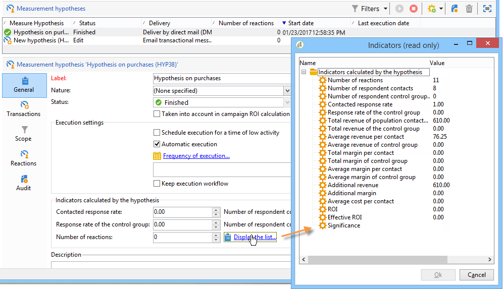
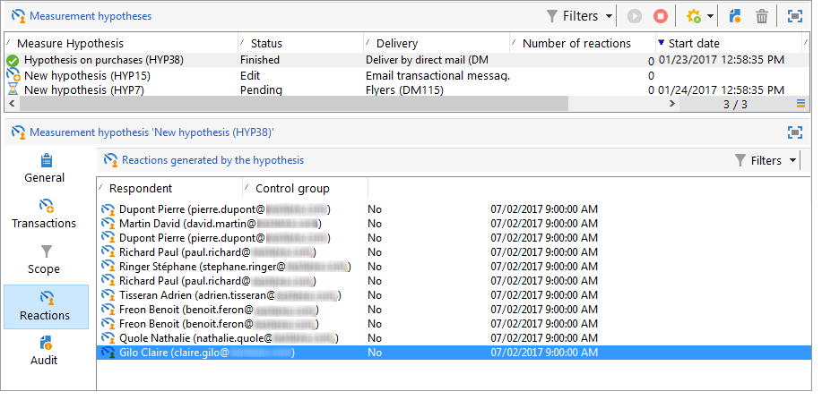

# Hypothetische tekstspatiëring{#hypothesis-tracking}

Het resultaat van hypotheseberekeningen is beschikbaar op verschillende niveaus van het Adobe Campaign-platform: De indicatoren berekend op basis van hypothesen en de reacties op de doelpopulaties zijn zichtbaar via de werkelijke hypothese, alsmede in de hypotheseverslagen die beschikbaar zijn via campagnes en leveringen.

## Hypothetische resultaten {#hypothesis-results}

### Indicatoren {#indicators}

Zodra de hypothese is berekend, worden verschillende meetindicatoren automatisch bijgewerkt. Deze zijn beschikbaar op het **[!UICONTROL General]** tabblad van de hypothese.

Deze indicatoren zijn:

* **Aantal respondenten**: aantal gecontacteerde personen dat met de hypothese overeenstemt.
* **Behandelde responspercentage**: aantal geënquêteerde contacten / totaal aantal gecontacteerde personen tijdens de levering.
* **Aantal contacten** van de respondentencontrolegroep: aantal controlegroepen die overeenkomen met de hypothese.
* **Responspercentage van de controlegroep**: aantal respondentencontrolegroepen / totaal aantal leveringscontrolegroepen.
* **Aantal reacties**: aantal records in de tabel die de relatie tussen personen, de hypothese en de transactietabel bevat.

Klik op de **[!UICONTROL Display the list]** koppeling voor de volledige lijst met indicatoren:

De indicatoren geven de volgende informatie:

* **Totale inkomsten van gecontacteerde** bevolking: totale bedragen over het aantal gecontacteerde personen.
* **Totale ontvangsten van de controlegroep**: totale bedragen over het aantal controlegroepen.
* **Gemiddelde omzet per contactpersoon**: totaal bedrag / gecontacteerd.
* **Gemiddelde inkomsten van de controlegroep**: totale bedragen / controlegroep.
* **Totale marge per contactpersoon**: totale marge over gecontacteerd.
* **Totale marge van de controlegroep**: totale marge over controlegroep.
* **Gemiddelde marge per contact**: totale marge / gecontacteerd.
* **Gemiddelde marge van controlegroepen**: totale marges / controlegroep.
* **Aanvullende inkomsten**: (Gemiddelde inkomsten van gecontacteerde gemiddelde opbrengsten van de controlegroep)*Aantal gecontacteerde personen
* **Aanvullende marge**: (Gemiddelde marge van de gecontacteerde-gemiddelde marge van de controlegroep) / aantal gecontacteerde personen
* **Gemiddelde kosten per contactpersoon**: berekende leveringskosten / Aantal contacten.
* **ROI**: berekende kosten van de levering / totale marge per contactpersoon
* **Effectieve ROI**: berekende leveringskosten / extra marge.
* **Significantie**: bevat waarden 0 tot en met 3, afhankelijk van de campagnesignificantie.

### Reacties {#reactions}

U kunt de reacties van de ontvangers op de hypothesen bekijken via het **[!UICONTROL Reactions]** tabblad.

1. Wanneer de hypotheseberekening is voltooid, gaat u naar het **[!UICONTROL Campaign management > Measurement hypotheses]** knooppunt van de Adobe Campaign-structuur.
1. Selecteer de gewenste hypothese en klik op het **[!UICONTROL Reactions]** tabblad om de lijst weer te geven met ontvangers die na de marketingcampagne waarschijnlijk iets zullen kopen.

   

## Rapporten {#reports}

In de sectie **[!UICONTROL Hypothesis report]** kunt u de resultaten bekijken van de hypotheses die zijn uitgevoerd voor campagnes en leveringen. Dit verslag bevat de indicatoren die door de hypothese zijn berekend (zie voor meer informatie de [indicatoren](#indicators)).

* **Op campagnereniveau**: Klik op de **[!UICONTROL Reports]** koppeling van de desbetreffende campagne en selecteer de **[!UICONTROL Hypothesis report]** koppeling. Dit verslag bevat de lijst van de campagneleveringen en de hypothesen die voor elke levering zijn berekend.

   

* **Op leveringsniveau**: om tot het rapport toegang te hebben, open de betrokken levering, klik **[!UICONTROL Reports]** in het **[!UICONTROL Summary]** lusje en selecteer **[!UICONTROL Hypothesis report]**. Indien voor dezelfde levering meerdere hypothesen zijn berekend, bevat het verslag alle hypothesen.

   
