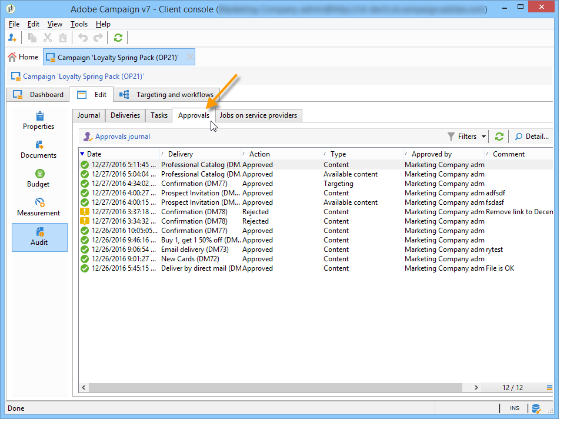
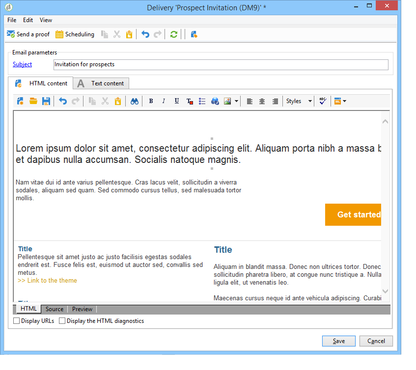

# Marketing-campagnes {#approving-marketing-campaigns} goedkeuren

## Goedkeuringsproces {#approval-process}

Elke leveringsstap kan worden goedgekeurd om volledige controle en controle op de verschillende processen van de campagne te waarborgen: het richten, inhoud, begroting, extractie, en het verzenden van een bewijs.

>[!NOTE]
>
>U moet controleren of de revisoren de juiste rechten hebben om te worden goedgekeurd. Controleer ook of hun beveiligingszone correct is gedefinieerd.

E-mails met kennisgevingen worden verzonden naar de Adobe Campaign-operatoren die als controleurs zijn aangewezen om hen op de hoogte te brengen van een goedkeuringsaanvraag.

De goedkeuringsprocedure wordt beschreven in [Controle en goedkeuring van leveringen](#checking-and-approving-deliveries).

>[!NOTE]
>
>Alleen de eigenaar van de levering kan een levering starten. Als een andere operator (of operatorgroep) een levering wil starten, moet u deze als controleurs toevoegen in het veld **[!UICONTROL Delivery start:]**.\
>Zie ook [Revisoren selecteren](#selecting-reviewers).

### Werkwijze {#operating-principle-}

De standaard e-mail voor goedkeuring van de begroting is bijvoorbeeld als volgt:

De revisoroperatoren kunnen vervolgens kiezen of ze de desbetreffende stap al dan niet goedkeuren.

Zodra de exploitant zijn keuze, goedkeuring of afwijzing van de baan goedkeurt wordt doorgestuurd naar het leveringsdashboard.

De informatie is ook beschikbaar in de goedkeuringslogboeken van de campagne (die via **[!UICONTROL Edit > Tracking > Approvals]** tabel wordt betreden):

Deze meldingen worden verzonden naar de betrokken marktdeelnemers voor elk proces waarvoor goedkeuring is ingeschakeld.

De goedkeuringen kunnen voor het campagnemalplaatje, voor elke campagne individueel, of voor een levering worden toegelaten.

Alle taken waarvoor goedkeuring is vereist, worden geselecteerd in het campagnemalplaatje ( **[!UICONTROL Properties]** > **[!UICONTROL Advanced campaign settings...]** > **[!UICONTROL Approvals]** tabblad), evenals de exploitanten die verantwoordelijk zijn voor goedkeuring (ze ontvangen meldingen, tenzij deze optie niet is ingeschakeld). Raadpleeg [Processen goedkeuren](#approving-processes) voor meer informatie.

Deze montages kunnen voor elke campagne met dit malplaatje worden gecreeerd, en individueel voor elke campagnelevering worden met voeten getreden: Klik op de knop **[!UICONTROL Properties]** en vervolgens op de tab **[!UICONTROL Approvals]**.

In het volgende voorbeeld is voor de leveringsinhoud geen goedkeuring vereist:

### Revisoren selecteren {#selecting-reviewers}

Voor elk type goedkeuring worden de voor de goedkeuring verantwoordelijke exploitanten of groepen van marktdeelnemers geselecteerd uit de vervolgkeuzelijst in de levering. Aanvullende operatoren kunnen worden toegevoegd met de koppeling **[!UICONTROL Edit...]**. In dit venster kunt u ook de deadline van de goedkeuring bewerken.

Als er geen controleur is opgegeven, is de campagnemanager verantwoordelijk voor de goedkeuring en ontvangt deze de meldingen. Het campagneremanager wordt opgegeven op het tabblad **[!UICONTROL Edit > Properties]** van de campagne:

>[!NOTE]
>
>Alle andere Adobe Campaign-operatoren met **[!UICONTROL Administrator]**-rechten kunnen ook taken goedkeuren, maar ze ontvangen geen berichten.\
>Standaard kan de campagnemanager de goedkeuring niet uitvoeren of de leveringen starten als er goedkeuringsoperatoren zijn gedefinieerd. U kunt dit gedrag wijzigen en de campagnemanager machtigen om leveringen goed te keuren/te starten door de optie **NmsCampaign_Activate_OwnerConfirmation** met **1** als een waarde te maken.

### Goedkeuringsmodi {#approval-modes}

#### Goedkeuring via het dashboard {#approval-via-the-dashboard}

Als u een taak wilt goedkeuren via de console of de webinterface, klikt u op de desbetreffende koppeling op het campagnemdashboard. Taken kunnen ook worden goedgekeurd via het volgen van de levering of via het leveringsdashboard.

Controleer de informatie die u wilt goedkeuren, kies of u de goedkeuring wilt accepteren of afwijzen en voer zo nodig een opmerking in. Klik **[!UICONTROL Ok]** om op te slaan.

>[!NOTE]
>
>Als een proces reeds door een andere exploitant is goedgekeurd, is de goedkeuringsverbinding niet beschikbaar.

#### Goedkeuring via kennisgevingsberichten {#approval-via-notification-messages}

Klik op de koppeling die beschikbaar is in het meldingsbericht (zie [Meldingen](#notifications)). U wordt gevraagd uzelf te identificeren, zoals hieronder wordt getoond:

Selecteer **[!UICONTROL Accept]** of **[!UICONTROL Reject]** en voer zo nodig een opmerking in.

Klik op **[!UICONTROL Validate]**.

>[!NOTE]
>
>Als tijdens het proces waarschuwingen zijn weergegeven, wordt een waarschuwing weergegeven in het bericht.

#### Goedkeuring {#approval-tracking}

De informatie is op verschillende plaatsen beschikbaar:

* **[!UICONTROL Approvals]** subtab op het tabblad **[!UICONTROL Edit > Tracking]** in het goedkeuringslogboek voor de campagne:

   

* **[!UICONTROL Deliveries]** subtab op het tabblad **[!UICONTROL Edit > Tracking]** in het leveringslogboek van de campagne:

   

* De goedkeuringsstatus voor elke levering kan worden bekeken door de optie **[!UICONTROL Hide/show log]** van **[!UICONTROL Summary]** tabel te klikken.

   

* Deze informatie is ook toegankelijk via het tabblad **[!UICONTROL Tracking > Approvals]** van elke levering:

   

>[!NOTE]
>
>Wanneer een exploitant een taak heeft goedgekeurd of geweigerd, kunnen de andere beoordelende exploitanten niet langer op de goedkeuring reageren.

#### Automatische en handmatige goedkeuring {#automatic-and-manual-approval}

Als Adobe Campaign bij het maken van een doelworkflow automatisch goedkeurt (de standaardmodus), wordt de goedkeuringskoppeling weergegeven of wordt een melding verzonden zodra goedkeuring is vereist.

Als u de goedkeuringsmodus wilt kiezen (handmatig of automatisch), klikt u op het tabblad **[!UICONTROL Edit > Properties]** van de campagne- of campagnemalplaatje, klikt u vervolgens op **[!UICONTROL Advanced campaign settings...]** en ten slotte op het tabblad **[!UICONTROL Approvals]**.

>[!NOTE]
>
>De geselecteerde goedkeuringsmodus is van toepassing op alle leveringen van de campagne.

Wanneer een doelworkflow wordt gemaakt, kunt u met handmatige goedkeuring voorkomen dat er goedkeuringskoppelingen worden gemaakt of dat meldingen automatisch worden verzonden. Het campagnesdashboard biedt dan een **[!UICONTROL Submit targeting for approval]** verbinding aan om het goedkeuringsproces manueel te lanceren.

Met een bevestigingsbericht kunt u goedkeuringen autoriseren voor de taken die voor deze levering zijn geselecteerd.

De goedkeuringsknoppen worden vervolgens weergegeven op het campagnemdashboard (voor deze levering), op het leveringsdashboard en in het bijhouden van de levering. Als meldingen zijn ingeschakeld, worden ze parallel verzonden.

Met deze methode voor het inschakelen van goedkeuringen kunt u doelgericht werken zonder dat u onjuiste meldingen naar revisoren verzendt.

### Meldingen {#notifications}

Meldingen zijn specifieke e-mailberichten die naar revisoren worden verzonden om hen te laten weten dat een proces in afwachting is van goedkeuring. Wanneer de exploitant de verbinding in het bericht klikt, verschijnt een authentificatiepagina en, na het programma openen, kan de exploitant de informatie bekijken en de baan goedkeuren of verwerpen. U kunt ook een opmerking invoeren in het goedkeuringsvenster.

De inhoud van e-mailberichten voor meldingen kan worden aangepast. Zie [Notification content](#notification-content).

#### Melding {#enabling-disabling-notification} inschakelen/uitschakelen

Door gebrek, worden de berichtberichten verzonden als de goedkeuring van de verwante baan in het campagnemalplaatje, de campagne, of de levering wordt toegelaten. Meldingen kunnen echter alleen via de console worden uitgeschakeld.

Hiervoor bewerkt u het goedkeuringsvenster van de campagne- of campagnemalplaatje ( **[!UICONTROL Edit > Properties]** > **[!UICONTROL Advanced campaign settings...]** > **[!UICONTROL Approvals]** tabblad) en selecteert u **[!UICONTROL Do not enable notification sending]**.

#### Inhoud {#notification-content}

De inhoud van het bericht wordt bepaald in een specifiek malplaatje: **[!UICONTROL Notification of validations for the marketing campaign]**. Deze sjabloon wordt opgeslagen in de map **[!UICONTROL Administration > Campaign management > Technical delivery templates]** van de Adobe Campaign-structuur.

## Leveringen {#checking-and-approving-deliveries} controleren en goedkeuren

Met Adobe Campaign kunt u goedkeuringsprocessen instellen voor de belangrijkste fasen van de marketingcampagne in de samenwerkingsmodus.

Voor directe postleveringen, kunnen de exploitanten van Adobe Campaign het extractiedossier bekijken alvorens het naar de router wordt verzonden, en indien nodig kunnen zij het formaat veranderen en extractie opnieuw lanceren. Zie [Een extractiebestand goedkeuren](#approving-an-extraction-file).

Voor elke campagne kunt u het leveringsdoel, de inhoud (zie [Inhoud goedkeuren](#approving-content)) en de kosten goedkeuren. Adobe Campaign-operatoren die met de goedkeuring zijn belast, kunnen via e-mail op de hoogte worden gesteld en kunnen goedkeuring van de console of via een webverbinding accepteren of afwijzen. Zie [Processen goedkeuren](#approving-processes).

Wanneer deze validatiefasen zijn voltooid, kan de levering worden gestart. Zie [Een levering starten](../../campaign/using/marketing-campaign-deliveries.md#starting-a-delivery).

>[!NOTE]
>
>Zie [Goedkeuringsproces](#approval-process) voor meer informatie over goedkeuringsmodi en tekstspatiëring.

### Processen {#approving-processes} goedkeuren

De stadia die goedkeuring vereisen verschijnen op het campagnesdashboard (via de console van de Webinterface). Zij verschijnen ook in de levering volgende lijst en op het leveringsdashboard.

Op dit punt, is de status van de campagne **[!UICONTROL To validate]**.

>[!NOTE]
>
>* Als u de processen wilt selecteren die moeten worden goedgekeurd, wijzigt u de sjabloon van de campagne. Voor meer op dit, verwijs naar [De malplaatjes van de Campagne](../../campaign/using/marketing-campaign-templates.md#campaign-templates).
   >
   >
* Raadpleeg ook de sectie over het [goedkeuringsproces](#approval-process).

>[!NOTE]
>
>In een het richten werkschema, als een fout verbonden aan een configuratiekwestie tijdens berichtvoorbereiding voorkomt, wordt de **[!UICONTROL Restart message preparation]** verbinding getoond op het dashboard. Corrigeer de fout en klik op deze koppeling om de berichtvoorbereiding opnieuw te starten terwijl het doelwerkgebied wordt overgeslagen.

Voor elke levering in de campagne, kunt u de volgende processen goedkeuren:

* **Doelstelling, inhoud en begroting**

   Wanneer de opties **[!UICONTROL Enable target approval]**, **[!UICONTROL Enable content approval]** of **[!UICONTROL Enable budget approval]** in het venster van de montages van de baangoedkeuring worden geselecteerd, worden de relevante verbindingen getoond in het campagnesdashboard voor de betrokken leveringen.

   >[!NOTE]
   >
   >De goedkeuring van de begroting is slechts beschikbaar als gericht goedkeuring in het venster van goedkeuringsmontages wordt toegelaten. De koppeling voor goedkeuring van de begroting wordt pas weergegeven nadat het doel is geanalyseerd. Deze koppeling wordt ook samen met de koppeling voor doelgoedkeuring weergegeven.

   Als de **[!UICONTROL Assign content editing]** of **[!UICONTROL External content approval]** opties in het venster van goedkeuringsmontages worden geselecteerd, zal het dashboard **[!UICONTROL Available content]** en **[!UICONTROL External content approval]** verbindingen tonen.

   Met Goedkeuring van inhoud hebt u toegang tot de verzonden proefdrukken.

* **Goedkeuring van uittreksels (direct-mailbezorging)**

   Wanneer **[!UICONTROL Enable extraction approval]** in het venster van goedkeuringsmontages wordt geselecteerd, moet het gehaalde dossier worden goedgekeurd alvorens de router kan worden meegedeeld.

   Er is een **[!UICONTROL Approve content]**-koppeling beschikbaar op het dashboard voor de campagne, zoals hieronder wordt weergegeven:

   

   U kunt een voorvertoning weergeven van de extractiebestanden via het goedkeuringsvak. U kunt de bestanden vervolgens accepteren of afwijzen.

   

   >[!NOTE]
   >
   >De voorvertoning van het extractiebestand heeft alleen betrekking op een gegevensvoorbeeld. Het volledige uitvoerbestand wordt niet geladen.

* **Bijbehorende leveringen goedkeuren**

   De optie **[!UICONTROL Enable individual approval of each associated delivery]** wordt gebruikt voor één hoofdlevering verbonden aan secundaire leveringen. Deze optie is standaard niet geselecteerd, zodat een algemene goedkeuring van de hoofdlevering kan worden uitgevoerd. Als deze optie is geselecteerd, moet elke levering afzonderlijk worden goedgekeurd.

   

#### Goedgekeurde processen {#choosing-the-processes-to-be-approved} selecteren

De goedkeuringsfasen worden bepaald met het malplaatje verbonden aan de campagne. U moet de goed te keuren onderdelen selecteren in het model en de Adobe Campaign-operatoren aangeven die verantwoordelijk zijn voor deze goedkeuringen. Voor meer op dit, verwijs naar [De malplaatjes van de Campagne](../../campaign/using/marketing-campaign-templates.md#campaign-templates).

>[!NOTE]
>
>De goedkeuringsconfiguratie voor de campagne of het campagnemalplaatje zal worden toegepast op alle toekomstige leveringen met betrekking tot deze campagne. Wijzigingen in de configuratie worden niet toegepast op vorige leveringen.

Deze informatie kan voor elke campagne en elke levering worden overschreven.

Voor een campagne, klik **[!UICONTROL Edit > Properties]** tabel, dan **[!UICONTROL Advanced campaign settings...]** verbinding, en tenslotte **[!UICONTROL Approvals]** sublusje om tot de pagina van de goedkeuringsconfiguratie toegang te hebben.

U kunt de processen selecteren en deselecteren om Adobe Campaign-operatoren die met de goedkeuring zijn belast, goed te keuren en aan te wijzen. Dit kunnen individuele operatoren, een groep operatoren of een lijst met operatoren zijn.

Als u een lijst met operatoren wilt selecteren, klikt u op de koppeling **[!UICONTROL Edit...]** rechts van het veld waarin de eerste controleur wordt aangewezen en voegt u zoveel operatoren toe als nodig is, zoals hieronder wordt getoond:

>[!NOTE]
>
>* Als een lijst met revisoren is gedefinieerd, wordt een taak goedgekeurd zodra een controleur deze heeft geaccepteerd. De desbetreffende goedkeuringsverbinding wordt dan niet meer aangeboden in het dashboard. Wanneer het verzenden van meldingen is ingeschakeld en een andere controleur op de goedkeuringskoppeling in het meldingsbericht klikt, wordt hem meegedeeld dat een andere operator de taak al heeft goedgekeurd.
>* U kunt een goedkeuringsschema voor de campagne definiëren in de onderste sectie van het revisiebewerkingsvenster. Standaard hebben revisoren drie dagen vanaf de verzenddatum om een proces goed te keuren. Het is mogelijk om een herinnering te vormen die automatisch naar de betrokken exploitanten vóór de goedkeuringstermijn wordt verzonden.
>* U kunt vanuit deze sectie herinneringen toevoegen.

>

Klik voor elke levering op de knop **[!UICONTROL Audit]** en op het tabblad **[!UICONTROL Approvals]** om goedkeuringsdatums en automatische herinneringen weer te geven en te bewerken.

>[!NOTE]
>
>Dit tabblad is beschikbaar nadat het goedkeuringsproces voor inhoud is gestart.

### Inhoud {#approving-content} goedkeuren

>[!CAUTION]
>
>Voor het goedkeuren van een inhoud is een proefcyclus verplicht. Met proefdrukken kunt u de weergave van gegevens, aanpassingsgegevens en de werking van koppelingen goedkeuren. Raadpleeg de sectie [Berichten verzenden](../../delivery/using/steps-validating-the-delivery.md#sending-a-proof) voor meer informatie over het maken van een proefdruk en de bijbehorende levenscyclus.
>
>De hieronder beschreven functies voor inhoudsgoedkeuring kunnen worden toegevoegd aan de levering van het bewijs.

Het is mogelijk om een cyclus van de inhoudsgoedkeuring te vormen. Selecteer hiertoe de optie **[!UICONTROL Enable content approval]** in het venster met goedkeuringsinstellingen. De belangrijkste stappen van de cyclus voor inhoudsgoedkeuring zijn:

1. Na het creëren van een nieuwe levering, klikt de campagnemanager de **[!UICONTROL Submit content]** verbinding op het campagnedashboard om de cyclus van de inhoudgoedkeuring te beginnen.

   

   >[!NOTE]
   >
   >Als de optie **[!UICONTROL Enable the sending of proofs]** (voor e-mailleveringen) of **[!UICONTROL Enable the sending and approval of proofs]** (voor directe mailleveringen) is geselecteerd in het venster met goedkeuringsinstellingen, worden automatisch proefdrukken verzonden.

1. Er wordt een meldingsbericht verzonden naar de persoon die verantwoordelijk is voor de inhoud, die kan kiezen of u de inhoud al dan niet wilt goedkeuren:

   * via het e-mailbericht:

      

      >[!NOTE]
      >
      >Het e-mailbericht bevat een koppeling naar de reeds verzonden proefdrukken en mogelijk naar een weergave van het bericht voor de verschillende webmails als de optie **Leverbaarheid** voor deze instantie is ingeschakeld.

   * via de console of webinterface, het bijhouden van de levering, het bezorgdashboard of het campagnemdashboard:

      

      >[!NOTE]
      >
      >Met dit campagnemdashboard kunt u de lijst met proefdrukken weergeven die zijn verzonden door op de koppeling **[!UICONTROL Inbox rendering...]** te klikken. Als u hun inhoud wilt weergeven, klikt u op het pictogram **[!UICONTROL Detail]** rechts van de lijst.

      

1. Aan de voor de campagne verantwoordelijke persoon wordt een meldingsbericht gezonden waarin deze wordt geïnformeerd of de inhoud al dan niet is goedgekeurd.

   >[!NOTE]
   >
   >De persoon die verantwoordelijk is voor de campagne kan de cyclus voor het goedkeuren van inhoud op elk gewenst moment opnieuw starten. Om dit te doen, klik de verbinding op **[!UICONTROL Content status]** lijn van het campagnesdashboard (op leveringsniveau), dan klik **[!UICONTROL Reset content approval to submit it again]**.

   

#### Inhoud bewerken toewijzen {#assign-content-editing}

Met deze optie kunt u iemand definiëren die verantwoordelijk is voor het bewerken van inhoud, zoals een webstramien. Als de optie **[!UICONTROL Assign content editing]** is geselecteerd in het venster met goedkeuringsinstellingen, worden verschillende goedkeuringsstappen toegevoegd tussen het maken van de verzending en het verzenden van het e-mailbericht aan de persoon die de inhoud beheert:

1. Na het creëren van een nieuwe levering, klikt de persoon verantwoordelijk voor de campagne **[!UICONTROL Submit content editing]** verbinding in het campagnedashboard om de tevreden het uitgeven cyclus te beginnen.

   

1. De persoon die verantwoordelijk is voor het bewerken van inhoud ontvangt een e-mail met de mededeling dat de inhoud beschikbaar is.

   

1. Vervolgens kunnen ze zich aanmelden bij de console, de levering openen en deze bewerken met een vereenvoudigde wizard om het onderwerp, HTML en tekstinhoud te wijzigen en proefdrukken te verzenden.

   

   >[!NOTE]
   >
   >Als de optie **[!UICONTROL Enable the sending of proofs]** (voor e-mailleveringen) of **[!UICONTROL Enable the sending and approval of proofs]** (voor directe mailleveringen) is geselecteerd in het venster met goedkeuringsinstellingen, worden automatisch proefdrukken verzonden.

1. Nadat de persoon die verantwoordelijk is voor het bewerken van inhoud alle wijzigingen in de inhoud van de levering heeft aangebracht, kan hij of zij de inhoud beschikbaar stellen.

   Om dit te doen, kunnen zij:

   * Klik op de koppeling **[!UICONTROL Available content]** via de Adobe Campaign-console.

      

   * Klik op de koppeling in het meldingsbericht en geef vervolgens de beschikbaarheid van de inhoud goed.

      

      De exploitant kan een commentaar toevoegen alvorens de inhoud aan de persoon voor te leggen die de campagne leidt.

      

      Met het meldingsbericht kan de revisor de inhoud goedkeuren of afwijzen.

      

#### Goedkeuring van externe inhoud {#external-content-approval}

Met deze optie kunt u een externe operator definiëren die verantwoordelijk is voor het goedkeuren van rendering van leveringen, zoals consistentie in de communicatie van het merk, snelheden, enzovoort. Wanneer de optie **[!UICONTROL External content approval]** is geselecteerd in het venster met goedkeuringsinstellingen, worden verschillende goedkeuringsstappen toegevoegd tussen de goedkeuring van de inhoud en de levering van het bericht aan de persoon die verantwoordelijk is voor de campagne:

1. De externe contentmanager ontvangt een bericht via e-mail waarin wordt gemeld dat de inhoud is goedgekeurd en waarmee externe goedkeuring wordt aangevraagd.
1. Het e-mailbericht bevat koppelingen naar de verzonden proefdrukken, waarmee u rendering van de levering kunt weergeven en een knop voor het goedkeuren of afwijzen van de leveringsinhoud.

   >[!NOTE]
   >
   >Deze koppelingen zijn alleen beschikbaar als een of meer proefdrukken zijn verzonden. Anders is rendering van levering alleen beschikbaar via de console of de webinterface.

   

### Een extractiebestand {#approving-an-extraction-file} goedkeuren

Voor off-line leveringen, produceert Adobe Campaign een extractiedossier dat, afhankelijk van hoe het opstelling is, naar de router wordt verzonden. De inhoud ervan is afhankelijk van de gebruikte exportsjabloon.

Wanneer de inhoud, het richten en het budget zijn goedgekeurd, verandert de levering in **[!UICONTROL Extraction pending]** tot de extractiewerkschema voor de campagnes wordt gelanceerd.

Op de datum van het extractieverzoek wordt het extractiebestand gemaakt en verandert de leveringsstatus in **[!UICONTROL File to approve]**.

U kunt de inhoud van het geëxtraheerde bestand weergeven (door op de naam ervan te klikken), goedkeuren of, indien nodig, de indeling wijzigen en de extractie opnieuw starten met de koppelingen op het dashboard.

Zodra het dossier is goedgekeurd, kunt u het bericht e-mail naar de router verzenden. Raadpleeg [Offline levering starten](../../campaign/using/marketing-campaign-deliveries.md#starting-an-offline-delivery) voor meer informatie hierover.
