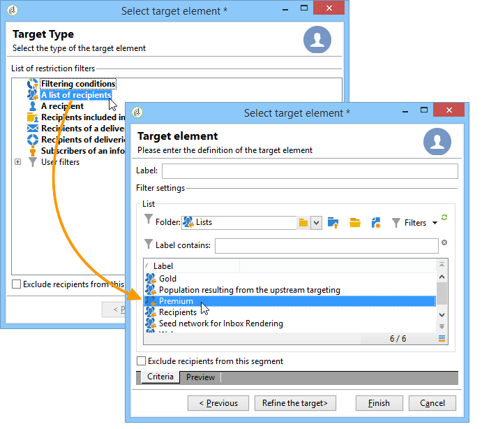
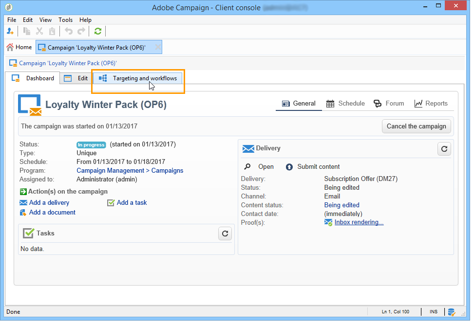
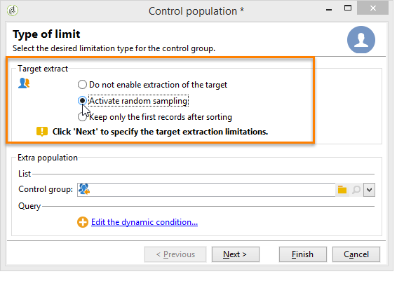
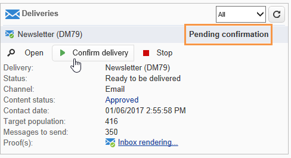
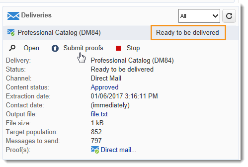
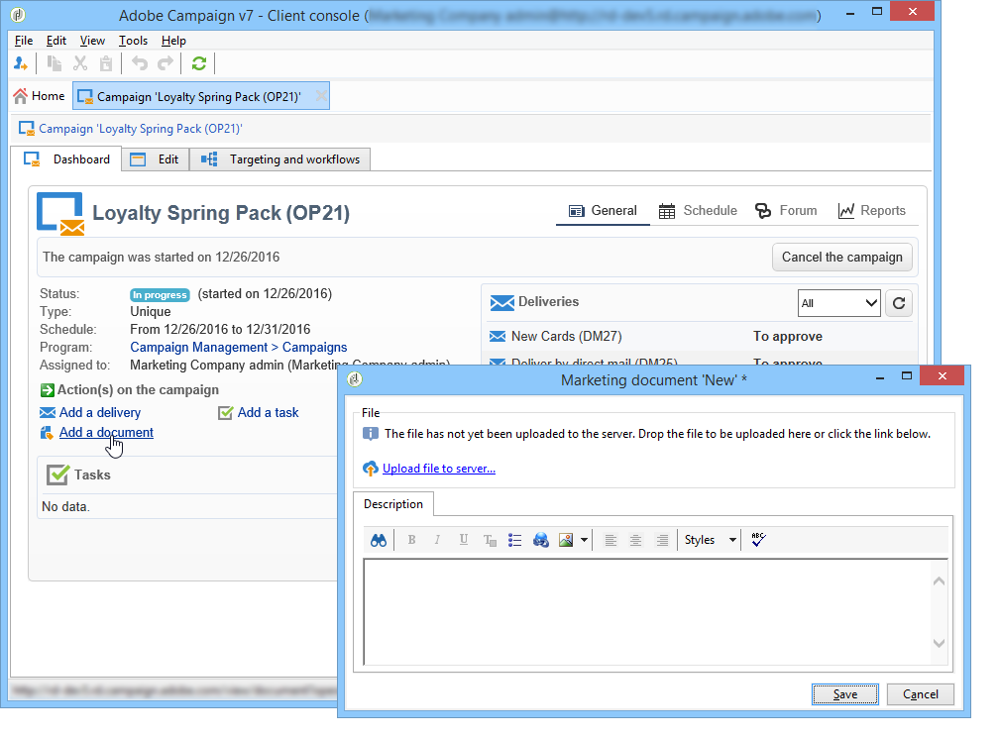

# Aflevering van marketingcampagnes {#marketing-campaign-deliveries}

Leveringen kunnen worden gemaakt via het campagnedashboard, een campagneworkflow of rechtstreeks via het overzicht van leveringen.

## Leveringen maken {#creating-deliveries}

Als u een levering wilt maken die is gekoppeld aan een campagne, klikt u op de **[!UICONTROL Add a delivery]** koppeling in het campagnemdashboard.

De voorgestelde configuraties zijn geschikt voor de verschillende typen levering (direct mail, e-mail, mobiele kanalen, fax of telefoon).

>[!NOTE]
>
>Raadpleeg de sectie [Berichten](../../delivery/using/communication-channels.md) verzenden voor meer informatie over het maken en configureren van leveringen.

## De doelpopulatie selecteren {#selecting-the-target-population}

Voor elke levering definieert de campagnemanager:

* Het hoofddoel. Zie [Het hoofddoel opbouwen in een workflow](#building-the-main-target-in-a-workflow) en de doelpopulatie selecteren voor meer informatie.
* De controlegroep. Voor meer op dit, verwijs naar het [Bepalen van een controlegroep](#defining-a-control-group).
* De zaadadressen. Zie [deze sectie](../../delivery/using/about-seed-addresses.md)voor meer informatie.

Enkele van deze gegevens worden overgenomen van de sjabloon.

>[!NOTE]
>
>De malplaatjes van de campagne worden voorgesteld in de malplaatjes [van de](../../campaign/using/marketing-campaign-templates.md#campaign-templates)Campagne.

Om het leveringsdoel te bouwen, kunt u het filtreren criteria voor de ontvangers in het gegevensbestand bepalen. Deze ontvankelijke selectiemodus wordt voorgesteld in de [Verzendende sectie van Berichten](../../delivery/using/steps-defining-the-target-population.md) .

### Voorbeeld: leveren aan een groep ontvangers {#example--delivering-to-a-group-of-recipients}

U kunt een populatie in een lijst importeren en deze lijst vervolgens als doel instellen in leveringen.

1. Hiervoor bewerkt u de desbetreffende levering en klikt u op de **[!UICONTROL To]** koppeling om de doelpopulatie te wijzigen.

1. Selecteer de **[!UICONTROL Main target]** optie op het **[!UICONTROL Defined via the database]** tabblad en klik **[!UICONTROL Add]** om ontvangers te selecteren.

1. Kies **[!UICONTROL A list of recipients]** en klik **[!UICONTROL Next]** om het te selecteren.

### Het hoofddoel opbouwen in een workflow {#building-the-main-target-in-a-workflow}

Het hoofddoel van een levering kan ook worden gedefinieerd in de doelworkflow: in deze grafische omgeving kunt u een doel maken met behulp van query&#39;s, tests en operatoren: verenigen, dedupliceren, delen, enz.

De handleiding [Automating with workflows](../../workflow/using/executing-a-workflow.md#architecture) bevat een gedetailleerde beschrijving van de werking van de workflowmodule.

>[!IMPORTANT]
>
>In dezelfde campagne kunt u niet meer dan 28 workflows instellen. Buiten deze limiet zijn extra workflows niet zichtbaar in de interface en kunnen fouten genereren.

#### Een doelworkflow maken {#creating-a-targeting-workflow}

Het richten kan door een combinatie filtervoorwaarden in een grafische opeenvolging in een werkschema worden tot stand gebracht. U kunt populaties en subpopulaties maken die op basis van uw vereisten worden aangepast. Klik op het **[!UICONTROL Targeting and workflows]** tabblad in het campagnemdashboard om de werkstroomeditor weer te geven.

De doelpopulatie wordt geëxtraheerd uit de Adobe Campagne-database via een of meer query&#39;s die in een workflow zijn geplaatst. Leer hoe te om een vraag te bouwen, verwijs naar [deze sectie](../../workflow/using/query.md).

U kunt query&#39;s starten en populaties delen via vakken zoals Union, Intersection, Sharing, Exclusion enzovoort.

Selecteer de objecten in de lijsten links van de werkruimte en koppel ze om het doel samen te stellen.

In het diagram, verbind omhoog het richten en het plannen van vragen die voor doelbouw in het diagram worden vereist. U kunt het richten uitvoeren terwijl de bouw bezig is om de bevolking te controleren die uit het gegevensbestand wordt gehaald.

>[!NOTE]
>
>De voorbeelden en de procedure voor het bepalen van vragen worden voorgesteld in [deze sectie](../../workflow/using/query.md).

Het linkergedeelte van de editor bevat een bibliotheek met grafische objecten die activiteiten vertegenwoordigen. Het eerste lusje bevat de het richten activiteiten, en het tweede lusje bevat de stroom-controle activiteiten, die af en toe worden gebruikt om het richten activiteiten te coördineren.

De functies voor het uitvoeren en opmaken van werkstromen voor het opgeven van doelen zijn toegankelijk via de werkbalk van de diagrameditor.

>[!NOTE]
>
>De activiteiten beschikbaar om het diagram evenals alle vertoning en lay-outeigenschappen te bouwen zijn gedetailleerd in het [Automatiseren met werkschema](../../workflow/using/executing-a-workflow.md#architecture) gids.

U kunt verschillende doelworkflows voor één campagne maken. Een workflow toevoegen:

1. Ga naar het gedeelte linksboven van de zone waar de workflow wordt gemaakt, klik met de rechtermuisknop en selecteer **[!UICONTROL Add]**. U kunt ook de **[!UICONTROL New]** knop boven deze zone gebruiken.

   

1. Selecteer de **[!UICONTROL New workflow]** sjabloon en geef deze workflow een naam.
1. Klik **[!UICONTROL OK]** om de creatie van het werkschema te bevestigen, en dan het diagram voor deze werkschema tot stand te brengen.

#### Een workflow uitvoeren {#executing-a-workflow}

Doelworkflows kunnen handmatig worden gestart via de **[!UICONTROL Start]** knop op de werkbalk, op voorwaarde dat u de juiste rechten hebt.

Het richten kan voor automatische uitvoering volgens een programma (planner) of een gebeurtenis (extern signaal, dossierinvoer, enz.) worden geprogrammeerd.

De acties met betrekking tot het uitvoeren van de doelworkflow (starten, stoppen, pauzeren, enz.) zijn **asynchrone** processen: de opdracht wordt opgeslagen en wordt van kracht zodra de server beschikbaar is om deze toe te passen.

Met de werkbalkpictogrammen kunt u actie ondernemen met betrekking tot de uitvoering van de doelworkflow.

* Starten of opnieuw starten

   * Met het **[!UICONTROL Start]** pictogram kunt u de doelworkflow starten. Wanneer u op dit pictogram klikt, worden alle activiteiten zonder een invoerovergang geactiveerd (behalve sprongen met eindpunten).

      

      De server houdt rekening met het verzoek, zoals aangetoond door zijn status:

      

      De processtatus verandert in **[!UICONTROL Started]**.

   * U kunt de doelworkflow opnieuw starten via het juiste werkbalkpictogram. Deze opdracht kan handig zijn als het **[!UICONTROL Start]** pictogram niet beschikbaar is, bijvoorbeeld wanneer het stopzetten van de doelworkflow wordt uitgevoerd. Klik in dat geval op het **[!UICONTROL Restart]** pictogram om te anticiperen op het opnieuw opstarten. De server houdt rekening met het verzoek, aangezien zijn status toont:

      

      Het proces gaat dan **[!UICONTROL Started]** status in.

* Stoppen of pauzeren

   * Met de werkbalkpictogrammen kunt u een actieve doelworkflow stoppen of pauzeren.

      Wanneer u klikt, worden actieve bewerkingen **[!UICONTROL Pause]****[!UICONTROL are not]** gepauzeerd, maar wordt geen andere activiteit gestart tot de volgende keer dat u de computer opnieuw opstart.

      

      De server houdt rekening met het bevel, aangezien zijn status toont:

      

      U kunt een doelworkflow ook automatisch pauzeren wanneer de uitvoering een bepaalde activiteit bereikt. Klik hiertoe met de rechtermuisknop op de activiteit waarvan de doelworkflow moet worden gepauzeerd en selecteer **[!UICONTROL Enable but do not execute]**.

      

      Deze configuratie wordt getoond door een speciaal pictogram.

      

      >[!NOTE]
      >
      >Deze optie is handig tijdens het ontwerpen en testen van campagnes die u op geavanceerde wijze wilt richten.

      Klik **[!UICONTROL Start]** om de uitvoering te hervatten.

   * Klik op het **[!UICONTROL Stop]** pictogram om de uitvoering te stoppen.

      

      De server houdt rekening met het bevel, aangezien zijn status toont:

      
   U kunt een doelworkflow ook automatisch stoppen wanneer de uitvoering een activiteit bereikt. Klik hiertoe met de rechtermuisknop op de activiteit waarvan de doelworkflow wordt gestopt en selecteer **[!UICONTROL Do not activate]**.

   

   

   Deze configuratie wordt getoond door een speciaal pictogram.

   >[!NOTE]
   >
   >Deze optie is handig tijdens het ontwerpen en testen van campagnes die u op geavanceerde wijze wilt richten.

* Onvoorwaardelijke stop

   In de Ontdekkingsreiziger, selecteer **[!UICONTROL Administration > Production > Object created automatically > Campaign workflows]** om tot elke campagnewerkschema&#39;s toegang te hebben en te handelen.

   U kunt de workflow onvoorwaardelijk stoppen door op het **[!UICONTROL Actions]** pictogram te klikken en **[!UICONTROL Unconditional]** Stoppen te selecteren. Deze actie beëindigt uw campagnewerkschema.

   

### Een besturingsgroep definiëren {#defining-a-control-group}

Een controlegroep is een populatie die de levering niet zal ontvangen; het wordt gebruikt om het gedrag en de impact van de campagne na de levering te volgen door een vergelijking te maken met het gedrag van de doelpopulatie, die de levering heeft ontvangen.

De controlegroep kan uit het belangrijkste doel worden gehaald en/of uit een specifieke groep of een vraag komen.

#### De besturingsgroep voor een campagne activeren {#activating-the-control-group-for-a-campaign}

U kunt een controlegroep op campagneniveau bepalen, waarbij de controlegroep op elke levering van de betrokken campagne zal worden toegepast.

1. Bewerk de desbetreffende campagne en klik op het **[!UICONTROL Edit]** tabblad.
1. Klik **[!UICONTROL Advanced campaign settings]**.

   

1. Selecteer de **[!UICONTROL Enable and edit control group configuration]** optie.
1. Klik **[!UICONTROL Edit...]** om de controlegroep te vormen.

   

De configuratieprocedure wordt voorgesteld in het [Uithalen van de controlegroep van het belangrijkste doel](#extracting-the-control-group-from-the-main-target) en het [Toevoegen van een bevolking](#adding-a-population).

#### De controlegroep voor een levering activeren {#activating-the-control-group-for-a-delivery}

U kunt een controlegroep op leveringsniveau bepalen, in welk geval de controlegroep op elke levering van de betrokken campagne zal worden toegepast.

Door gebrek, is de configuratie van de controlegroep die op het campagneniveau wordt bepaald op elke levering van die campagne van toepassing. U kunt, echter, de controlegroep voor een individuele levering aanpassen.

>[!NOTE]
>
>Als u een controlegroep voor een campagne hebt bepaald, en u het voor een levering ook vormt verbonden aan deze campagne, slechts zal de controlegroep die voor de levering wordt bepaald worden toegepast.

1. Bewerk de desbetreffende levering en klik op de **[!UICONTROL To]** koppeling in de **[!UICONTROL Email parameters]** sectie.

   

1. Klik op het **[!UICONTROL Control group]** tabblad en selecteer **[!UICONTROL Enable and edit control group configuration]**.
1. Klik **[!UICONTROL Edit...]** om de controlegroep te vormen.

De configuratieprocedure wordt voorgesteld in het [Uithalen van de controlegroep van het belangrijkste doel](#extracting-the-control-group-from-the-main-target) en het [Toevoegen van een bevolking](#adding-a-population).

#### De besturingsgroep extraheren van het hoofddoel {#extracting-the-control-group-from-the-main-target}

U kunt ontvangers extraheren uit het hoofddoel van de levering. In dit geval, zullen de ontvangers van het doel van leveringsacties worden genomen die door deze configuratie worden beïnvloed. Deze extractie kan willekeurig zijn of het resultaat zijn van het sorteren van de ontvangers.

Als u een controlegroep wilt extraheren, schakelt u de controlegroep voor de campagne of levering in en selecteert u een van de volgende opties: **[!UICONTROL Activate random sampling]** of **[!UICONTROL Keep only the first records after sorting]**.

* **[!UICONTROL Activate random sampling]** : bij deze optie wordt steekproefsgewijze bemonstering toegepast op de ontvangers in de doelpopulatie. Als u vervolgens de drempel instelt op 100, bestaat de controlegroep uit 100 ontvangers die willekeurig uit de doelpopulatie zijn geselecteerd. De willekeurige bemonstering is afhankelijk van de database-engine.
* **[!UICONTROL Keep only the first records after sorting]** : met deze optie kunt u een beperking definiëren op basis van een of meer sorteervolgorden. Als u het **[!UICONTROL Age]** gebied als sorterend criterium selecteert en dan 100 als drempel bepaalt, zal de controlegroep uit de 100 jongste ontvangers worden samengesteld. Het zou bijvoorbeeld interessant kunnen zijn om een controlegroep te definiëren die ontvangers bevat die weinig aankopen doen, of ontvangers die vaak aankopen doen, en om hun gedrag te vergelijken met dat van de gecontacteerde ontvangers.

Klik **[!UICONTROL Next]** om de sorteervolgorde te definiëren (indien nodig) en selecteer de beperkingsmodus voor ontvangers.

Deze configuratie is gelijk aan een deelactiviteit in de workflow, waarmee u het doel kunt onderverdelen in subsets. De controlegroep is één van deze subsets. Raadpleeg de [volgende sectie](../../workflow/using/executing-a-workflow.md#architecture) voor meer informatie.

### Een populatie toevoegen {#adding-a-population}

U kunt een nieuwe bevolking bepalen die als controlegroep moet worden gebruikt. Deze populatie kan uit een groep ontvangers komen of u kunt het tot stand brengen via een specifieke vraag.

>[!NOTE]
>
>De Adobe Campagne-query-editor wordt in [deze sectie](../../workflow/using/query.md)weergegeven.

## Levering starten {#starting-a-delivery}

Zodra alle goedkeuringen zijn verleend, is de levering klaar om te worden begonnen. De leveringsprocedure is dan afhankelijk van het soort levering. Zie [Een online levering](#starting-an-online-delivery)starten voor e-mail- of mobiele-kanaalleveringen en zie [Een offlinelevering](#starting-an-offline-delivery)starten voor directe e-mailleveringen.

### Een online levering starten {#starting-an-online-delivery}

Zodra alle goedkeuringsaanvragen zijn ingewilligd, verandert de leveringsstatus in **[!UICONTROL Pending confirmation]** en kan deze door een exploitant worden gestart. Indien van toepassing, wordt de Adobe Campagneoperator (of groep van operatoren) die als controleur is aangewezen om de levering te starten, op de hoogte gesteld dat een levering klaar is om te worden gestart.

>[!NOTE]
>
>Als een specifieke exploitant of groep exploitanten voor het beginnen van een levering in de eigenschappen van de levering wordt aangewezen, kunt u de exploitant die voor de levering verantwoordelijk is ook toestaan om de verzending te bevestigen. Hiervoor activeert u de optie **NMS_ActivateOwnerConfirmation** door **1** als waarde in te voeren. De opties worden beheerd via het knooppunt **[!UICONTROL Administration]** > **[!UICONTROL Platform]** > **[!UICONTROL Options]** in de Adobe Campagneverkenner.
>  
>Voer **0** in als u deze optie wilt uitschakelen. Het proces voor bevestiging verzenden werkt dan als standaard: alleen de exploitant of groep van exploitanten die voor de verzending zijn aangewezen in de leveringseigenschappen (of een beheerder) kan de verzending bevestigen en uitvoeren.

De informatie verschijnt ook op het campagnedashboard. Met de **[!UICONTROL Confirm delivery]** koppeling kunt u de levering starten.

Met een bevestigingsbericht kunt u deze handeling beveiligen.

### Offline levering starten {#starting-an-offline-delivery}

Zodra alle goedkeuringen zijn verleend, verandert de leveringsstatus in **[!UICONTROL Pending extraction]**. De extractiebestanden worden gemaakt met behulp van een speciale workflow die in de standaardconfiguratie automatisch wordt gestart wanneer een directe-maillevering in behandeling is voor extractie. Wanneer een proces bezig is, wordt het getoond in het dashboard en kan via zijn verbinding worden uitgegeven.

>[!NOTE]
>
>De technische workflows met betrekking tot campagneprocessen worden weergegeven in de [lijst met workflows](../../workflow/using/campaign.md)van het campagneproces.

**Stap 1 - Goedkeuring van bestanden**

Nadat de extractieworkflow is voltooid, moet het extractiebestand worden goedgekeurd (mits de goedkeuring van het extractiebestand is geselecteerd in de leveringsinstellingen).

Zie Een extractiebestand goedkeuren voor meer informatie.

**Stap 2 - Goedkeuring van het bericht aan de dienstverlener**

* Zodra het extractiedossier wordt goedgekeurd, kunt u het bewijs van de e-mail van het routerbericht produceren. Dit e-mailbericht wordt geconstrueerd gebaseerd op een leveringsmalplaatje. Het moet worden goedgekeurd.

   >[!NOTE]
   >
   >Deze stap is alleen beschikbaar als het verzenden en goedkeuren van proefdrukken is ingeschakeld in het venster Goedkeuring.

* Klik op de **[!UICONTROL Send a proof]** knop om de proefdrukken te maken.

   Het proefdrukdoel moet vooraf worden gedefinieerd.

   U kunt zo veel proefdrukken maken als nodig is. Deze zijn toegankelijk via de **[!UICONTROL Direct mail...]** koppeling van de leveringsdetails.

   

* De leveringsstatus verandert in **[!UICONTROL To submit]**. Klik op de **[!UICONTROL Submit proofs]** knop om het goedkeuringsproces te starten.

   

* De leveringsstatus verandert in **[!UICONTROL Proof to validate]** en een knoop laat u goedkeuring goedkeuren of verwerpen.

   

   U kunt deze goedkeuring accepteren of afwijzen of terugkeren naar de extractiestap.

   

* Het extractiedossier wordt verzonden naar de router en de levering wordt gebeëindigd.

### Berekening van de kosten en voorraden {#calculation-of-costs-and-stocks}

Met de uitname van het bestand worden twee bewerkingen gestart: begrotingsberekening en voorraadberekening. De begrotingsonderdelen worden bijgewerkt.

* Op het **[!UICONTROL Budget]** tabblad kunt u de budgetten voor de campagne beheren. Het totaal van de kostenposten wordt weergegeven in het **[!UICONTROL Calculates cost]** veld van het hoofdtabblad van de campagne en het programma waartoe het behoort. De bedragen zijn ook terug te vinden in de campagnebegroting.

   De echte kosten zullen uiteindelijk van informatie worden berekend die door de router wordt verstrekt. Alleen daadwerkelijk verzonden berichten worden gefactureerd.

* De voorraden worden bepaald in de **[!UICONTROL Administration > Campaign management > Stocks]** knoop van de boom, en kostenstructuren in de **[!UICONTROL Administration > Campaign management > Service providers]** knoop.

   De voorraadlijnen zijn zichtbaar in de voorraadsectie. Als u de oorspronkelijke voorraad wilt definiëren, opent u een voorraadlijn. De voorraad wordt telkens verlaagd wanneer een levering plaatsvindt. U kunt een waarschuwingsniveau en meldingen definiëren.

>[!NOTE]
>
>Zie [Leveranciers, voorraden en begrotingen](../../campaign/using/providers--stocks-and-budgets.md)voor meer informatie over kostenberekeningen en voorraadbeheer.

## Gekoppelde documenten beheren {#managing-associated-documents}

U kunt verschillende documenten aan een campagne koppelen: rapport, foto, webpagina, diagram, enz. Deze documenten kunnen elke gewenste indeling hebben (Microsoft Word, PowerPoint, PNG, JPG, Acrobat PDF, enzovoort). Zie Documenten toevoegen als u documenten aan een campagne wilt koppelen.

>[!IMPORTANT]
>
>Deze modus is gereserveerd voor kleine documenten.

In een campagne kunt u ook andere objecten bekijken, zoals promotiecoupons, speciale aanbiedingen voor een specifieke winkel of filiaal, enzovoort. Wanneer deze elementen in een overzicht worden opgenomen, kunnen zij met een directe postlevering worden geassocieerd. Zie [Bronnen die via een leveringsoverzicht](#associating-and-structuring-resources-linked-via-a-delivery-outline)zijn gekoppeld, koppelen en structureren.

>[!NOTE]
>
>Als u MRM gebruikt, kunt u een bibliotheek van marketing middelen ook beheren die voor verscheidene deelnemers voor samenwerkingswerk beschikbaar zijn. Zie [Marketingbronnen](../../campaign/using/managing-marketing-resources.md)beheren.

### Documenten toevoegen {#adding-documents}

Documenten kunnen worden gekoppeld op campagneniveau (contextuele documenten) of op programmaniveau (algemene documenten).

Het **[!UICONTROL Documents]** tabblad bevat:

* De lijst met alle documenten die vereist zijn voor de inhoud (sjabloon, afbeeldingen, enz.) die lokaal kunnen worden gedownload door Adobe Campagneontwikkelaars met de juiste rechten,
* Documenten die informatie voor de router bevatten, als om het even welk.

De documenten zijn via het **[!UICONTROL Edit > Documents]** tabblad gekoppeld aan het programma of de campagne.

U kunt ook een document aan een campagne toevoegen via de koppeling die in het dashboard wordt aangeboden.

Klik op het **[!UICONTROL Details]** pictogram om de inhoud van een bestand weer te geven en informatie toe te voegen:

In het dashboard worden de documenten die bij de campagne horen gegroepeerd in de **[!UICONTROL Document(s)]** sectie, zoals in het volgende voorbeeld:

U kunt ze ook vanuit deze weergave bewerken en wijzigen.

### Middelen koppelen en structureren via een leveringsoverzicht {#associating-and-structuring-resources-linked-via-a-delivery-outline}

>[!NOTE]
>
>De leveringsschema&#39;s worden uitsluitend gebruikt in het kader van direct-mailcampagnes.

Een leveringsoverzicht geeft een gestructureerde reeks elementen aan (documenten, filialen/winkels, promotionele coupons, enz.) opgericht in het bedrijf en voor een bepaalde campagne.

Deze elementen worden gegroepeerd in leveringsschema&#39;s, en een bepaald leveringsoverzicht zal met een levering worden geassocieerd; in het extractiebestand dat naar de **dienstverlener** wordt gezonden , wordt naar dit bestand verwezen om aan de levering te worden gehecht . U kunt bijvoorbeeld een leveringsoverzicht maken dat verwijst naar een vertakking en de marketingbrochures die erin worden gebruikt.

Voor een campagne, laten de leveringsoverzichten u externe elementen structureren die met de levering volgens bepaalde criteria moeten worden geassocieerd: verwante branche, aangeboden promotieaanbieding, uitnodiging voor een lokale evenement, enz.

#### Een omtrek maken {#creating-an-outline}

Als u een omtrek wilt maken, klikt u op het **[!UICONTROL Delivery outlines]** subtabblad op het **[!UICONTROL Edit > Documents]** tabblad van de desbetreffende campagne.

>[!NOTE]
>
>Als dit tabblad niet aanwezig is, is deze functie niet beschikbaar voor deze campagne. Verwijs naar de configuratie van het campagnemalplaatje.
>   
>Raadpleeg de sjablonen [voor](../../campaign/using/marketing-campaign-templates.md#campaign-templates)campagnes voor meer informatie.

Klik vervolgens op **[!UICONTROL Add a delivery outline]** en maak een hiërarchie van contouren voor de campagne:

1. Klik met de rechtermuisknop op de basis van de structuur en selecteer **[!UICONTROL New > Delivery outlines]**.
1. Klik met de rechtermuisknop op de omtrek die u zojuist hebt gemaakt en selecteer **[!UICONTROL New > Item]** of **[!UICONTROL New > Personalization fields]**.

Een overzicht kan punten en verpersoonlijkingsgebieden, middelen en aanbiedingen bevatten:

* Items kunnen bijvoorbeeld fysieke documenten zijn waarnaar hier wordt verwezen en die hier worden beschreven en die aan de levering worden gekoppeld.
* Met velden voor personalisatie kunt u personalisatie-elementen maken die te maken hebben met leveringen in plaats van met ontvangers. Het is dus mogelijk waarden te creëren die in leveringen voor een specifiek doel moeten worden gebruikt (welkomstaanbod, korting, enz.) Ze worden gemaakt in Adobe Campaign en via de **[!UICONTROL Import personalization fields...]** koppeling geïmporteerd in de omtrek.

   

   Ze kunnen ook rechtstreeks in de omtrek worden gemaakt door op het **[!UICONTROL Add]** pictogram rechts van de lijstzone te klikken.

   

* De bronnen zijn marketingbronnen die worden gegenereerd in het dashboard voor marketingbronnen en die toegankelijk zijn via de **[!UICONTROL Resources]** link van het **[!UICONTROL Campaigns]** universum.

   

   >[!NOTE]
   >
   >Voor meer op marketing middelen, verwijs naar het [Beheer van marketing middelen](../../campaign/using/managing-marketing-resources.md).

#### Een omtrek selecteren {#selecting-an-outline}

Voor elke levering kunt u de omtrek selecteren die u wilt koppelen in de sectie die is gereserveerd voor de extractieomtrek, zoals in het volgende voorbeeld:

De geselecteerde omtrek wordt vervolgens weergegeven in de onderste sectie van het venster. U kunt de afbeelding bewerken met het pictogram rechts van het veld of wijzigen met de vervolgkeuzelijst:

Op het **[!UICONTROL Summary]** tabblad van de levering wordt ook deze informatie weergegeven:

#### Extractieresultaat {#extraction-result}

In het dossier dat wordt uitgepakt en aan de dienstverlener wordt toegezonden, de naam van de omtrek en, in voorkomend geval, de kenmerken ervan (kosten, beschrijving enz.) worden toegevoegd aan de inhoud volgens de informatie in het uitvoermalplaatje verbonden aan de dienstverlener.

In het volgende voorbeeld worden het label, de geschatte kosten en de beschrijving van de omtrek die aan de levering is gekoppeld, toegevoegd aan het extractiebestand.

Het exportmodel moet worden gekoppeld aan de dienstverlener die voor de betrokken levering is geselecteerd. Zie [Dienstverleners en hun kostenstructuren](../../campaign/using/providers--stocks-and-budgets.md#creating-service-providers-and-their-cost-structures)creëren.

>[!NOTE]
>
>Raadpleeg de sectie Aan de [slag](../../platform/using/generic-imports-and-exports.md) voor meer informatie over exporteren.
