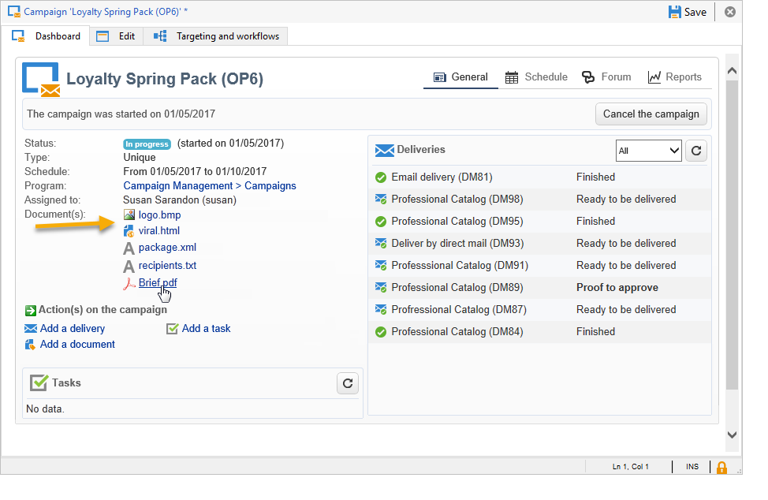

# Leveringen voor marketingcampagnes {#marketing-campaign-deliveries}

Leveringen kunnen worden gemaakt via het campagnedashboard, een campagneworkflow of rechtstreeks via het overzicht van leveringen.

Wanneer de leveringen worden gemaakt op basis van een campagne, worden ze gekoppeld aan deze campagne en geconsolideerd op campagnereniveau.

[ Ontdek deze functie in video](#create-email-video)

## Leveringen maken {#creating-deliveries}

Als u een levering wilt maken die is gekoppeld aan een campagne, klikt u op de koppeling **[!UICONTROL Add a delivery]** in het campagnemdashboard.

De voorgestelde configuraties zijn geschikt voor de verschillende typen levering: direct mail, e-mail, mobiele kanalen. [Meer informatie](../../delivery/using/steps-about-delivery-creation-steps.md).

## Starten van levering {#starting-a-delivery}

Zodra alle goedkeuringen zijn verleend, is de levering klaar om te worden begonnen. De leveringsprocedure is dan afhankelijk van het soort levering. Zie [Een online levering starten](#starting-an-online-delivery) voor e-mail- of mobiele-kanaalleveringen en [Een offlinelevering starten](#starting-an-offline-delivery) voor directe mailleveringen.

### Een online levering starten {#starting-an-online-delivery}

Zodra alle goedkeuringsverzoeken zijn verleend, verandert de leveringsstatus in **[!UICONTROL Pending confirmation]** en kan door een exploitant worden begonnen. In voorkomend geval wordt de Adobe Campaign-exploitant (of groep marktdeelnemers) die als controleur is aangewezen om de levering te starten, ervan in kennis gesteld dat de levering klaar is om te worden gestart.

>[!NOTE]
>
>Als een specifieke exploitant of groep exploitanten voor het beginnen van een levering in de eigenschappen van de levering wordt aangewezen, kunt u de exploitant die voor de levering verantwoordelijk is ook toestaan om de verzending te bevestigen. Hiervoor activeert u de optie **NMS_ActivateOwnerConfirmation** door **1** als waarde in te voeren. De opties worden beheerd via het knooppunt **[!UICONTROL Administration]** > **[!UICONTROL Platform]** > **[!UICONTROL Options]** in de Adobe Campaign-verkenner.
>  
>Als u deze optie wilt deactiveren, voert u **0** in als waarde. Het proces voor bevestiging verzenden werkt dan als standaard: alleen de exploitant of groep van exploitanten die voor de verzending zijn aangewezen in de leveringseigenschappen (of een beheerder) kan de verzending bevestigen en uitvoeren.

De informatie verschijnt ook op het campagnedashboard. Met de koppeling **[!UICONTROL Confirm delivery]** kunt u de levering starten.

Met een bevestigingsbericht kunt u deze handeling beveiligen.

### Offline levering {#starting-an-offline-delivery} starten

Zodra alle goedkeuringen zijn verleend, verandert de leveringsstatus in **[!UICONTROL Pending extraction]**. De extractiebestanden worden gemaakt met behulp van een speciale workflow die in de standaardconfiguratie automatisch wordt gestart wanneer een directe-maillevering in behandeling is voor extractie. Wanneer een proces bezig is, wordt het getoond in het dashboard en kan via zijn verbinding worden uitgegeven.

>[!NOTE]
>
>De technische workflows met betrekking tot het campagnepakket worden weergegeven in [Lijst van technische workflows](../../workflow/using/about-technical-workflows.md).

**Stap 1 - Goedkeuring van bestanden**

Nadat de extractieworkflow is voltooid, moet het extractiebestand worden goedgekeurd (mits de goedkeuring van het extractiebestand is geselecteerd in de leveringsinstellingen).

Raadpleeg [Een extractiebestand goedkeuren](../../campaign/using/marketing-campaign-approval.md#approving-an-extraction-file) voor meer informatie.

**Stap 2 - Goedkeuring van het bericht aan de dienstverlener**

* Zodra het extractiedossier wordt goedgekeurd, kunt u het bewijs van de e-mail van het routerbericht produceren. Dit e-mailbericht wordt geconstrueerd gebaseerd op een leveringsmalplaatje. Het moet worden goedgekeurd.

   >[!NOTE]
   >
   >Deze stap is alleen beschikbaar als het verzenden en goedkeuren van proefdrukken is ingeschakeld in het venster Goedkeuring.

* Klik op de knop **[!UICONTROL Send a proof]** om de proefdrukken te maken.

   Het proefdrukdoel moet vooraf worden gedefinieerd.

   U kunt zo veel proefdrukken maken als nodig is. Deze worden betreden via de **[!UICONTROL Direct mail...]** verbinding van het leveringsdetail.

   

* De leveringsstatus verandert in **[!UICONTROL To submit]**. Klik op de knop **[!UICONTROL Submit proofs]** om het goedkeuringsproces te starten.

   

* De leveringsstatus verandert in **[!UICONTROL Proof to validate]** en een knoop laat u goedkeuring goedkeuren of verwerpen.

   

   U kunt deze goedkeuring accepteren of afwijzen of terugkeren naar de extractiestap.

   

* Het extractiedossier wordt verzonden naar de router en de levering wordt gebeëindigd.

### Berekening van kosten en voorraden {#calculation-of-costs-and-stocks}

Met de uitname van het bestand worden twee bewerkingen gestart: begrotingsberekening en voorraadberekening. De begrotingsonderdelen worden bijgewerkt.

* Op het tabblad **[!UICONTROL Budget]** kunt u de budgetten voor de campagne beheren. Het totaal van de kostenposten wordt weergegeven in het veld **[!UICONTROL Calculates cost]** van het hoofdtabblad van de campagne en het programma waartoe het behoort. De bedragen zijn ook terug te vinden in de campagnebegroting.

   De echte kosten zullen uiteindelijk van informatie worden berekend die door de router wordt verstrekt. Alleen daadwerkelijk verzonden berichten worden gefactureerd.

* De voorraden worden bepaald in de **[!UICONTROL Administration > Campaign management > Stocks]** knoop van de boom, en kostenstructuren in **[!UICONTROL Administration > Campaign management > Service providers]** knoop.

   De voorraadlijnen zijn zichtbaar in de voorraadsectie. Als u de oorspronkelijke voorraad wilt definiëren, opent u een voorraadlijn. De voorraad wordt telkens verlaagd wanneer een levering plaatsvindt. U kunt een waarschuwingsniveau en meldingen definiëren.

>[!NOTE]
>
>Zie [Leveranciers, voorraden en budgetten](../../campaign/using/providers--stocks-and-budgets.md) voor meer informatie over kostenberekeningen en voorraadbeheer.

## Gekoppelde documenten {#managing-associated-documents} beheren

U kunt verschillende documenten aan een campagne koppelen: rapport, foto, webpagina, diagram, enz. Deze documenten kunnen elke gewenste indeling hebben (Microsoft Word, PowerPoint, PNG, JPG, Acrobat PDF, enzovoort). Leer hoe u documenten koppelt aan een campagne [in deze sectie](../../campaign/using/marketing-campaign-assets.md).

>[!IMPORTANT]
>
>Deze modus is gereserveerd voor kleine documenten.

In een campagne kunt u ook andere objecten bekijken, zoals promotiecoupons, speciale aanbiedingen voor een specifieke winkel of filiaal, enzovoort. Wanneer deze elementen in een overzicht worden opgenomen, kunnen zij met een directe postlevering worden geassocieerd. [Meer informatie](#associating-and-structuring-resources-linked-via-a-delivery-outline).

>[!NOTE]
>
>Als u MRM gebruikt, kunt u een bibliotheek van marketing middelen ook beheren die voor verscheidene deelnemers voor samenwerkingswerk beschikbaar zijn. Zie [Marketing resources beheren](../../campaign/using/managing-marketing-resources.md).

### Documenten {#adding-documents} toevoegen

Documenten kunnen worden gekoppeld op campagneniveau (contextuele documenten) of op programmaniveau (algemene documenten).

Het tabblad **[!UICONTROL Documents]** bevat:

* De lijst met alle documenten die vereist zijn voor de inhoud (sjabloon, afbeeldingen, enz.) die door Adobe Campaign-operatoren met de juiste rechten lokaal kunnen worden gedownload,
* Documenten die informatie voor de router bevatten, als om het even welk.

De documenten zijn gekoppeld aan het programma of de campagne via het tabblad **[!UICONTROL Edit > Documents]**.

U kunt ook een document aan een campagne toevoegen via de koppeling die in het dashboard wordt aangeboden.

Klik op het pictogram **[!UICONTROL Details]** om de inhoud van een bestand weer te geven en informatie toe te voegen:

In het dashboard worden documenten die bij de campagne horen gegroepeerd in de sectie **[!UICONTROL Document(s)]**, zoals in het volgende voorbeeld:

U kunt ze ook vanuit deze weergave bewerken en wijzigen.

### Middelen koppelen en structureren via een leveringsoverzicht {#associating-and-structuring-resources-linked-via-a-delivery-outline}

>[!NOTE]
>
>De leveringsschema&#39;s worden uitsluitend gebruikt in het kader van direct-mailcampagnes.

Een leveringsoverzicht geeft een gestructureerde reeks elementen aan (documenten, filialen/winkels, promotionele coupons, enz.) opgericht in het bedrijf en voor een bepaalde campagne.

Deze elementen worden gegroepeerd in leveringsschema&#39;s, en een bepaald leveringsoverzicht zal met een levering worden geassocieerd; in het extractiebestand dat naar de **serviceprovider** wordt verzonden, wordt ernaar verwezen om aan de levering te worden gekoppeld. U kunt bijvoorbeeld een leveringsoverzicht maken dat verwijst naar een vertakking en de marketingbrochures die erin worden gebruikt.

Voor een campagne, laten de leveringsoverzichten u externe elementen structureren die met de levering volgens bepaalde criteria moeten worden geassocieerd: verwante branche, aangeboden promotieaanbieding, uitnodiging voor een lokale evenement, enz.

#### Een omtrek maken {#creating-an-outline}

Als u een omtrek wilt maken, klikt u op het subtabblad **[!UICONTROL Delivery outlines]** op het tabblad **[!UICONTROL Edit > Documents]** van de desbetreffende campagne.

>[!NOTE]
>
>Als dit tabblad niet aanwezig is, is deze functie niet beschikbaar voor deze campagne. Verwijs naar de configuratie van het campagnemalplaatje.
>   
>Voor meer op dit, verwijs naar [De malplaatjes van de Campagne](../../campaign/using/marketing-campaign-templates.md#campaign-templates).

Klik vervolgens op **[!UICONTROL Add a delivery outline]** en maak de hiërarchie van contouren voor de campagne:

1. Klik met de rechtermuisknop op de basis van de structuur en selecteer **[!UICONTROL New > Delivery outlines]**.
1. Klik met de rechtermuisknop op de omtrek die u net hebt gemaakt en selecteer **[!UICONTROL New > Item]** of **[!UICONTROL New > Personalization fields]**.

Een overzicht kan punten en verpersoonlijkingsgebieden, middelen en aanbiedingen bevatten:

* Items kunnen bijvoorbeeld fysieke documenten zijn waarnaar hier wordt verwezen en die hier worden beschreven en die aan de levering worden gekoppeld.
* Met velden voor personalisatie kunt u personalisatie-elementen maken die te maken hebben met leveringen in plaats van met ontvangers. Het is dus mogelijk waarden te creëren die in leveringen voor een specifiek doel moeten worden gebruikt (welkomstaanbod, korting, enz.) Ze worden gemaakt in Adobe Campaign en geïmporteerd in de omtrek via de koppeling **[!UICONTROL Import personalization fields...]**.

   

   Ze kunnen ook rechtstreeks in de omtrek worden gemaakt door op het pictogram **[!UICONTROL Add]** rechts van de lijstzone te klikken.

   

* De bronnen zijn marketingbronnen die worden gegenereerd in het dashboard voor marketingbronnen dat wordt geopend via de koppeling **[!UICONTROL Resources]** van het tabblad **[!UICONTROL Campaigns]**.

   

   >[!NOTE]
   >
   >Raadpleeg [Marketing resources beheren](../../campaign/using/managing-marketing-resources.md) voor meer informatie over marketingbronnen.

#### Een omtrek selecteren {#selecting-an-outline}

Voor elke levering, kunt u het overzicht selecteren om van de sectie te associëren die voor het extractieoverzicht wordt gereserveerd, zoals in het volgende voorbeeld:

De geselecteerde omtrek wordt vervolgens weergegeven in de onderste sectie van het venster. U kunt de afbeelding bewerken met het pictogram rechts van het veld of wijzigen met de vervolgkeuzelijst:

Op het tabblad **[!UICONTROL Summary]** van de levering wordt ook deze informatie weergegeven:

#### Extractieresultaat {#extraction-result}

In het dossier dat wordt uitgepakt en aan de dienstverlener wordt toegezonden, de naam van de omtrek en, in voorkomend geval, de kenmerken ervan (kosten, beschrijving enz.) worden toegevoegd aan de inhoud volgens de informatie in het uitvoermalplaatje verbonden aan de dienstverlener.

In het volgende voorbeeld worden het label, de geschatte kosten en de beschrijving van de omtrek die aan de levering is gekoppeld, toegevoegd aan het extractiebestand.

Het exportmodel moet worden gekoppeld aan de dienstverlener die voor de betrokken levering is geselecteerd. Zie [Serviceproviders en hun kostenstructuren maken](../../campaign/using/providers--stocks-and-budgets.md#creating-service-providers-and-their-cost-structures).

>[!NOTE]
>
>Raadpleeg de sectie [Aan de slag](../../platform/using/get-started-data-import-export.md) voor meer informatie over exporteren.

#### Video over zelfstudie {#create-email-video}

In deze video wordt uitgelegd hoe u een campagne en een e-mail maakt in Adobe Campaign.

>[!VIDEO](https://video.tv.adobe.com/v/25604?quality=12)

Er zijn [hier](https://experienceleague.adobe.com/docs/campaign-classic-learn/tutorials/overview.html?lang=nl) extra instructievideo&#39;s voor campagnes beschikbaar.
