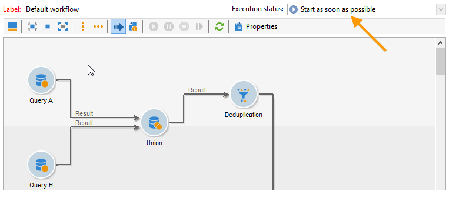
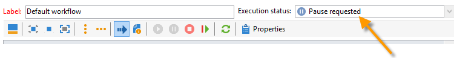
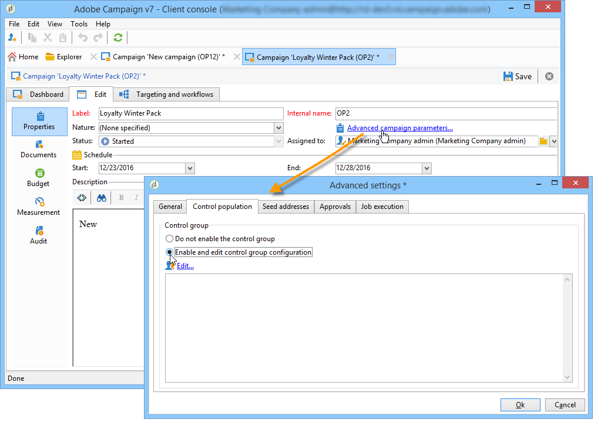
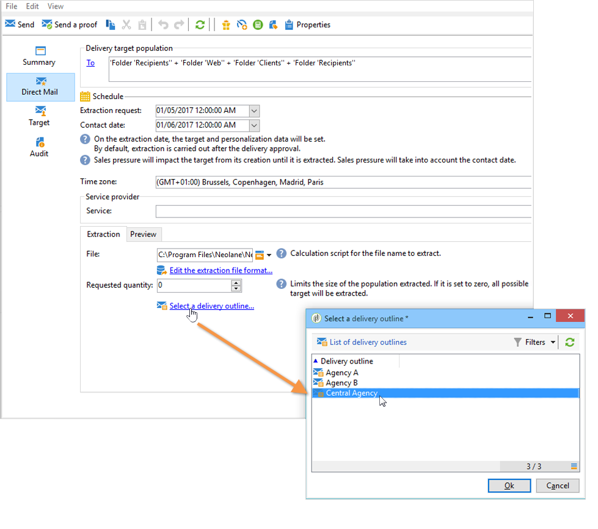

# Marketingcampagneleveringen {#marketing-campaign-deliveries}

Leveringen kunnen worden gemaakt via het campagnedashboard, een campagneworkflow of rechtstreeks via het overzicht van leveringen.

Wanneer de leveringen worden gemaakt op basis van een campagne, worden ze gekoppeld aan deze campagne en geconsolideerd op campagnereniveau.

[ Ontdek deze functie in video](#create-email-video)

## Leveringen maken {#creating-deliveries}

Als u een levering wilt maken die is gekoppeld aan een campagne, klikt u op de koppeling **[!UICONTROL Add a delivery]** in het campagnemdashboard.

De voorgestelde configuraties zijn geschikt voor de verschillende typen levering: direct mail, e-mail, mobiele kanalen. [Meer informatie](../../delivery/using/steps-about-delivery-creation-steps.md).

## De doelpopulatie selecteren {#selecting-the-target-population}

Voor elke levering kunt u definiëren:

* Het publiek - leer meer in [Het publiek in een werkschema bouwen](#building-the-main-target-in-a-workflow) en [Het selecteren van de doelpopulatie](#selecting-the-target-population).
* A control group - Learn more in [Defining a control group](#defining-a-control-group).
* Zaadadressen - leer meer in [deze sectie](../../delivery/using/about-seed-addresses.md).

Sommige van deze informatie kunnen van [malplaatje](../../campaign/using/marketing-campaign-templates.md#campaign-templates) worden geërft.

Om het leveringsdoel te bouwen, kunt u het filtreren criteria voor de ontvangers in het gegevensbestand bepalen. Deze ontvankelijke selectiemodus wordt voorgesteld in [deze sectie](../../delivery/using/steps-defining-the-target-population.md).

**Voorbeeld: berichten verzenden naar een groep**

U kunt een populatie in een lijst importeren en deze lijst vervolgens als doel instellen in leveringen.

1. Om dit te doen, geef de betrokken levering uit en klik **[!UICONTROL To]** verbinding om de gerichte bevolking te veranderen.

1. Selecteer op het tabblad **[!UICONTROL Main target]** de optie **[!UICONTROL Defined via the database]** en klik **[!UICONTROL Add]** om ontvangers te selecteren.

1. Kies **[!UICONTROL A list of recipients]** en klik **[!UICONTROL Next]** om het te selecteren.

### Het publiek opbouwen in een werkstroom {#building-the-main-target-in-a-workflow}

Het hoofddoel van een levering kan ook worden gedefinieerd in de doelworkflow: in deze grafische omgeving kunt u een doel maken met behulp van query&#39;s, tests en operatoren: verenigen, dedupliceren, delen, enz. [Meer informatie](../../workflow/using/architecture.md).

>[!IMPORTANT]
>
>U kunt niet meer dan 28 workflows in een campagne maken. Buiten deze limiet zijn extra workflows niet zichtbaar in de interface en kunnen fouten genereren.

#### De workflow {#creating-a-targeting-workflow} maken

Het richten kan door een combinatie filtervoorwaarden in een grafische opeenvolging in een werkschema worden tot stand gebracht. U kunt populaties en subpopulaties maken die op basis van uw vereisten worden aangepast. Als u de werkstroomeditor wilt weergeven, klikt u op het tabblad **[!UICONTROL Targeting and workflows]** in het campagnedashboard.

De doelpopulatie wordt geëxtraheerd uit de Adobe Campaign-database via een of meer query&#39;s die in een workflow zijn geplaatst. Leren hoe te om een vraag te bouwen, verwijs naar [deze sectie](../../workflow/using/query.md).

U kunt query&#39;s starten en populaties delen via vakken zoals Union, Intersection, Sharing, Exclusion enzovoort.

Selecteer de objecten in de lijsten links van de werkruimte en koppel ze om het doel samen te stellen.

In het diagram, verbind omhoog het richten en het plannen van vragen die voor doelbouw in het diagram worden vereist. U kunt het richten uitvoeren terwijl de bouw bezig is om de bevolking te controleren die uit het gegevensbestand wordt gehaald.

>[!NOTE]
>
>De voorbeelden en de procedure voor het bepalen van vragen worden voorgesteld in [deze sectie](../../workflow/using/query.md).

Het linkergedeelte van de editor bevat een bibliotheek met grafische objecten die activiteiten vertegenwoordigen. Het eerste lusje bevat de het richten activiteiten, en het tweede lusje bevat de stroom-controle activiteiten, die af en toe worden gebruikt om het richten activiteiten te coördineren.

De functies voor het uitvoeren en opmaken van werkstromen voor het opgeven van doelen zijn toegankelijk via de werkbalk van de diagrameditor.

>[!NOTE]
>
>De activiteiten beschikbaar om het diagram evenals alle vertoning en lay-outeigenschappen te bouwen zijn gedetailleerd in [Automatiseren met werkschema&#39;s](../../workflow/using/architecture.md) gids.

U kunt verschillende doelworkflows voor één campagne maken. Een workflow toevoegen:

1. Ga naar de hogere linkersectie van de streek van de werkschemaverwezenlijking, klik met de rechtermuisknop aan, en selecteer **[!UICONTROL Add]**. U kunt de **[!UICONTROL New]** knoop ook gebruiken die boven deze streek wordt gevestigd.

   

1. Selecteer de sjabloon **[!UICONTROL New workflow]** en geef deze workflow een naam.
1. Klik **[!UICONTROL OK]** om verwezenlijking van het werkschema te bevestigen, en dan het diagram voor deze werkschema tot stand te brengen.

#### De workflow uitvoeren {#executing-a-workflow}

Doelworkflows kunnen handmatig worden gestart via de knop **[!UICONTROL Start]** op de werkbalk, op voorwaarde dat u de juiste rechten hebt.

Het richten kan voor automatische uitvoering volgens een programma (planner) of een gebeurtenis (extern signaal, dossierinvoer, enz.) worden geprogrammeerd.

De acties met betrekking tot het uitvoeren van de doelworkflow (starten, stoppen, pauzeren, enz.) zijn **asynchrone** processen: de opdracht wordt opgeslagen en wordt van kracht zodra de server beschikbaar is om deze toe te passen.

Met de werkbalkpictogrammen kunt u actie ondernemen met betrekking tot de uitvoering van de doelworkflow.

* Starten of opnieuw starten

   * Met het pictogram **[!UICONTROL Start]** kunt u de doelworkflow starten. Wanneer u op dit pictogram klikt, worden alle activiteiten zonder een invoerovergang geactiveerd (behalve sprongen met eindpunten).

      

      De server houdt rekening met het verzoek, zoals aangetoond door zijn status:

      

      De processtatus verandert in **[!UICONTROL Started]**.

   * U kunt de doelworkflow opnieuw starten via het juiste werkbalkpictogram. Deze opdracht kan handig zijn als het pictogram **[!UICONTROL Start]** niet beschikbaar is, bijvoorbeeld wanneer het stopzetten van de doelworkflow wordt uitgevoerd. Klik in dit geval op het pictogram **[!UICONTROL Restart]** om te anticiperen op het opnieuw opstarten. De server houdt rekening met het verzoek, aangezien zijn status toont:

      

      Het proces gaat dan **[!UICONTROL Started]** status in.

* Stoppen of pauzeren

   * Met de werkbalkpictogrammen kunt u een actieve doelworkflow stoppen of pauzeren.

      Wanneer u op **[!UICONTROL Pause]** klikt, worden actieve bewerkingen **[!UICONTROL are not]** gepauzeerd, maar wordt geen andere activiteit gestart tot de volgende keer dat u de computer opnieuw opstart.

      

      De server houdt rekening met het bevel, aangezien zijn status toont:

      

      U kunt een doelworkflow ook automatisch pauzeren wanneer de uitvoering een bepaalde activiteit bereikt. Om dit te doen, klik de activiteit met de rechtermuisknop aan waarvan het richten werkschema moet worden gepauzeerd, en selecteer **[!UICONTROL Enable but do not execute]**.

      

      Deze configuratie wordt getoond door een speciaal pictogram.

      

      >[!NOTE]
      >
      >Deze optie is handig tijdens het ontwerpen en testen van campagnes die u op geavanceerde wijze wilt richten.

      Klik **[!UICONTROL Start]** om uitvoering te hervatten.

   * Klik op het pictogram **[!UICONTROL Stop]** om de actieve uitvoering te stoppen.

      

      De server houdt rekening met het bevel, aangezien zijn status toont:

      
   U kunt een doelworkflow ook automatisch stoppen wanneer de uitvoering een activiteit bereikt. Om dit te doen, klik de activiteit met de rechtermuisknop aan waarvan het richten werkschema zal worden tegengehouden, en selecteer **[!UICONTROL Do not activate]**.

   

   

   Deze configuratie wordt getoond door een speciaal pictogram.

   >[!NOTE]
   >
   >Deze optie is handig tijdens het ontwerpen en testen van campagnes die u op geavanceerde wijze wilt richten.

* Onvoorwaardelijke stop

   In de Ontdekkingsreiziger, selecteer **[!UICONTROL Administration > Production > Object created automatically > Campaign workflows]** om tot elke campagnewerkschema&#39;s toegang te hebben en op te treden.

   U kunt de workflow onvoorwaardelijk stoppen door op het pictogram **[!UICONTROL Actions]** te klikken en **[!UICONTROL Unconditional]** stop te selecteren. Deze actie beëindigt uw campagnewerkschema.

   

### Een besturingsgroep {#defining-a-control-group} definiëren

Een controlegroep is een populatie die de levering niet zal ontvangen; het wordt gebruikt om het gedrag en de impact van de campagne na de levering te volgen door een vergelijking te maken met het gedrag van de doelpopulatie, die de levering heeft ontvangen.

De controlegroep kan uit het belangrijkste doel worden gehaald en/of uit een specifieke groep of een vraag komen.

#### De besturingsgroep activeren voor een campagne {#activating-the-control-group-for-a-campaign}

U kunt een controlegroep op campagneniveau bepalen, waarbij de controlegroep op elke levering van de betrokken campagne zal worden toegepast.

1. Bewerk de desbetreffende campagne en klik op het tabblad **[!UICONTROL Edit]**.
1. Klik op **[!UICONTROL Advanced campaign settings]**.

   

1. Selecteer de optie **[!UICONTROL Enable and edit control group configuration]**.
1. Klik **[!UICONTROL Edit...]** om de controlegroep te vormen.

   

De configuratieprocedure wordt voorgesteld in [Het halen van de controlegroep van het belangrijkste doel](#extracting-the-control-group-from-the-main-target) en [het toevoegen van een controlegroep](#adding-a-population).

#### De besturingsgroep voor levering {#activating-the-control-group-for-a-delivery} activeren

U kunt een controlegroep op leveringsniveau bepalen, in welk geval de controlegroep op elke levering van de betrokken campagne zal worden toegepast.

Door gebrek, is de configuratie van de controlegroep die op het campagneniveau wordt bepaald op elke levering van die campagne van toepassing. U kunt, echter, de controlegroep voor een individuele levering aanpassen.

>[!NOTE]
>
>Als u een controlegroep voor een campagne hebt bepaald, en u het voor een levering ook vormt verbonden aan deze campagne, slechts zal de controlegroep die voor de levering wordt bepaald worden toegepast.

1. Bewerk de desbetreffende levering en klik vervolgens op de koppeling **[!UICONTROL To]** in de sectie **[!UICONTROL Email parameters]**.

   

1. Klik op de tab **[!UICONTROL Control group]** en selecteer **[!UICONTROL Enable and edit control group configuration]**.
1. Klik **[!UICONTROL Edit...]** om de controlegroep te vormen.

De configuratieprocedure wordt voorgesteld in [Het halen van de controlegroep van het belangrijkste doel](#extracting-the-control-group-from-the-main-target) en [het toevoegen van een controlegroep](#adding-a-population).

#### De besturingsgroep extraheren uit het hoofddoel {#extracting-the-control-group-from-the-main-target}

U kunt ontvangers extraheren uit het hoofddoel van de levering. In dit geval, zullen de ontvangers van het doel van leveringsacties worden genomen die door deze configuratie worden beïnvloed. Deze extractie kan willekeurig zijn of het resultaat zijn van het sorteren van de ontvangers.

Als u een controlegroep wilt extraheren, schakelt u de controlegroep voor de campagne of levering in en selecteert u een van de volgende opties: **[!UICONTROL Activate random sampling]** of **[!UICONTROL Keep only the first records after sorting]**.

* **[!UICONTROL Activate random sampling]** : bij deze optie wordt steekproefsgewijze bemonstering toegepast op de ontvangers in de doelpopulatie. Als u vervolgens de drempel instelt op 100, bestaat de controlegroep uit 100 ontvangers die willekeurig uit de doelpopulatie zijn geselecteerd. De willekeurige bemonstering is afhankelijk van de database-engine.
* **[!UICONTROL Keep only the first records after sorting]** : met deze optie kunt u een limiet definiëren op basis van een of meer sorteervolgorden. Als u het **[!UICONTROL Age]** gebied als sorterend criterium selecteert en dan 100 als drempel bepaalt, zal de controlegroep uit de 100 jongste ontvangers worden samengesteld. Het zou bijvoorbeeld interessant kunnen zijn om een controlegroep te definiëren die ontvangers bevat die weinig aankopen doen, of ontvangers die vaak aankopen doen, en om hun gedrag te vergelijken met dat van de gecontacteerde ontvangers.

Klik **[!UICONTROL Next]** om de sorteervolgorde (indien nodig) te bepalen en de ontvankelijke beperkingsmodus te selecteren.

Deze configuratie is gelijk aan een deelactiviteit in de workflow, waarmee u het doel kunt onderverdelen in subsets. De controlegroep is één van deze subsets. Raadpleeg [deze sectie](../../workflow/using/architecture.md) voor meer informatie.

### Een controlegroep toevoegen {#adding-a-population}

U kunt een nieuwe bevolking bepalen die als controlegroep moet worden gebruikt. Deze populatie kan uit een groep ontvangers komen of u kunt het tot stand brengen via een specifieke vraag.

>[!NOTE]
>
>Adobe Campaign query editor wordt weergegeven in [deze sectie](../../workflow/using/query.md).

## Starten van levering {#starting-a-delivery}

Zodra alle goedkeuringen zijn verleend, is de levering klaar om te worden begonnen. De leveringsprocedure is dan afhankelijk van het soort levering. Zie [Een online levering starten](#starting-an-online-delivery) voor e-mail- of mobiele-kanaalleveringen en [Een offlinelevering starten](#starting-an-offline-delivery) voor directe mailleveringen.

### Een online levering starten {#starting-an-online-delivery}

Zodra alle goedkeuringsverzoeken zijn verleend, verandert de leveringsstatus in **[!UICONTROL Pending confirmation]** en kan door een exploitant worden begonnen. In voorkomend geval wordt de Adobe Campaign-exploitant (of groep marktdeelnemers) die als controleur is aangewezen om de levering te starten, ervan in kennis gesteld dat de levering klaar is om te worden gestart.

>[!NOTE]
>
>Als een specifieke exploitant of groep exploitanten voor het beginnen van een levering in de eigenschappen van de levering wordt aangewezen, kunt u de exploitant die voor de levering verantwoordelijk is ook toestaan om de verzending te bevestigen. Hiervoor activeert u de optie **NMS_ActivateOwnerConfirmation** door **1** als waarde in te voeren. De opties worden beheerd via het knooppunt **[!UICONTROL Administration]** > **[!UICONTROL Platform]** > **[!UICONTROL Options]** in de Adobe Campaign-verkenner.
>  
>Als u deze optie wilt deactiveren, voert u **0** in als waarde. Het proces voor bevestiging verzenden werkt dan als standaard: alleen de exploitant of groep van exploitanten die voor de verzending zijn aangewezen in de leveringseigenschappen (of een beheerder) kan de verzending bevestigen en uitvoeren.

De informatie verschijnt ook op het campagnedashboard. Met de koppeling **[!UICONTROL Confirm delivery]** kunt u de levering starten.

Met een bevestigingsbericht kunt u deze handeling beveiligen.

### Offline levering {#starting-an-offline-delivery} starten

Zodra alle goedkeuringen zijn verleend, verandert de leveringsstatus in **[!UICONTROL Pending extraction]**. De extractiebestanden worden gemaakt met behulp van een speciale workflow die in de standaardconfiguratie automatisch wordt gestart wanneer een directe-maillevering in behandeling is voor extractie. Wanneer een proces bezig is, wordt het getoond in het dashboard en kan via zijn verbinding worden uitgegeven.

>[!NOTE]
>
>De technische workflows met betrekking tot het campagnepakket worden weergegeven in [Lijst van technische workflows](../../workflow/using/about-technical-workflows.md).

**Stap 1 - Goedkeuring van bestanden**

Nadat de extractieworkflow is voltooid, moet het extractiebestand worden goedgekeurd (mits de goedkeuring van het extractiebestand is geselecteerd in de leveringsinstellingen).

Raadpleeg [Een extractiebestand goedkeuren](../../campaign/using/marketing-campaign-approval.md#approving-an-extraction-file) voor meer informatie.

**Stap 2 - Goedkeuring van het bericht aan de dienstverlener**

* Zodra het extractiedossier wordt goedgekeurd, kunt u het bewijs van de e-mail van het routerbericht produceren. Dit e-mailbericht wordt geconstrueerd gebaseerd op een leveringsmalplaatje. Het moet worden goedgekeurd.

   >[!NOTE]
   >
   >Deze stap is alleen beschikbaar als het verzenden en goedkeuren van proefdrukken is ingeschakeld in het venster Goedkeuring.

* Klik op de knop **[!UICONTROL Send a proof]** om de proefdrukken te maken.

   Het proefdrukdoel moet vooraf worden gedefinieerd.

   U kunt zo veel proefdrukken maken als nodig is. Deze worden betreden via de **[!UICONTROL Direct mail...]** verbinding van het leveringsdetail.

   

* De leveringsstatus verandert in **[!UICONTROL To submit]**. Klik op de knop **[!UICONTROL Submit proofs]** om het goedkeuringsproces te starten.

   

* De leveringsstatus verandert in **[!UICONTROL Proof to validate]** en een knoop laat u goedkeuring goedkeuren of verwerpen.

   

   U kunt deze goedkeuring accepteren of afwijzen of terugkeren naar de extractiestap.

   

* Het extractiedossier wordt verzonden naar de router en de levering wordt gebeëindigd.

### Berekening van kosten en voorraden {#calculation-of-costs-and-stocks}

Met de uitname van het bestand worden twee bewerkingen gestart: begrotingsberekening en voorraadberekening. De begrotingsonderdelen worden bijgewerkt.

* Op het tabblad **[!UICONTROL Budget]** kunt u de budgetten voor de campagne beheren. Het totaal van de kostenposten wordt weergegeven in het veld **[!UICONTROL Calculates cost]** van het hoofdtabblad van de campagne en het programma waartoe het behoort. De bedragen zijn ook terug te vinden in de campagnebegroting.

   De echte kosten zullen uiteindelijk van informatie worden berekend die door de router wordt verstrekt. Alleen daadwerkelijk verzonden berichten worden gefactureerd.

* De voorraden worden bepaald in de **[!UICONTROL Administration > Campaign management > Stocks]** knoop van de boom, en kostenstructuren in **[!UICONTROL Administration > Campaign management > Service providers]** knoop.

   De voorraadlijnen zijn zichtbaar in de voorraadsectie. Als u de oorspronkelijke voorraad wilt definiëren, opent u een voorraadlijn. De voorraad wordt telkens verlaagd wanneer een levering plaatsvindt. U kunt een waarschuwingsniveau en meldingen definiëren.

>[!NOTE]
>
>Zie [Leveranciers, voorraden en budgetten](../../campaign/using/providers--stocks-and-budgets.md) voor meer informatie over kostenberekeningen en voorraadbeheer.

## Gekoppelde documenten {#managing-associated-documents} beheren

U kunt verschillende documenten aan een campagne koppelen: rapport, foto, webpagina, diagram, enz. Deze documenten kunnen elke gewenste indeling hebben (Microsoft Word, PowerPoint, PNG, JPG, Acrobat PDF, enzovoort). Zie [Documenten toevoegen](#adding-documents) om documenten aan een campagne te koppelen.

>[!IMPORTANT]
>
>Deze modus is gereserveerd voor kleine documenten.

In een campagne kunt u ook andere objecten bekijken, zoals promotiecoupons, speciale aanbiedingen voor een specifieke winkel of filiaal, enzovoort. Wanneer deze elementen in een overzicht worden opgenomen, kunnen zij met een directe postlevering worden geassocieerd. Zie [Bronnen koppelen en structureren via een leveringsoverzicht](#associating-and-structuring-resources-linked-via-a-delivery-outline).

>[!NOTE]
>
>Als u MRM gebruikt, kunt u een bibliotheek van marketing middelen ook beheren die voor verscheidene deelnemers voor samenwerkingswerk beschikbaar zijn. Zie [Marketing resources beheren](../../campaign/using/managing-marketing-resources.md).

### Documenten {#adding-documents} toevoegen

Documenten kunnen worden gekoppeld op campagneniveau (contextuele documenten) of op programmaniveau (algemene documenten).

Het tabblad **[!UICONTROL Documents]** bevat:

* De lijst met alle documenten die vereist zijn voor de inhoud (sjabloon, afbeeldingen, enz.) die door Adobe Campaign-operatoren met de juiste rechten lokaal kunnen worden gedownload,
* Documenten die informatie voor de router bevatten, als om het even welk.

De documenten zijn gekoppeld aan het programma of de campagne via het tabblad **[!UICONTROL Edit > Documents]**.

U kunt ook een document aan een campagne toevoegen via de koppeling die in het dashboard wordt aangeboden.

Klik op het pictogram **[!UICONTROL Details]** om de inhoud van een bestand weer te geven en informatie toe te voegen:

In het dashboard worden documenten die bij de campagne horen gegroepeerd in de sectie **[!UICONTROL Document(s)]**, zoals in het volgende voorbeeld:

U kunt ze ook vanuit deze weergave bewerken en wijzigen.

### Middelen koppelen en structureren via een leveringsoverzicht {#associating-and-structuring-resources-linked-via-a-delivery-outline}

>[!NOTE]
>
>De leveringsschema&#39;s worden uitsluitend gebruikt in het kader van direct-mailcampagnes.

Een leveringsoverzicht geeft een gestructureerde reeks elementen aan (documenten, filialen/winkels, promotionele coupons, enz.) opgericht in het bedrijf en voor een bepaalde campagne.

Deze elementen worden gegroepeerd in leveringsschema&#39;s, en een bepaald leveringsoverzicht zal met een levering worden geassocieerd; in het extractiebestand dat naar de **serviceprovider** wordt verzonden, wordt ernaar verwezen om aan de levering te worden gekoppeld. U kunt bijvoorbeeld een leveringsoverzicht maken dat verwijst naar een vertakking en de marketingbrochures die erin worden gebruikt.

Voor een campagne, laten de leveringsoverzichten u externe elementen structureren die met de levering volgens bepaalde criteria moeten worden geassocieerd: verwante branche, aangeboden promotieaanbieding, uitnodiging voor een lokale evenement, enz.

#### Een omtrek maken {#creating-an-outline}

Als u een omtrek wilt maken, klikt u op het subtabblad **[!UICONTROL Delivery outlines]** op het tabblad **[!UICONTROL Edit > Documents]** van de desbetreffende campagne.

>[!NOTE]
>
>Als dit tabblad niet aanwezig is, is deze functie niet beschikbaar voor deze campagne. Verwijs naar de configuratie van het campagnemalplaatje.
>   
>Voor meer op dit, verwijs naar [De malplaatjes van de Campagne](../../campaign/using/marketing-campaign-templates.md#campaign-templates).

Klik vervolgens op **[!UICONTROL Add a delivery outline]** en maak de hiërarchie van contouren voor de campagne:

1. Klik met de rechtermuisknop op de basis van de structuur en selecteer **[!UICONTROL New > Delivery outlines]**.
1. Klik met de rechtermuisknop op de omtrek die u net hebt gemaakt en selecteer **[!UICONTROL New > Item]** of **[!UICONTROL New > Personalization fields]**.

Een overzicht kan punten en verpersoonlijkingsgebieden, middelen en aanbiedingen bevatten:

* Items kunnen bijvoorbeeld fysieke documenten zijn waarnaar hier wordt verwezen en die hier worden beschreven en die aan de levering worden gekoppeld.
* Met velden voor personalisatie kunt u personalisatie-elementen maken die te maken hebben met leveringen in plaats van met ontvangers. Het is dus mogelijk waarden te creëren die in leveringen voor een specifiek doel moeten worden gebruikt (welkomstaanbod, korting, enz.) Ze worden gemaakt in Adobe Campaign en geïmporteerd in de omtrek via de koppeling **[!UICONTROL Import personalization fields...]**.

   

   Ze kunnen ook rechtstreeks in de omtrek worden gemaakt door op het pictogram **[!UICONTROL Add]** rechts van de lijstzone te klikken.

   

* De bronnen zijn marketingbronnen die worden gegenereerd in het dashboard voor marketingbronnen dat wordt geopend via de koppeling **[!UICONTROL Resources]** van het **[!UICONTROL Campaigns]** universum.

   

   >[!NOTE]
   >
   >Raadpleeg [Marketing resources beheren](../../campaign/using/managing-marketing-resources.md) voor meer informatie over marketingbronnen.

#### Een omtrek selecteren {#selecting-an-outline}

Voor elke levering, kunt u het overzicht selecteren om van de sectie te associëren die voor het extractieoverzicht wordt gereserveerd, zoals in het volgende voorbeeld:

De geselecteerde omtrek wordt vervolgens weergegeven in de onderste sectie van het venster. U kunt de afbeelding bewerken met het pictogram rechts van het veld of wijzigen met de vervolgkeuzelijst:

Op het tabblad **[!UICONTROL Summary]** van de levering wordt ook deze informatie weergegeven:

#### Extractieresultaat {#extraction-result}

In het dossier dat wordt uitgepakt en aan de dienstverlener wordt toegezonden, de naam van de omtrek en, in voorkomend geval, de kenmerken ervan (kosten, beschrijving enz.) worden toegevoegd aan de inhoud volgens de informatie in het uitvoermalplaatje verbonden aan de dienstverlener.

In het volgende voorbeeld worden het label, de geschatte kosten en de beschrijving van de omtrek die aan de levering is gekoppeld, toegevoegd aan het extractiebestand.

Het exportmodel moet worden gekoppeld aan de dienstverlener die voor de betrokken levering is geselecteerd. Zie [Serviceproviders en hun kostenstructuren maken](../../campaign/using/providers--stocks-and-budgets.md#creating-service-providers-and-their-cost-structures).

>[!NOTE]
>
>Raadpleeg de sectie [Aan de slag](../../platform/using/get-started-data-import-export.md) voor meer informatie over exporteren.

#### Video over zelfstudie {#create-email-video}

In deze video wordt uitgelegd hoe u een campagne en een e-mail maakt in Adobe Campaign Classic.

>[!VIDEO](https://video.tv.adobe.com/v/25604?quality=12)

Er zijn [hier](https://experienceleague.adobe.com/docs/campaign-classic-learn/tutorials/overview.html?lang=nl) extra Campaign Classic hoe kan ik-video&#39;s beschikbaar.