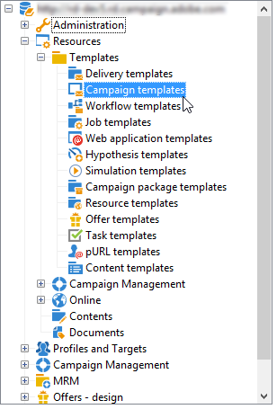
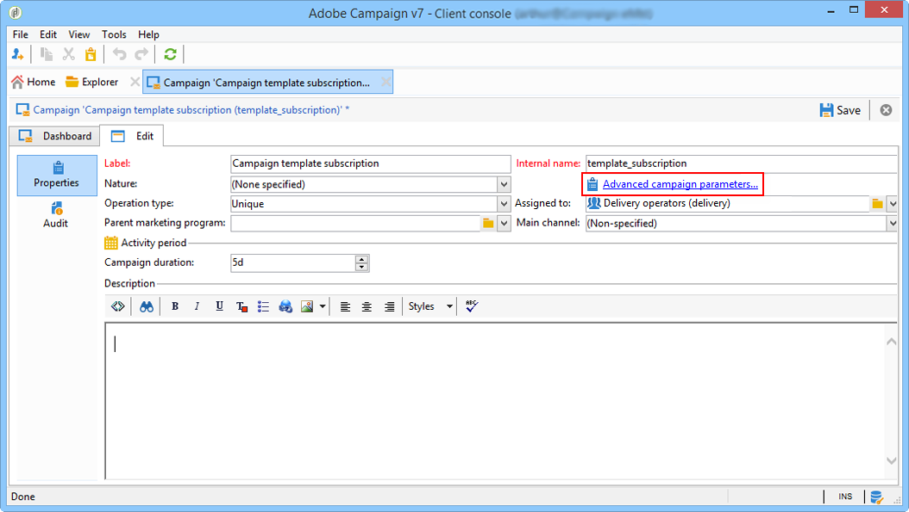
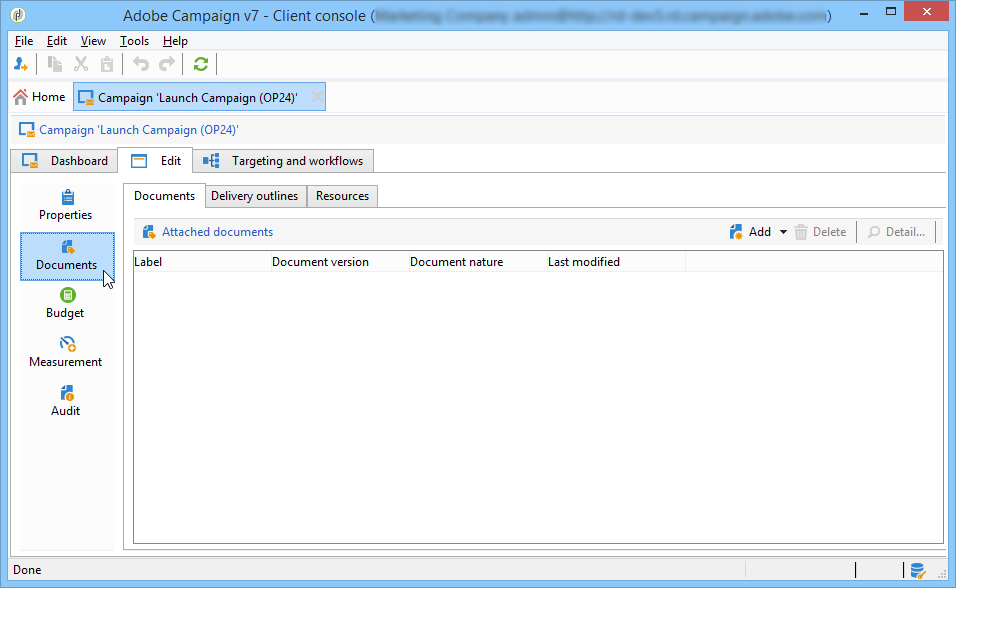
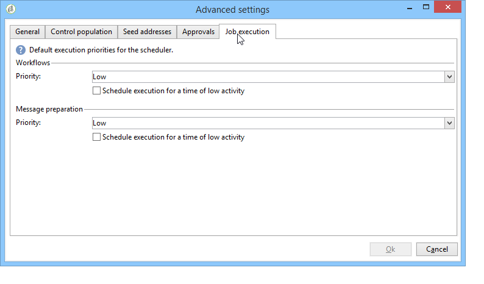

# Campagnesjablonen maken en configureren {#campaign-templates}

Alle marketing campagnes zijn gebaseerd op een malplaatje, dat belangrijkste kenmerken en mogelijkheden opslaat. Campagnemalplaatjes worden gecentraliseerd in de **[!UICONTROL Resources > Templates > Campaign templates]** knoop. Een standaardsjabloon wordt standaard verschaft. U kunt hiermee een nieuwe campagne maken met alle beschikbare modules (Documenten, Taken, zaadadressen, enz.), maar de aangeboden modules zijn afhankelijk van uw rechten en de configuratie van uw Adobe Campaign-platform.

>[!NOTE]
>
>De structuur wordt weergegeven wanneer u op het pictogram **[!UICONTROL Explorer]** op de startpagina klikt.

Een ingebouwde sjabloon wordt geleverd om een campagne te maken waarvoor geen specifieke configuratie is gedefinieerd. U kunt uw campagnemalplaatjes tot stand brengen en vormen en dan campagnes van deze malplaatjes tot stand brengen.

 Raadpleeg  [deze video](../../campaign/using/marketing-campaign-deliveries.md#create-email-video) voor meer informatie over het maken van campagnes.

## Een campagnemalplaatje maken {#creating-or-duplicating-a-campaign-template}

Volg onderstaande stappen om een campagnemalplaatje te maken:

1. Open Campagne **Explorer**.
1. In **Middelen > Malplaatjes > de malplaatjes van de Campagne**, klik **Nieuw** in de toolbar boven de lijst van malplaatjes.

   

1. Voer het label van uw nieuwe campagnemalplaatje in.
1. Klik **Opslaan** en open de sjabloon opnieuw.
1. Voer op het tabblad **Bewerken** de **Interne naam** en andere waarden in, indien nodig.
1. Selecteer **Geavanceerde campagnemontages** om een werkschema aan uw campagnemalplaatje toe te voegen.

   

1. Wijzig de **Doelwaarden en workflows** in **Ja**.

   

1. Klik op het tabblad **Doelgericht en workflows** op **Een workflow toevoegen...**.

   

1. Vul het veld **Label** in en klik op **Ok**.
1. Maak uw workflow naar wens.
1. Klik **Opslaan**. Uw sjabloon is nu klaar om in een campagne te worden gebruikt.

U kunt **dupliceren** het standaardmalplaatje om zijn configuratie opnieuw te gebruiken en aan te passen.

De diverse lusjes en sub-tabs van het campagnemalplaatje staan u toe om tot zijn montages toegang te hebben, die in [Algemene configuratie](#general-configuration) worden beschreven.

## Modules selecteren {#select-modules}

Met de koppeling **[!UICONTROL Advanced campaign settings...]** kunt u taken voor de campagnes op basis van deze sjabloon in- en uitschakelen. Selecteer de mogelijkheden die u wilt inschakelen in de campagnes die op deze sjabloon zijn gebaseerd.

Als een functie niet is geselecteerd, worden de elementen betreffende het proces (menu&#39;s, pictogrammen, opties, tabs, subtabs, enz.) zal niet in de interface van het malplaatje of in campagnes verschijnen die op dit malplaatje worden gebaseerd. De lusjes links van de campagnedetails vallen gewoonlijk met de processen samen die in het malplaatje worden geselecteerd. Als bijvoorbeeld **Uitgaven en doelstellingen** niet is geselecteerd, wordt het corresponderende tabblad **[!UICONTROL Budget]** niet weergegeven in campagnes die op deze sjabloon zijn gebaseerd.

Bovendien worden de kortere weg aan de configuratievensters toegevoegd aan het campagnesdashboard. Wanneer een functionaliteit wordt toegelaten, geeft een directe verbinding toegang tot het van het campagnesdashboard.

Bijvoorbeeld met de onderstaande configuratie:

De volgende koppelingen worden weergegeven in het campagnesdashboard (de koppeling **[!UICONTROL Add a task]** ontbreekt):

En alleen de volgende tabbladen worden weergegeven:

Nochtans, met dit type van configuratie:

De volgende koppelingen en tabbladen worden weergegeven:

## Typologie van modules {#typology-of-enabled-modules}

* **Controlegroep**

   Wanneer deze module wordt geselecteerd, wordt een extra lusje toegevoegd aan de geavanceerde montages van het malplaatje en de campagnes die op dit malplaatje worden gebaseerd. De configuratie kan via het malplaatje of individueel voor elke campagne worden bepaald. Meer informatie over besturingsgroepen vindt u in [deze sectie](../../campaign/using/marketing-campaign-deliveries.md#defining-a-control-group).

   

* **Seed-adressen**

   Wanneer deze module wordt geselecteerd, wordt een extra lusje toegevoegd aan de geavanceerde montages van het malplaatje en de campagnes die op dit malplaatje worden gebaseerd. De configuratie kan via het malplaatje of individueel voor elke campagne worden bepaald. Meer informatie over zaadadressen in [deze sectie](../../delivery/using/about-seed-addresses.md).

   

* **Documenten**

   Wanneer deze module wordt geselecteerd, wordt een extra lusje toegevoegd aan **[!UICONTROL Edition]** lusje van het malplaatje en de campagnes die op dit malplaatje worden gebaseerd. Bijgevoegde documenten kunnen worden toegevoegd vanuit de sjabloon of afzonderlijk voor elke campagne. Meer informatie over documenten vindt u in [deze sectie](../../campaign/using/marketing-campaign-deliveries.md#managing-associated-documents).

   

* **Omtrek**

   Als deze module is geselecteerd, wordt een **[!UICONTROL Delivery outlines]** subtab toegevoegd aan het tabblad **[!UICONTROL Documents]** om leveringscontouren voor de campagne te definiëren. Meer informatie over leveringscontouren vindt u in [deze sectie](../../campaign/using/marketing-campaign-deliveries.md#associating-and-structuring-resources-linked-via-a-delivery-outline).

   

* **Doelstellingen en workflows**

   Wanneer u de **[!UICONTROL Targeting and workflows]** module selecteert, wordt een lusje toegevoegd om u één of meerdere werkschema&#39;s voor campagnes te laten tot stand brengen die op dit malplaatje worden gebaseerd. Workflows kunnen ook afzonderlijk worden geconfigureerd voor elke campagne op basis van deze sjabloon.Meer informatie over campagneworkflows vindt u in [deze sectie](../../campaign/using/marketing-campaign-deliveries.md#building-the-main-target-in-a-workflow).

   

   Wanneer deze module wordt toegelaten, wordt een lusje toegevoegd aan de geavanceerde montages van de campagne om de opeenvolging van de procesuitvoering te bepalen.

   

* **Goedkeuring**

   Als u **[!UICONTROL Approval]** selecteert, kunt u zowel de processen selecteren om goed te keuren als de exploitanten verantwoordelijk voor goedkeuringen. Meer informatie over goedkeuringen vindt u in [deze sectie](../../campaign/using/marketing-campaign-approval.md#selecting-reviewers).

   

   U kunt kiezen of u procesgoedkeuring al dan niet wilt inschakelen via het tabblad **[!UICONTROL Approvals]** van de sectie Geavanceerde instellingen voor sjablonen. De banen waarvoor goedkeuring wordt geselecteerd moeten voor berichtlevering worden goedgekeurd om te worden toegelaten.

   U moet een revisoroperator of groep operatoren aan elke ingeschakelde goedkeuring koppelen.

* **Uitgaven en doelstellingen**

   Wanneer deze module wordt geselecteerd, wordt een **[!UICONTROL Budget]** lusje toegevoegd aan de details van het malplaatje en campagnes die op dit malplaatje worden gebaseerd zodat de bijbehorende begroting kan worden geselecteerd.

   

## Eigenschappen en uitvoering {#general-configuration}

### Sjablooneigenschappen {#template-properties}

Wanneer u een campagnemalplaatje creeert, moet u de volgende informatie ingaan:

* Voer de **label** van de sjabloon in: dit label wordt standaard toegewezen aan alle campagnes die met deze sjabloon worden gemaakt.
* Selecteer de campagne **nature** van de drop-down lijst. De waarden die in deze lijst beschikbaar zijn, zijn de waarden die in de **[!UICONTROL natureOp]** opsomming worden opgeslagen.

   >[!NOTE]
   >
   >Raadpleeg de sectie [Aan de slag](../../platform/using/managing-enumerations.md) voor meer informatie over opsommingen.

* Selecteer het **type van campagne**: uniek, terugkerend of periodiek. Standaard worden campagnemasjablonen toegepast op unieke campagnes. Herhalings- en periodieke campagnes worden beschreven in [deze sectie](../../campaign/using/setting-up-marketing-campaigns.md#recurring-and-periodic-campaigns).
* Geef de duur van de campagne op, d.w.z. het aantal dagen waarop de campagne zal plaatsvinden. Wanneer u een campagne maakt op basis van deze sjabloon, worden de begin- en einddatums van de campagne automatisch ingevuld.

   Als de campagne terugkerend is, moet u de begin en einddata van de campagne direct in het malplaatje specificeren.

* Geef het **verwante programma** van de sjabloon op: campagnes op basis van deze sjabloon worden gekoppeld aan het geselecteerde programma.

### Parameters voor sjabloonuitvoering {#template-execution-parameters}

Met de koppeling **[!UICONTROL Advanced campaign settings...]** kunt u de geavanceerde opties van de sjabloon configureren voor de verwerking van het leveringsdoel (controlegroep, zaadadressen, enz.) en de configuratie van campagnemeting en workflowuitvoering.

## Uitvoering van campagne bijhouden{#campaign-reverse-scheduling}

U kunt een programma voor een campagne en spoorprestaties tot stand brengen, bijvoorbeeld om een gebeurtenisprogramma voor een specifieke datum voor te bereiden. De malplaatjes van de campagne laten u nu de begindatum van een taak berekenen die op de einddatum van een campagne wordt gebaseerd.

In het vakje van de taakconfiguratie, ga naar **[!UICONTROL Implementation schedule]** gebied en controleer **[!UICONTROL The start date is calculated based on the campaign end date]** doos. (Hier is &quot;begindatum&quot; de begindatum van de taak.) Ga naar het **[!UICONTROL Start]** gebied en ga een interval in: deze taak zal lang voor de einddatum van de campagne van start gaan . Als u een periode ingaat die langer is dan de campagne aan laatste wordt geplaatst, zal de taak vóór de campagne beginnen.

Wanneer u een campagne gebruikend dit malplaatje creeert, zal de datum van de taakaanvang automatisch worden berekend. U kunt deze echter altijd later wijzigen.
