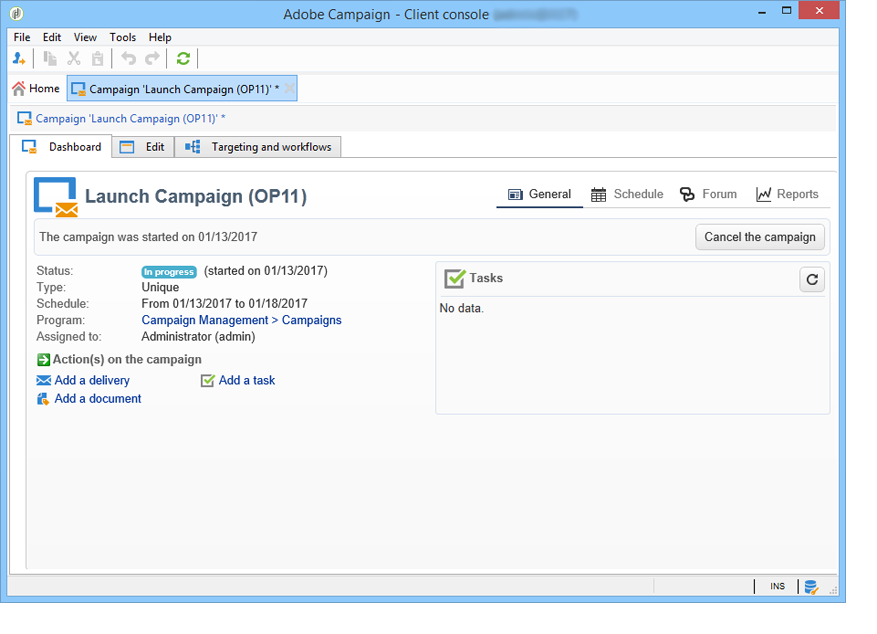

# Campagnesjablonen maken en configureren {#campaign-templates}

Alle marketing campagnes zijn gebaseerd op een malplaatje, dat belangrijkste kenmerken en mogelijkheden opslaat. De sjablonen voor campagnes zijn gecentraliseerd in de **[!UICONTROL Resources > Templates > Campaign templates]** knooppunt. Een standaardsjabloon wordt standaard verschaft. U kunt hiermee een nieuwe campagne maken met alle beschikbare modules (Documenten, Taken, zaadadressen, enz.), maar de aangeboden modules zijn afhankelijk van uw rechten en de configuratie van uw Adobe Campaign-platform.

>[!NOTE]
>
>De structuur wordt weergegeven wanneer u op de knop **[!UICONTROL Explorer]** op de startpagina.

Een ingebouwde sjabloon wordt geleverd om een campagne te maken waarvoor geen specifieke configuratie is gedefinieerd. U kunt uw campagnemalplaatjes tot stand brengen en vormen en dan campagnes van deze malplaatjes tot stand brengen.

 Raadpleeg voor meer informatie over het maken van campagnes [deze video](../../campaign/using/marketing-campaign-deliveries.md#create-email-video).

## Een campagnemalplaatje maken {#creating-or-duplicating-a-campaign-template}

Volg onderstaande stappen om een campagnemalplaatje te maken:

1. Campagne openen **Verkenner**.
1. In **Bronnen > Sjablonen > Campagnersjablonen**, klikt u op **Nieuw** in de werkbalk boven de lijst met sjablonen.

   

1. Voer het label van uw nieuwe campagnemalplaatje in.
1. Klikken **Opslaan** en open de sjabloon opnieuw.
1. In de **Bewerken** , voert u de **Interne naam** en andere waarden, indien nodig.
1. Selecteren **Geavanceerde campagneinstellingen** om een werkschema aan uw campagnemalplaatje toe te voegen.

   

1. Wijzig de **Doelstellingen en workflows** waarde aan **Ja**.

   

1. In de **Doelstellingen en workflows** tabblad, klikt u op **Een workflow toevoegen...**.

   

1. Voltooi de **Label** veld en klik op **OK**.
1. Maak uw workflow naar wens.
1. Klikken **Opslaan**. Uw sjabloon is nu klaar om in een campagne te worden gebruikt.

U kunt ook **dupliceren** het standaardmalplaatje om zijn configuratie opnieuw te gebruiken en aan te passen.

Met de verschillende tabbladen en subtabbladen van de campagnemalplaatje hebt u toegang tot de instellingen die worden beschreven in [Algemene configuratie](#general-configuration).

## Modules selecteren {#select-modules}

De **[!UICONTROL Advanced campaign settings...]** Met de koppeling kunt u taken voor de campagnes op basis van deze sjabloon in- en uitschakelen. Selecteer de mogelijkheden die u wilt inschakelen in de campagnes die op deze sjabloon zijn gebaseerd.

Als een functie niet is geselecteerd, worden de elementen betreffende het proces (menu&#39;s, pictogrammen, opties, tabs, subtabs, enz.) zal niet in de interface van het malplaatje of in campagnes verschijnen die op dit malplaatje worden gebaseerd. De lusjes links van de campagnedetails vallen gewoonlijk met de processen samen die in het malplaatje worden geselecteerd. Als **Uitgaven en doelstellingen** is niet geselecteerd, de bijbehorende **[!UICONTROL Budget]** wordt niet weergegeven in campagnes die op deze sjabloon zijn gebaseerd.

Bovendien worden de kortere weg aan de configuratievensters toegevoegd aan het campagnesdashboard. Wanneer een functionaliteit wordt toegelaten, geeft een directe verbinding toegang tot het van het campagnesdashboard.

Bijvoorbeeld met de onderstaande configuratie:

De volgende koppelingen worden weergegeven op het campagnemdashboard (de **[!UICONTROL Add a task]** koppeling ontbreekt):

En alleen de volgende tabbladen worden weergegeven:

Nochtans, met dit type van configuratie:

De volgende koppelingen en tabbladen worden weergegeven:

## Typologie van modules {#typology-of-enabled-modules}

* **Controlegroep**

   Wanneer deze module wordt geselecteerd, wordt een extra lusje toegevoegd aan de geavanceerde montages van het malplaatje en de campagnes die op dit malplaatje worden gebaseerd. De configuratie kan via het malplaatje of individueel voor elke campagne worden bepaald. Meer informatie over controlegroepen in [deze sectie](../../campaign/using/marketing-campaign-deliveries.md#defining-a-control-group).

   

* **Seed-adressen**

   Wanneer deze module wordt geselecteerd, wordt een extra lusje toegevoegd aan de geavanceerde montages van het malplaatje en de campagnes die op dit malplaatje worden gebaseerd. De configuratie kan via het malplaatje of individueel voor elke campagne worden bepaald. Meer informatie over adressen in [deze sectie](../../delivery/using/about-seed-addresses.md).

   

* **Documenten**

   Als deze module is geselecteerd, wordt een extra tabblad toegevoegd aan het dialoogvenster **[!UICONTROL Edition]** van de sjabloon en de campagnes die op deze sjabloon zijn gebaseerd. Bijgevoegde documenten kunnen worden toegevoegd vanuit de sjabloon of afzonderlijk voor elke campagne. Meer informatie over documenten in [deze sectie](../../campaign/using/marketing-campaign-deliveries.md#managing-associated-documents).

   

* **Omtrek**

   Als deze module is geselecteerd, wordt een **[!UICONTROL Delivery outlines]** subtab wordt toegevoegd aan de **[!UICONTROL Documents]** om de leveringsoverzichten voor de campagne te bepalen. Meer informatie over leveringscontouren vindt u in [deze sectie](../../campaign/using/marketing-campaign-deliveries.md#associating-and-structuring-resources-linked-via-a-delivery-outline).

   

* **Doelstellingen en workflows**

   Wanneer u **[!UICONTROL Targeting and workflows]** wordt een tabblad toegevoegd, zodat u een of meer workflows kunt maken voor campagnes die op deze sjabloon zijn gebaseerd. Workflows kunnen ook afzonderlijk worden geconfigureerd voor elke campagne op basis van deze sjabloon.Meer informatie over workflows voor campagnes in [deze sectie](../../campaign/using/marketing-campaign-deliveries.md#building-the-main-target-in-a-workflow).

   

   Wanneer deze module wordt toegelaten, wordt een lusje toegevoegd aan de geavanceerde montages van de campagne om de opeenvolging van de procesuitvoering te bepalen.

   

* **Goedkeuring**

   Als u **[!UICONTROL Approval]**, kunt u selecteren welke processen u wilt goedkeuren en welke operatoren verantwoordelijk zijn voor de goedkeuring. Meer informatie over goedkeuringen in [deze sectie](../../campaign/using/marketing-campaign-approval.md#selecting-reviewers).

   

   U kunt kiezen of u procesgoedkeuring wilt inschakelen via het dialoogvenster **[!UICONTROL Approvals]** tabblad van het gedeelte Geavanceerde instellingen voor sjablonen. De banen waarvoor goedkeuring wordt geselecteerd moeten voor berichtlevering worden goedgekeurd om te worden toegelaten.

   U moet een revisoroperator of groep operatoren aan elke ingeschakelde goedkeuring koppelen.

* **Uitgaven en doelstellingen**

   Als deze module is geselecteerd, wordt een **[!UICONTROL Budget]** wordt toegevoegd aan de details van het sjabloon en de campagnes op basis van dit sjabloon, zodat het bijbehorende budget kan worden geselecteerd.

   

## Eigenschappen en uitvoering {#general-configuration}

### Sjablooneigenschappen {#template-properties}

Wanneer u een campagnemalplaatje creeert, moet u de volgende informatie ingaan:

* Voer de **label** van de template: dit label wordt standaard toegewezen aan alle campagnes die met deze sjabloon worden gemaakt.
* Selecteer de campagne **aard** in de vervolgkeuzelijst. De waarden in deze lijst zijn opgeslagen in **[!UICONTROL natureOp]** opsomming.

   >[!NOTE]
   >
   >Raadpleeg voor meer informatie over opsommingen de [Aan de slag](../../platform/using/managing-enumerations.md) sectie.

* Selecteer **type campagne**: uniek, terugkerend of periodiek. Standaard worden campagnemasjablonen toegepast op unieke campagnes. Recursieve en periodieke campagnes worden beschreven in [deze sectie](../../campaign/using/setting-up-marketing-campaigns.md#recurring-and-periodic-campaigns).
* Geef de duur van de campagne op, d.w.z. het aantal dagen waarop de campagne zal plaatsvinden. Wanneer u een campagne maakt op basis van deze sjabloon, worden de begin- en einddatums van de campagne automatisch ingevuld.

   Als de campagne terugkerend is, moet u de begin en einddata van de campagne direct in het malplaatje specificeren.

* Geef de **verwant programma** van de template: campagnes op basis van deze sjabloon worden gekoppeld aan het geselecteerde programma.

### Parameters voor sjabloonuitvoering {#template-execution-parameters}

De **[!UICONTROL Advanced campaign settings...]** de verbinding laat u de geavanceerde opties van het malplaatje voor verwerking van het leveringsdoel (controlegroep, zaadadressen, enz.) vormen en de configuratie van campagnemeting en workflowuitvoering.

## Uitvoering van campagne bijhouden{#campaign-reverse-scheduling}

U kunt een programma voor een campagne en spoorprestaties tot stand brengen, bijvoorbeeld om een gebeurtenisprogramma voor een specifieke datum voor te bereiden. De malplaatjes van de campagne laten u nu de begindatum van een taak berekenen die op de einddatum van een campagne wordt gebaseerd.

Ga in het vak Taakconfiguratie naar de knop **[!UICONTROL Implementation schedule]** gebied en **[!UICONTROL The start date is calculated based on the campaign end date]** doos. (Hier is &quot;begindatum&quot; de begindatum van de taak.) Ga naar de **[!UICONTROL Start]** en voer een interval in: deze taak zal lang voor de einddatum van de campagne van start gaan . Als u een periode ingaat die langer is dan de campagne aan laatste wordt geplaatst, zal de taak vóór de campagne beginnen.

Wanneer u een campagne gebruikend dit malplaatje creeert, zal de datum van de taakaanvang automatisch worden berekend. U kunt deze echter altijd later wijzigen.
