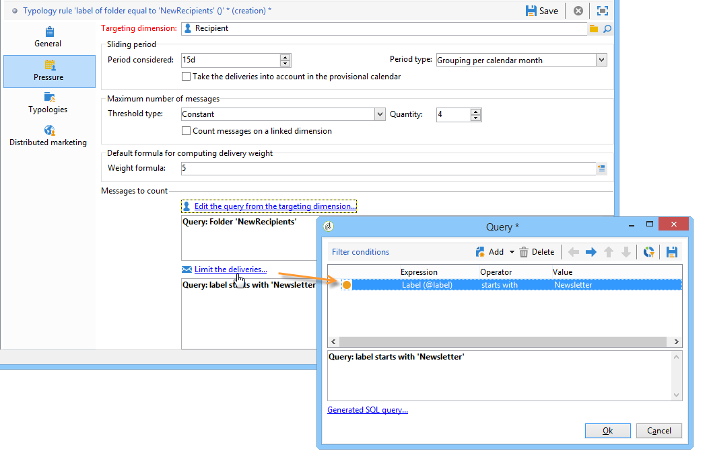
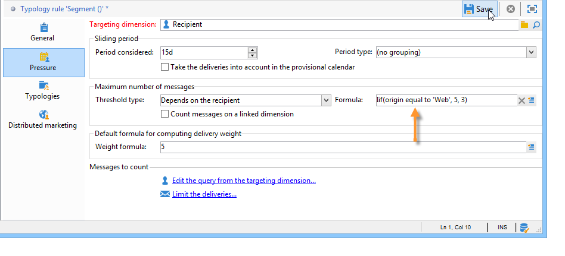
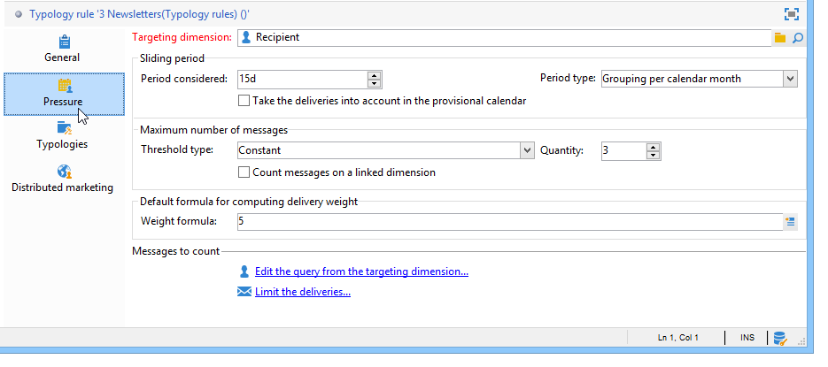

# Drukvoorschriften{#pressure-rules}

## Over vermoeidheid bij het op de markt brengen {#about-marketing-fatigue}

Door het beheer van de verkoopdruk te implementeren, kunt u voorkomen dat de populatie in de database te veel wordt gevraagd, ook wel &#39;marketingmoeheid&#39; genoemd. Om dit te doen, kunt u een maximumaantal berichten per ontvanger bepalen. Ook kunt u arbitrageregels tussen campagnes toepassen, zodat de beste boodschap naar het doelpubliek wordt gestuurd.

**Drukvoorschriften** , bijvoorbeeld om het aantal brieven dat naar een populatie moet worden gestuurd, te beperken tot twee, om de communicatie te selecteren die het best aansluit bij de belangen van een groep abonnees, om te voorkomen dat een sms naar een ontevreden klant wordt gestuurd, enz.

De campagnes worden geselecteerd gebaseerd op bepaalde drempels en berichtgewicht.

* Een drempel is het hoogste aantal leveringen dat binnen een bepaalde periode voor een bepaalde afnemer is toegestaan. De variabele kan ingesteld of variabel zijn. Deze wordt ingesteld of berekend in de instellingen voor de typologieregel. Zie [Maximum aantal berichten](#maximum-number-of-messages).
* Met leveringsgewichten kunt u topprioriteit-leveringen identificeren in het kader van drukbeheer. Berichten met het hoogste gewicht hebben prioriteit. Zie [Berichtdikte](#message-weight).

Arbitrage bestaat erin ervoor te zorgen dat geplande campagnes met een groter gewicht dan de lopende campagne niet leiden tot excessieve profielopvraging: in dat geval wordt het profiel van de levering uitgesloten .

Arbitragecriteria (gewicht en/of drempel) kunnen variëren op basis van twee soorten informatie:

* voorkeur van de ontvanger, die verklarende informatie is: abonnementen op nieuwsbrieven, status van de ontvanger (klant of vooruitzicht);
* gedrag ontvanger: aankopen, bezochte koppelingen enz.

De arbitrageregel voor het definiëren van in aanmerking komende berichten wordt toegepast tijdens de analysefase. Voor elke ontvanger en voor de betrokken periode wordt het bericht verzonden als de volgende formule waar is: **(aantal verzonden berichten) + (aantal berichten met een groter gewicht) &lt; drempel**.

Anders wordt de ontvanger **[!UICONTROL Excluded by arbitration]**. Voor meer informatie hierover, verwijs naar [Uitsluiting na arbitrage](#exclusion-after-arbitration).

## Een drukregel maken {#creating-a-pressure-rule}

Als u arbitrage wilt instellen tussen campagnes die gebruikmaken van Adobe Campaign, begint u met het maken van typologieën voor campagnes en het definiëren van gekoppelde typologieregels (**drukregels** ).

Voer de volgende stappen uit om een **[!UICONTROL Pressure]** typologieregel te maken en te configureren:

1. Klik in de lijst met typologische regels voor de campagne op het **[!UICONTROL New]** pictogram boven de lijst.

   

1. Selecteer op het **[!UICONTROL General]** tabblad van de nieuwe regel een regel van het type **Druk** en voer een naam en beschrijving voor deze regel in.

   

1. Wijzig zo nodig de uitvoeringsvolgorde. Wanneer meerdere typologische regels worden toegepast als een **[!UICONTROL Typology]** set, worden eerst de onderste geordende regels toegepast. Raadpleeg voor meer informatie de [uitvoeringsvolgorde](../../campaign/using/applying-rules.md#execution-order).
1. Definieer in de **[!UICONTROL Calculation parameters]** sectie een frequentie als u het maken van doelen wilt opslaan na de volgende dagelijkse uitvoering van de herarbitrage. Zie [Rekenfrequentie](../../campaign/using/applying-rules.md#adjusting-calculation-frequency)aanpassen voor meer informatie hierover.
1. Klik op het **[!UICONTROL Pressure]** tabblad en kies de kalenderperiode waarin de typologieregel van toepassing is.

   

   De regel wordt toegepast op leveringen waarvan de contactdatum in de betrokken periode is opgenomen.

   >[!NOTE]
   >
   >Met geplande leveringen wordt alleen rekening gehouden als de **[!UICONTROL Take the deliveries into account in the provisional calendar]** optie is geselecteerd. Raadpleeg [Setting the period](#setting-the-period)voor meer informatie.

1. Definieer de methode voor het berekenen van het hoogste aantal berichten.

   De drempel vertegenwoordigt het hoogste aantal berichten dat tijdens de betrokken periode naar een ontvanger kan worden verzonden.

   Door gebrek, is de drempel constant en u moet op een maximumaantal berichten wijzen die door de regel worden toegelaten.

   

   Als u een drempelwaarde voor een variabele wilt definiëren, selecteert u de **[!UICONTROL Depends on the recipient]** waarde in het **[!UICONTROL Type of threshold]** veld en gebruikt u het pictogram aan de rechterkant om de expressie-editor te openen.

   

   Voor meer op dit, verwijs naar [Maximum aantal berichten](#maximum-number-of-messages).

1. Geef de methode op voor de berekening van het leveringsgewicht.

   Elke levering heeft een gewicht, d.w.z. een waarde die het prioriteitsniveau vertegenwoordigt: dit maakt arbitrage tussen campagnes mogelijk . Het gewicht wordt berekend aan de hand van de formule die is gedefinieerd in de typologieregel en/of in de eigenschappen ervan. Zie [Berichtdikte](#message-weight)voor meer informatie.

1. Standaard worden alle berichten in aanmerking genomen voor de berekening van de drempelwaarde. Op het **[!UICONTROL Restriction]** tabblad kunt u de berichten filteren waarop de typologieregel betrekking heeft:

   * In de bovenste sectie van dit tabblad kunt u de betreffende ontvangers beperken.
   * In de onderste sectie van dit tabblad kunt u de berichten filteren die moeten worden geteld.

      In het volgende voorbeeld wordt alleen rekening gehouden met ontvangers die zijn opgeslagen in de map **NewContacts** en gaat het om leveringen die beginnen met **Newsletter** .
   

1. Het **[!UICONTROL Typologies]** lusje laat u de campagnemetypologieën bekijken die deze regel toepassen of de regel met één of meerdere bestaande typologieën verbinden. Raadpleeg [Typologieën](../../campaign/using/about-campaign-typologies.md#applying-typologies)toepassen voor meer informatie.

## Definitie van drempels en gewichten {#defining-thresholds-and-weights}

### Maximum aantal berichten {#maximum-number-of-messages}

Elke drukregel definieert een drempel, d.w.z. het maximumaantal berichten dat gedurende een bepaalde tijdsperiode naar een ontvanger kan worden verzonden. Zodra deze drempel is bereikt, kunnen tot het einde van de beoordelingsperiode geen leveringen meer plaatsvinden. Met dit proces kunt u automatisch een ontvanger uitsluiten van een levering als een bericht de ingestelde drempelwaarde overschrijdt. Op deze manier voorkomt u te veel vragen.

Drempelwaarden kunnen constant zijn of door een formule met variabelen worden berekend. Dit betekent dat de drempels voor een bepaalde periode van de ene ontvanger tot de andere kunnen variëren, of zelfs voor dezelfde ontvanger.

>[!CAUTION]
>
>Het invoeren van **0** als drempel voorkomt dat tijdens de beoordelingsperiode alle leveringen aan de doelpopulatie plaatsvinden.

**Voorbeeld:**

U kunt het aantal geoorloofde berichten volgens het segment indexeren waartot de ontvanger behoort. Dit betekent dat een ontvanger die tot het segment van het Web behoort meer berichten dan andere ontvangers kan ontvangen. Een **[!UICONTROL Iif (@origin='Web', 5, 3)]** typeformule machtigt de levering van 5 berichten aan ontvangers en 3 voor andere segmenten. De configuratie is als volgt:

Als u de drempel wilt definiëren, kunt u een dimensie gebruiken die is gekoppeld aan de doeldimensie: bijvoorbeeld om berichten op te nemen die worden afgeleverd aan de in de bezoekerstabel opgeslagen ontvangerprofielen (voor meer informatie over de bezoekerslijst, verwijs naar [deze sectie](../../web/using/use-case--creating-a-refer-a-friend-form.md)) of om te voorkomen dat meer dan één bericht per week naar hetzelfde huishouden wordt verzonden (die naar verschillende e-mailadressen kunnen verwijzen) die in een dimensie worden geïdentificeerd die verband houdt met die van de ontvangers.

Selecteer hiertoe de **[!UICONTROL Count messages on a linked dimension]** optie en selecteer vervolgens de bezoeker of de tabel met contactpersonen.

### Berichtgewicht {#message-weight}

Elke levering heeft een gewicht dat overeenkomt met het prioriteitsniveau. Standaard is het gewicht van een levering ingesteld op 5. Aan de hand van drukregels kunt u het gewicht bepalen van de leveringen waarop deze worden toegepast.

U kunt het gewicht instellen of berekenen met behulp van een formule die geschikt is voor de ontvanger. U kunt bijvoorbeeld het gewicht van een levering bepalen op basis van de belangen van de ontvanger.

>[!CAUTION]
>
>Het gewicht dat in een typologieregel wordt gedefinieerd, kan voor elke levering afzonderlijk worden overbelast, op het **[!UICONTROL Properties]** tabblad. Klik op het **[!UICONTROL Typology]** tabblad om de typologie van de campagne te selecteren en geef indien nodig het gewicht op dat u wilt toepassen.\
>Het gewicht dat in een A-typologieregel wordt gedeclareerd, wordt echter niet gebruikt voor het berekenen van een B-typologieregel: dit gewicht heeft alleen betrekking op leveringen die gebruikmaken van de A-regel.

**Voorbeeld:**

In het volgende voorbeeld willen we het gewicht van nieuwsbrieven op muziek koppelen aan de nevenscore van hun ontvangers. Dit doet u als volgt:

1. Maak een nieuw veld waarin u de geschiktheidsscores voor ontvangers kunt opslaan. Het veld, **@Muziek** in dit geval, zal worden verrijkt met antwoorden op enquêtes en online opiniepeilingen, verzamelde volggegevens, enz.
1. Maak een typologieregel om het gewicht van het bericht te berekenen op basis van dit veld.

   

1. Pas deze regel op berichten met het volgende onderwerp toe: nieuwsbrieven, speciale aanbiedingen, enz. Het gewicht van deze leveringen, en dus het prioriteitsniveau ervan, zal afhangen van de geschiktheidsscore van elke ontvanger.

## Vaststelling van de periode {#setting-the-period}

De drukregels worden gedefinieerd in **n**-dag rolperiodes.

De periode wordt gevormd op het **[!UICONTROL Pressure]** lusje van de regel. U kunt het aantal dagen opgeven en, indien nodig, het type groepering selecteren dat u wilt toepassen (dag, week, maand, kwartaal, enz.).

Met het groeperingstype kunt u het **[!UICONTROL Period considered]** veld uitbreiden tot de hele dag, kalenderweek, kalendermaand of kalenderjaar voor datums voor de periode.

Bijvoorbeeld, zal een drukregel die een drempel van 2 berichten per week bepaalt, met een groepering aan elke kalendermaand, de levering van meer dan 2 berichten binnen de zelfde week EN binnen de zelfde kalendermaand verhinderen. Waarschuwing: als de periode twee maanden overlapt, wordt bij de berekening rekening gehouden met de leveringen van deze twee kalendermaanden en kunnen derhalve alle nieuwe leveringen in de tweede maand worden voorkomen.

>[!NOTE]
>
>Standaard wordt bij de berekening van de drempel alleen rekening gehouden met reeds verzonden leveringen. Schakel de **[!UICONTROL Take the deliveries into account in the provisional calendar]** optie in als u ook de leveringen wilt overwegen die voor de desbetreffende periode zijn gepland. In dit geval wordt de beoordelingsperiode verdubbeld om toekomstige leveringen en eerdere leveringen te kunnen integreren.\
>Als u de geleverde producten wilt beperken tot een periode van twee weken, kunt u:
>
>* Voer **15d** in het **[!UICONTROL Concerned period]** veld in: leveringen die tot twee weken vóór de datum van levering waarop de regel wordt toegepast, zijn verzonden, worden bij de berekening in aanmerking genomen;
>
>  
of
>
>* Voer **7d** in het **[!UICONTROL Period considered]** veld IN EN controleer het **[!UICONTROL Take the deliveries into account in the provisional calendar]**\
   >optie: bij de berekening wordt rekening gehouden met leveringen die tot 7 dagen vóór de leveringsdatum zijn verzonden en die tot 7 dagen na de leveringsdatum waarop de regel wordt toegepast, zijn gepland.
>
>
De begindatum van de periode is afhankelijk van de configuratie van de database.

Als u bijvoorbeeld een drukregel van 15 dagen toepast zonder te groeperen in een levering van 12/11, wordt rekening gehouden met leveringen tussen 11/27 en 12/12. Indien bij de drukregel rekening wordt gehouden met de leveringen in het voorlopige tijdschema, worden alle tussen 11.27 en 12.27 geplande leveringen in aanmerking genomen. Tot slot als u een groepering per kalendermaand in de regel vormt, zullen alle leveringen in November en December in aanmerking worden genomen voor het berekenen van de drempel (van 11/1 tot 12/31).

>[!CAUTION]
>
>**Frequente gevallen**
>Om ervoor te zorgen dat geen rekening wordt gehouden met leveringen voor de lopende kalenderweek en om geen risico&#39;s te nemen, ook rekening houdend met die van de vorige week voor de berekeningsdrempel, geeft u **[!UICONTROL Period considered]** &quot;0&quot; op en selecteert u &quot;Groepering per kalenderweek&quot; als **[!UICONTROL Period type]**.
> 
>Wanneer een periode groter is dan 0 (bijvoorbeeld 1), kan bij de berekening de waarde van de leveringen van de voorgaande dag in aanmerking worden genomen. Indien de vorige dag overeenkomt met de vorige kalenderweek en de gekozen periode &quot;Groepering per kalenderweek&quot; is, wordt derhalve met alle voorafgaande weken rekening gehouden voor de berekeningsdrempel.

**Voorbeeld:**

We willen een drukregel maken die het aanvragen beperkt tot 3 berichten per periode van twee weken, met een groepering tot de kalendermaand.

Laten we zes nieuwsbrieven nemen met hetzelfde gewicht, gepland voor 05/30, 06/3, 06/8, 06/12, 06/22 en 06/30.

De voor 12 en 30 juni geplande leveringen worden niet verzonden: de levering 06/12 zou de drempel van 3 berichten per periode van twee weken overschrijden en de dertigste levering zou de drempel van toegestane communicatie per kalendermaand overschrijden.

Alle ontvangers voor deze leveringen worden tijdens de analysefase door arbitrage uitgesloten:

Voor dezelfde regel geldt dat als u leveringen per kwartaal groepeert, de ontvangers van **nieuwsbrief nr.5** ook worden uitgesloten en niet worden verzonden.

Als ten slotte geen groepering wordt geselecteerd, wordt alleen **nieuwsbrief nr.4** verzonden, aangezien deze voor dezelfde periode van twee weken als de eerste drie nieuwsbrieven was gepland.

>[!NOTE]
>
>Wanneer u de definitie van een typologieregel verandert, kunt u een **Simulatie** tot stand brengen om zijn effect op de leveringen te controleren het op wordt toegepast en het effect te controleren dat de leveringen op elkaar hebben. Raadpleeg [Campagnesimulaties](../../campaign/using/campaign-simulations.md)voor meer informatie hierover.

## Uitsluiting na arbitrage {#exclusion-after-arbitration}

Arbitrage wordt elke avond opnieuw toegepast via de **[!UICONTROL Forecasting]** technische workflow en de **[!UICONTROL Campaign jobs]** workflow.

In de **[!UICONTROL Forecasting]** workflow worden de gegevens vooraf berekend voor de lopende periode (van de begindatum tot de huidige datum), zodat tijdens de analyse typologische regels kunnen worden toegepast. Ook worden de uitsluitingstellers elke nacht opnieuw berekend voor arbitrage.

Voor elke ontvanger controleert Adobe Campagne dus of het aantal te verzenden berichten de drempel niet overschrijdt, rekening houdend met het aantal berichten dat al voor de betrokken periode is verzonden. Deze informatie is een **indicator**, aangezien alle berekeningen op het tijdstip van levering worden bijgewerkt.

Als dit aantal de drempel overschrijdt, worden de arbitrageregels toegepast die in de campagnetypologie zijn gedefinieerd en worden de ontvangers uitgesloten van campagnes met een lager gewicht.

>[!NOTE]
>
>Als meerdere leveringen dezelfde scores hebben, wordt de campagne die voor de vroegste datum is gepland, verzonden.

## Gevallen gebruiken voor drukregels {#use-cases-on-pressure-rules}

### Aanpassing van de drempel op basis van criterium {#adapting-the-threshold-based-on-criterion}

Wij willen een typologieregel tot stand brengen om de levering van meer dan 4 berichten per week aan klanten en 2 berichten per week aan vooruitzichten te verhinderen.

Om klanten en vooruitzichten te identificeren, gebruik het **[!UICONTROL Status]** gebied, dat 0 voor vooruitzichten en 1 voor klanten bevat.

Pas de volgende stappen toe om de regel te maken:

1. Maak een nieuwe typologische regel voor het type **Druk** .
1. Bewerk het **[!UICONTROL Pressure]** tabblad: in de **[!UICONTROL Maximum number of messages]** sectie willen wij een formule creëren om de drempel afhankelijk van elke ontvanger te berekenen. Selecteer de **[!UICONTROL Depends on the recipient]** waarde in het **[!UICONTROL Threshold type]** veld en klik rechts van **[!UICONTROL Edit expression]** het **[!UICONTROL Formula]** veld.

   Klik op de **[!UICONTROL Advanced parameters]** knop om de berekeningsformule te definiëren.

   

1. Selecteer de **[!UICONTROL Edit the formula using an expression]** optie en klik **[!UICONTROL Next]**.

   

1. Dubbelklik in de lijst met functies op de functie **Iif** in het **[!UICONTROL Others]** knooppunt.

   Selecteer vervolgens de **status** van de ontvangers in de **[!UICONTROL Available fields]** sectie.

   

   Voer de volgende formule in: **IF(@status=0,2,4)**

   

   Met deze formule kunt u de waarde 2 toewijzen als de status gelijk is aan 0 en de waarde 4 voor alle andere statussen.

   Klik **[!UICONTROL Finish]** om de formule goed te keuren.

1. Vermeld de periode gedurende welke de regel van toepassing zal zijn: 7 dagen in dit geval om het aantal berichten per week te tellen.

   

1. Sla de regel op om het maken goed te keuren.

Koppel nu de regel die u zojuist hebt gemaakt aan een typologie om deze toe te passen op leveringen. Dit doet u als volgt:

1. Maak een campagnetypologie.
1. Ga naar het **[!UICONTROL Rules]** tabblad, klik op de **[!UICONTROL Add]** knop en selecteer de regel die u zojuist hebt gemaakt.

   

1. Sla de typologie op: wordt toegevoegd aan de lijst van bestaande typologieën.

Als u deze typologie in uw leveringen wilt gebruiken, selecteert u deze in de leveringseigenschappen op het **[!UICONTROL Typology]** tabblad, zoals hieronder wordt weergegeven:

>[!NOTE]
>
>De typologie kan in het leveringsmalplaatje worden bepaald, dat automatisch op alle leveringen wordt toegepast die gebruikend dit malplaatje worden gecreeerd.

Tijdens de leveringsanalyse worden de ontvangers van de levering, indien van toepassing, uitgesloten van de levering, afhankelijk van het aantal reeds aan hen verzonden leveringen. Als u deze gegevens wilt weergeven, kunt u:

* Bekijk het analyseresultaat:

   

* Bewerk de levering en klik op het **[!UICONTROL Delivery]** tabblad en het **[!UICONTROL Exclusions]** subtabblad:

   

* Klik op het **[!UICONTROL Audit]** tabblad en vervolgens op het **[!UICONTROL Causes of exclusions]** subtabblad om het aantal uitsluitingen en de toegepaste typologische regels weer te geven:

   

### Het leveringsgewicht berekenen op basis van het gedrag {#calculating-the-delivery-weight-based-on-behavior}

U kunt drukregels bepalen die op ontvankelijk gedrag worden gebaseerd: zo kan het gewicht van een levering worden aangepast aan criteria die van de ene ontvanger tot de andere verschillen . U kunt bijvoorbeeld een bericht verzenden, afhankelijk van de vraag of een ontvanger uw website heeft bezocht, in een bepaald gedeelte van de laatste nieuwsbrief heeft geklikt, zich op een informatieservice heeft geabonneerd of zelfs op basis van antwoorden op een enquête, een online game, enz.

In het volgende voorbeeld willen we een levering maken met een gewicht van 5. Dit gewicht wordt verrijkt met nevenscores op basis van het gedrag van de ontvanger: klanten die al vanaf deze site hebben besteld, hebben een score van 5, terwijl klanten die nog nooit online hebben besteld, een score van 4 hebben.

Om dit type van configuratie uit te voeren, moet u een formule gebruiken om berichtgewicht te bepalen. In het gegevensmodel moet informatie over de populatiescore en enquêteantwoorden beschikbaar zijn. In ons voorbeeld is het veld **Propensiteit** toegevoegd.

Pas de volgende configuratiestappen toe:

1. Maak een nieuwe typologische regel voor het type **Druk** .
1. Bewerk het **[!UICONTROL Pressure]** tabblad. Wij willen een drempelformule creëren die op elke individuele ontvanger wordt gebaseerd: Klik op het **[!UICONTROL Edit expression]** pictogram rechts van het **[!UICONTROL Weight formula]** veld.

   

1. Standaard wordt waarde **5** weergegeven in de bovenste sectie van de expressieeditor. We willen de nevenscore van elke ontvanger toevoegen aan dit gewicht: Plaats uw curseur rechts van 5, ga het **+** karakter in en selecteer het gebied van de **Volheid** .

   

1. Voeg vervolgens een hogere waarde toe voor ontvangers die al een aankoop hebben gedaan. Voor hen moet het gewicht van de levering met 5 worden verhoogd, voor andere met slechts 4.

   

1. Klik **[!UICONTROL Finish]** om deze regel op te slaan.
1. Koppel de regel aan een campagnetypologie en verwijs deze typologie in een levering om het goed te keuren.

### Alleen de hoogst gewogen berichten verzenden {#sending-only-the-highest-weighted-messages}

U wilt niet meer dan 2 berichten binnen de zelfde week, met een grens van 2 berichten per dag, naar elk van uw ontvangers verzenden, en u wilt slechts de berichten met hogere gewichten om worden geleverd.

Hiervoor moet u verschillende leveringen met verschillende gewichten voor dezelfde ontvanger plannen en een drukregel toepassen om de leveringen met een lager gewicht uit te sluiten.

Eerst, vorm de drukregel.

1. Maak een drukregel. Raadpleeg [Een drukregel](#creating-a-pressure-rule)maken voor meer informatie hierover.
1. Selecteer op het **[!UICONTROL General]** tabblad de **[!UICONTROL Re-apply the rule at the start of personalization]** optie.

   

   Met deze optie wordt de waarde die in het **[!UICONTROL Frequency]** veld is gedefinieerd, overschreven en wordt de regel tijdens de verpersoonlijkingsfase automatisch toegepast. Zie [Rekenfrequentie](../../campaign/using/applying-rules.md#adjusting-calculation-frequency)aanpassen voor meer informatie hierover.

1. Selecteer op het **[!UICONTROL Pressure]** tabblad **[!UICONTROL 7d]** de optie **[!UICONTROL Period considered]** en **[!UICONTROL Grouping per day]** als de optie **[!UICONTROL Period type]**.
1. Selecteer de **[!UICONTROL Take the deliveries into account in the provisional calendar]** optie om de geplande leveringen op te nemen.

   

   Bij de berekening wordt rekening gehouden met leveringen die tot 7 dagen vóór de leveringsdatum zijn verzonden en die tot 7 dagen na de leveringsdatum zijn gepland. Raadpleeg [Setting the period](#setting-the-period)voor meer informatie.

1. Koppel op het **[!UICONTROL Typologies]** tabblad de regel aan een campagnetypologie.
1. Sla uw wijzigingen op.

Maak en configureer nu een workflow voor elke levering waarop u de drukregel wilt toepassen.

1. Maak een campagne. Zie [deze sectie](../../campaign/using/setting-up-marketing-campaigns.md#creating-a-campaign)voor meer informatie.
1. Voeg op het **[!UICONTROL Targeting and workflows]** tabblad van uw campagne een **query** -activiteit toe aan uw workflow. Raadpleeg [deze sectie](../../workflow/using/query.md)voor meer informatie over het gebruik van deze activiteit.
1. Voeg een **[!UICONTROL Email delivery]** activiteit aan het werkschema toe en open het. Raadpleeg [deze sectie](../../workflow/using/delivery.md)voor meer informatie over het gebruik van deze activiteit.
1. Ga naar het **[!UICONTROL Approvals]** lusje van **[!UICONTROL Delivery properties]** en maak alle goedkeuringen onbruikbaar.

   

1. Verwijs op het **[!UICONTROL Typology]** lusje van **[!UICONTROL Delivery properties]**, de campagnetypologie om de regel op toe te passen. Definieer een gewicht voor de levering.

   

1. Klik in de levering **[!UICONTROL Scheduling]** en selecteer **[!UICONTROL Schedule delivery (automatic execution when the scheduled date is reached)]**. Selecteer in dit voorbeeld de **[!UICONTROL Use a calculation formula]** optie.
1. Stel de extractiedatum in op 10 minuten (huidige datum + 10 minuten).
1. Stel de contactdatum in op de volgende dag (huidige datum + 1 dag).

   

   Voor de drukregeluitsluitingen die met succes moeten worden geïmplementeerd, moet u de extractiedatum en -tijd vóór de contactdatum en -tijd instellen, evenals voordat de nachtelijke arbitrage opnieuw wordt toegepast. Voor meer informatie hierover, verwijs naar [Uitsluiting na arbitrage](#exclusion-after-arbitration).

1. Hef de selectie van de **[!UICONTROL Confirm the delivery before sending]** optie op en sla uw wijzigingen op.
1. Ga op dezelfde manier te werk voor elke levering die u wilt verzenden. Zorg ervoor dat u het gewenste gewicht voor elke levering instelt.
1. Voer de relevante workflows uit om de leveringen voor te bereiden en te verzenden.

Wanneer de nachtelijke arbitrage wordt toegepast, worden de leveringen met de laagste gewichten voor dezelfde afnemer uitgesloten. Alleen leveringen met het hoogste gewicht worden in aanmerking genomen voor verzending. Zie [Berichtdikte](#message-weight)voor meer informatie.

Aangezien er al eerder in de week een e-mailbericht naar de betrokken ontvangers is verzonden, wordt in de onderstaande tabel een voorbeeld weergegeven van de configuraties die kunnen worden toegepast voor nog twee leveringen.

<table> 
 <thead> 
  <tr> 
   <th> Aflevering  </th> 
   <th> Goedkeuringen  </th> 
   <th> Dikte  </th> 
   <th> Extractiedatum/-tijd  </th> 
   <th> Contactdatum  </th> 
   <th> Begindatum/-tijd van levering  </th> 
   <th> Uitvoeringsdatum/tijd van de arbitrageworkflow  </th> 
   <th> Leveringsstatus  </th> 
   <th> Verzonden levering (datum/tijd)  </th> 
  </tr> 
 </thead> 
 <tbody> 
  <tr> 
   <td> Aflevering 1  </td> 
   <td> Uitgeschakeld  </td> 
   <td> 5  </td> 
   <td> 3pm  </td> 
   <td> 8.00 uur (volgende dag)  </td> 
   <td> 2pm  </td> 
   <td> Night  </td> 
   <td> Uitgesloten  </td> 
   <td> Uitgesloten  </td> 
  </tr> 
  <tr> 
   <td> Aflevering 2  </td> 
   <td> Uitgeschakeld  </td> 
   <td> 10  </td> 
   <td> 4pm  </td> 
   <td> 9.00 uur (volgende dag)  </td> 
   <td> 2pm  </td> 
   <td> Night  </td> 
   <td> Verzonden  </td> 
   <td> 9.00 uur (volgende dag)  </td> 
  </tr> 
 </tbody> 
</table>

Nadat de extractiedatum voor de twee leveringen is verstreken, wordt de nachtelijke arbitrage opnieuw toegepast vóór de contactdata van beide leveringen. Op deze manier kunnen alle reeds verzonden leveringen (ontvangers voor wie een levering wordt verwerkt, geregistreerd via de grote logboeken) of geplande leveringen (ontvangers die in aanmerking komen voor een levering, geregistreerd via de voorspelde logboeken) worden gevonden.

Nadat alle verzonden en mogelijke leveringen zijn vermeld voor de periode die is gedefinieerd in de drukregel, worden deze door Adobe Campaign gesorteerd op basis van gewicht, met de hoogste gewogen eerst. Wanneer de in de drukregel vastgestelde drempelwaarde wordt bereikt (hier niet meer dan twee e-mails in dezelfde week), worden de ontvangers uitgesloten van de levering.
