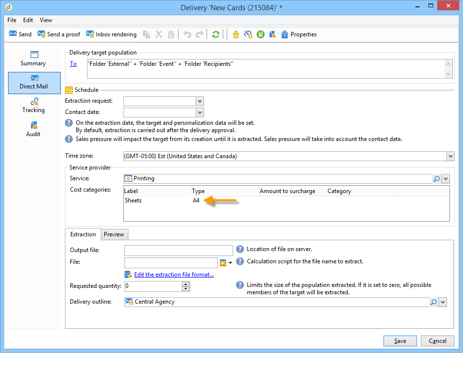
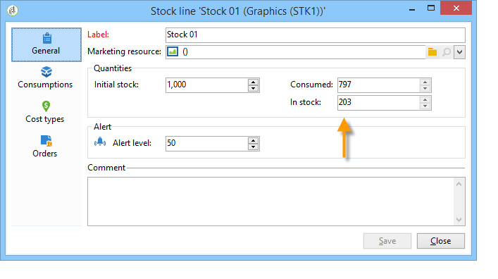

# Providers, voorraden en budgetten{#providers-stocks-and-budgets}

Met Adobe Campaign kunt u serviceproviders definiëren die betrokken zijn bij de taken die in de campagnes worden uitgevoerd. Informatie over de dienstverleners en de bijbehorende kostenstructuren wordt door de Adobe Campaign-beheerder in hoofdlijnen gedefinieerd. Van de levering wordt naar de dienstverlener verwezen en de kostenstructuur ervan maakt het mogelijk de kosten van deze levering te berekenen en het betrokken bestand te beheren.

## Dienstverleners en hun kostenstructuren creëren {#creating-service-providers-and-their-cost-structures}

Elke serviceprovider wordt opgeslagen in een bestand met contactgegevens, servicesjablonen en verwante taken.

De dienstverleners worden gevormd in **[!UICONTROL Administration > Campaign management]** knooppunt van de structuur.

De taken die tijdens de leveringen worden uitgevoerd, worden door de dienstverleners verricht, met name voor direct mail en mobiele kanalen. Deze serviceproviders kunnen bijvoorbeeld betrokken zijn bij het afdrukken of verspreiden van berichten. Deze taken omvatten configuraties en kosten die specifiek zijn voor elke dienstverlener. De configuratie van dienstverleners omvat vier fasen:

1. Opzetten van een serviceprovider in Adobe Campaign

   Zie [Een serviceprovider toevoegen](#adding-a-service-provider).

1. Bepalend kostencategorieën en structuren van bijbehorende de dienstmalplaatjes

   Zie [Definiëren van kostencategorieën](#defining-cost-categories) en [Vaststelling van de kostenstructuur](#defining-the-cost-structure).

1. Configuratie van processen

   Zie [Het vormen processen verbonden aan de dienst](#configuring-processes-associated-with-a-service).

1. Verwijzen naar de dienstverlener op campagneniveau

   Zie [Een service koppelen aan een campagne](#associating-a-service-with-a-campaign).

### Het creëren van een dienstverlener en zijn kostencategorieën {#creating-a-service-provider-and-its-cost-categories}

#### Een serviceprovider toevoegen {#adding-a-service-provider}

U kunt zoveel serviceproviders maken als nodig zijn voor uw leveringen. De procedure voor de toevoeging van een dienstverlener is als volgt:

1. Klik met de rechtermuisknop op de lijst met serviceproviders en selecteer **[!UICONTROL New]** of klik op de knop **[!UICONTROL New]** boven de lijst met dienstverleners.
1. Geef in de onderste sectie van het venster de naam en contactgegevens van de serviceprovider op.

   

1. Klik op de knop **[!UICONTROL Save]** om de serviceprovider aan de lijst toe te voegen.

#### Definiëren van kostencategorieën {#defining-cost-categories}

U moet de dienstmalplaatjes met elke dienstverlener associëren. In deze templates moet u eerst de kostencategorieën en, indien nodig, de betrokken voorraad identificeren. Vervolgens moet u de regels voor kostenberekening voor elke categorie maken, via de kostenstructuren.

>[!NOTE]
>
>Raadpleeg voor meer informatie hierover [Vaststelling van de kostenstructuur](#defining-the-cost-structure).

Een kostencategorie is een entiteit die een reeks kosten bevat die in aanmerking komen voor een bepaalde soort levering (e-mail, direct mail, enz.) of voor een taak. De categorieën van kosten worden gegroepeerd in de malplaatjes van de diensten verbonden aan de dienstverleners. Elke dienstverlener kan één of meerdere de dienstmalplaatjes van verwijzingen voorzien.

Pas de volgende stappen toe om een servicesjabloon te maken en de inhoud ervan te definiëren:

1. In de **[!UICONTROL Services]** tabblad van het prepress-bureau klikt u op de knop **[!UICONTROL Add]** en geef de servicesjabloon een naam.

   

1. Maak de kostencategorieën voor elk type proces (levering per direct mail/e-mail/etc.). of taak). Om dit te doen, klik **[!UICONTROL Cost categories]** en vervolgens de **[!UICONTROL Add]** en voert u de parameters van elke kostencategorie in.

   

   * Voer een label in voor deze kostencategorie en selecteer het type proces in kwestie: Aflevering door **[!UICONTROL Direct mail]**, **[!UICONTROL Email]**, **[!UICONTROL Mobile]**, **[!UICONTROL Telephone]** of **[!UICONTROL Task]**.
   * Klik op de knop **[!UICONTROL Add]** om de soorten kosten te bepalen verbonden aan deze categorie.
   * Indien nodig wordt een voorraadlijn gekoppeld aan elk type kosten, zodat de gebruikte hoeveelheden automatisch aan de bestaande voorraden worden gerelateerd.

     >[!NOTE]
     >
     >De voorraadlijnen worden gedefinieerd in de **[!UICONTROL Stock management]** knooppunt.\
     >Raadpleeg voor meer informatie hierover [Beheer van voorraden en orders](#stock-and-order-management).

1. U kunt een waarde voor deze kostencategorie vooraf selecteren, die standaard wordt aangeboden in de kostencategorieën van de serviceprovider (in plaats van een leeg vak). Selecteer hiertoe de optie in het dialoogvenster **[!UICONTROL Selected]** kolom voor de betrokken categorie:

   

   Op leveringsniveau wordt de waarde standaard geselecteerd:

   

### Vaststelling van de kostenstructuur {#defining-the-cost-structure}

Voor elk type kosten worden in een kostenstructuur de toe te passen berekeningsregels vermeld.

Klik op de knop **[!UICONTROL Cost structure]** om de kostenberekening voor elke kostencategorie en type te vormen. Klikken **[!UICONTROL Add]** en voert de kostenstructuur in.

* Om de kostenstructuur tot stand te brengen, selecteer het type van bericht en de betreffende kostencategorie van de drop-down lijsten, evenals het type van kosten waarop de berekeningsregel zal van toepassing zijn. De inhoud van deze vervolgkeuzelijsten is afkomstig van de informatie die is ingevoerd via de **[!UICONTROL Cost categories]** tab.

  U moet een label toewijzen aan de kostenstructuur. Standaard heeft deze de volgende leveringsomtrek: **Kostencategorie - Soort kosten**.

  U kunt de naam echter wijzigen: voer de gewenste waarde rechtstreeks in het dialoogvenster **[!UICONTROL Label]** veld.

* De kostenberekeningsformule wordt gedefinieerd in de onderste sectie van het venster.

  Deze formule kan worden vastgesteld (voor om het even welk aantal berichten) of berekend volgens het aantal berichten.

  Wanneer het van het aantal berichten afhangt, kan de structuur van de kostenberekening zijn **[!UICONTROL Linear]**, **[!UICONTROL Linear by threshold]**, of **[!UICONTROL Constant by threshold]**.

#### Lineaire structuur {#linear-structure}

Als de hoeveelheid altijd gelijk is voor een bericht (of een partij berichten) ongeacht het totale aantal berichten, selecteert u **[!UICONTROL Linear]** en voert u de kosten van elk bericht in.

Als dit bedrag op een partij berichten van toepassing is, specificeer het aantal berichten betrokken in **[!UICONTROL for]** veld.

#### Lineaire structuur volgens drempel {#linear-structure-by-threshold}

Als het bedrag per drempel voor elk bericht van toepassing is, moet u een **[!UICONTROL Linear by threshold]** berekeningsstructuur. In dit type van kostenstructuur, zal elk bericht 0.13 kosten, bijvoorbeeld, als het totale aantal berichten tussen 1 en 100 is, en 0.12 van 100 tot 1000 verzonden berichten zal kosten, of 0.11 voorbij 1000 berichten.

De configuratie is als volgt:

Als u een drempelwaarde wilt toevoegen, klikt u op de knop **[!UICONTROL Add]** rechts van de lijst.

#### Constante structuur op drempel {#constant-structure-by-threshold}

Tot slot kunt u een kostenberekening op het totale aantal berichten vormen. Selecteer een **[!UICONTROL Constant by threshold]** berekeningsstructuur. Bijvoorbeeld, zullen de kosten aan een vast bedrag van 12.00 voor 1 tot 100 berichten, en bij 100.00 voor een levering van 101 tot 1000 berichten, en 500.00 voor om het even welke levering over 1000 berichten, ongeacht het totale aantal worden geplaatst.

### Het vormen processen verbonden aan de dienst {#configuring-processes-associated-with-a-service}

U kunt informatie over de processen associëren verbonden aan de dienst via **[!UICONTROL Processes]** tab.

Om dit te doen, klik **[!UICONTROL Processes]** lusje om het verzenden van informatie aan de router te vormen.

* De **[!UICONTROL File extraction]** in dit gedeelte wordt de exportsjabloon aangegeven die voor levering wordt gebruikt wanneer deze service is geselecteerd. U kunt de naam van het uitvoerbestand in het dialoogvenster **[!UICONTROL Extraction file]** veld. Met de knop rechts van het veld kunt u variabelen invoegen.

  

* De **[!UICONTROL Notification email]** kunt u de sjabloon opgeven om serviceproviders op de hoogte te stellen nadat bestanden zijn verzonden. Selecteer de sjabloon die wordt gebruikt om het waarschuwingsbericht en de groep ontvangers te maken.

  Standaard worden leveringssjablonen voor berichtberichten opgeslagen in de **[!UICONTROL Administration > Campaign management > Technical delivery templates]** knooppunt, dat toegankelijk is vanuit de algemene weergave.

* De **[!UICONTROL Post-processing]** kunt u de workflow selecteren die u wilt starten nadat de levering is goedgekeurd. Als een werkstroomsjabloon wordt ingevoerd, wordt automatisch een werkstroominstantie gemaakt en gestart zodra de goedkeuring van kracht wordt. Deze workflow kan het extractiebestand bijvoorbeeld naar een externe serviceprovider sturen voor verwerking.

### Een service koppelen aan een campagne {#associating-a-service-with-a-campaign}

Services worden gekoppeld aan campagnes via leveringen of taken. Serviceproviders zijn gekoppeld aan leveringssjablonen om hun services aan te bieden in de leveringen die via deze sjabloon zijn gemaakt.

Wanneer een dienst wordt geselecteerd, de kostencategorieën die met het type van levering (direct mail, e-mail, enz.) corresponderen worden automatisch in de centrale tabel aangegeven, samen met de verwerkingsopties die zijn gedefinieerd.

>[!NOTE]
>
>Als geen kostencategorie wordt getoond wanneer de dienst wordt geselecteerd, betekent het dat geen kostencategorie voor dit type van proces werd bepaald. Bijvoorbeeld voor een e-maillevering, als er geen is **[!UICONTROL Email]** type kostencategorie is gedefinieerd, geen categorie wordt weergegeven en het selecteren van de service heeft geen effect.

* Voor een directe postlevering, kunt u de dienst van het configuratievenster selecteren.

  

* Voor levering op mobiele kanalen of telefoon geldt dezelfde selectiemodus.
* Voor een e-maillevering wordt de service geselecteerd in het menu **[!UICONTROL Advanced]** in de leveringseigenschappen, zoals in het volgende voorbeeld:

  

De **[!UICONTROL Amount to surcharge]** in de kolom kunt u kosten voor deze categorie toevoegen in de context van de desbetreffende levering of taak.

U kunt verplichte selectie van een kostentype tijdens de definitie van kostencategorieën voor een levering opleggen. Selecteer **[!UICONTROL A cost type must be selected]**.

## Beheer van voorraden en orders {#stock-and-order-management}

De types van kosten kunnen met voorraadlijnen worden geassocieerd om alarm, spoorlevering, en lanceringsorden te behandelen.

De procedure voor het opzetten van het beheer van de voorraden en de orders in Adobe Campaign en voor het waarschuwen van de marktdeelnemers in geval van ontoereikende leveranties is als volgt:

1. Aanmaak van voorraden en referentie van verbonden dienstverleners

   Zie [Een voorraad maken](#creating-a-stock).

1. Stamlijnen toevoegen

   Zie [Stamlijnen toevoegen](#adding-stock-lines).

1. Aanmeldende exploitanten in geval van een waarschuwing

   Zie [Waarschuwingsoperatoren](#alerting-operators).

1. Bestellingen en levering.

   Zie [Orders](#orders).

### Voorraadbeheer {#stock-management}

Adobe Campaign kan een groep operatoren waarschuwen als het bestand is uitgeput of een minimumdrempel heeft bereikt. De voorraadniveaus zijn toegankelijk via de **[!UICONTROL Stocks]** koppeling van de **[!UICONTROL Campaigns]** via de **[!UICONTROL Other choices]** koppeling van het navigatiegebied.

#### Een voorraad maken {#creating-a-stock}

Pas de volgende stappen toe om een nieuwe voorraad te maken:

1. Klik op de knop **[!UICONTROL Create]** boven de lijst van voorraden.
1. Voer het label van de voorraad in en selecteer in de vervolgkeuzelijst de serviceprovider waaraan deze is gekoppeld.

   

   >[!NOTE]
   >
   >Raadpleeg voor meer informatie hierover [Dienstverleners en hun kostenstructuren creëren](#creating-service-providers-and-their-cost-structures).

#### Stamlijnen toevoegen {#adding-stock-lines}

Een voorraad omvat verschillende voorraadlijnen. Een voorraadlijn bevat een initiële hoeveelheid middelen die door leveringen zal worden verbruikt. Elke voorraadlijn geeft de verbruikte hoeveelheid, de voorraad en de bestelde hoeveelheid aan.

Wanneer u een voorraad maakt, klikt u op de knop **[!UICONTROL Stock lines]** om nieuwe regels toe te voegen.

Nadat de voorraad is gemaakt, klikt u erop om deze te bewerken en gebruikt u het dashboard om aandelenlijnen te maken en weer te geven.

Klik op de knop **[!UICONTROL Create]** om de voorraadparameters te bepalen.

* Vermeld de aanvankelijk in voorraad zijnde hoeveelheid in het **[!UICONTROL Initial stock]** veld. De **[!UICONTROL Consumed]** en **[!UICONTROL In stock]** de velden worden automatisch berekend en bijgewerkt naarmate de campagnes vorderen.

  

* Vermeld de drempel waaraf exploitanten moeten worden gewaarschuwd voor de aanschaf van een ordervoorraad in het **[!UICONTROL Alert level]** veld. Wanneer het alarmniveau wordt bereikt, wordt een waarschuwingsbericht getoond in het goedkeuringsvenster van leveringen die deze voorraad gebruiken.

#### Een aandeel koppelen aan kostencategorieën {#associating-a-stock-with-cost-categories}

Voor een bepaalde dienstverlener, in een dienst, kan een voorraadlijn door één van de kostencategorieën worden van verwijzingen voorzien, als volgt:

### Tracking van materiaal {#stock-tracking}

#### Waarschuwingsoperatoren {#alerting-operators}

Er wordt een waarschuwing weergegeven wanneer een voorraad waarnaar in een levering wordt verwezen, onvoldoende is. De volgende waarschuwing wordt bijvoorbeeld weergegeven wanneer een extractiebestand wordt goedgekeurd:

#### Orders {#orders}

De **[!UICONTROL Orders]** Met de subtab kunt u de huidige bestellingen weergeven en nieuwe bestellingen opslaan.

Als u een bestelling wilt opslaan, bewerkt u de doelvoorraadregel. Klik op de knop **[!UICONTROL Add]** en geeft u de leveringsdatum en de bestelde hoeveelheid op.

>[!NOTE]
>
>Zodra de leveringsdatum is bereikt, verdwijnt de bestelde voorraadlijn automatisch en wordt de in de **[!UICONTROL Volume on order]** veld wordt toegevoegd aan de **[!UICONTROL Tracking]** tab. Deze hoeveelheid wordt automatisch toegevoegd aan het voorraadvolume.

De **[!UICONTROL Consumptions]** bevat het volume dat per campagne wordt verbruikt. De gegevens op dit tabblad worden automatisch ingevoerd op basis van de uitgevoerde leveringen. Klik op de knop **[!UICONTROL Edit]** om de betrokken campagne te openen.

## Begroting berekenen {#calculating-budgets}

### Beginsel {#principle}

De kosten worden beheerd voor leveringen en campagnes. Volgens de vooruitgang worden deze kosten aan de begrotingen toegerekend.

De kosten voor de uitvoering van een campagne worden geconsolideerd op het niveau van de campagne en de kosten van alle campagnes van een programma worden doorberekend aan het programma waarmee zij worden geassocieerd. Met speciale rapporten kunt u de budgetten bijhouden voor het gehele platform of voor elk plan en elk programma.

### Implementatie {#implementation}

Als u in een campagne het budget selecteert, moet u het oorspronkelijke bedrag invoeren. De berekende kosten worden automatisch bijgewerkt op basis van het niveau van de aangegane verplichtingen (gemaakte, verwachte, gereserveerde, vastgelegde kosten). Zie [Berekening van bedragen](../../mrm/using/controlling-costs.md#calculating-amounts).

>[!NOTE]
>
>De procedure voor het opstellen van de begrotingen wordt uiteengezet in [Een begroting maken](../../mrm/using/controlling-costs.md#creating-a-budget).
