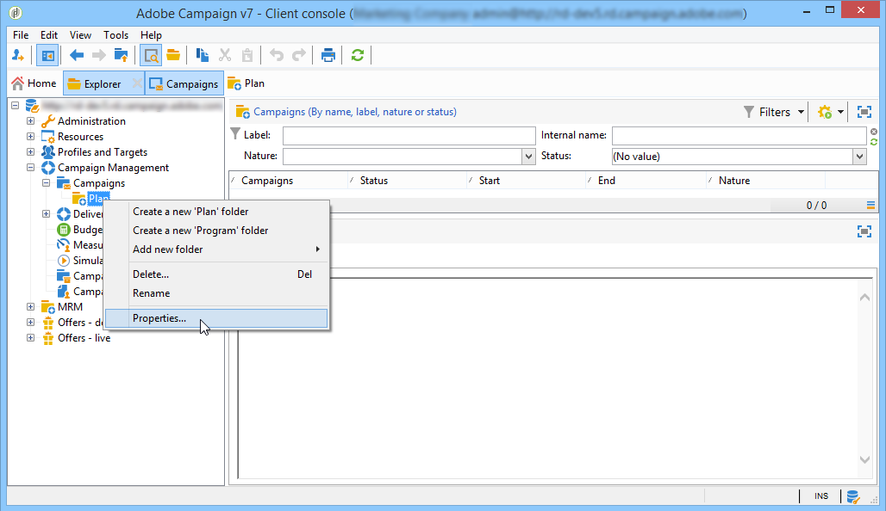
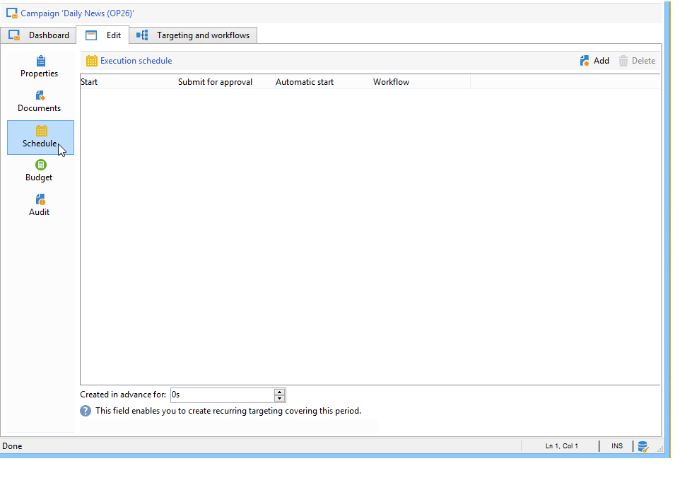

# Marketing-campagnes instellen{#setting-up-marketing-campaigns}

De campagnes omvatten acties (leveringen) en processen (het invoeren of het halen van dossiers), evenals middelen (marketing documenten, leveringsoverzichten). Ze worden gebruikt in marketingcampagnes. Campagnes maken deel uit van een programma en programma&#39;s zijn opgenomen in een campagneplan.

 Ontdek hoe u een marketingplan, programma&#39;s en campagnes kunt maken  [in video](#video)

Een marketingcampagne maken:

1. Een campagne maken: campagnes en hun kenmerken te ontdekken : label, type, begin- en einddatum, begroting, bijbehorende middelen, manager(s) en deelnemers.

   Zie [Een campagne maken](#creating-a-campaign).

1. Doelpopulatie(s) definiëren: Maak een workflow met query&#39;s als doel.

   Zie [De doelpopulatie selecteren](../../campaign/using/marketing-campaign-deliveries.md#selecting-the-target-population).

1. Leveringen maken: selecteert u kanalen en definieert u de inhoud die u wilt verzenden.

   Zie [Leveringen maken](../../campaign/using/marketing-campaign-deliveries.md#creating-deliveries).

1. Leveringen goedkeuren.

   Zie [Goedkeuringsproces](../../campaign/using/marketing-campaign-approval.md#approval-process).

1. Leveringen controleren.

   Zie [Bewaking](../../campaign/using/marketing-campaign-monitoring.md).

1. Plan campagnes en bijbehorende kosten.

   Zie [Serviceproviders en hun kostenstructuren maken](../../campaign/using/providers--stocks-and-budgets.md#creating-service-providers-and-their-cost-structures).

Wanneer deze stappen zijn voltooid, kunt u de leveringen starten (zie [Een levering starten](../../campaign/using/marketing-campaign-deliveries.md#starting-a-delivery)), de gegevens, processen en informatie met betrekking tot de leveringen controleren en, indien nodig, de bijbehorende documenten beheren (zie [Gekoppelde documenten beheren](../../campaign/using/marketing-campaign-deliveries.md#managing-associated-documents)). U kunt de uitvoering van de verwerkingsfasen van campagnes en leveringen (zie [Tracking](../../campaign/using/marketing-campaign-monitoring.md)) ook volgen.

## Plan- en programmahiërarchie {#creating-plan-and-program-hierarchy} maken

Om uw omslaghiërarchie voor marketing plannen en programma&#39;s te vormen:

1. Klik op het pictogram **Verkenner** op de startpagina.
1. Klik met de rechtermuisknop op de map waarin u het abonnement wilt maken.
1. Selecteer **Nieuwe map toevoegen > Campagnebeheer > Plan**.

   

1. Wijzig de naam van het abonnement.
1. Klik met de rechtermuisknop op het zojuist gemaakte abonnement en selecteer **Eigenschappen..**.

   

1. Wijzig op het tabblad **Algemeen** de **Interne naam** om dubbele gegevens tijdens het exporteren van pakketten te voorkomen.
1. Klik **Opslaan**.
1. Klik met de rechtermuisknop op het zojuist gemaakte abonnement en selecteer **Een nieuwe map &#39;Program&#39; maken**.
1. Herhaal bovenstaande stappen om de naam van de nieuwe programmamap en de interne naam ervan te wijzigen.

## Een campagne maken {#creating-a-campaign}

### Een campagne toevoegen {#adding-a-campaign}

U kunt een campagne maken via de lijst met campagnes. Als u deze weergave wilt weergeven, selecteert u het menu **[!UICONTROL Campaigns]** in het dashboard **[!UICONTROL Campaigns]**.

Met het veld **[!UICONTROL Program]** kunt u het programma selecteren waaraan de campagne wordt gekoppeld. Deze informatie is verplicht.

Campagnes kunnen ook worden gemaakt via een programma. Klik hiertoe op de knop **[!UICONTROL Add]** op het tabblad **[!UICONTROL Schedule]** van het betreffende programma.

Wanneer u een campagne maakt via het tabblad **[!UICONTROL Schedule]** van een programma, wordt de campagne automatisch gekoppeld aan het betreffende programma. Het veld **[!UICONTROL Program]** is in dit geval verborgen.

Selecteer in het venster Campagne maken de sjabloon voor de campagne en voeg een naam en een beschrijving van de campagne toe. U kunt ook de begin- en einddatum van de campagne opgeven.

Klik **[!UICONTROL OK]** om de campagne te creëren. Deze wordt toegevoegd aan het programma.

>[!NOTE]
>
>Als u de weer te geven campagnes wilt filteren, klikt u op de koppeling **[!UICONTROL Filter]** en selecteert u de status van de weer te geven campagnes.

### Een campagne bewerken en configureren {#editing-and-configuring-a-campaign}

U kunt dan de campagne uitgeven u enkel hebt gecreeerd en zijn parameters bepalen.

Om een campagne te openen en te vormen, selecteer het van het programma en klik **[!UICONTROL Open]**.

Hiermee gaat u naar het campagnedashboard.

## Terugkerende en periodieke campagnes {#recurring-and-periodic-campaigns}

Een terugkomende campagne is een campagne die op een specifiek malplaatje wordt gebaseerd, de waarvan werkschema&#39;s worden gevormd om volgens een bijbehorend programma worden uitgevoerd. De workflows zullen daarom terugkeren in een campagne. Het richten wordt gedupliceerd op elke uitvoering en de diverse processen en doelpopulaties worden gevolgd. Het is ook mogelijk toekomstige streefcijfers vooraf uit te voeren, via de dekkingsperiode tijdens het automatisch maken van werkstromen, om simulaties met doelramingen te starten.

Een periodieke campagne is een campagne die automatisch volgens het uitvoeringsprogramma van zijn malplaatje wordt gecreeerd.

### Een terugkerende campagne maken {#creating-a-recurring-campaign}

Herhalende campagnes worden gecreeerd van een specifiek malplaatje dat het werkschemamalplaatje bepaalt dat en het uitvoeringsplan moet worden uitgevoerd.

#### Een sjabloon maken voor terugkerende campagnes {#creating-the-campaign-template}

1. Creeer een **[!UICONTROL Recurring]** campagnemalplaatje.

   >[!NOTE]
   >
   >U wordt aangeraden de standaardsjabloon te dupliceren in plaats van een lege sjabloon te maken.

   

1. Voer de naam van de sjabloon en de duur van de campagne in.

   

1. Voor dit type campagne, wordt een **[!UICONTROL Schedule]** lusje toegevoegd om het programma van de malplaatjeuitvoering tot stand te brengen.

Geef op dit tabblad de geplande uitvoeringsdatums op voor de campagnes die op deze sjabloon zijn gebaseerd.

De configuratiewijze van het uitvoeringsprogramma valt samen met het **[!UICONTROL Scheduler]** voorwerp van het Werkschema. Raadpleeg [deze sectie](../../workflow/using/architecture.md) voor meer informatie.

>[!IMPORTANT]
>
>De het programmaconfiguratie van de uitvoering moet zorgvuldig worden uitgevoerd om het overbelasten van het gegevensbestand te vermijden. Met terugkerende campagnes worden de workflow(en) van de sjabloon gedupliceerd, afhankelijk van het opgegeven schema. De implementatie van te frequente workflowcreatie kan de werking van de database belemmeren.

1. Geef een waarde op in het veld **[!UICONTROL Create in advance for]** om de corresponderende workflows voor de aangegeven periode te maken.
1. Maak het werkstroomsjabloon dat moet worden gebruikt in campagnes op basis van deze sjabloon, met de doelparameters en een of meer generieke leveringen.

   >[!NOTE]
   >
   >Deze workflow moet worden opgeslagen als een terugkerende werkstroomsjabloon. Hiervoor bewerkt u de workfloweigenschappen en selecteert u de optie **[!UICONTROL Recurring workflow template]** op het tabblad **[!UICONTROL Execution]**.

   

#### Maak de terugkerende campagne {#create-the-recurring-campaign}

Pas de volgende procedure toe om de terugkerende campagne te maken en de workflows uit te voeren volgens het schema dat in de sjabloon is gedefinieerd:

1. Creeer een nieuwe campagne die op een terugkomende campagnemalplaatje wordt gebaseerd.
1. Vul het schema voor workflowuitvoering in.

   

1. In het campagnereschema kunt u voor elke regel een automatische begindatum voor het maken of uitvoeren van de workflow invoeren.

   Voor elke regel kunt u de volgende aanvullende opties toevoegen:

   * **[!UICONTROL To be approved]** : Hiermee kunt u de goedkeuringsaanvragen voor levering afdwingen in de workflow.
   * **[!UICONTROL To be started]** : Hiermee kunt u de workflow starten wanneer de begindatum is bereikt.

   Met het veld **[!UICONTROL Create in advance for]** kunt u alle workflows maken die de ingevoerde periode beslaan.

   Na uitvoering van de **[!UICONTROL Jobs on campaigns]**-workflow worden de toegewezen workflows gemaakt op basis van de voorvallen die in het campagnereschema zijn gedefinieerd. Op deze manier wordt voor elke uitvoeringsdatum een workflow gemaakt.

1. De terugkomende werkschema&#39;s worden gecreeerd automatisch van het werkschemamalplaatje huidig in de campagne. Ze zijn zichtbaar vanaf het tabblad **[!UICONTROL Targeting and workflows]** van de campagne.

   

   Het label van een terugkerende werkstroominstantie bestaat uit zijn malplaatjelabel en het werkschemanummer, met # karakter binnen tussen.

   Workflows die zijn gemaakt op basis van het schema, worden automatisch hieraan gekoppeld in de kolom **[!UICONTROL Workflow]** van het tabblad **[!UICONTROL Schedule]**.

   

   Elke workflow kan op dit tabblad worden bewerkt.

   

   >[!NOTE]
   >
   >De begindatum van de aan de workflow gekoppelde planningsregel is beschikbaar in een variabele van de workflow met de volgende syntaxis:\
   >`$date(instance/vars/@startPlanningDate)`

### Een periodieke campagne maken {#creating-a-periodic-campaign}

Een periodieke campagne is een campagne die op een specifiek malplaatje wordt gebaseerd dat u campagneinstanties laat tot stand brengen die op een uitvoeringsprogramma worden gebaseerd. Campagneinstanties worden automatisch gemaakt op basis van een periodiek campagnemalplaatje, afhankelijk van de frequentie die in het sjabloonprogramma is gedefinieerd.

#### Het creëren van het campagnemalplaatje {#creating-the-campaign-template-1}

1. Creeer een **[!UICONTROL Periodic]** campagnemalplaatje, bij voorkeur door een bestaand campagnemalplaatje te dupliceren.

   

1. Voer de eigenschappen van de sjabloon in.

   >[!NOTE]
   >
   >De exploitant aan wie het malplaatje wordt toegewezen moet de aangewezen rechten hebben om campagnes in het geselecteerde programma tot stand te brengen.

1. Maak de workflow die aan deze sjabloon is gekoppeld. Het zal in elke periodieke campagne worden gedupliceerd die door het malplaatje wordt gecreeerd.

   

   >[!NOTE]
   >
   >Deze workflow is een werkstroomsjabloon. Deze kan niet worden uitgevoerd vanuit de campagnemalplaatje.

1. Voltooi zijn uitvoeringsprogramma zoals voor een terugkomende campagnemalplaatje: Klik op de knop **[!UICONTROL Add]** en definieer de begin- en einddatum of vul het uitvoeringsschema in via de koppeling.

   

   >[!IMPORTANT]
   >
   >De periodieke campagnemalplaatjes creëren nieuwe campagnes volgens het hierboven bepaalde programma. Het moet daarom zorgvuldig worden afgerond om overbelasting van de Adobe Campaign-databank te voorkomen.

1. Wanneer de begindatum van de uitvoering is bereikt, wordt de overeenkomende campagne automatisch gemaakt. Het neemt alle kenmerken van zijn malplaatje over.

   Elke campagne kan via het sjabloonprogramma worden bewerkt.

   

Elke periodieke campagne bevat dezelfde elementen. Zodra gecreeerd, wordt het beheerd als standaardcampagne.

## Video over zelfstudie {#video}

In deze video ziet u hoe u een marketingplan, programma&#39;s en campagnes kunt maken.

>[!VIDEO](https://video.tv.adobe.com/v/35132?quality=12)

Er zijn [hier](https://experienceleague.adobe.com/docs/campaign-classic-learn/tutorials/overview.html?lang=nl) extra Campaign Classic hoe kan ik-video&#39;s beschikbaar.
