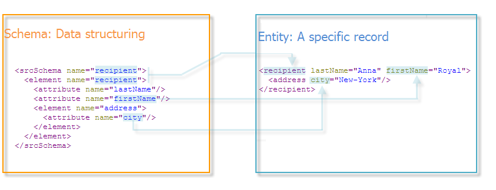

# Schema-verwijzing{#about-schema-reference}

In dit hoofdstuk wordt beschreven hoe u extensieschema&#39;s configureert om het conceptuele gegevensmodel van de Adobe Campagne-database uit te breiden.

Voor een beter inzicht in de ingebouwde lijsten van de Campagne en hun interactie, verwijs naar het Klassieke gegevensmodel [van de](https://helpx.adobe.com/campaign/kb/acc-datamodel.html)Campagne.

De fysieke en logische structuur van de gegevens die in de toepassing worden overgedragen, wordt in XML beschreven. Het voert een grammatica specifiek voor de Campagne van Adobe uit, genoemd een **schema**.

Een schema is een XML-document dat is gekoppeld aan een databasetabel. De code definieert de gegevensstructuur en beschrijft de SQL-definitie van de tabel:

* De naam van de tabel
* Velden
* Indexen
* Koppelingen met andere tabellen

Hierin wordt ook de XML-structuur beschreven die wordt gebruikt om gegevens op te slaan:

* Elementen en kenmerken
* Hiërarchie van elementen
* Element- en kenmerktypen
* Standaardwaarden
* Labels, beschrijvingen en andere eigenschappen.

Met schema&#39;s kunt u een entiteit in de database definiëren. Er is een schema voor elke entiteit.

In de volgende afbeelding ziet u de locatie van schema&#39;s in het Adobe Campagne-gegevenssysteem:


## Syntaxis van schema&#39;s {#syntax-of-schemas}

Het hoofdelement van het schema is **`<srcschema>`**. Het bevat de ** **`<element>`** en **`<attribute>`** subelementen.

Het eerste **`<element>`** subelement valt samen met de hoofdmap van de entiteit.

```
<srcSchema name="recipient" namespace="cus">
  <element name="recipient">  
    <attribute name="lastName"/>
    <attribute name="email"/>
    <element name="location">
      <attribute name="city"/>
   </element>
  </element>
</srcSchema>
```

>[!NOTE]
>
>Het hoofdelement van de entiteit heeft dezelfde naam als het schema.



De **`<element>`** tags definiëren de namen van entiteitselementen. **`<attribute>`** tags in het schema de namen definiëren van de kenmerken in de **`<element>`** tags waaraan ze zijn gekoppeld.

## Identificatie van een schema {#identification-of-a-schema}

Een gegevensschema wordt geïdentificeerd door zijn naam en zijn namespace.

Met een naamruimte kunt u een set schema&#39;s groeperen op interessegebied. Bijvoorbeeld, wordt **concentraat** namespace gebruikt voor klant-specifieke configuratie (**klanten**).

>[!CAUTION]
>
>Standaard moet de naam van de naamruimte beknopt zijn en alleen toegestane tekens bevatten, in overeenstemming met XML-naamgevingsregels.
>
>Id&#39;s mogen niet beginnen met numerieke tekens.

Bepaalde naamruimten zijn gereserveerd voor beschrijvingen van de systeementiteiten die vereist zijn voor de werking van de Adobe Campagne-toepassing:

* **xtk**: met betrekking tot platformsysteemgegevens,
* **nl**: betreffende het algemene gebruik van de aanvraag,
* **nms**: wat de levering betreft (ontvanger, levering, tracking, enz.),
* **ncm**: met betrekking tot inhoudsbeheer,
* **temp**: gereserveerd voor tijdelijke regelingen.

De identificatiesleutel van een schema is een tekenreeks die is opgebouwd met behulp van de naamruimte en de naam gescheiden door een dubbele punt. bijvoorbeeld: **focus:ontvanger**.
