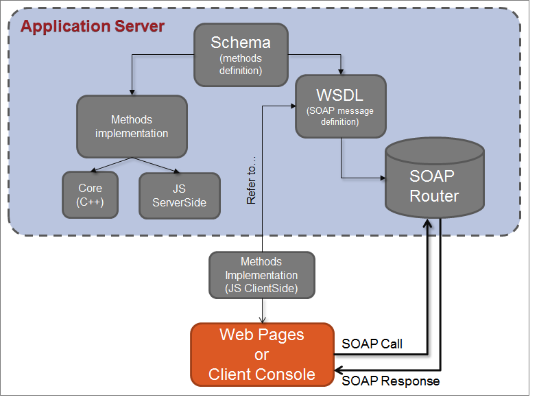

# Webservices{#about-web-services}

## Definitie van Adobe Campagne-API&#39;s {#definition-of-adobe-campaign-apis}

De toepassingsserver van de Campagne van Adobe werd ontworpen voor openheid en gemakkelijke integratie met meer en meer diverse en complexe bedrijfsinformatiesystemen.

Adobe Campagne-API&#39;s worden gebruikt in JavaScript binnen de toepassing en in SOAP buiten de toepassing. Ze vormen een bibliotheek van algemene functies die kunnen worden verrijkt. Zie [SOAP-methoden](../../configuration/using/implementing-soap-methods.md)implementeren voor meer informatie.

>[!CAUTION]
>
>Het aantal geoorloofde Vraag van de Motor varieert per dag op uw vergunningscontract. Raadpleeg [deze pagina](https://helpx.adobe.com/legal/product-descriptions/adobe-campaign-classic---product-description.html)voor meer informatie.\
>In [deze specifieke documentatie](https://docs.campaign.adobe.com/doc/AC/en/jsapi/index.html)vindt u een lijst met alle API&#39;s, inclusief de volledige beschrijving ervan.

## Vereisten {#prerequisites}

Voordat u de Adobe Campagne-API&#39;s kunt gebruiken, moet u vertrouwd zijn met de volgende onderwerpen:

* Javascript
* SOAP-protocol
* Adobe Campaign datamodel

## Adobe Campagne-API&#39;s gebruiken {#using-adobe-campaign-apis}

Adobe Campaign gebruikt twee typen API&#39;s:

* Algemene gegevens krijgen toegang tot API&#39;s voor het opvragen van gegevens in het datamodel. Zie API&#39;s [die zijn gericht op gegevens](../../configuration/using/data-oriented-apis.md).
* Bedrijfs specifieke APIs die u op elk voorwerp laten handelen: leveringen, workflows, abonnementen, enz. Raadpleeg de [bedrijfsgerichte API&#39;s](../../configuration/using/business-oriented-apis.md).

Als u API&#39;s wilt ontwikkelen en wilt communiceren met Adobe Campaign, moet u bekend zijn met uw datamodel. Met Adobe Campaign kunt u een volledige beschrijving van de basis genereren. Zie de [beschrijving van het model](../../configuration/using/data-oriented-apis.md#description-of-the-model).

## SOAP-aanroepen {#soap-calls}

Het protocol van de ZEEP laat u API methodes, via de rijke cliënt, derdetoepassingen aanhalen gebruikend webservices, of JSP gebruikend deze methodes.


De structuur van een SOAP-bericht is als volgt:

* een omhulsel dat de structuur van het bericht aangeeft;
* een optionele koptekst,
* een instantie die de informatie over de oproep en de reactie bevat;
* foutbeheer dat de foutvoorwaarde definieert.

## Middelen en uitwisselingen {#resources-and-exchanges}

In het volgende schema ziet u de verschillende bronnen die betrokken zijn bij het gebruik van de Adobe Campagne-API&#39;s:



## Voorbeeld van een SOAP-bericht bij de methode &#39;ExecuteQuery&#39; {#example-of-a-soap-message-on-the--executequery--method--}

In dit voorbeeld, roept een vraag van de ZEEP de &quot;ExecuteQuery&quot;methode aan, die een karakterkoord als parameter voor authentificatie (zittingsteken) en een inhoud van XML voor de beschrijving van de uit te voeren vraag neemt.

Zie [ExecuteQuery (xtk:queryDef)](../../configuration/using/data-oriented-apis.md#executequery--xtk-querydef-)voor meer informatie.

>[!NOTE]
>
>De beschrijving van WSDL van deze dienst wordt voltooid in het hier getoonde voorbeeld: Beschrijving [webservice: WSDL](../../configuration/using/web-service-calls.md#web-service-description--wsdl).

### SOAP-query {#soap-query}

```
<?xml version='1.0' encoding='ISO-8859-1'?>
  <SOAP-ENV:Envelope xmlns:xsd='http://www.w3.org/2001/XMLSchema' xmlns:xsi='http://www.w3.org/2001/XMLSchema-instance' xmlns:ns='http://xml.apache.org/xml-soap' xmlns:SOAP-ENV='http://schemas.xmlsoap.org/soap/envelope/'>
    <SOAP-ENV:Body>
      <ExecuteQuery xmlns='urn:xtk:queryDef' SOAP-ENV:encodingStyle='http://schemas.xmlsoap.org/soap/encoding/'>
        <__sessiontoken xsi:type='xsd:string'/>
        <entity xsi:type='ns:Element' SOAP-ENV:encodingStyle='http://xml.apache.org/xml-soap/literalxml'>
          <queryDef firstRows="true" lineCount="200" operation="select" schema="nms:rcpGrpRel" startLine="0" startPath="/" xtkschema="xtk:queryDef">
          ...
          </queryDef>
        </entity>
      </ExecuteQuery>
  </SOAP-ENV:Body>
</SOAP-ENV:Envelope>
```

Het `<soap-env:envelope>` element is het eerste element van het bericht dat de envelop van de ZEEP vertegenwoordigt.

Het `<soap-env:body>` element is het eerste onderliggende element van de omhulling. Het bevat de beschrijving van het bericht, d.w.z. de inhoud van de vraag of de reactie.

De methode die moet worden aangeroepen, wordt in het `<executequery>` element ingevoerd vanuit de hoofdtekst van het SOAP-bericht.

In SOAP worden de parameters op volgorde van weergave herkend. De eerste parameter, `<__sessiontoken>`, neemt de authentificatieketen, de tweede parameter is de beschrijving van XML van de vraag van het `<querydef>` element.

### SOAP-reactie {#soap-response}

```
<?xml version='1.0' encoding='ISO-8859-1'?>
  <SOAP-ENV:Envelope xmlns:xsd='http://www.w3.org/2001/XMLSchema' xmlns:xsi='http://www.w3.org/2001/XMLSchema-instance' xmlns:ns='http://xml.apache.org/xml-soap' xmlns:SOAP-ENV='http://schemas.xmlsoap.org/soap/envelope/'>
    <SOAP-ENV:Body>
      <ExecuteQueryResponse xmlns='urn:xtk:queryDef' SOAP-ENV:encodingStyle='http://schemas.xmlsoap.org/soap/encoding/'>
        <pdomOutput xsi:type='ns:Element' SOAP-ENV:encodingStyle='http://xml.apache.org/xml-soap/literalxml'>
          <rcpGrpRel-collection><rcpGrpRel group-id="1872" recipient-id="1362"></rcpGrpRel></rcpGrpRel-collection>
        </pdomOutput>
      </ExecuteQueryResponse>
    </SOAP-ENV:Body>
</SOAP-ENV:Envelope>
```

Het resultaat van de query wordt ingevoerd vanuit het `<pdomoutput>` element.

## Foutbeheer {#error-management}

Voorbeeld van reactie SOAP-fout:

```
<?xml version='1.0' encoding='ISO-8859-1'?>
<SOAP-ENV:Envelope xmlns:SOAP-ENV='http://schemas.xmlsoap.org/soap/envelope/'>
  <SOAP-ENV:Body>
    <SOAP-ENV:Fault>
      <faultcode>SOAP-ENV:Server</faultcode>
      <faultstring>Error while executing 'Write' of the 'xtk:persist'.</faultstring> service
      <detail>ODBC error: [Microsoft][ODBC SQL Server Driver][SQL Server]Cannot insert duplicate key row in object 'XtkOption' with unique index 'XtkOption_name'. SQLSTate: 23000
ODBC error: [Microsoft][ODBC SQL Server Driver][SQL Server]The statement has been terminated. SQLSTate: 01000 Cannot save the 'Options (xtk:option)' document </detail>
    </SOAP-ENV:Fault>
  </SOAP-ENV:Body>
</SOAP-ENV:Envelope>
```

Het `<soap-env:fault>` element in het lichaam van het bericht van de ZEEP wordt gebruikt om de foutensignalen over te brengen die tijdens de verwerking van de dienst van het Web voortkomen. Dit bestaat uit de volgende subelementen:

* `<faultcode>` : Hiermee wordt het type fout aangegeven. De fouttypen zijn:

   * &quot;VersionMismatch&quot; in geval van incompatibiliteit met de gebruikte SOAP-versie,
   * &quot;MustUnderstanding&quot; in geval van een probleem in de berichtkopbal,
   * &quot;Client&quot; in het geval dat de client enige informatie mist,
   * &quot;Server&quot; in het geval dat de server een probleem heeft met het uitvoeren van de verwerking.

* `<faultstring>` : bericht waarin de fout wordt beschreven
* `<detail>` : lang foutbericht

Het succes of de mislukking van de de dienstaanroeping wordt geïdentificeerd wanneer het `<faultcode>` element wordt geverifieerd.

>[!CAUTION]
>
>Alle Adobe Campagne-webservices verwerken fouten. Daarom wordt sterk geadviseerd om elke vraag te testen om teruggekeerde fouten te behandelen.

Voorbeeld van foutafhandeling in C#:

```
try 
{
  // Invocation of method
  ...
}
catch (SoapException e)
{
  System.Console.WriteLine("Soap exception: " + e.Message);        
  if (e.Detail != null)
    System.Console.WriteLine(e.Detail.InnerText);
}
```

## URL van de de dienstserver van het Web (of EndPoint) {#url-of-web-service-server--or-endpoint-}

Om de dienst van het Web voor te leggen, moet de server van de Campagne van Adobe die de overeenkomstige de dienstmethode uitvoert worden gecontacteerd.

De server-URL is als volgt:

[https://`<server>`/nl/jsp/soaprouter.jsp`](https://XXXX//nl/jsp/soaprouter.jsp)

Met **`<server>`** de toepassingsserver van de Campagne van Adobe (**nlserver Web**).
