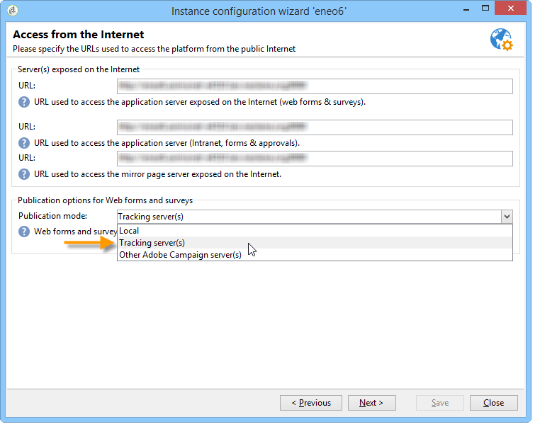

# Anonieme tracking{#anonymous-tracking}

Met Adobe Campaign kunt u verzamelde webtraceringsgegevens koppelen aan een ontvanger wanneer deze anoniem door uw site bladert. Wanneer een gebruiker door de gelabelde pagina&#39;s van uw website bladert, worden deze bladergegevens verzameld, zodat deze worden geïdentificeerd en de informatie automatisch wordt gekoppeld aan de pagina&#39;s nadat de gebruiker in een e-mailbericht van Adobe Campaign heeft geklikt.

>[!IMPORTANT]
>
>Door anonieme tracering op een website in te stellen, kan de verzameling van een aanzienlijke hoeveelheid trackinglogbestanden worden geactiveerd, wat invloed heeft op de databasebewerking. Configureer het voorzichtig.\
>Logbestanden voor bijhouden worden opgeslagen in de database totdat de gegevens voor bijhouden zijn gewist. Gebruik de plaatsingstovenaar om de purgefrequentie te vormen. Zie [deze sectie](../../installation/using/deploying-an-instance.md#purging-data)voor meer informatie.

Om anonieme het volgen van het Web op uw instantie toe te laten, moeten de volgende elementen worden gevormd:

* De parameter **trackWebVisitors** van het **omleidingselement** van het **serverConf.xml** - dossier van de volgende server moet aan &quot;**waar**&quot;worden geplaatst, om een permanent koekje (**uuid230**) in browsers van onbekende internetgebruikers te plaatsen die de plaats bezoeken.
* De **Anonieme wijze van het Volgen** van het Web moet in het volgende configuratiescherm van de plaatsingstovenaar worden geselecteerd.

   

* Webformulieren en enquêtes moeten worden gepubliceerd en uitgevoerd op de trackingserver. De passende optie moet in de plaatsingstovenaar worden geselecteerd.

   

