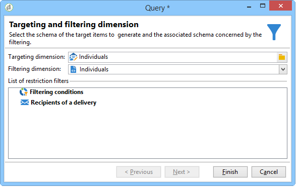
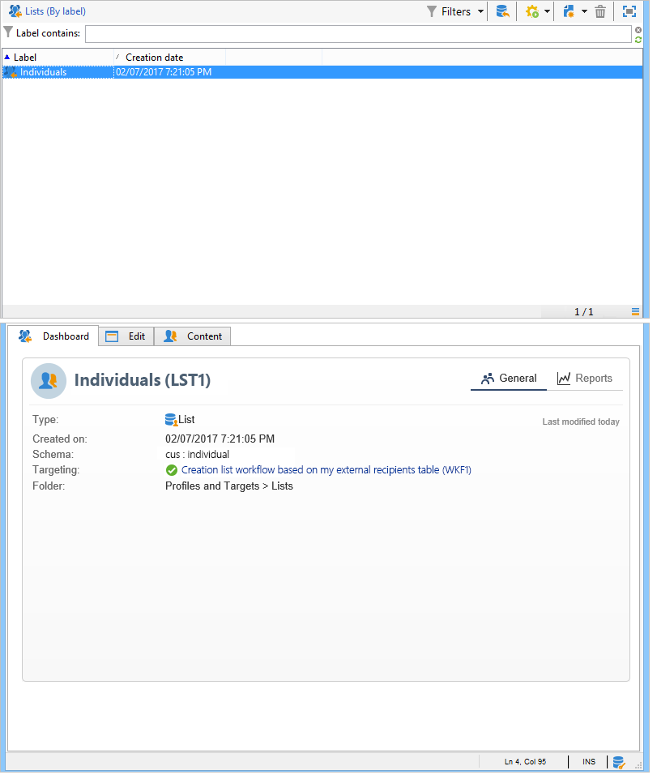

# Een profiellijst maken met een workflow{#creating-a-profile-list-with-a-workflow}

Als u een **[!UICONTROL List]** typelijst wilt maken op basis van de nieuwe tabel voor ontvangers, moet u een doelworkflow maken die de lijst genereert. Raadpleeg [deze sectie](../../platform/using/creating-and-managing-lists.md#about-lists-in-adobe-campaign)voor meer informatie over lijsten in Campagne.

1. Ga naar het **[!UICONTROL Profiles and Targets > Jobs > Targeting workflows]** knooppunt van de verkenner.
1. Maak een nieuwe doelworkflow.
1. Plaats een activiteit van de **Vraag** die door een de updateactiviteit **van de** Lijst wordt gevolgd.

   

1. Dubbelklik op de activiteit **Query** en klik vervolgens **[!UICONTROL Edit the query]** om een doeldimensie te kiezen op basis van het schema van de nieuwe tabel voor ontvangers (in ons voorbeeld: **Individueel**). Klik **[!UICONTROL Finish]** om te bevestigen.

   

1. Dubbelklik op de **List-updateactiviteit** en selecteer vervolgens het **[!UICONTROL Create the list if necessary (Computed name)]** keuzerondje.

   

1. Selecteer de aanmaakmap voor de nieuwe lijst.
1. Voer de workflow uit om de lijst te maken.
1. Bekijk het resultaat in de knoop van de boom die u tijdens de **[!UICONTROL List update]** activiteit selecteerde.

   Het dashboard specificeert het schema waarop de lijst gebaseerd is, zoals hieronder getoond:

   

>[!NOTE]
>
>U kunt ook naar de video [Een lijst met ontvangers](https://docs.adobe.com/content/help/en/campaign-learn/campaign-classic-tutorials/getting-started/creating-a-list-of-recipients.html) maken verwijzen.

