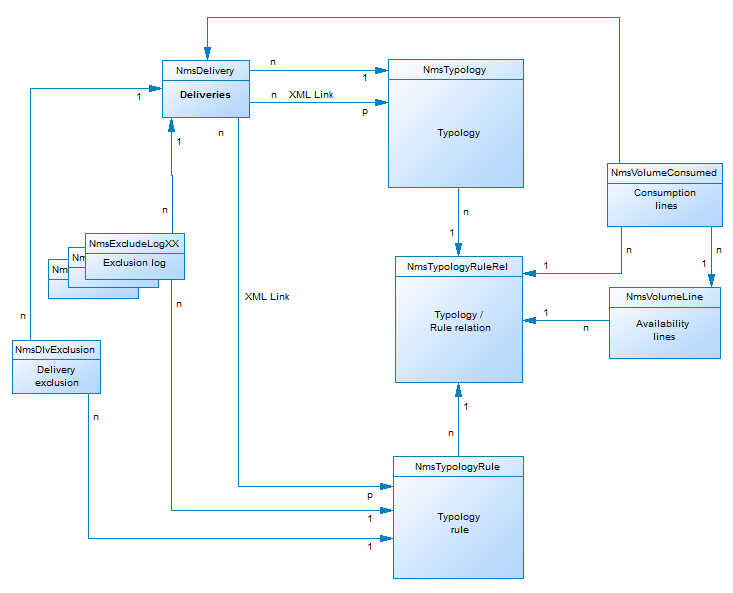

# Beschrijving van gegevensmodel campagne{#data-model-description}

Adobe Campagne wordt geleverd met een vooraf gedefinieerd gegevensmodel. In deze sectie vindt u een aantal details over de ingebouwde tabellen van het gegevensmodel van de campagne en de interactie ervan.

Om tot de beschrijving van elke lijst toegang te hebben, ga naar **[!UICONTROL Admin > Configuration > Data schemas]**, selecteer een middel van de lijst en klik de **[!UICONTROL Documentation]** tabel.

>[!NOTE]
>
>De fysieke en logische structuur van de gegevens die in de toepassing worden overgedragen, wordt in XML beschreven. Het voert een grammatica specifiek voor de Campagne van Adobe uit, genoemd een schema. Lees deze [sectie](../../configuration/using/about-schema-reference.md)voor meer informatie over Adobe Campagne-schema&#39;s.

## Beschrijving van de belangrijkste tabellen {#description-main-tables}

Adobe Campaign is gebaseerd op een relationele database die tabellen bevat die aan elkaar zijn gekoppeld.

In het volgende diagram ziet u de verbindingen tussen de belangrijkste bedrijfstabellen van het gegevensmodel van de campagne van Adobe met de hoofdvelden voor elk.

<!---->

Het vooraf gedefinieerde Adobe Campagne-gegevensmodel bevat de onderstaande hoofdtabellen.

### NmsRecipient {#NmsRecipient}

Deze tabel komt overeen met het schema **nms:ontvanger** .

Dit is de standaardtabel die wordt gebruikt voor de **ontvangers van leveringen**. Bijgevolg bevat het de informatie die nodig is voor leveringen via de verschillende kanalen:

* sEmail: e-mailadres.
* iEmailFormat: voorkeursindeling voor e-mailberichten (1 voor tekst, 2 voor HTML en 0 als deze niet gedefinieerd zijn).
* sAddress1, sAddress2, sAddress3, sAddress4, sZipCode, sCity wordt gebruikt om het postadres te bouwen (in overeenstemming met de norm XPZ 10-011 AFNOR van Mei 1997).
* sPhone, sMobilePhone en sFax bevatten respectievelijk de telefoon-, mobiele telefoon- en faxnummers.
* iBlackList is de standaardmarkering voor niet-deelname die wordt gebruikt voor de profielen (1 betekent &quot;niet-geabonneerd&quot;, anders 0).

Het veld iFolderId is de externe sleutel die de ontvanger aan zijn uitvoeringsmap koppelt. Zie [XtkFolder](#XtkFolder)voor meer informatie.

Het veld sCountryCode is de ISO-code 3166-1 Alpha 2 (2 tekens) van het land dat aan de ontvanger is gekoppeld. Dit veld is in feite een buitenlandse sleutel in de referentietabel van het land (NmsCountry), die de landlabels en andere landcodegegevens bevat. Als het land niet is gevuld, wordt de waarde &#39;XX&#39; opgeslagen (en wordt gebruikt in plaats van een nul-id-record).

Zie deze [sectie](../../configuration/using/about-data-model.md#default-recipient-table)voor meer informatie over de tabel Ontvanger.

### NmsGroup {#NmsGroup}

Deze tabel komt overeen met het schema **nms:group** .

Hiermee kunt u **statische groepen ontvangers** maken. Er is een veel-op-veel relatie tussen ontvangers en groepen. Eén ontvanger kan bijvoorbeeld tot meerdere groepen behoren en één groep kan meerdere ontvangers bevatten. Groepen kunnen handmatig worden gemaakt, via import of levering als doel. Groepen worden vaak gebruikt als leveringsdoelen. Er is een unieke index op het gebied die de interne naam van de sName groep vertegenwoordigt. De groep is gekoppeld aan een map (de sleutel is iFolderId. Zie [XtkFolder](#XtkFolder)voor meer informatie hierover.

### NmsRcpGrpRel {#NmsRcpGrpRel}

De NmsRcpGrpRel-relatietabel bevat alleen de twee velden die overeenkomen met de id&#39;s van de gekoppelde tabellen iRecipientId en iGroupId.

### NmsService {#NmsService}

Deze tabel komt overeen met het **nms:service** -schema.

De diensten zijn entiteiten die aan groepen (statische ontvankelijke groeperingen) gelijkaardig zijn, behalve dat zij meer informatie verspreiden en gemakkelijke beheer van abonnementen en abonnementen via vormen toelaten.

Er is een unieke index op het gebied die de interne naam van de dienst sName vertegenwoordigt. De service is gekoppeld aan een map (de sleutel is iFolderId. Zie [XtkFolder](#XtkFolder)voor meer informatie hierover. Tot slot specificeert het iType gebied het leveringskanaal van deze dienst (0 voor e-mail, 1 voor SMS, 2 voor telefoon, 3 voor directe post en 4 voor fax).

### NmsSubscription {#NmsSubscription}

Deze tabel komt overeen met het schema **nms:abonnement** .

Het laat u toe om ontvankelijke abonnementen aan informatiediensten te beheren.

### NmsSubHisto {#NmsSubHisto}

Deze tabel komt overeen met het schema **nms:subHisto** .

Als de abonnementen worden beheerd met behulp van webformulieren of de interface van de toepassing, worden alle abonnementen en aftekeningen in de tabel NmsSubHisto gehistoriseerd. In het veld iAction wordt de handeling (0 voor abonnement en 1 voor abonnement) opgegeven die wordt uitgevoerd op de datum die is opgeslagen in het veld tsDate.

### NmsDelivery {#NmsDelivery}

Deze tabel komt overeen met het **nms:leveringsschema** .

Elke record in deze tabel vertegenwoordigt een **leveringsactie** of een **leveringssjabloon**. Het bevat alle parameters die nodig zijn voor het uitvoeren van leveringen (doel, inhoud, enz.). Logboeken voor levering (uitzending) (NmsBroadLog) en bijbehorende URL&#39;s voor tracering (NmsTrackingUrl) worden tijdens de analysefase gemaakt (zie hieronder voor meer informatie over beide tabellen).

Er is een unieke index op het gebied die de interne naam van de levering sInternalName of het scenario vertegenwoordigt. De levering is gekoppeld aan een uitvoeringsmap (de externe sleutel is iFolderProcessId. Zie [XtkFolder](#XtkFolder)voor meer informatie hierover.

### XtkFolder {#XtkFolder}

Het bevat **alle omslagen in de boom** zichtbaar op het lusje van de **Navigatie** van de console.

De mappen worden getypt: De waarde van het veld sModel geeft het type gegevens aan dat in de map kan worden opgenomen. Met dit veld kan de clientconsole de gegevens ook correct weergeven met de bijbehorende formulieren. De mogelijke waarden voor dit veld worden gedefinieerd in de navTree.

De structuur wordt beheerd door de velden iParentId en iChildCount. Het veld sFullName geeft het volledige pad van de map in de structuur. Tot slot is er een unieke index op het gebied die de interne naam van de sName omslag vertegenwoordigt.

## Aflevering en tekstspatiëring {#delivery-and-tracking}

Deze reeks lijsten is verbonden met de module van de **Levering** , die toestaat om leveringen en uiteindelijke kwesties te controleren die wanneer de berichten worden verzonden worden ontmoet. Zie [Leveringen](../../delivery/using/monitoring-a-delivery.md)controleren voor meer informatie. Zie [Trackingberichten](../../delivery/using/about-message-tracking.md)voor meer informatie over bijhouden.

**NmsBroadLogMsg**: Deze tabel komt overeen met het schema **nms:wideLogMsg** . Het is een uitbreiding van de lijst van het leveringslogboek.

## Campagnebeheer {#campaign-management}

Deze reeks lijsten is verbonden met de module van de **Marketing campagnes** , die toestaat om mededelingen en marketing campagnes te bepalen, te optimaliseren, uit te voeren en te analyseren. Zie [Informatie over marketingcampagnes](../../campaign/using/designing-marketing-campaigns.md)voor meer informatie.

* **NmsOperation**: Deze tabel komt overeen met het **nms:bewerkingsschema** . Het bevat de gegevens van marketingcampagnes.
* **NmsDeliveryOutline**: Deze tabel komt overeen met het schema **nms:deliveryOutline** . Het bevat de uitgebreide eigenschappen van de levering (leveringsoverzicht).
* **NmsDlvOutlineItem**: Deze tabel komt overeen met het schema **nms:dlvOutlineItem** . Het bevat de artikelen van een leveringsoverzicht.
* **NmsDeliveryCustomization**: Deze lijst past nms aan:deliveryCustomization **** schema. Het bevat de verpersoonlijkingsgebieden van een levering.
* **NmsBudget**: Deze tabel komt overeen met het schema **nms:budget** . Het bevat de gegevens van een begroting over een campagne, een plan, een programma, een taak en/of leveringen.
* **NmsDocument**: Deze tabel komt overeen met het **nms:documentschema** . Het bevat de marketingdocumenten van de campagne in de vorm van bestanden (afbeeldingen, excel- of woordbestanden, enz.)
* **XtkWorkflow**: Deze tabel komt overeen met het schema **xtk:workflow** . Het bevat campagnedoel.
* **NmsTask**: Deze tabel komt overeen met het **nms:taakschema** . Het bevat de definitie van een marketingtaak.
* **NmsAsset**: Deze tabel komt overeen met het schema **nms:asset** . Het bevat de definitie van een marketingmiddel.

## Communicatieconsistentie {#communication-consistency}

Deze reeks lijsten is verbonden met de module van de Optimalisering **van de** Campagne, die toestaat om het verzenden van leveringen te controleren, te filtreren en te controleren. Zie [Informatie over campagnetypologieën](../../campaign/using/about-campaign-typologies.md)voor meer informatie.

* **NmsTypologyRule**: Deze tabel komt overeen met het schema **nms:typologyRule** . Het bevat de regels die van toepassing zijn op leveringen afhankelijk van typologieën.
* **NmsTypologie**: Deze tabel komt overeen met het schema **nms:typologie** . Het bevat de regels die moeten worden toegepast op leveringen die overeenkomen met de typologie.
* **NmsTypologyRuleRel**: Deze tabel komt overeen met het schema **nms:typologyRuleRel** . Het bevat de relaties tussen typologieën en hun regels.
* **NmsVolumeLine**: Deze tabel komt overeen met het schema **nms:volumeLine** . Het bevat de reeks beschikbaarheidslijnen van de capaciteitsregels.
* **NmsVolumeConsumed**: Deze tabel komt overeen met het schema **nms:volumeConsumed** . Het bevat alle verbruikslijnen van de capaciteitsregels.

## Responsbeheer {#response-management}

Deze reeks lijsten is verbonden met de module van de Manager **van de** Reactie, die toestaat om het succes en de rentabiliteit van marketing campagnes te meten of voorstellen voor alle communicatie kanalen aan te bieden. Zie [Informatie over responsbeheer](../../campaign/using/about-response-manager.md)voor meer informatie.

### NmsRemaHypothesis {#NmsRemaHypothesis}

Deze tabel valt samen met het schema **nms:remaHypothesis** . Het bevat de definitie van de meethypothese.

Deze tabel bevat belangrijke informatie die is opgeslagen in XML, zoals:

**Uitvoercontext (informatie opgeslagen in XML)**

De uitvoeringscontext vult de tabellen en velden die in aanmerking moeten worden genomen voor de meetberekening, namelijk:
* Het opslagschema van het nms:remaMatchRcp-reactielogbestand.
* Het schema van de transactietabel (aankopen bijvoorbeeld).
* Het vraagschema, dat u toelaat om de beginlijst van de hypothesevoorwaarden te bepalen.
* De verbindingen met individuen, die u toelaten om het individu te identificeren dat op het het vragen schema wordt gebaseerd.
* De transactiedatum. Dit veld is niet verplicht, maar u wordt aangeraden het te gebruiken om de omtrek van de berekening te beperken.
* Het transactiebedrag: het is een facultatief veld voor de automatische berekening van inkomstenindicatoren .

**Hypothese-omtrek (informatie opgeslagen in XML)**

De perimeter van de hypothese bestaat uit het filtreren van de hypothese die op de lijst van het het vragen schema wordt gebaseerd.

**Hypothesis overload-script (informatie opgeslagen in XML)**

Het hypotheseoverbelastingsscript is een JavaScript-code waarmee u de inhoud van de hypothese tijdens de uitvoering kunt overladen.

**Meetindicatoren**

De volgende indicatoren worden automatisch bijgewerkt tijdens de uitvoering van de hypothese:

* Aantal reacties: **iTransaction**. Aantal lijnen in de lijst van reactielogboeken.
* Aantal gecontacteerde personen: **iContactReactie**. Afzonderlijk aantal gerichte contacten in de hypothese.
* Aantal controlegroepen: **iProofReactie**. Afzonderlijk aantal gerichte contacten tussen controlegroepen in de hypothese.
* Behandelde responspercentage: **dContactReactieRate**. Responspercentage van de gerichte contacten in de hypothese.
* Responspercentage van de controlegroep: **dProofReactieRate**. Responspercentage van de hypothesecontrolegroep.
* Totale gecontacteerde inkomsten van de bevolking: **dContactRehandeldeTotalAmount**. Totale inkomsten van de gerichte contacten in de hypothese.
* Gemiddelde inkomsten van de controlegroep: **dContactRehandeldeAvgAmount**. Gemiddelde inkomsten van de doelgroep contacten in de hypothese.
* Totale ontvangsten van de controlegroep: **dProofReactieTotalAmount**. Totale inkomsten van de groep hypothesecontrole.
* Gemiddelde inkomsten van de controlegroep: **dProofReactieAvgAmount**. Gemiddelde inkomsten van de hypothesecontrolegroep.
* Totale marge per contactpersoon: **dContactRehandeldeTotalMargin**. Totale marge per contact als bedoeld in de hypothese.
* Gemiddelde marge per contact: **dContactRehandeldeAvgMargin**. Gemiddelde marge per contact als bedoeld in de hypothese.
* Totale marge van de controlegroep: **dProofReactieTotalMargin**. Totale marge van de in de hypothese beoogde controlegroep.
* Gemiddelde marge van de controlegroep: **dProofReactieAvgMargin**. Gemiddelde marge van de in de hypothese beoogde controlegroep.
* Aanvullende inkomsten: **dAdditionalAmount**. (Gemiddelde inkomsten van gecontacteerde onderneming - Gemiddelde inkomsten van de controlegroep) * Aantal gecontacteerde partijen.
* Aanvullende marge: **dAdditionalMargin**. (Gemiddelde marge van gecontacteerde partij - Gemiddelde marge van controlegroep) / Aantal gecontacteerde personen.
* Gemiddelde kosten per contactpersoon (SQL-expressie). Berekende kosten van de levering / Aantal gecontacteerde personen.
* ROI (SQL-expressie). Berekende kosten van de levering/totale marge van gecontacteerd.
* Effectieve ROI (SQL-expressie). Berekende kosten van de levering / Aanvullende marge.
* Significantie: **Significativy** (SQL-expressie). Bevat waarden van 0 tot en met 3, afhankelijk van het belang van de campagne.

### NmsRemaMatchRcp {#NmsRemaMatchRcp}

Deze tabel komt overeen met het schema **nms:remaMatchRcp** .

Het bevat een overzicht van de reactie van een individu op een bepaalde hypothese. Deze verslagen werden gecreeerd tijdens hypotheseuitvoering.

## Simulatie en levering {#simulation-and-delivery}

Deze reeks lijsten is verbonden met de module van de **Simulatie** , die toestaat om de distributie van aanbiedingen te testen die tot een categorie of een milieu behoren alvorens uw voorstel naar ontvangers te verzenden. Zie [Informatie over simulatie](../../interaction/using/about-offers-simulation.md)van aanbiedingen voor meer informatie.

* **NmsSimulation**: Deze tabel komt overeen met het **nms:simulatieschema** . Het is een simulatie voor een reeks leveringen of aanbiedingen voor een bepaalde populatie.
* **NmsDlvSimulationRel**: Deze tabel komt overeen met het schema **nms:dlvSimulationRel** . Het bevat de lijst met leveringen waarmee in de simulatie rekening is gehouden. Het bereik van de simulatie wordt opgeslagen in XML.
* **NmsOfferSimulationRel**: Deze tabel komt overeen met het schema **nms:offerSimulationRel** . Hiermee kunt u een simulatie koppelen aan een aanbieding.

## Interactiemodule {#interaction-module}

Deze reeks lijsten is verbonden aan de module van de **Interactie** , die toestaat om in echt - tijd tijdens een interactie met een bepaald contact te antwoorden door hen één of verscheidene aangepaste aanbiedingen te maken. Zie [Interactie en aanbiedingsbeheer](../../interaction/using/interaction-and-offer-management.md)voor meer informatie.

* **NmsOffer**: Deze tabel komt overeen met het schema **nms:aanbieding** . Het bevat de definitie van elk marketingaanbod.
* **NmsPropositionRcp**: Deze tabel komt overeen met het schema **nms:propositionRcp** . Het bevat het kanaallogboek van marketingvoorstellen die naar elk individu worden verzonden. De record wordt gemaakt wanneer een voorstel wordt voorbereid of daadwerkelijk aan een individu wordt gedaan.
* **NmsOfferSpace**: Deze tabel komt overeen met het schema **nms:offerSpace** . Het bevat de definitie van locaties waarop voorstellen worden gedaan.
* **NmsOfferContext**: Deze tabel komt overeen met het schema **nms:offerContext** . Het bevat aanvullende criteria betreffende de toepasselijkheid van het voorstel en de definitie van de formule voor gewichtsberekening.
* **NmsOfferView**: Deze tabel komt overeen met de **nms:offerView**. Het bevat de aanbiedingsverklaringen.
* **NmsOfferCategory**: Deze tabel komt overeen met de **nms:offerCategory**. Het bevat de aanbiedingrubrieken.
* **NmsOfferEnv**: Deze tabel komt overeen met de **nms:offerEnv**. Het bevat de aanbiedingsomgevingen.

## Module Berichtencentrum {#message-center-module}

De volgende reeks lijsten is verbonden met de module van het **Transactioneel overseinen** (Centrum van het Bericht), die toestaat om individuele en unieke die mededelingen te beheren aan een gebruiker worden verzonden en van gebeurtenissen worden geproduceerd die van informatiesystemen worden teweeggebracht. Voor meer op dit, zie [Ongeveer transactioneel overseinen](../../message-center/using/about-transactional-messaging.md).

### NmsRtEvent {#NmsRtEvent}

Deze tabel komt overeen met het schema **nms:rtEvent** . Het bevat een definitie van gebeurtenissen in real time.

### NmsBatchEvent {#NmsBatchEvent}

Deze tabel komt overeen met het schema **nms:batchEvent** . Het bevat de definitie van gebeurtenissen op batch.

<!--## Microsites Module {#microsites-module}

This set of tables is linked to the **Web applications** functionality, which allows to create and publish dynamic and interactive web applications with data from the database and content adapted to the rights of the connected user. For more on this, see [About web applications](../../web/using/about-web-applications.md).

* **NmsTrackingUrl**: This table matches the **nms:trackingUrl** schema.

* **NmsPurl**: This table matches the **nms:purl** schema.-->

## NMAC-module {#nmac-module}

Deze set tabellen is gekoppeld aan het **Mobile App Channel**, waarmee gepersonaliseerde meldingen naar iOS- en Android-terminals kunnen worden verzonden via apps. Zie [Informatie over het mobiele toepassingskanaal](../../delivery/using/about-mobile-app-channel.md)voor meer informatie.

* **NmsMobileApp**: Deze tabel komt overeen met het schema **nms:mobileApp** . Het bevat de mobiele toepassingen die zijn gedefinieerd in Adobe Campaign.
* **NmsAppSubscription**: Deze tabel komt overeen met het schema **nms:appSubscription** . Het bevat de abonneeinformatie betreffende één of meerdere toepassingen.
* **NmsAppSubscriptionRcp**: Deze tabel komt overeen met het schema **nms:appSubscriptionRcp** . Hiermee kunt u bezoekers die zijn geabonneerd op een toepassing, koppelen aan de tabel met ontvangers.
* **NmsExcludeLogAppSubRcp**: Deze tabel komt overeen met het schema **nms:excludeLogAppSubRcp** .
* **NmsTrackingLogAppSubRcp**: Deze tabel komt overeen met het schema **nms:trackingLogAppSubRcp** .
* **NmsBroadLogAppSubRcp**: Deze tabel komt overeen met het schema **nms:wideLogAppSubRcp** .

## Module voor sociale marketing {#social-marketing-module}

Deze set tabellen is gekoppeld aan de module **Sociale netwerken** beheren, waarmee u via Facebook en Twitter kunt communiceren met klanten en vooruitzichten. Zie [Sociale marketing](../../social/using/about-social-marketing.md)voor meer informatie.

* **NmsVisitor**: Deze tabel komt overeen met het schema **nms:bezoeker** . Het bevat informatie over bezoekers.
* **NmsVisitorSub**: Deze tabel komt overeen met het schema **nms:bezoekorSub** . Hiermee kunt u een bezoeker koppelen aan de services waarop ze zich hebben geabonneerd (Twitter of Facebook).
* **NmsFriendShipRel**: Deze tabel komt overeen met het schema **nms:vriendshipRel** . Hiermee kunt u bezoekers koppelen aan hun vrienden in het kader van de Facebook-service.
* **NmsVisitorInterestRel**: Deze tabel komt overeen met het schema **nms:bezoekorInterestRel** . U kunt bezoekers en hun belangen met elkaar verbinden.
* **NmsInterest**: Deze tabel komt overeen met het schema **nms:interest** . Het bevat de lijst met belangen voor elke bezoeker.