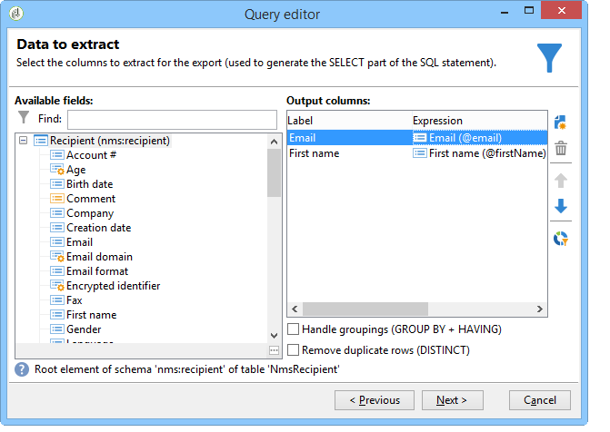

# Gegevensgeoriënteerde API&#39;s{#data-oriented-apis}

Met gegevensgeoriënteerde API&#39;s kunt u het volledige datamodel beheren.

## Overzicht van het datamodel {#overview-of-the-datamodel}

Adobe Campagne biedt geen specifieke lees-API per entiteit (geen functie getRecipient of getDelivery, enz.). Met de methoden QUERY &amp; WRITER voor het lezen en wijzigen van gegevens hebt u toegang tot de gegevens van het model.

Met Adobe Campaign kunt u verzamelingen beheren: de vragen laten u toe om een reeks informatie terug te krijgen die door de basis wordt verzameld. In tegenstelling tot toegang in SQL-modus, retourneren Adobe Campagne-API&#39;s een XML-structuur in plaats van gegevenskolommen. Adobe Campaign maakt dus samengestelde documenten met alle verzamelde gegevens.

Deze werkende wijze biedt geen één-op-één afbeelding tussen de attributen en de elementen van de documenten van XML en de kolommen van de lijsten in het gegevensbestand aan.

XML-documenten worden opgeslagen in MEMO-tekstvelden van de database.

## Beschrijving van het model {#description-of-the-model}

U moet bekend zijn met het gegevensmodel van de Campagne van Adobe om de gebieden van het gegevensbestand in uw manuscripten te kunnen richten.

Raadpleeg de beschrijving [van het gegevensmodel van](https://docs.campaign.adobe.com/doc/AC/en/technicalResources/_Datamodel_Description_of_the_main_tables.html)Adobe Campagne Data model voor een presentatie van het gegevensmodel.

Raadpleeg dit artikel voor informatie over het genereren van de structuur: [Hoe te om een Model of Woordenboek](https://helpx.adobe.com/campaign/kb/generate-data-model.html)van Gegevens te produceren.

## Query en schrijver {#query-and-writer}

In het volgende introductieschema vindt u details op laag niveau voor lezen (ExecuteQuery) en schrijven (Writer) tussen database en klant (webpagina&#39;s of Adobe Campagne Client Console).


### ExecuteQuery {#executequery}

Voor kolommen en voorwaarden kunt u Query&#39;s gebruiken.

Hierdoor kunt u de onderliggende SQL isoleren. De querytaal is niet afhankelijk van de onderliggende engine: sommige functies worden opnieuw toegewezen, waardoor meerdere SELECT SQL-orders kunnen worden gegenereerd.

Voor meer op dit, verwijs naar [Voorbeeld op de methode &#39;ExecuteQuery&#39; van schema &#39;xtk:queryDef&#39;](../../configuration/using/web-service-calls.md#example-on-the--executequery--method-of-schema--xtk-querydef-).

De methode **ExecuteQuery** wordt weergegeven in [ExecuteQuery (xtk:queryDef)](#executequery--xtk-querydef-).

### Schrijven {#write}

Met schrijfopdrachten kunt u eenvoudige of complexe documenten schrijven met items in een of meer tabellen van de basis.

Met de Transaction API&#39;s kunt u aansluitingen beheren via de opdracht **updateOrInsert** : Met één opdracht kunt u gegevens maken of bijwerken. U kunt ook samenvoeging van wijzigingen configureren (**samenvoegen**): in deze modus kunt u gedeeltelijke updates toestaan.

De structuur van XML biedt een logische mening van de gegevens aan en laat u de fysieke structuur van de SQL lijst negeren.

De schrijfmethode wordt voorgesteld in [Write/WriteCollection (xtk:zitting)](#write---writecollection--xtk-session-).

## ExecuteQuery (xtk:queryDef) {#executequery--xtk-querydef-}

Deze methode laat u vragen van gegevens uitvoeren verbonden aan een schema. Het neemt een authentificatietekenreeks (moet worden het programma geopend) en een document van XML beschrijvend de vraag die als parameters moet worden voorgelegd. De retourparameter is een XML-document dat het resultaat bevat van de query in de indeling van het schema waarnaar de query verwijst.

Definitie van de methode &quot;ExecuteQuery&quot; in het schema &quot;xtk:queryDef&quot;:

```
<method name="ExecuteQuery" const="true">
  <parameters>
    <param desc="Output XML document" name="output" type="DOMDocument" inout="out"/>
  </parameters>
</method>
```

>[!NOTE]
>
>Dit is een const-methode. De invoerparameters worden in een XML-document opgenomen in de indeling van het schema &quot;xtk:queryDef&quot;.

### Indeling van het XML-document van de invoerquery {#format-of-the-xml-document-of-the-input-query}

De structuur van het XML-document van de query wordt beschreven in het schema &quot;xtk:queryDef&quot;. In dit document worden de clausules van een SQL-query beschreven: &quot;select&quot;, &quot;where&quot;, &quot;order by&quot;, &quot;group by&quot;, &quot;have&quot;.

```
<queryDef schema="schema_key" operation="operation_type">
  <select>
    <node expr="expression1">
    <node expr="expression2">
    ...
  </select>
  <where> 
    <condition expr="expression1"/> 
    <condition expr="expression2"/>
    ... 
  </where>
  <orderBy>
    <node expr="expression1">
    <node expr="expression2">
    ...
  </orderBy>
  <groupBy>
    <node expr="expression1">
    <node expr="expression2">
    ...
  </groupBy>
  <having>
    <condition expr="expression1"/> 
    <condition expr="expression2"/>
    ...
  </having>
</queryDef>
```

Een subquery ( `<subquery>` ) kan worden gedefinieerd in een `<condition> ` element. De syntaxis voor een `<subquery> ` element is gebaseerd op de syntaxis van een `<querydef>`.

Voorbeeld van een `<subquery>  : </subquery>`

```
<condition setOperator="NOT IN" expr="@id" enabledIf="$(/ignored/@ownerType)=1">
  <subQuery schema="xtk:operatorGroup">
     <select>
       <node expr="[@operator-id]" />
     </select>
     <where>
       <condition expr="[@group-id]=$long(../@owner-id)"/>
     </where>
   </subQuery>
</condition>  
  
```

Een vraag moet een beginschema van het **schemaattribuut** van verwijzingen voorzien.

Het gewenste type bewerking wordt ingevoerd in het kenmerk **operation** en bevat een van de volgende waarden:

* **get**: Hiermee wordt een record uit de tabel opgehaald en wordt een fout geretourneerd als de gegevens niet bestaan,
* **getIfExists**: Hiermee wordt een record uit de tabel opgehaald en wordt een leeg document geretourneerd als de gegevens niet bestaan,
* **selecteren**: maakt een cursor die meerdere records retourneert en een leeg document retourneert als er geen gegevens zijn,
* **aantal**: retourneert een gegevenstelling.

De **XPath** -syntaxis wordt gebruikt om gegevens te zoeken op basis van het invoerschema. Raadpleeg [Gegevensschema&#39;s voor meer informatie over XPath](../../configuration/using/data-schemas.md).

#### Voorbeeld met de bewerking &#39;get&#39; {#example-with-the--get--operation}

Haalt de achternaam en voornaam van een ontvanger (&quot;nms:ontvanger&quot;-schema) op met een filter op de e-mail.

```
<queryDef schema="nms:recipient" operation="get">
  <!-- fields to retrieve -->
  <select>
    <node expr="@firstName"/>
    <node expr="@lastName"/>
  </select> 

  <!-- condition on email -->
  <where>  
    <condition expr="@email= 'john.doe@aol.com'"/>
  </where>
</queryDef>
```

#### Voorbeeld met de bewerking &#39;select&#39; {#example-with-the--select--operation}

Retourneert de lijst met ontvangers die zijn gefilterd in een map en het e-maildomein met een sortering in aflopende volgorde op de geboortedatum.

```
<queryDef schema="nms:recipient" operation="select">
  <select>
    <node expr="@email"/>
    <!-- builds a string with the concatenation of the last name and first name separated by a dash -->      
    <node expr="@lastName+'-'+@firstName"/>
    <!-- get year of birth date -->
    <node expr="Year(@birthDate)"/>
  </select> 

  <where>  
     <condition expr="[@folder-id] = 1234 and @domain like 'Adobe%'"/>
  </where>

  <!-- order by birth date -->
  <orderBy>
    <node expr="@birthDate" sortDesc="true"/> <!-- by default sortDesc="false" -->
  </orderBy>
</queryDef>
```

Expressies kunnen eenvoudige velden of complexe expressies zijn, zoals rekenkundige bewerkingen of het samenvoegen van tekenreeksen.

Om het aantal verslagen te beperken die moeten worden teruggekeerd, voeg de **lineCount** attributen aan het `<querydef>` element toe.

Om het aantal verslagen te beperken die door de vraag aan 100 zijn teruggekeerd:

```
<queryDef schema="nms:recipient" operation="select" lineCount="100">
...
```

Om de volgende 100 verslagen terug te winnen, stel de zelfde vraag opnieuw in werking, toevoegend het **startLine** attribuut.

```
<queryDef schema="nms:recipient" operation="select" lineCount="100" startLine="100">
...
```

#### Voorbeeld met de bewerking &#39;count&#39; {#example-with-the--count--operation}

Om het aantal verslagen op een vraag te tellen:

```
<queryDef schema="nms:recipient" operation="count"">
  <!-- condition on the folder and domain of the e-mail -->
  <where>  
    <condition expr="[@folder-id] = 1234" and @domain like 'Adobe%'"/>
  </where>
</queryDef>
```

>[!NOTE]
>
>Ook hier gebruiken we de voorwaarde uit het vorige voorbeeld. De clausules `<select>` en clausules worden niet gebruikt. </select>&quot;

#### Gegevensgroepering {#data-grouping}

Om e-mailadressen terug te winnen waarnaar meer dan eens wordt verwezen:

```
<queryDef schema="nms:recipient" operation="select">
  <select>
    <node expr="@email"/>
    <node expr="count(@email)"/>
  </select>

  <!-- e-mail grouping clause -->
  <groupby>
    <node expr="@email"/>
  </groupby>

  <!-- grouping condition -->
  <having>
    <condition expr="count(@email) > 1"/>
  </having>

</queryDef>
```

De query kan worden vereenvoudigd door het kenmerk **groupBy** rechtstreeks toe te voegen aan het veld dat moet worden gegroepeerd:

```
<select>
  <node expr="@email" groupBy="true"/>
</select>
```

>[!NOTE]
>
>Het `<groupby>` element hoeft niet meer te worden gevuld.

#### Bracketing in omstandigheden {#bracketing-in-conditions}

Hier volgen twee voorbeelden van haakjes op dezelfde voorwaarde.

* De eenvoudige versie in één expressie:

   ```
   <where>
     <condition expr="(@age > 15 or @age <= 45) and  (@city = 'Newton' or @city = 'Culver City') "/>
   </where>
   ```

* De gestructureerde versie met `<condition>` elementen:

   ```
   <where>
     <condition bool-operator="AND">
       <condition expr="@age > 15" bool-operator="OR"/>
       <condition expr="@age <= 45"/>
     </condition>
     <condition>
       <condition expr="@city = 'Newton'" bool-operator="OR"/>
       <condition expr="@city = 'Culver City'"/>
     </condition>
   </where>
   ```

Het is mogelijk de operator &#39;OR&#39; te vervangen door de operator &#39;IN&#39; wanneer er verschillende voorwaarden gelden voor hetzelfde veld:

```
<where>
  <condition>
    <condition expr="@age IN (15, 45)"/>
    <condition expr="@city IN ('Newton', 'Culver City')"/>
  </condition>
</where>
```

Deze syntaxis vereenvoudigt de query wanneer meer dan twee gegevens in de voorwaarde worden gebruikt.

#### Voorbeelden van koppelingen {#examples-on-links}

* Koppelingen 1-1 of N1: als de tabel de externe sleutel heeft (de koppeling begint in de tabel), kunnen de velden van de gekoppelde tabel worden gefilterd of rechtstreeks worden opgehaald.

   Voorbeeld van een filter op het maplabel:

   ```
   <where>
     <condition expr="[folder/@label] like 'Segment%'"/>
   </where>
   ```

   U kunt als volgt de velden van de map ophalen uit het schema &quot;nms:ontvanger&quot;:

   ```
   <select>
     <!-- label of recipient folder -->
     <node expr="[folder/@label]"/>
     <!-- displays the string count of the folder -->
     <node expr="partition"/>
   </select>
   ```

* Verzamelingskoppelingen (1N): het filtreren op de gebieden van een inzamelingstabel moet via **BESTAAT** of **NIET BESTAAT** exploitant worden uitgevoerd.

   Om de ontvangers te filtreren die aan de de informatiedienst van de &quot;Krantenbrief&quot;zijn geabonneerd:

   ```
   <where>
     <condition expr="subscription" setOperator="EXISTS">
       <condition expr="@name = 'Newsletter'"/>
     </condition>
   </where>
   ```

   Directe herwinning van de gebieden van een inzamelingsverbinding van de `<select>` clausule wordt niet geadviseerd omdat de vraag een kardinaal product terugkeert. Deze wordt alleen gebruikt wanneer de gekoppelde tabel slechts één record bevat (voorbeeld `<node expr="">`).

   Voorbeeld op de verzamelingskoppeling &quot;Abonnement&quot;:

   ```
   <select>
     <node expr="subscription/@label"/>
   </select>
   ```

   Het is mogelijk om een sublijst terug te winnen die de elementen van een inzamelingsverbinding in de `<select>` clausule bevat. De XPath van de gebieden waarnaar wordt verwezen zijn contextueel van het inzamelingselement.

   De filterelementen ( `<orderby>` ) en de beperkingselementen ( `<where>` ) kunnen aan het inzamelingselement worden toegevoegd.

   In dit voorbeeld, voor elke ontvanger keert de vraag e-mail en de lijst van informatiediensten terug waarop de ontvanger zich abonneert:

   ```
   <queryDef schema="nms:recipient" operation="select">
     <select>
       <node expr="@email"/>
   
       <!-- collection table (unbound type) -->
       <node expr="subscription">  
         <node expr="[service/@label]"/>    
         <!-- sub-condition on the collection table -->
         <where>  
           <condition expr="@expirationDate >= GetDate()"/>
         </where>
         <orderBy>
           <node expr="@expirationDate"/> 
         </orderBy>
       </node>
     </select> 
   </queryDef>
   ```

#### De parameters van de component &#39;where&#39; en &#39;select&#39; binden {#binding-the-parameters-of-the--where--and--select--clause}

Door de binding van parameters kan de engine de waarden instellen van de parameters die in de query worden gebruikt. Dit is zeer nuttig, aangezien de motor voor het ontsnappen van waarden verantwoordelijk is, en er het extra voordeel van een geheime voorgeheugen voor de parameters is die moeten worden teruggewonnen.

Wanneer een vraag wordt geconstrueerd, worden de &quot;gebonden&quot;waarden vervangen door een karakter (? in ODBC, `#[index]#` in postgres...) in het lichaam van de SQL vraag.

```
<select>
  <!--the value will be bound by the engine -->
  <node expr="@startDate = #2002/02/01#"/>                   
  <!-- the value will not be bound by the engine but visible directly in the query -->
  <node expr="@startDate = #2002/02/01#" noSqlBind="true"/> 
</select>
```

Als u wilt voorkomen dat een parameter wordt gebonden, moet het kenmerk &quot;noSqlBind&quot; worden gevuld met de waarde &quot;true&quot;.

>[!IMPORTANT]
>
>Als de vraag &quot;orde-door&quot;of &quot;groep-door&quot;instructies omvat, zullen de gegevensbestandmotoren niet waarden kunnen &quot;binden&quot;. U moet het @noSqlBind= &quot;waar&quot;attribuut op &quot;selecteren&quot;en/of &quot;waar&quot;instructies van de vraag plaatsen.

#### Tip voor het samenstellen van query&#39;s: {#query-building-tip-}

Om met de syntaxis van een vraag te helpen, kunt u de vraag schrijven gebruikend de generische vraagredacteur in de de cliëntconsole van de Campagne van Adobe ( **[!UICONTROL Tools/ Generic query editor...]** menu). Dit doet u als volgt:

1. Selecteer de gegevens die u wilt ophalen:

   

1. Definieer de filtervoorwaarde:

   

1. Voer de vraag uit en druk CTRL+F4 om de code van de vraagbron te bekijken.

   

### Documentindeling uitvoeren {#output-document-format}

De retourparameter is een XML-document in de indeling van het schema dat aan de query is gekoppeld.

Voorbeeld van een terugkeer van het &quot;nms:ontvanger&quot;schema op &quot;krijgt&quot;verrichting:

```
<recipient email="john.doe@adobe.com" lastName"Doe" firstName="John"/>
```

Bij een &quot;select&quot;-bewerking is het geretourneerde document een opsomming van elementen:

```
<!-- the name of the first element does not matter -->
<recipient-collection>   
  <recipient email="john.doe@adobe.com" lastName"Doe" firstName="John"/>
  <recipient email="peter.martinez@adobe.com" lastName"Martinez" firstName="Peter"/>
  <recipient...
</recipient-collection>  
```

Voorbeeld van een document dat wordt geretourneerd voor bewerking van het type &quot;count&quot;:

```
<recipient count="3"/>
```

#### Alias {#alias}

Met een alias kunt u de locatie van gegevens in het uitvoerdocument wijzigen. Het **alias** -kenmerk moet een XPath opgeven in het corresponderende veld.

```
<queryDef schema="nms:recipient" operation="get">
  <select>
    <node expr="@firstName" alias="@firstName"/>
    <node expr="@lastName"/>
    <node expr="[folder/@label]" alias="@My_folder"/>
  </select> 
</queryDef>
```

Retourneert:

```
<recipient My_folder="Recipients" First name ="John" lastName="Doe"/>
```

In plaats van:

```
<recipient firstName="John" lastName="Doe">
  <folder label="Recipients"/>
</recipient>
```

### Voorbeeld van SOAP-berichten {#example-of-soap-messages}

* Query:

   ```
   <?xml version='1.0' encoding='ISO-8859-1'?>
   <SOAP-ENV:Envelope xmlns:xsd='http://www.w3.org/2001/XMLSchema' xmlns:xsi='http://www.w3.org/2001/XMLSchema-instance' xmlns:ns='http://xml.apache.org/xml-soap' xmlns:SOAP-ENV='http://schemas.xmlsoap.org/soap/envelope/'>
     <SOAP-ENV:Body>
       <ExecuteQuery xmlns='urn:xtk:queryDef' SOAP-ENV:encodingStyle='http://schemas.xmlsoap.org/soap/encoding/'>
         <__sessiontoken xsi:type='xsd:string'/>
         <entity xsi:type='ns:Element' SOAP-ENV:encodingStyle='http://xml.apache.org/xml-soap/literalxml'>
           <queryDef operation="get" schema="nms:recipient" xtkschema="xtk:queryDef">
             <select>
               <node expr="@email"/>
               <node expr="@lastName"/>
               <node expr="@firstName"/>
             </select>
             <where>
               <condition expr="@id = 3599"/>
             </where>
           </queryDef>
         </entity>
       </ExecuteQuery>
     </SOAP-ENV:Body>
   </SOAP-ENV:Envelope>
   ```

* Reactie:

   ```
   <?xml version='1.0' encoding='ISO-8859-1'?>
   <SOAP-ENV:Envelope xmlns:xsd='http://www.w3.org/2001/XMLSchema' xmlns:xsi='http://www.w3.org/2001/XMLSchema-instance' xmlns:ns='http://xml.apache.org/xml-soap' xmlns:SOAP-ENV='http://schemas.xmlsoap.org/soap/envelope/'>
     <SOAP-ENV:Body>
       <ExecuteQueryResponse xmlns='urn:xtk:queryDef' SOAP-ENV:encodingStyle='http://schemas.xmlsoap.org/soap/encoding/'>
         <pdomOutput xsi:type='ns:Element' SOAP-ENV:encodingStyle='http://xml.apache.org/xml-soap/literalxml'>
           <recipient email="john.doe@adobe.com" lastName"Doe" firstName="John"/>
         </pdomOutput>
       </ExecuteQueryResponse>
     </SOAP-ENV:Body>
   </SOAP-ENV:Envelope>
   ```

## Write/WriteCollection (xtk:session) {#write---writecollection--xtk-session-}

Deze services worden gebruikt om een entiteit (&quot;Write&quot;-methode) of een verzameling entiteiten (&quot;WriteCollection&quot;-methode) in te voegen, bij te werken of te verwijderen.

De bij te werken entiteiten zijn gekoppeld aan een gegevensschema. De invoerparameters zijn een verificatietekenreeks (moet worden aangemeld) en een XML-document met de gegevens die moeten worden bijgewerkt.

Dit document wordt aangevuld met instructies voor het configureren van de schrijfprocedures.

De aanroep retourneert geen gegevens, behalve fouten.

Definitie van de methoden &quot;Write&quot; en &quot;WriteCollection&quot; in het schema &quot;xtk:session&quot;:

```
<method name="Write" static="true">
  <parameters>
    <param name="doc" type="DOMDocument" desc="Difference document"/>
  </parameters>
</method>
<method name="WriteCollection" static="true">
  <parameters>
    <param name="doc" type="DOMDocument" desc="Difference collection document"/>
  </parameters>
</method>
```

>[!NOTE]
>
>Dit is een &quot;statische&quot; methode. De invoerparameters worden opgenomen in een XML-document in de indeling van het schema dat moet worden bijgewerkt.

### Overzicht {#overview}

De afstemming van gegevens werkt op basis van de definitie van de sleutels die zijn ingevoerd in het bijbehorende schema. De schrijfprocedure zoekt naar de eerste in aanmerking komende sleutel op basis van de gegevens die in het invoerdocument zijn ingevoerd. De entiteit wordt ingevoegd of bijgewerkt op basis van haar bestaan in de database.

De sleutel van het schema van de te bijwerken entiteit wordt voltooid gebaseerd op het **xtkschema** attribuut.

De afstemmingssleutel kan daarom worden afgedwongen met het kenmerk **_key** dat de lijst met XPails bevat waaruit de sleutel bestaat (gescheiden door komma&#39;s).

Het is mogelijk om het type bewerking te forceren door het kenmerk **_operation** te vullen met de volgende waarden:

* **invoegen**: de opname van de record forceert (de verzoeningssleutel wordt niet gebruikt);
* **insertOrUpdate**: werkt de record bij of voegt deze in, afhankelijk van de reconciliatietoets (standaardmodus);
* **update**: het register bijwerkt; niets doet als de gegevens niet bestaan,
* **verwijderen**: de records verwijdert;
* **geen**: alleen gebruikt voor het afstemmen van koppelingen, zonder update of invoeging.

### Voorbeeld met de methode &#39;Write&#39; {#example-with-the--write--method}

Een ontvanger bijwerken of invoegen (impliciete bewerking &quot;insertOrUpdate&quot;) met e-mailadres, geboortedatum en plaats:

```
<recipient xtkschema="nms:recipient" email="john.doe@adobe.com" birthDate="1956/05/04" folder-id=1203 _key="@email, [@folder-id]">
  <location city="Newton"/>
</recipient>
```

Een ontvanger verwijderen:

```
<recipient xtkschema="nms:recipient" _operation="delete" email="rene.dupont@adobe.com" folder-id=1203 _key="@email, [@folder-id]"/>
```

>[!NOTE]
>
>Voor een verwijderingsbewerking moet het invoerdocument alleen de velden bevatten waaruit de afstemmingssleutel bestaat.

### Voorbeeld met de methode WriteCollection {#example-with-the--writecollection--method}

Bijwerken of invoegen voor verschillende ontvangers:

```
<recipient-collection xtkschema="nms:recipient">    
  <recipient email="john.doe@adobe.com" firstName="John" lastName="Doe" _key="@email"/>
  <recipient email="peter.martinez@adobe.com" firstName="Peter" lastName="Martinez" _key="@email"/>
  <recipient ...
</recipient-collection>
```

### Voorbeeld van koppelingen {#example-on-links}

#### Voorbeeld 1 {#example-1}

De map koppelen aan een ontvanger op basis van de interne naam (@name).

```
<recipient _key="[folder/@name], @email" email="john.doe@adobe.net" lastName="Doe" firstName="John" xtkschema="nms:recipient">
  <folder name="Folder2" _operation="none"/>
</recipient>
```

De kenmerken &quot;_key&quot; en &quot;_operation&quot; kunnen worden ingevoerd op een gekoppeld element. Het gedrag op dit element is hetzelfde als op het hoofdelement van het invoerschema.

De definitie van de sleutel van de hoofdentiteit (&quot;nms:ontvanger&quot;) bestaat uit een veld van een gekoppelde tabel (elementschema &quot;xtk:folder&quot;) en de e-mail. `<folder>`

>[!NOTE]
>
>De bewerking &quot;none&quot; die in het mappenelement is ingevoerd, definieert een afstemming in de map zonder update of invoeging.

#### Voorbeeld 2 {#example-2}

Het bijwerken van het bedrijf (verbonden lijst in &quot;cus:bedrijf&quot;schema) van een ontvanger:

```
<recipient _key="[folder/@name], @email" email="john.doe@adobe.net" lastName="Doe" firstName="John" xtkschema="nms:recipient">
  <company name="adobe" code="ERT12T" _key="@name" _operation="update"/>
</recipient>
```

#### Voorbeeld 3 {#example-3}

Een ontvanger aan een groep toevoegen met de groeprelatietabel (&quot;nms:rcpGrpRel&quot;):

```
<recipient _key="@email" email="martin.ledger@adobe.net" xtkschema="nms:recipient">
  <rcpGrpRel _key="[rcpGroup/@name]">
    <rcpGroup name="GRP1"/>
  </rcpGrpRel>
</recipient>
```

>[!NOTE]
>
>De definitie van de sleutel is niet ingegaan in het `<rcpgroup>` element omdat een impliciete sleutel die op de groepsnaam wordt gebaseerd in het &quot;nms:group&quot;schema wordt bepaald.

### XML-verzamelingselementen {#xml-collection-elements}

Door gebrek, moeten alle inzamelingselementen worden bevolkt om de de inzamelingselementen van XML bij te werken. Gegevens uit de database worden vervangen door gegevens uit het invoerdocument. Als het document alleen de elementen bevat die moeten worden bijgewerkt, moet u het kenmerk &quot;_operation&quot; invullen voor alle verzamelingselementen die moeten worden bijgewerkt om een samenvoeging met de XML-gegevens van de database te forceren.

### Voorbeeld van SOAP-berichten {#example-of-soap-messages-1}

* Query:

   ```
   <?xml version='1.0' encoding='ISO-8859-1'?>
   <SOAP-ENV:Envelope xmlns:xsd='http://www.w3.org/2001/XMLSchema' xmlns:xsi='http://www.w3.org/2001/XMLSchema-instance' xmlns:ns='http://xml.apache.org/xml-soap' xmlns:SOAP-ENV='http://schemas.xmlsoap.org/soap/envelope/'>
     <SOAP-ENV:Body>
       <Write xmlns='urn:xtk:persist' SOAP-ENV:encodingStyle='http://schemas.xmlsoap.org/soap/encoding/'>
         <__sessiontoken xsi:type='xsd:string'/>
         <domDoc xsi:type='ns:Element' SOAP-ENV:encodingStyle='http://xml.apache.org/xml-soap/literalxml'>
           <recipient xtkschema="nms:recipient" email="rene.dupont@adobe.com" firstName="René" lastName="Dupont" _key="@email">
         </domDoc>
       </Write>
     </SOAP-ENV:Body>
   </SOAP-ENV:Envelope>
   ```

* Reactie:

   ```
   <?xml version='1.0' encoding='ISO-8859-1'?>
   <SOAP-ENV:Envelope xmlns:xsd='http://www.w3.org/2001/XMLSchema' xmlns:xsi='http://www.w3.org/2001/XMLSchema-instance' xmlns:ns='http://xml.apache.org/xml-soap' xmlns:SOAP-ENV='http://schemas.xmlsoap.org/soap/envelope/'>
     <SOAP-ENV:Body>
       <WriteResponse xmlns='urn:' SOAP-ENV:encodingStyle='http://schemas.xmlsoap.org/soap/encoding/'>
       </WriteResponse>
     </SOAP-ENV:Body>
   </SOAP-ENV:Envelope>
   ```

   Retourneren met fout:

   ```
   <?xml version='1.0'?>
   <SOAP-ENV:Envelope xmlns:xsd="http://www.w3.org/2001/XMLSchema" xmlns:xsi="http://www.w3.org/2001/XMLSchema-instance" xmlns:SOAP-ENV='http://schemas.xmlsoap.org/soap/envelope/'>
     <SOAP-ENV:Body>
       <SOAP-ENV:Fault>
         <faultcode>SOAP-ENV:Server</faultcode>
         <faultstring xsi:type="xsd:string">Error while executing the method 'Write' of service 'xtk:persist'.</faultstring>
         <detail xsi:type="xsd:string">PostgreSQL error: ERROR:  duplicate key violates unique constraint &quot;nmsrecipient_id&quot;Impossible to save document of type 'Recipients (nms:recipient)'</detail>
       </SOAP-ENV:Fault>
     </SOAP-ENV:Body>
   </SOAP-ENV:Envelope>
   ```

