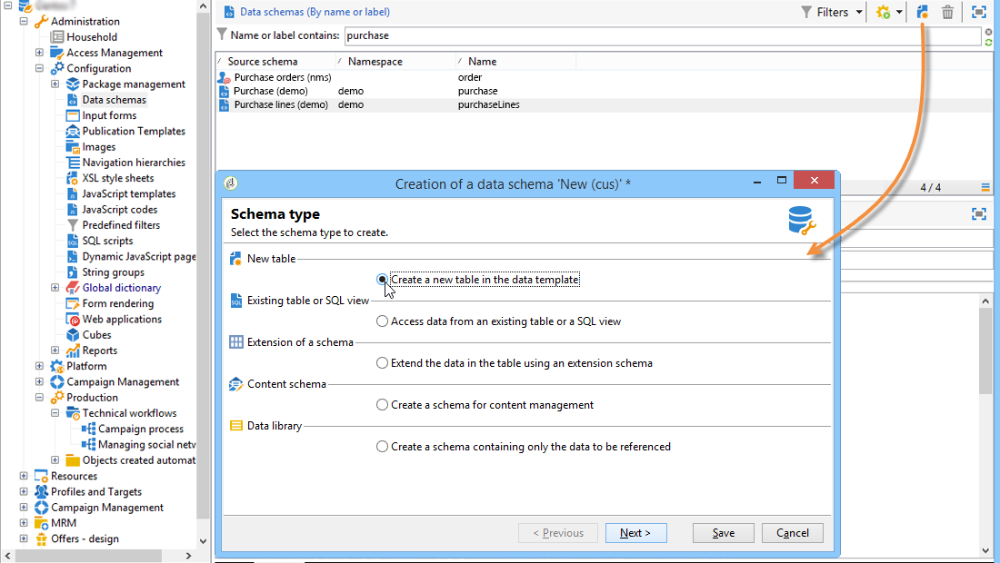

# Gegevensschema&#39;s{#data-schemas}

## Beginselen {#principles}

Als u de schema&#39;s wilt bewerken, maken en configureren, klikt u op het **[!UICONTROL Administration > Configuration > Data schemas]** knooppunt van de Adobe Campagne-clientconsole.

>[!NOTE]
>
>De out-of-the-box gegevensschema&#39;s kunnen slechts door een beheerder van uw Klassieke console van de Campagne van Adobe worden geschrapt.


In het bewerkveld wordt de XML-inhoud van het bronschema weergegeven:


>[!NOTE]
>
>Met het besturingselement &#39;Naam&#39; kunt u de schemasleutel invoeren die bestaat uit de naam en naamruimte. De kenmerken &quot;name&quot; en &quot;namespace&quot; van het hoofdelement van het schema worden automatisch bijgewerkt in de XML-bewerkingszone van het schema.

In de voorvertoning wordt het uitgebreide schema automatisch gegenereerd:


>[!NOTE]
>
>Wanneer het bronschema wordt opgeslagen, wordt het genereren van het uitgebreide schema automatisch gestart.

Als u de volledige structuur van een schema moet controleren, kunt u het voorproeflusje gebruiken. Als het schema is uitgebreid, zult u al zijn uitbreidingen dan kunnen visualiseren. Als aanvulling geeft het tabblad Documentatie alle schemakenmerken en -elementen weer, en de bijbehorende eigenschappen (SQL-veld, type/lengte, label, beschrijving). Het tabblad Documentatie is alleen van toepassing op gegenereerde schema&#39;s. Raadpleeg voor meer informatie de sectie [Regenererende schema&#39;s](../../configuration/using/regenerating-schemas.md) .

## Voorbeeld: het creëren van een contractlijst {#example--creating-a-contract-table}

In het volgende voorbeeld willen we een nieuwe tabel voor **contracten** maken in het databasemodel van de Adobe Campagne-database. In deze tabel kunt u voor elk contract de voor- en achternaam en het e-mailadres van de houder en de medehouder opslaan.

Hiervoor moet u het schema van de tabel maken en de databasestructuur bijwerken om de bijbehorende tabel te genereren. Pas de volgende stappen toe:

1. Bewerk het **[!UICONTROL Administration > Configuration > Data schemas]** knooppunt van de Adobe Campaign-structuur en klik **[!UICONTROL New]** .
1. Kies de **[!UICONTROL Create a new table in the data model]** optie en klik **[!UICONTROL Next]** .

   

1. Geef een naam voor de tabel en een naamruimte op.

   

   >[!NOTE]
   >
   >Standaard worden schema&#39;s die door gebruikers worden gemaakt, opgeslagen in de naamruimte &#39;cus&#39;. Raadpleeg [Identificatie van een schema](../../configuration/using/about-schema-reference.md#identification-of-a-schema)voor meer informatie hierover.

1. Maak de inhoud van de tabel. We raden u aan om de wizard Invoer te gebruiken om er zeker van te zijn dat er geen instellingen ontbreken. Klik hiertoe op de **[!UICONTROL Insert]** knop en kies het type instelling dat u wilt toevoegen.

   

1. Definieer de instellingen voor de tabel met contracten:

   ```
   <srcSchema desc="Active contracts" img="ncm:channels.png" label="Contracts" labelSingular="Contract" mappingType="sql" name="Contracts" namespace="cus" xtkschema="xtk:srcSchema">
     <element desc="Active contracts" img="ncm:channels.png" label="Contracts" labelSingular="Contract"
              name="Contracts" autopk="true">
              <attribute name="holderName" label="Holder last name" type="string"/>
              <attribute name="holderFirstName" label="Holder first name" type="string"/>
              <attribute name="holderEmail" label="Holder email" type="string"/>
              <attribute name="co-holderName" label="Co-holder last name" type="string"/>           
              <attribute name="co-holderFirstName" label="Co-holder first name" type="string"/>           
              <attribute name="co-holderEmail" label="Co-holder email" type="string"/>    
              <attribute name="date" label="Subscription date" type="date"/>     
              <attribute name="noContract" label="Contract number" type="long"/>  
     </element>
   </srcSchema>
   ```

   Voeg het type contract toe en plaats een index op het contractaantal.

   ```
   <srcSchema _cs="Contracts (cus)" desc="Active contracts" entitySchema="xtk:srcSchema" img="ncm:channels.png"
              label="Contracts" labelSingular="Contract" name="Contracts" namespace="cus" xtkschema="xtk:srcSchema">
     <enumeration basetype="byte" name="typeContract">
       <value label="Home" name="home" value="0"/>
       <value label="Car" name="car" value="1"/>
       <value label="Health" name="health" value="2"/>
       <value label="Pension fund" name="pension fund" value="2"/>
     </enumeration>
     <element autopk="true" desc="Active contracts" img="ncm:channels.png" label="Contracts"
              labelSingular="Contract" name="Contracts">
       <attribute label="Holder last name" name="holderName" type="string"/>
       <attribute label="Holder first name" name="holderFirstName" type="string"/>
       <attribute label="Holder email" name="holderEmail" type="string"/>
       <attribute label="Co-holder last name" name="co-holderName" type="string"/>
       <attribute label="Co-holder first name" name="co-holderFirstName" type="string"/>
       <attribute label="Co-holder email" name="co-holderEmail" type="string"/>
       <attribute label="Subscription date" name="date" type="date"/>
      <attribute desc="Type of contract" enum="cus:Contracts:typeContract" label="Type of contract"
                  name="type" type="byte"/>
       <attribute label="Contract number" name="noContract" type="long"/>
       <dbindex name="noContract" unique="true">
         <keyfield xpath="@noContract"/>
       </dbindex>
     </element>
   </srcSchema>
   ```

1. Sla het schema op om de structuur te genereren:

   

1. Werk de databasestructuur bij om de tabel te maken waarnaar het schema wordt gekoppeld. Raadpleeg [De databasestructuur](../../configuration/using/updating-the-database-structure.md)bijwerken voor meer informatie.

