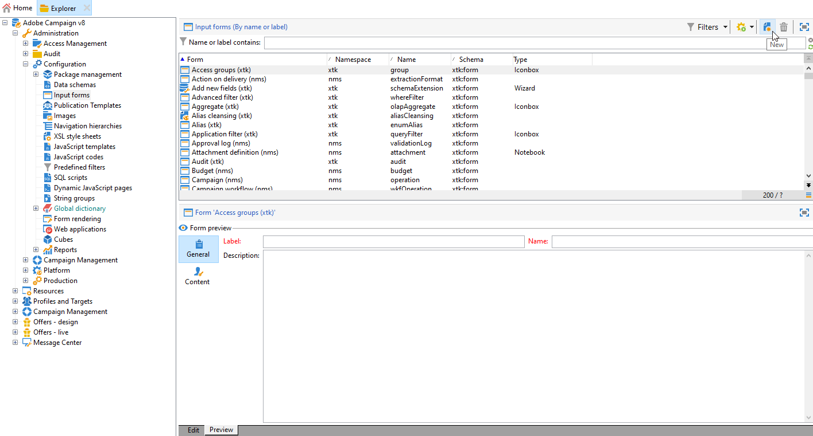
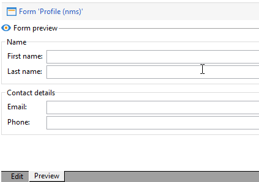

# Formulieren bewerken{#editing-forms}


## Overzicht

Marktdeelnemers en operatoren gebruiken invoerformulieren om records te maken, te wijzigen en voor te vertonen. Forms geeft een visuele weergave van informatie weer.

U kunt invoerformulieren maken en wijzigen:

* U kunt de fabrieksinvoerformulieren wijzigen die standaard worden geleverd. De fabrieksinvoerformulieren zijn gebaseerd op de fabrieksgegevensschema&#39;s.
* U kunt aangepaste invoerformulieren maken op basis van gegevensschema&#39;s die u definieert.

Forms zijn entiteiten van `xtk:form` type. U kunt de invoerformulierstructuur bekijken in het dialoogvenster `xtk:form` schema. Kies **[!UICONTROL Administration]** > **[!UICONTROL Configuration]** > **[!UICONTROL Data schemas]** in het menu. Meer informatie over [formulierstructuur](form-structure.md).

Kies **[!UICONTROL Administration]> [!UICONTROL Configuration] >[!UICONTROL Input forms]** in het menu:


Als u formulieren wilt ontwerpen, bewerkt u de XML-inhoud in de XML-editor:


[Meer informatie](form-structure.md#formatting).

Als u een voorbeeld van een formulier wilt bekijken, klikt u op de knop **[!UICONTROL Preview]** tab:


## Formuliertypen

U kunt verschillende typen invoerformulieren maken. Het formuliertype bepaalt hoe gebruikers door het formulier navigeren:

* Consolescherm

   Dit is het standaardformuliertype. Het formulier bestaat uit één pagina.

   

* Contentmanagement

   Gebruik dit formuliertype voor inhoudsbeheer. Zie dit [use case](../../delivery/using/use-case--creating-content-management.md).

   

* Wizard

   Dit formulier bestaat uit meerdere zwevende schermen die in een bepaalde reeks zijn geordend. Gebruikers navigeren van het ene scherm naar het andere. [Meer informatie](form-structure.md#wizards).

* Iconbox

   Dit formulier bestaat uit meerdere pagina&#39;s. Gebruikers kunnen door het formulier navigeren door pictogrammen links van het formulier te selecteren.

   

* Laptop

   Dit formulier bestaat uit meerdere pagina&#39;s. Als gebruikers in het formulier willen navigeren, selecteren ze boven aan het formulier tabbladen.

   

* Verticaal deelvenster

   In dit formulier wordt een boomstructuur weergegeven.

* Horizontaal venster

   Dit formulier bevat een lijst met items.

## Containers

In formulieren kunt u containers voor verschillende doeleinden gebruiken:

* Inhoud indelen in formulieren
* Toegang tot invoervelden definiëren
* Formulieren nesten in andere formulieren

[Meer informatie](form-structure.md#containers).

### Inhoud ordenen

Gebruik containers om inhoud in formulieren te ordenen:

* U kunt velden groeperen in secties.
* U kunt pagina&#39;s toevoegen aan formulieren met meerdere pagina&#39;s.

Als u een container wilt invoegen, gebruikt u de `<container>` element. [Meer informatie](form-structure.md#containers).

#### Velden groeperen

Gebruik containers om invoervelden te groeperen in georganiseerde secties.

Gebruik dit element om een sectie in een formulier in te voegen: `<container type="frame">`. Als u een sectietitel wilt toevoegen, kunt u desgewenst de opdracht `label` kenmerk.

Syntaxis: `<container type="frame" label="`*section_title*`"> […] </container>`

In dit voorbeeld definieert een container de **Maken** , die de **[!UICONTROL Created by]** en **[!UICONTROL Name]** invoervelden:

```xml
<form _cs="Coupons (nms)" entitySchema="xtk:form" img="xtk:form.png" label="Coupons"
      name="coupon" namespace="nms" type="default" xtkschema="xtk:form">
  <input xpath="@code"/>
  <input xpath="@type"/>
  <container label="Creation" type="frame">
    <input xpath="createdBy"/>
    <input xpath="createdBy/@name"/>
  </container>
</form>
```


#### Pagina&#39;s toevoegen aan formulieren met meerdere pagina&#39;s

Voor formulieren met meerdere pagina&#39;s gebruikt u een container om een formulierpagina te maken.

In dit voorbeeld worden containers voor de **Algemeen** en **Details** pagina&#39;s van een formulier:

```xml
<container img="ncm:book.png" label="General">
[…]
</container>
<container img="ncm:detail.png" label="Details">
[…]
</container>
```

### Toegang tot velden definiëren

Gebruik containers om te definiëren wat zichtbaar is en om de toegang tot velden te definiëren. U kunt groepen velden in- of uitschakelen.

### Formulieren nesten

Gebruik containers om formulieren in andere formulieren te nesten. [Meer informatie](#add-pages-to-multipage-forms).

## Verwijzingen naar afbeeldingen

Kies **[!UICONTROL Administration]** > **[!UICONTROL Configuration]** > **[!UICONTROL Images]** in het menu.

Als u een afbeelding wilt koppelen aan een element in het formulier, bijvoorbeeld een pictogram, kunt u een verwijzing naar een afbeelding toevoegen. Gebruik de `img` in het dialoogvenster `<container>` element.

Syntaxis: `img="`*`namespace`*`:`*`filename`*`.`*`extension`*`"`

In dit voorbeeld worden verwijzingen naar de `book.png` en `detail.png` afbeeldingen van de `ncm` naamruimte:

```xml
<container img="ncm:book.png" label="General">
[…]
</container>
<container img="ncm:detail.png" label="Details">
[…]
</container>
```

Deze afbeeldingen worden gebruikt voor pictogrammen waarop gebruikers klikken om door een formulier met meerdere pagina&#39;s te navigeren:


## Een eenvoudig formulier maken {#create-simple-form}

Voer de volgende stappen uit om een formulier te maken:

1. Kies in het menu de optie **[!UICONTROL Administration]** > **[!UICONTROL Configuration]** > **[!UICONTROL Input forms]**.
1. Klik op de knop **[!UICONTROL New]** aan de rechterbovenhoek van de lijst.

   

1. Geef de formuliereigenschappen op:

   * Geef de naam van het formulier en de naamruimte op.

      De formuliernaam en de naamruimte kunnen overeenkomen met het gerelateerde gegevensschema.  In dit voorbeeld wordt een formulier getoond voor de `cus:order` gegevensschema:

      ```xml
      <form entitySchema="xtk:form" img="xtk:form.png" label="Order" name="order" namespace="cus" type="iconbox" xtkschema="xtk:form">
        […]
      </form>
      ```

      U kunt het gegevensschema ook expliciet opgeven in het dialoogvenster `entity-schema` kenmerk.

      ```xml
      <form entity-schema="cus:stockLine" entitySchema="xtk:form" img="xtk:form.png" label="Stock order" name="stockOrder" namespace="cus" xtkschema="xtk:form">
        […]
      </form>
      ```

   * Geef het label op dat op het formulier moet worden weergegeven.
   * Geef desgewenst het formuliertype op. Als u geen formuliertype opgeeft, wordt standaard het schermtype voor de console gebruikt.

      

      Als u een formulier met meerdere pagina&#39;s ontwerpt, kunt u het formuliertype weglaten in het dialoogvenster `<form>` en geeft u het type op in een container.

1. Klik op **[!UICONTROL Save]**.

1. Voeg de formulierelementen in.

   Als u bijvoorbeeld een invoerveld wilt invoegen, gebruikt u de opdracht `<input>` element. Stel de `xpath` kenmerk aan de veldverwijzing als een XPath-expressie. [Meer informatie](schema-structure.md#referencing-with-xpath).

   In dit voorbeeld worden invoervelden weergegeven op basis van de `nms:recipient` schema.

   ```xml
   <input xpath="@firstName"/>
   <input xpath="@lastName"/>
   ```

1. Als het formulier is gebaseerd op een specifiek schematype, kunt u de velden voor dit schema opzoeken:

   1. Klik op **[!UICONTROL Insert]** > **[!UICONTROL Document fields]**.

      

   1. Selecteer het veld en klik op **[!UICONTROL OK]**.

      

1. Geef desgewenst de veldeditor op.

   Een standaardeditor voor velden wordt aan elk gegevenstype gekoppeld:
   * Voor een datumveld wordt in het formulier een invoerkalender weergegeven.
   * Voor een veld van het type opsomming wordt in het formulier een selectielijst weergegeven.

   U kunt de volgende veldeditortypen gebruiken:

   | Veldeditor | Formulierkenmerk |
   | --- | --- |
   | Keuzerondje | `type="radiobutton"` |
   | Selectievakje | `type="checkbox"` |
   | Boomstructuur bewerken | `type="tree"` |

   Meer informatie over [besturingselementen voor geheugenlijsten](form-structure.md#memory-list-controls).

1. U kunt ook toegang tot de velden definiëren:

   | Element | Kenmerk | Beschrijving |
   | --- | --- | --- |
   | `<input>` | `read-only:"true"` | Biedt alleen-lezen toegang tot een veld |
   | `<container>` | `type="visibleGroup" visibleIf="`*bewerken-expr*`"` | Hiermee geeft u een groep velden voorwaardelijk weer |
   | `<container>` | `type="enabledGroup" enabledIf="`*bewerken-expr*`"` | Hiermee wordt een groep velden voorwaardelijk ingeschakeld |

   Voorbeeld:

   ```xml
   <container type="enabledGroup" enabledIf="@gender=1">
     […]
   </container>
   <container type="enabledGroup" enabledIf="@gender=2">
     […]
   </container>
   ```

1. U kunt containers ook gebruiken om velden te groeperen in secties.

   ```xml
   <container type="frame" label="Name">
      <input xpath="@firstName"/>
      <input xpath="@lastName"/>
   </container>
   <container type="frame" label="Contact details">
      <input xpath="@email"/>
      <input xpath="@phone"/>
   </container>
   ```

   

## Een formulier met meerdere pagina&#39;s maken {#create-multipage-form}

U kunt formulieren met meerdere pagina&#39;s maken. U kunt formulieren ook nesten binnen andere formulieren.

### Een `iconbox` formulier

Gebruik de `iconbox` formuliertype om pictogrammen links van het formulier weer te geven. Hiermee gaan gebruikers naar verschillende pagina&#39;s in het formulier.


Het type van een bestaand formulier wijzigen in `iconbox`Voer de volgende stappen uit:

1. Wijzig de `type` kenmerk van de `<form>` element naar `iconbox`:

   ```xml
   <form […] type="iconbox">
   ```

1. Stel een container in voor elke formulierpagina:

   1. Voeg een `<container>` element as a child of the `<form>` element.
   1. Als u een label en een afbeelding voor het pictogram wilt definiëren, gebruikt u de opdracht `label` en `img` kenmerken.

      ```xml
      <form entitySchema="xtk:form" name="Service provider" namespace="nms" type="iconbox" xtkschema="xtk:form">
          <container img="xtk:properties.png" label="General">
              <input xpath="@label"/>
              <input xpath="@name"/>
              […]
          </container>
          <container img="nms:msgfolder.png" label="Details">
              <input xpath="@address"/>
              […]
          </container>
          <container img="nms:supplier.png" label="Services">
              […]
          </container>
      </form>
      ```
   U kunt ook de `type="frame"` kenmerk van het bestaande `<container>` elementen.

### Een laptopformulier maken

Gebruik de `notebook` formuliertype om tabbladen boven aan het formulier weer te geven. Hiermee gaan gebruikers naar verschillende pagina&#39;s.


Het type van een bestaand formulier wijzigen in `notebook`Voer de volgende stappen uit:

1. Wijzig de `type` kenmerk van de `<form>` element naar `notebook`:

   ```xml
   <form […] type="notebook">
   ```

1. Voeg een container toe voor elke formulierpagina:

   1. Voeg een `<container>` element as a child of the `<form>` element.
   1. Als u het label en de afbeelding voor het pictogram wilt definiëren, gebruikt u de opdracht `label` en `img` kenmerken.

   ```xml
     <form entitySchema="xtk:form" name="Service provider" namespace="nms" type="notebook" xtkschema="xtk:form">
         <container label="General">
             <input xpath="@label"/>
             <input xpath="@name"/>
             […]
         </container>
         <container label="Details">
             <input xpath="@address"/>
             […]
         </container>
         <container label="Services">
             […]
         </container>
     </form>
   ```

   U kunt ook de `type="frame"` kenmerk van het bestaande `<container>` elementen.

### Formulieren nesten {#nest-forms}

U kunt formulieren nesten binnen andere formulieren. U kunt bijvoorbeeld laptopformulieren nesten in iconbox-formulieren.

Het niveau van het nesten controleert navigatie. Gebruikers kunnen naar subformulieren gaan.

Als u een formulier in een ander formulier wilt nesten, voegt u een `<container>` en stel de `type` aan het formuliertype. Voor het formulier op het hoogste niveau kunt u het formuliertype instellen in een buitencontainer of in het dialoogvenster `<form>` element.

### Voorbeeld

In dit voorbeeld wordt een complex formulier getoond:

* De vorm op hoofdniveau is een iconbox-vorm. Dit formulier bestaat uit twee containers met het label **Algemeen** en **Details**.

   Het resultaat is dat op het buitenste formulier de **Algemeen** en **Details** pagina&#39;s op het hoogste niveau. Gebruikers kunnen deze pagina&#39;s openen door op de pictogrammen links van het formulier te klikken.

* Het subformulier is een laptopformulier dat is genest in het **Algemeen** container. Het subformulier bestaat uit twee containers met een label **Naam** en **Contact**.

```xml
<form _cs="Profile (nms)" entitySchema="xtk:form" img="xtk:form.png" label="Profile" name="profile" namespace="nms" xtkschema="xtk:form">
  <container type="iconbox">
    <container img="ncm:general.png" label="General">
      <container type="notebook">
        <container label="Name">
          <input xpath="@firstName"/>
          <input xpath="@lastName"/>
        </container>
        <container label="Contact">
          <input xpath="@email"/>
        </container>
      </container>
    </container>
    <container img="ncm:detail.png" label="Details">
      <input xpath="@birthDate"/>
    </container>
  </container>
</form>
```

Als gevolg hiervan **Algemeen** op de buitenste pagina van het formulier wordt de **Naam** en **Contact** tabs.


## Een fabrieksinvoerformulier wijzigen {#modify-factory-form}

Voer de volgende stappen uit om een fabrieksformulier te wijzigen:

1. U kunt desgewenst het gerelateerde gegevensschema uitbreiden:

   1. Kies in het menu de optie **[!UICONTROL Administration]** > **[!UICONTROL Configuration]** > **[!UICONTROL Data schemas]**.
   1. Selecteer een gegevensschema en breid het uit. U kunt bijvoorbeeld velden toevoegen. [Meer informatie](extending-a-schema.md).

      >[!CAUTION]
      > Wijzig de oorspronkelijke gegevens niet in een fabrieksnaamruimte, maar breid deze uit in een aangepaste naamruimte. De reden is dat tijdens software-upgrades alle gegevens in de fabrieksnaamruimten worden overschreven. De gegevens in het dialoogvenster `xtk`, `ncm`, en `nms` fabrieksnaamruimten worden overschreven. De gegevens in uw aangepaste naamruimten worden niet gewijzigd.

1. Het fabrieksinvoerformulier wijzigen:

   1. Kies in het menu de optie **[!UICONTROL Administration]** > **[!UICONTROL Configuration]** > **[!UICONTROL Input forms]**.
   1. Selecteer een invoerformulier en wijzig dit.

   U kunt schema&#39;s met fabrieksgegevens uitbreiden, maar u kunt geen formulieren met fabrieksinvoer uitbreiden. We raden u aan fabrieksinvoerformulieren rechtstreeks te wijzigen zonder ze opnieuw te maken. Tijdens software-upgrades worden uw wijzigingen in de fabrieksinvoerformulieren samengevoegd met de upgrades. Als het automatisch samenvoegen mislukt, kunt u de conflicten oplossen. [Meer informatie](../../production/using/upgrading.md#resolving-conflicts).

   Als u bijvoorbeeld een fabrieksschema met een extra veld uitbreidt, kunt u dit veld toevoegen aan het gerelateerde fabrieksformulier.
