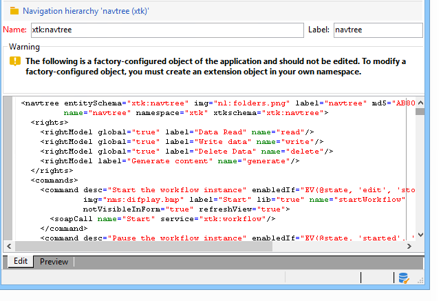

# Bewerking{#edition}

Het scherm voor het creëren van en het vormen van de configuratiedocumenten van de navigatiehiërarchie is toegankelijk via de **[!UICONTROL Administration > Configuration > Navigation hierarchies]** knoop:

De configuratie van de navigatiehiërarchie is verdeeld over verscheidene documenten van XML. Het werkt op een gelijkaardig beginsel zoals schemauitbreiding: alle documenten worden samengevoegd om één document te genereren dat de volledige configuratie bevat. Dit document kan niet worden bewerkt en wordt weergegeven via het tabblad Voorbeeld.

Het bewerkingsveld bevat de inhoud van het XML-document:

>[!NOTE]
>
>Met het besturingselement Naam bewerken kunt u de documentsleutel invoeren die bestaat uit de naam en naamruimte. De kenmerken &quot;name&quot; en &quot;namespace&quot; van het element **`<navtree>`** worden automatisch bijgewerkt in het XML-bewerkingsveld van het schema.

In de voorvertoning wordt automatisch het samengevoegde document met de volledige configuratie gegenereerd:

