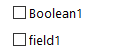

# Formulierstructuur{#form-structure}

De beschrijving van een formulier is een gestructureerd XML-document waarin de grammatica van het formulierschema **xtk:form** wordt gevolgd.

Het XML-document van het invoerformulier moet het `<form>` hoofdelement bevatten met de kenmerken **name** en **namespace** om de naam en naamruimte van het formulier te vullen.

```
<form name="form_name" namespace="name_space">
...
</form>
```

Een formulier is standaard gekoppeld aan het gegevensschema met dezelfde naam en naamruimte. Als u een formulier wilt koppelen aan een andere naam, stelt u het kenmerk **entiteit-schema** van het `<form>` element in op de naam van de schemasleutel. Als u de structuur van een invoerformulier wilt illustreren, kunt u een interface beschrijven met het voorbeeldschema &quot;focus:receiver&quot;:

```
<srcSchema name="recipient" namespace="cus">
  <enumeration name="gender" basetype="byte">    
    <value name="unknown" label="Not specified" value="0"/>    
    <value name="male" label="Male" value="1"/>   
    <value name="female" label="Female" value="2"/>   
  </enumeration>

  <element name="recipient">
    <attribute name="email" type="string" length="80" label="Email" desc="E-mail address of recipient"/>
    <attribute name="birthDate" type="datetime" label="Date"/>
    <attribute name="gender" type="byte" label="Gender" enum="gender"/>
  </element>
</srcSchema>
```

Het invoerformulier op basis van het voorbeeldschema:


```
<form name="recipient" namespace="cus">
  <input xpath="@gender"/>
  <input xpath="@birthDate"/>
  <input xpath="@email"/>
</form>
```

De beschrijving van de bewerkingsbesturingselementen begint bij het `<form>` hoofdelement. Een bewerkingsbesturingselement wordt ingevoerd in een **`<input>`** element met het kenmerk **xpath** dat het pad van het veld in het schema bevat.

Het bewerkingsbesturingselement past zich automatisch aan het overeenkomstige gegevenstype aan en gebruikt het label dat in het schema is gedefinieerd.

>[!NOTE]
>
>U kunt het label dat in het gegevensschema is gedefinieerd, overladen door het **labelkenmerk** aan het `<input>` element toe te voegen:\
>`<input label="E-mail address" xpath="@name" />`

Elk veld wordt standaard weergegeven op één regel en neemt alle beschikbare ruimte in beslag, afhankelijk van het type gegevens.

## Opmaak {#formatting}

De lay-out van de besturingselementen lijkt op de lay-out die wordt gebruikt in HTML-tabellen, met de mogelijkheid om een besturingselement te verdelen in meerdere kolommen, elementen te interliniëren of de bezetting van de beschikbare ruimte op te geven. Houd er echter rekening mee dat u met de opmaak het gebied alleen door verhoudingen kunt opsplitsen. u kunt geen vaste afmetingen opgeven voor een object.

De besturingselementen van het bovenstaande voorbeeld in twee kolommen weergeven:


```
<form name="recipient" namespace="cus">
  <container colcount="2">
    <input xpath="@gender"/>
    <input xpath="@birthDate"/>
    <input xpath="@email"/>
  </container>
</form>
```

Met het **`<container>`** element met het kenmerk **colcount** kunt u de weergave van onderliggende besturingselementen op twee kolommen forceren.

Het **colspan** attribuut op een controle breidt de controle door het aantal kolommen uit ingegaan in zijn waarde:


```
<form name="recipient" namespace="cus">
  <container colcount="2">
    <input xpath="@gender"/>
    <input xpath="@birthDate"/>
    <input xpath="@email" colspan="2"/>
  </container>
</form> 
```

Door het **type=&quot;frame&quot;** attribuut te vullen, voegt de container een kader rond de kindcontroles met het etiket in het **etiketattribuut** toe:


```
<form name="recipient" namespace="cus">
  <container colcount="2" type="frame" label="General">
    <input xpath="@gender"/>
    <input xpath="@birthDate"/>
    <input xpath="@email" colspan="2"/>
  </container>
</form>
```

Een **`<static>`** element kan worden gebruikt om het invoerformulier op te maken:


```
<form name="recipient" namespace="cus">
  <static type="separator" colspan="2" label="General"/>
  <input xpath="@gender"/>
  <input xpath="@birthDate"/>
  <input xpath="@email" colspan="2"/>
  <static type="help" label="General information about recipient with date of birth, gender, and e-mail address." colspan="2"/>
</form>
```

Met de **`<static>`** tag met het **scheidingsteken** kunt u een scheidingsbalk toevoegen met een label in het **labelkenmerk** .

Er is een Help-tekst toegevoegd met de `<static>` tag met het type help. De inhoud van de tekst wordt ingevoerd in het **labelkenmerk** .

## Containers {#containers}

Met containers kunt u een set besturingselementen groeperen. Zij worden vertegenwoordigd door het **`<container>`** element. Deze werden hierboven gebruikt om besturingselementen in te delen in meerdere kolommen.

Het **xpath** attribuut op een `<container>` laat u het van verwijzingen voorzien van kindcontroles vereenvoudigen. De verwijzing van controles is dan met betrekking tot de ouder `<container>` ouder.

Voorbeeld van een container zonder &quot;xpath&quot;:

```
<container colcount="2">
  <input xpath="location/@zipCode"/>
  <input xpath="location/@city"/>
</container>
```

Voorbeeld met de toevoeging van &quot;xpath&quot; aan het element &quot;location&quot;:

```
<container colcount="2" xpath="location">
  <input xpath="@zipCode"/>
  <input xpath="@city"/>
</container>
```

### Typen containers {#types-of-container}

Containers worden gebruikt om complexe besturingselementen samen te stellen met een set velden die zijn opgemaakt in pagina&#39;s.

#### Tabcontainer {#tab-container}

Met een tabcontainer worden gegevens op pagina&#39;s opgemaakt die toegankelijk zijn via tabs.


```
<container type="notebook">
  <container colcount="2" label="General">
    <input xpath="@gender"/>
    <input xpath="@birthDate"/>
    <input xpath="@email" colspan="2"/>
  </container>
  <container colcount="2" label="Location">
    ...
  </container>
</container>
```

De hoofdcontainer wordt gedefinieerd door het kenmerk **type=&quot;notebook&quot;** . Tabs worden gedeclareerd in de onderliggende containers en het label van de tabbladen wordt gevuld vanuit het **labelkenmerk** .

>[!NOTE]
>
>Met de functie **style=&quot;down|up**(standaard)**&quot;** wordt de verticale plaatsing van tablabels onder of boven het besturingselement forceerd. Deze functie is optioneel.
>
>`<container style="down" type="notebook">  ... </container>`

#### Pictogramlijst {#icon-list}

In deze container wordt een verticale pictogrambalk weergegeven waarmee u de pagina&#39;s kunt selecteren die u wilt weergeven.


```
<container type="iconbox">
  <container colcount="2" label="General" img="xtk:properties.png">
    <input xpath="@gender"/>
    <input xpath="@birthDate"/>
    <input xpath="@email" colspan="2"/>
  </container>
  <container colcount="2" label="Location" img="nms:msgfolder.png">
    ...
  </container>
</container>
```

De hoofdcontainer wordt gedefinieerd door het kenmerk **type=&quot;iconbox&quot;** . De pagina&#39;s die aan de pictogrammen zijn gekoppeld, worden gedeclareerd in de onderliggende containers. Het label van de pictogrammen wordt gevuld vanuit het **labelkenmerk** .

Het pictogram van een pagina wordt gevuld vanuit het `img="<image>"` kenmerk, waarbij `<image>` de naam van de afbeelding overeenkomt met de sleutel die uit de naam en naamruimte bestaat (bijvoorbeeld &quot;xtk:properties.png&quot;).

De afbeeldingen zijn beschikbaar via het **[!UICONTROL Administration > Configuration > Images]** knooppunt.

#### Visibility container {#visibility-container}

U kunt een set besturingselementen maskeren via een dynamische voorwaarde.

Dit voorbeeld illustreert de zichtbaarheid van besturingselementen voor de waarde van het veld Geslacht:

```
<container type="visibleGroup" visibleIf="@gender=1">
  ...
</container>
<container type="visibleGroup" visibleIf="@gender=2">
  ...
</container>
```

Een zichtbaarheidscontainer wordt gedefinieerd door het attribuut **type=&quot;visibleGroup&quot;**. Het **kenmerk visibleIf** bevat de zichtbaarheidsvoorwaarde.

Voorbeelden van syntaxis van voorwaarde:

* **visibleIf=&quot;@email=&#39;peter.martinezATneeolane.net&#39;&quot;**: test gelijkheid op koord-type gegevens. De vergelijkingswaarde moet tussen aanhalingstekens staan.
* **visibleIf=&quot;@gender >= 1 en @gender != 2&quot;**: voorwaarde op een numerieke waarde.
* **visibleIf=&quot;@boolean1==true of @boolean2==false&quot;**: testen op Booleaanse velden.

#### Container inschakelen {#enabling-container}

Met deze container kunt u een set gegevens in- of uitschakelen vanuit een dynamische voorwaarde. Als u een besturingselement uitschakelt, wordt het niet bewerkt. In het volgende voorbeeld wordt getoond hoe besturingselementen kunnen worden ingeschakeld met behulp van de waarde van het veld &quot;Geslacht&quot;:

```
<container type="enabledGroup" enabledIf="@gender=1">
  ...
</container>
<container type="enabledGroup" enabledIf="@gender=2">
  ...
</container>
```

Een toelatende container wordt bepaald door het **type=&quot;enabledGroup&quot;** attribuut. Het **enabledIf** attribuut bevat de activeringsvoorwaarde.

## Een koppeling bewerken {#editing-a-link}

Vergeet niet dat een koppeling als volgt in het gegevensschema wordt gedeclareerd:

```
<element label="Company" name="company" target="cus:company" type="link"/>
```

De bewerkingscontrole voor de koppeling in de invoervorm is als volgt:


```
<input xpath="company"/>
```

Doelselectie is toegankelijk via het bewerkingsveld. Invoer wordt ondersteund door &#39;type-ahead&#39;, zodat een doelelement gemakkelijk kan worden gevonden op basis van de eerste paar ingevoerde tekens. Het onderzoek wordt dan gebaseerd op het **Compute koord** dat in het gerichte schema wordt bepaald. Als het schema niet bestaat na bevestiging in de controle, wordt een bevestigingsbericht van de verwezenlijking van het on-the-fly doel getoond. De bevestiging leidt tot een nieuw verslag in de doellijst en associeert het met de verbinding.

Een vervolgkeuzelijst wordt gebruikt om een doelelement te selecteren in de lijst met records die al zijn gemaakt.

Met het pictogram **[!UICONTROL Modify the link]** (map) wordt een selectieformulier gestart met de lijst met doelelementen en een filterzone:


Met het pictogram **[!UICONTROL Edit link]** (vergroting) wordt de bewerkvorm van het gekoppelde element gestart. Het gebruikte formulier wordt standaard afgetrokken op de sleutel van het doelschema. Met het **formulierkenmerk** kunt u de naam van het bewerkingsformulier afdwingen (bijvoorbeeld &quot;cus:company2&quot;).

U kunt de keuze van doelelementen beperken door het **`<sysfilter>`** element uit de koppelingsdefinitie in het invoerformulier toe te voegen:

```
<input xpath="company">
  <sysFilter>
    <condition expr="[location/@city] =  'Newton"/>
  </sysFilter>
</input>
```

U kunt de lijst ook sorteren met het **`<orderby>`** element:

```
<input xpath="company">
  <orderBy>
    <node expr="[location/@zipCode]"/>
  </orderBy>
</input>
```

### Eigenschappen van besturing {#control-properties}

* **noAutoComplete**: schakelt type-vooruit uit (met de waarde &quot;waar&quot;)
* **createMode**: maakt de koppeling direct als deze niet bestaat. Mogelijke waarden zijn:

   * **geen**: schakelt creatie uit. Er wordt een foutbericht weergegeven als de koppeling niet bestaat
   * **inline**: maakt de koppeling met de inhoud in het bewerkingsveld
   * **editie**: geeft het bewerkingsformulier weer op de koppeling. Wanneer het formulier wordt gevalideerd, worden de gegevens opgeslagen (standaardmodus)

* **noZoom**: geen formulier bewerken op de koppeling (met de waarde &quot;true&quot;)
* **formulier**: Hiermee wordt de bewerkingsvorm van het doelelement overbelast

## Lijst met koppelingen {#list-of-links}

Een verbinding ingegaan in het gegevensschema als inzamelingselement (unbound= &quot;waar&quot;) moet door een lijst gaan om alle elementen te bekijken verbonden aan het.

Het principe bestaat uit het weergeven van de lijst met gekoppelde elementen die zijn geoptimaliseerd voor het laden van gegevens (downloaden via gegevensbatch, alleen uitvoeren van de lijst als deze zichtbaar is).

Voorbeeld van een verzamelingskoppeling in een schema:

```
<element label="Events" name="rcpEvent" target="cus:event" type="link" unbound="true">
...
</element>
```

De lijst in de invoervorm:


```
 <input xpath="rcpEvent" type="linklist">
  <input xpath="@label"/>
  <input xpath="@date"/>
</input>
```

De controle van de lijst wordt bepaald door het **type=&quot;linklist&quot;** attribuut. Het lijstpad moet naar de verzamelingskoppeling verwijzen.

De kolommen worden gedeclareerd via de **`<input>`** elementen van de lijst. Het kenmerk **xpath** verwijst naar het pad van het veld in het doelschema.

Een werkbalk met een label (gedefinieerd op de koppeling in het schema) wordt automatisch boven de lijst geplaatst.

De lijst kan via de **[!UICONTROL Filters]** knoop worden gefiltreerd en worden gevormd om de kolommen toe te voegen en te sorteren.

Met de **[!UICONTROL Add]** knoppen en **[!UICONTROL Delete]** knoppen kunt u verzamelingselementen aan de koppeling toevoegen en verwijderen. Standaard wordt bij het toevoegen van een element de bewerkingsvorm van het doelschema gestart.

De **[!UICONTROL Detail]** knop wordt automatisch toegevoegd wanneer het kenmerk **zoom=&quot;true&quot;** is ingevuld in het **`<input>`** label van de lijst: hiermee kunt u het bewerkingsformulier van de geselecteerde regel starten.

Filteren en sorteren kan worden toegepast wanneer de lijst wordt geladen:

```
 <input xpath="rcpEvent" type="linklist">
  <input xpath="@label"/>
  <input xpath="@date"/>
  <sysFilter>
    <condition expr="@type = 1"/>
  </sysFilter>
  <orderBy>
    <node expr="@date" sortDesc="true"/>
  </orderBy>
</input>
```

### Relatietabel {#relationship-table}

Met een relatietabel kunt u twee tabellen koppelen aan N-N-kardinaliteit. De relatietabel bevat alleen de koppelingen naar de twee tabellen.

Als u een element aan de lijst toevoegt, kunt u daarom een lijst van een van de twee koppelingen in de relatietabel voltooien.

Voorbeeld van een relatietabel in een schema:

```
<srcSchema name="subscription" namespace="cus">
  <element name="recipient" type="link" target="cus:recipient" label="Recipient"/>
  <element name="service" type="link" target="cus:service" label="Subscription service"/>
</srcSchema>
```

Bij ons voorbeeld beginnen we met de invoervorm van het schema &#39;cus:receiver&#39;. De lijst moet de verenigingen met abonnementen aan de diensten tonen en moet u toestaan om een abonnement toe te voegen door een bestaande dienst te selecteren.


```
<input type="linklist" xpath="subscription" xpathChoiceTarget="service" xpathEditTarget="service" zoom="true">
  <input xpath="recipient"/>
  <input xpath="service"/>
</input>
```

Met het **kenmerk xpathChoiceTarget** kunt u een selectievorm starten vanuit de ingevoerde koppeling. Het creëren van het verslag van de relatietabel zal automatisch de verbinding aan de huidige ontvanger en de geselecteerde dienst bijwerken.

>[!NOTE]
>
>Met het **kenmerk xpathEditTarget** kunt u het bewerken van de geselecteerde regel op de ingevoerde koppeling forceren.

### Eigenschappen van List {#list-properties}

* **noToolbar**: verbergt de werkbalk (met de waarde &quot;true&quot;)
* **toolbarCaption**: Hiermee wordt het werkbalklabel overbelast
* **toolbarAlign**: wijzigt de verticale of horizontale geometrie van de werkbalk (mogelijke waarden: &quot;vertical&quot;|&quot;horizontal&quot;)
* **img**: Hiermee geeft u de afbeelding weer die aan de lijst is gekoppeld
* **formulier**: Hiermee wordt de bewerkingsvorm van het doelelement overbelast
* **zoomen**: voegt de **[!UICONTROL Zoom]** knop toe om het doelelement te bewerken
* **xpathEditTarget**: sets die de ingevoerde koppeling bewerken
* **xpathChoiceTarget**: start bovendien het selectievorm op de ingevoerde koppeling

## Besturingselementen geheugenlijst {#memory-list-controls}

Met geheugenlijsten kunt u de verzamelingselementen bewerken door de lijstelementen vooraf te laden. Deze lijst kan niet worden gefilterd of worden gevormd.

Deze lijsten worden gebruikt op XML in kaart gebrachte inzamelingselementen of op laag-volumeverbindingen.

### Kolomlijst {#column-list}

Met dit besturingselement wordt een bewerkbare kolomlijst weergegeven met een werkbalk die knoppen Toevoegen en Verwijderen bevat.


```
<input xpath="rcpEvent" type="list">
  <input xpath="@label"/>
  <input xpath="@date"/>
</input>
```

De lijstcontrole moet met het **type=&quot;list&quot;** attribuut worden ingevuld, en de weg van de lijst moet naar het inzamelingselement verwijzen.

De kolommen worden gedeclareerd in de onderliggende **`<input>`** codes van de lijst. Kolomlabel en -grootte kunnen worden geforceerd met de kenmerken **label** en **colSize** .

>[!NOTE]
>
>Pijlen in de sorteervolgorde worden automatisch toegevoegd wanneer het kenmerk **ordered=&quot;true&quot;** wordt toegevoegd aan het verzamelingselement in het gegevensschema.

De werkbalkknoppen kunnen horizontaal worden uitgelijnd:


```
<input nolabel="true" toolbarCaption="List of events" type="list" xpath="rcpEvent" zoom="true">
  <input xpath="@label"/>
  <input xpath="@date"/>
</input>
```

Het **kenmerk toolbarCaption** forceert de horizontale uitlijning van de werkbalk en voert de titel boven de lijst in.

#### Inzoomen op een lijst {#zoom-in-a-list}

U kunt de gegevens in een lijst invoegen en bewerken in een afzonderlijk bewerkingsformulier.


```
<input nolabel="true" toolbarCaption="List of events" type="list" xpath="rcpEvent" zoom="true" zoomOnAdd="true">
  <input xpath="@label"/>
  <input xpath="@date"/>

  <form colcount="2" label="Event">
    <input xpath="@label"/>
    <input xpath="@date"/>
  </form>
</input>
```

Het bewerkingsformulier wordt ingevuld vanaf het `<form>` element onder de lijstdefinitie. De structuur is identiek aan die van een invoerformulier. De **[!UICONTROL Detail]** knop wordt automatisch toegevoegd wanneer het kenmerk **zoom=&quot;true&quot;** is ingevuld in het **`<input>`** label van de lijst. Met dit kenmerk kunt u het bewerkingsformulier van de geselecteerde regel starten.

>[!NOTE]
>
>Als u het kenmerk **zoomOnAdd=&quot;true&quot;** toevoegt, wordt het bewerkingsformulier automatisch opgeroepen wanneer een lijstelement wordt ingevoegd.

### Eigenschappen van List {#list-properties-1}

* **noToolbar**: verbergt de werkbalk (met de waarde &quot;true&quot;)
* **toolbarCaption**: Hiermee wordt het werkbalklabel overbelast
* **toolbarAlign**: wijzigt de positie van de werkbalk (mogelijke waarden: &quot;vertical&quot;|&quot;horizontal&quot;)
* **img**: Hiermee geeft u de afbeelding weer die aan de lijst is gekoppeld
* **formulier**: Hiermee wordt de bewerkingsvorm van het doelelement overbelast
* **zoomen**: voegt de **[!UICONTROL Zoom]** knop toe om het doelelement te bewerken
* **zoomOnAdd**: Hiermee wordt het bewerkingsformulier gestart als het wordt toegevoegd
* **xpathChoiceTarget**: start bovendien het selectievorm op de ingevoerde koppeling

## Niet-bewerkbare velden {#non-editable-fields}

Als u een veld wilt weergeven en wilt voorkomen dat het wordt bewerkt, gebruikt u de **`<value>`** tag of vult u het kenmerk **readOnly=&quot;true&quot;** in op de **`<input>`** tag.

Voorbeeld op het veld &quot;Geslacht&quot;:


```
<value value="@gender"/>
<input xpath="@gender" readOnly="true"/>
```

## Keuzerondje {#radio-button}

Met een keuzerondje kunt u kiezen uit verschillende opties. De **`<input>`** markeringen worden gebruikt om van de mogelijke opties een lijst te maken, en het **checkedValue** attribuut specificeert de waarde verbonden aan de keus.

Voorbeeld op het veld &quot;Geslacht&quot;:

```
<input type="RadioButton" xpath="@gender" checkedValue="0" label="Choice 1"/>
<input type="RadioButton" xpath="@gender" checkedValue="1" label="Choice 2"/>
<input type="RadioButton" xpath="@gender" checkedValue="2" label="Choice 3"/>
```


## Selectievakje {#checkbox}

Een selectievakje geeft een Booleaanse status weer (geselecteerd of niet). Dit besturingselement wordt standaard gebruikt door Booleaanse velden (true/false). Een variabele met de standaardwaarde 0 of 1 kan aan deze knop worden gekoppeld. Deze waarde kan worden overbelast via de **kenmerken checkValue** .

```
<input xpath="@boolean1"/>
<input xpath="@field1" type="checkbox" checkedValue="Y"/>
```



## Navigatiehiërarchie bewerken {#navigation-hierarchy-edit}

Deze controle bouwt een boom op een reeks gebieden om uit te geven.

De te bewerken besturingselementen worden gegroepeerd in een **`<container>`** item dat onder het **`<input>`** label van het structuurbesturingselement wordt ingevoerd:

```
<input nolabel="true" type="treeEdit">
  <container label="Text fields">
    <input xpath="@text1"/>
    <input xpath="@text2"/>
  </container>
  <container label="Boolean fields">
    <input xpath="@boolean1"/>
    <input xpath="@boolean2"/>
  </container>
</input>
```


## Expressieveld {#expression-field}

Een expressieveld werkt een veld dynamisch bij vanuit een expressie. de **`<input>`** tag wordt gebruikt met een **xpath** -kenmerk om het pad in te voeren van het veld dat moet worden bijgewerkt en een **expr** -kenmerk dat de update-expressie bevat.

```
<!-- Example: updating the boolean1 field from the value contained in the field with path /tmp/@flag -->
<input expr="Iif([/tmp/@flag]=='On', true, false)" type="expr" xpath="@boolean1"/>
<input expr="[/ignored/@action] == 'FCP'" type="expr" xpath="@launchFCP"/>
```

## Context van formulieren {#context-of-forms}

Door het uitvoeren van een invoerformulier wordt een XML-document geïnitialiseerd dat de gegevens bevat van de entiteit die wordt bewerkt. Dit document vertegenwoordigt de context van het formulier en kan als werkruimte worden gebruikt.

### De context bijwerken {#updating-the-context}

Als u de context van het formulier wilt wijzigen, gebruikt u de **`<set expr="<value>" xpath="<field>"/>`** code, waar **`<field>`** is het doelveld, en **`<value>`** is dit de update-expressie of waarde.

Voorbeelden van het gebruik van de **`<set>`** tag:

* **`<set expr="'Test'" xpath="/tmp/@test" />`**: Hiermee wordt de waarde &#39;Testen&#39; op de tijdelijke locatie geplaatst. /tmp/@test1
* **`<set expr="'Test'" xpath="@lastName" />`**: Hiermee wordt de entiteit in het kenmerk &quot;lastName&quot; bijgewerkt met de waarde &quot;Test&quot;
* **`<set expr="true" xpath="@boolean1" />`**: stelt de waarde van het veld &quot;boolean1&quot; in op &quot;true&quot;
* **`<set expr="@lastName" xpath="/tmp/@test" />`**: updates met de inhoud van het kenmerk &quot;lastName&quot;

De context van het formulier kan worden bijgewerkt tijdens het initialiseren en sluiten van het formulier via de **`<enter>`** tags en **`<leave>`** codes.

```
<form name="recipient" namespace="cus">
  <enter>
    <set...
  </enter>
  ...
  <leave>
    <set...
  </leave>
</form>
```

>[!NOTE]
>
>De `<enter>` - en `<leave>` `<container>` -tags kunnen worden gebruikt op pagina&#39;s (&#39;notebook&#39; en &#39;iconbox&#39;-typen).

### Expressietaal {#expression-language-}

Een macrotaal kan in formulierdefinitie worden gebruikt om voorwaardelijke tests uit te voeren.

De **`<if expr="<expression>" />`** tag voert de instructies uit die onder de tag zijn opgegeven als de expressie wordt geverifieerd:

```
<if expr="([/tmp/@test] == 'Test' or @lastName != 'Doe') and @boolean2 == true">
  <set xpath="@boolean1" expr="true"/>
</if>
```

De **`<check expr="<condition>" />`** tag in combinatie met de **`<error>`** tag voorkomt validatie van het formulier en geeft een foutbericht weer als niet aan de voorwaarde wordt voldaan:

```
<leave>
  <check expr="/tmp/@test != ''">
    <error>You must populate the 'Test' field!</error> 
  </check>
</leave>
```

## Wizards {#wizards}

Een wizard begeleidt u door een reeks gegevensinvoerstappen in de vorm van pagina&#39;s. De ingevoerde gegevens worden opgeslagen wanneer u het formulier valideert.

Een wizard heeft de volgende structuur:

```
<form type="wizard" name="example" namespace="cus" img="nms:rcpgroup32.png" label="Wizard example" entity-schema="nms:recipient">
  <container title="Title of page 1" desc="Long description of page 1">
    <input xpath="@lastName"/>
    <input xpath="comment"/>
  </container>
  <container title="Title of page 2" desc="Long description of page 2">
    ...
  </container>
  ...
</form>
```


Met de aanwezigheid van het kenmerk **type=&quot;wizard&quot;** op het `<form>` element kunt u de wizardmodus definiëren in de constructie van het formulier. De pagina&#39;s worden voltooid met `<container>` elementen, onderliggende elementen van het `<form>` element. Het `<container>` element van een pagina wordt gevuld met de titelkenmerken voor de titel en het desc om de beschrijving onder de paginatitel weer te geven. De knoppen **[!UICONTROL Previous]** en **[!UICONTROL Next]** worden automatisch toegevoegd om te kunnen bladeren tussen pagina&#39;s.

Met de **[!UICONTROL Finish]** knop slaat u de ingevoerde gegevens op en sluit u het formulier.

### SOAP-methoden {#soap-methods}

De uitvoering van de SOAP-methode kan worden gestart vanuit een gevulde **`<leave>`** tag aan het einde van een pagina.

De **`<soapcall>`** tag bevat de aanroep van de methode met de volgende invoerparameters:

```
<soapCall name="<name>" service="<schema>">
  <param type="<type>" exprIn="<xpath>"/>  
  ...
</soapCall>
```

De naam van de dienst en zijn implementatieschema zijn ingegaan via de **naam** en de **dienstattributen** van de **`<soapcall>`** markering.

De invoerparameters worden beschreven op de **`<param>`** elementen onder de **`<soapcall>`** tag.

Het parametertype moet via het **typeattribuut** worden gespecificeerd. De mogelijke typen zijn:

* **tekenreeks**: tekenreeks
* **Booleaans**:Boolean
* **byte**: 8-bits geheel getal
* **kort**: 16-bits geheel getal
* **lang**: 32-bits geheel getal
* **kort**: 16-bits geheel getal
* **dubbel**: drijvende-kommagetal met dubbele precisie
* **DOMElement**: elementtype node

Het **kenmerk exprIn** bevat de locatie van de gegevens die als parameter moeten worden doorgegeven.

**Voorbeeld**:

```
<leave>
  <soapCall name="RegisterGroup" service="nms:recipient">         
    <param type="DOMElement" exprIn="/tmp/entityList"/>         
    <param type="DOMElement" exprIn="/tmp/choiceList"/>         
    <param type="boolean"    exprIn="true"/>       
  </soapCall>
</leave>
```

