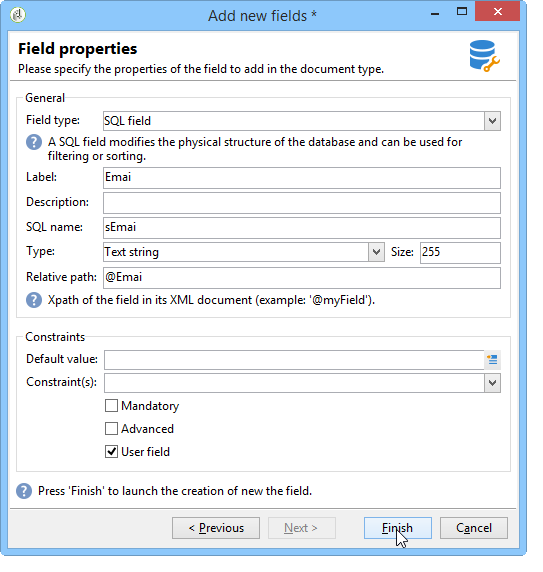

# Wizard Nieuw veld{#new-field-wizard}

Met een wizard die toegankelijk is via **[!UICONTROL Tools > Advanced > Add new fields]** kunt u een of meer velden toevoegen aan een tabel in de database.

Valideren van de wizard werkt het extensieschema bij van de tabel die moet worden uitgebreid en start het SQL-script om de fysieke structuur van de database te wijzigen.

Deze assistent heeft het voordeel om snel een gebied toe te voegen zonder de structuur van een gegevensschema te moeten kennen.

Het belangrijkste nadeel is de beperking van de gegevens en de eigenschappen die moeten worden uitgebreid.

De wizardschermen bevatten de volgende stappen:

1. Op de eerste pagina kunt u de naam invoeren van het schema dat moet worden uitgebreid en de naamruimte van het extensieschema waarin de wijzigingen worden opgeslagen:

   

1. Op de volgende pagina kunt u de eigenschappen invoeren van het veld dat moet worden toegevoegd.

   

1. Klik op de **[!UICONTROL Finish]** knop om de wijzigingen te bevestigen.

In ons voorbeeld wordt automatisch een extensiebestand met de naam &#39;cus:receiver&#39; gemaakt en wordt het bijbehorende SQL-script uitgevoerd:

```
<srcSchema extendedSchema="nms:recipient" label="Recipients" name="recipient"  namespace="cus">  
  <element name="recipient">    
    <attribute belongsTo="cus:recipient" dataPolicy="email" label="Email" length="80" name="email1" sqlname="sEmail1" type="string" user="true"/>  
  </element>
</srcSchema>
```

>[!NOTE]
>
>Standaard worden de toegevoegde velden gedeclareerd met de **gebruiker** van de eigenschap (met de waarde &quot;true&quot;). Hiermee kunt u het veld in de invoervorm van het uitgebreide schema weergeven en bewerken met behulp van een &quot;treeEdit&quot;-type besturingselement (zie Invoerformulier).

