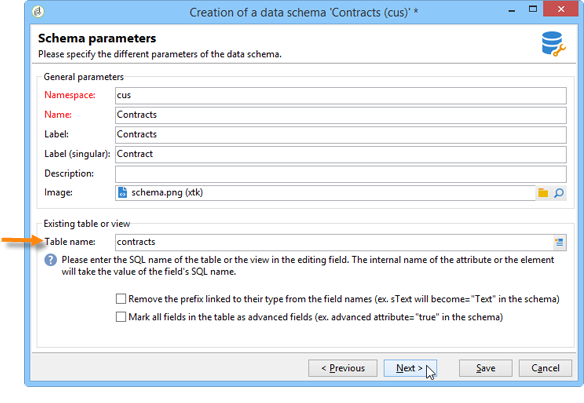

# Schema van een bestaande tabel{#schema-of-an-existing-table}

## Overzicht {#overview}

Wanneer de toepassing toegang moet krijgen tot de gegevens van een bestaande tabel, een SQL-weergave of gegevens uit een externe database, maakt u het schema in Adobe Campaign met de volgende gegevens:

* Naam van tabel: voer de naam in van de tabel (met de alias wanneer een koppeling wordt gebruikt) met het kenmerk &quot;sqltable&quot;.
* schemasleutel: verwijzing naar het (de) afstemmingsveld(en);
* indexen: gebruikt om query&#39;s te genereren;
* De velden en hun locatie in de XML-structuur: vul alleen de velden in die in de toepassing worden gebruikt.
* koppelingen: als er verbindingen zijn met de andere tabellen in de basis.

## Implementatie {#implementation}

Pas de volgende stappen toe om het bijbehorende schema te maken:

1. Bewerk de **[!UICONTROL Administration>Configuration>Data schemas]** knoop van de boom van Adobe Campaign en klik **[!UICONTROL New]** .
1. Selecteer de **[!UICONTROL Access data from an existing table or an SQL view]** en klik op **[!UICONTROL Next]** .

   

1. Kies de tabel of de bestaande weergave:

   

1. Pas de schemainhoud aan uw behoeften aan.

   

   Het schema moet worden gevuld met het kenmerk view=&quot;true&quot; op het tabblad `<srcSchema>` basiselement om geen SQL-script voor het maken van tabellen te genereren.

**Voorbeeld** :

```
<srcSchema name="recipient" namespace="cus" view="true">
  <element name="recipient" sqltable="dbsrv.recipient">
    <key name="email">
      <keyfield xpath="@email"/>
    </key>   
    <attribute name="email" type="string" length="80" sqlname="email"/>
  </element>
</srcSchema>
```

## Een externe database openen {#accessing-an-external-database}

De **Federale gegevenstoegang - FDA** hebt u toegang tot de gegevens die in een externe database zijn opgeslagen.

De configuratie die op de schema&#39;s moet worden gedragen om tot gegevens in een externe gegevensbestand toegang te hebben is gedetailleerd in [deze pagina](../../installation/using/creating-data-schema.md).
