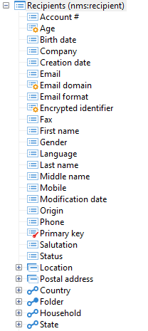

# Structuur van een gegevensschema{#structure-of-a-data-schema}

De structuur van een gegevensschema wordt weergegeven in de vorm van een boomstructuur. Als u het schema grafisch wilt weergeven in de Adobe Campaign-clientconsole, selecteert u het doelschema en klikt u op het **[!UICONTROL Structure]** subtabblad.

De velden worden standaard eerst weergegeven (Actief, Geactiveerd, enz.) en in alfabetische volgorde. De volgende structurerende elementen komen (Postadres, Plaats), en tenslotte de verbindingen (E-mailinformatie, Omslag, enz.).

Primaire sleutels worden geïdentificeerd door een rode sleutel, en vreemde sleutels worden geïdentificeerd door een gele sleutel.

Koppelingen worden grafisch onderscheiden, afhankelijk van het feit of ze tot de tabel behoren. De items die uit de tabel beginnen, dat wil zeggen met de vreemde sleutel in de tabel, worden als eerste weergegeven (e-mailgegevens, Map, Land). &quot;Reverse&quot;inzamelingsverbindingen (Abonnement, Orders, enz.) worden aan het einde weergegeven.
