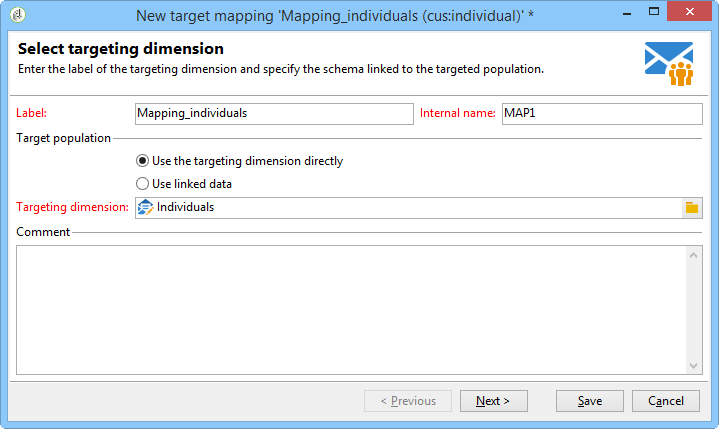

# Targettoewijzing{#target-mapping}

In twee gevallen is het noodzakelijk om doeltoewijzingen te maken:

* als u een andere ontvangertabel gebruikt dan die van Adobe Campaign,
* als u een het filtreren afmeting vormt die van de standaard gericht afmeting op het scherm van de doelafbeelding verschillend is.

De medewerker van de verwezenlijking van de doelafbeelding zal u helpen alle schema&#39;s tot stand brengen die worden vereist om uw douanetabel te gebruiken.

## Schema&#39;s maken en configureren die zijn gekoppeld aan de aangepaste tabel {#creating-and-configuring-schemas-linked-to-the-custom-table}

Alvorens u een doelafbeelding creeert, zijn verscheidene configuraties noodzakelijk opdat Adobe Campaign met een nieuw ontvankelijk gegevensschema werkt.

Hiervoor voert u de volgende stappen uit:

1. Maak een nieuw gegevensschema waarin de velden van de aangepaste tabel die u wilt gebruiken, zijn geïntegreerd.

   Voor verdere informatie, verwijs naar [ Verwijzing van het Schema (xtk:srcSchema) ](../../configuration/using/about-schema-reference.md).

   In ons voorbeeld maken we een klantschema, een zeer eenvoudige tabel met de volgende velden: ID, voornaam, achternaam, e-mailadres, mobiele-telefoonnummer. Het doel is om e-mail- of sms-berichten te kunnen verzenden naar de personen die in deze tabel zijn opgeslagen.

   Voorbeeldschema (cus:individual)

   ```
   <srcSchema name="individual" namespace="cus" label="Individuals">
     <element name="individual">
       <key name="id" internal="true">
         <keyfield xpath="@id"/>
       </key>
       <attribute name="id" type="long" length="32"/>
       <attribute name="lastName" type="string" length="100"/>
       <attribute name="firstName" type="string" length="100"/>
       <attribute name="email" type="string" length="100"/>
       <attribute name="mobile" type="string" length="100"/>
     </element>
   </srcSchema>
   ```

1. Declareer uw schema als externe mening gebruikend het = &quot;ware&quot;attribuut. Verwijs naar [ de meningsattributen ](../../configuration/using/schema-characteristics.md#the-view-attribute).

   ```
    <srcSchema desc="External recipient table" namespace="cus" view="true"....>
      ...
    </srcSchema>
   ```

1. Gebruik de volgende structuur als u een direct-mailadres wilt toevoegen:

   ```
   <element advanced="true" name="postalAddress" template="nms:common:postalAddress">
        <attribute expr="SubString(JuxtWords(Smart([../infos/@firstname]), Upper([../infos/@name])), 1, 80)"
                   name="line1"/>
        <attribute expr="Upper([../address/@line2])" name="line2"/>
        <attribute expr="Upper([../address/@line])" name="line3"/>
        <attribute expr="Upper([../address/@line])" name="line4"/>
        <attribute expr="Upper([../address/@line])" name="line5"/>
        <attribute expr="Upper([../address/@line])" name="line6"/>
        <attribute _operation="delete" name="line7"/>
        <attribute _operation="delete" name="addrErrorCount"/>
        <attribute _operation="delete" name="addrQuality"/>
        <attribute _operation="delete" name="addrLastCheck"/>
        <element expr="@line1+'n'+@line2+'n'+@line3+'n'+@line4+'n'+@line5+'n'+@line6"
                 name="serialized"/>
        <attribute expr="AllNonNull2([../address/@line], [../infos/@name])" name="addrDefined"/>
      </element>
   ```

1. Klik op het knooppunt **[!UICONTROL Administration > Campaign management > Target mappings]** .
1. Klik de **Nieuwe** knoop om de medewerker van de doelafbeelding te openen.
1. Ga het **gebied van het Etiket** in en selecteer het schema dat u net op het **het richten dimensie** gebied hebt gecreeerd.

   

1. In **geef adresvormen** venster uit, selecteer de gebieden van het schema die de diverse leveringsadressen aanpassen. Hier kunnen we de velden **@email** en **@mobile** toewijzen.

   

1. In het volgende **venster van de Opslag**, ga het **Achtervoegsel van de uitbreidingsschema&#39;s** gebied in om de nieuwe schema&#39;s van de uit-van-de-doosschema&#39;s te onderscheiden die door Adobe Campaign worden verstrekt.

   Klik op **[!UICONTROL Define new additional fields]** om de dimensie te selecteren die u wilt gebruiken in de levering.

   Standaard wordt uitsluitingsbeheer opgeslagen in dezelfde tabel als berichten.

   Controleer **een opslagschema voor het volgen** doos produceren als u opslag voor het volgen verbonden aan uw doelafbeelding wilt vormen.

   

   >[!IMPORTANT]
   >
   >Adobe Campaign steunt geen veelvoudige ontvankelijke schema&#39;s, weet als het richten van schema&#39;s, verbonden aan de zelfde brede en/of trackinglogschema&#39;s. Dit kan anders leiden tot anomalieën in de afstemming van gegevens achteraf. Voor meer informatie over dit, verwijs naar de [ Aanbeveling en beperkingen ](../../configuration/using/about-custom-recipient-table.md) pagina.

1. In het **venster van Uitbreidingen**, selecteer de facultatieve schema&#39;s die u wilt produceren (de lijst van beschikbare schema&#39;s hangt van de modules af die op het platform van Adobe Campaign worden geïnstalleerd).

   

1. Klik **sparen** knoop om de medewerker te sluiten.

   De medewerker gebruikt het beginschema om alle andere schema&#39;s tot stand te brengen die worden vereist om het nieuwe werk van de doelafbeelding te maken.

   

## Doeltoewijzing gebruiken {#using-target-mapping}

Er zijn twee manieren om het nieuwe schema als doel van een levering te gebruiken:

* Een of meer leveringssjablonen maken op basis van toewijzing
* Selecteer direct toewijzingen tijdens doelselectie wanneer het creëren van een levering, zoals hieronder getoond:


