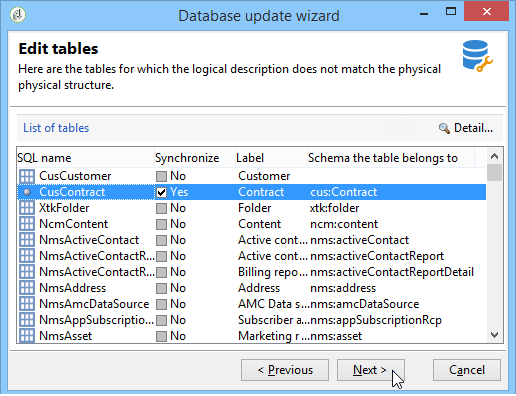

# De databasestructuur bijwerken{#updating-the-database-structure}

Als u de wijzigingen die zijn aangebracht in de schema&#39;s wilt toepassen, start u de wizard voor databaseupdates. Deze wizard is toegankelijk via **[!UICONTROL Tools > Advanced > Update database structure]** . Het controleert of de fysieke structuur van het gegevensbestand zijn logische beschrijving aanpast en de SQL updatescripts uitvoert.

De modules in het gegevensbestand worden automatisch bevolkt en geactiveerd.

De **[!UICONTROL Add stored procedures]** en **[!UICONTROL Import initialization data]** opties worden gebruikt om de eerste SQL-scripts en gegevenspakketten te starten die worden uitgevoerd wanneer de database wordt gemaakt.

U kunt een set gegevens importeren uit een extern gegevenspakket. U doet dit door het XML-bestand van het pakket te selecteren **[!UICONTROL Import a package]** en in te voeren.

Voer de stappen uit en bekijk het SQL-script voor de update van de database:

>[!NOTE]
>
>Dit bevindt zich in een bewerkingsveld en kan worden gewijzigd om SQL-code te verwijderen of toe te voegen.

Start vervolgens de database-update:

