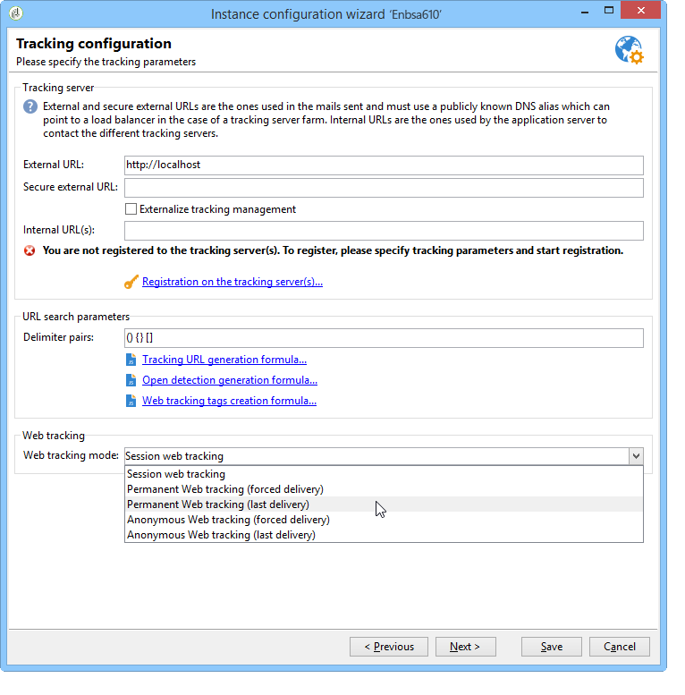

# Webtrackingmodus{#web-tracking-mode}


Met Adobe Campaign kunt u een webvolgmodus selecteren waarmee wordt gedefinieerd hoe trackinglogbestanden in de toepassing worden verwerkt.

Er zijn drie beschikbare het volgen van het Web wijzen: **&quot;Sessie het volgen&quot;**, **&quot;Permanent het volgen&quot;** en **&quot;Anonieme het volgen&quot;**.



Elke modus heeft specifieke kenmerken. De &quot;permanente&quot;het volgen van het Web wijze omvat de kenmerken van de &quot;zitting&quot;Web het volgen wijze, terwijl de &quot;anonieme&quot;wijze de kenmerken van &quot;permanent&quot;en &quot;zitting&quot;wijzen omvat.

>[!IMPORTANT]
>
>De &quot;anonieme&quot;wijze van het Web het volgen wordt toegelaten door gebrek als het &quot;Leads&quot;pakket wordt toegelaten. In alle andere gevallen, wordt de &quot;zitting&quot;Web het volgen wijze toegelaten door gebrek.
>
>Op elk gewenst moment kan de standaardmodus worden gewijzigd in de wizard voor de implementatie van instanties.

Merk op dat als u het **permanente Web** of **anonieme** het volgen wijze gebruikt, u een index aan de &quot;sourceID&quot;kolom (uuid230) in de volgende lijsten (trackingLogXXX) moet toevoegen:

1. Identificeer de volgende tabel(len) waarop permanente tracering betrekking heeft.
1. Breid de schema&#39;s uit die deze lijsten aanpassen door de volgende lijnen toe te voegen:

```
<dbindex name="sourceId">
 <keyfield xpath="@sourceId"/>
</dbindex>
```

**Permanent {en** Anonieme **het volgen van het Web wijzen omvatten twee opties:** Geforceerde levering **en** Laatste levering **.**

De **Geforceerde levering** optie laat u toe om het herkenningsteken van de levering (@jobid) tijdens het volgen te specificeren.

De **Laatste levering** optie laat u het huidige volgende logboek aan de laatste gevolgde levering verbinden.

**Kenmerken van zittingWeb die volgen:**

In deze modus wordt een trackinglogboek gemaakt voor mensen met een sessiecookie. Dit zijn mensen die op een URL hebben geklikt in een e-mail die door Adobe Campaign is verzonden, zodat we de volgende informatie kunnen bijhouden:

* Leverings-id
* Contactpersoon-id
* leveringslogboek
* permanent cookie (uuid230)
* URL bijhouden
* datum van het trackinglogboek

Met deze Web het volgen wijze, als een deel van de informatie mist, zal geen volgend logboek in de toepassing worden gecreeerd.

Deze modus is voordelig in termen van volume (beperkt aantal records in de tabel trackingLog) en berekening (geen afstemming).

**Kenmerken van de permanente wijze van het Web volgen:**

Met deze webtraceringsmodus kunt u een traceringslogboek maken op basis van de aanwezigheid van het permanente uuuid230-cookie. Als een bezoeker zijn sessie sluit, gebruikt Adobe Campaign het permanente cookie om informatie over de bezoekers te herstellen op basis van eerdere trackinglogboeken. Adobe Campaign voegt een trackinglogbestand opnieuw in als uuid230 van de huidige sessie dezelfde waarde heeft als een uuid230 die al in de volgende tabel is opgeslagen.

Dit betekent dat de bezoeker eerder in Adobe Campaign moet zijn geïdentificeerd (via een levering) om verzoening op uuid230-waarden mogelijk te maken.

Standaard worden zoekopdrachten in vorige logbestanden voor bijhouden uitgevoerd in de tabel &quot;trackingLog&quot;. Als het Leads-pakket is ingeschakeld, doorzoekt Adobe Campaign de tabel &quot;trackingLog&quot; voordat het doorzoekt, naar de tabel &quot;innerLead&quot; voor vorige logrecords voor bijhouden van inhoud.

Deze methode is duur in termen van berekening tijdens logboekaanpassing.

**Kenmerken van de anonieme het volgen van het Web wijze:**

Met deze webtraceringsmodus kunt u een traceringslogboek ophalen dat is gekoppeld aan anonieme navigatie in Adobe Campaign. Er wordt automatisch een traceringslogboek gemaakt voor elke klik op een bijgehouden URL. Dit logboek heeft slechts de waarde van uuid230. Tijdens een marketing campagne, wordt een het volgen logboek gecreeerd automatisch met alle identiteitsinformatie (verwijs naar zitting het volgen). Adobe Campaign zoekt automatisch naar eerdere logs voor een waarde &quot;uuid230&quot; die gelijk is aan de waarde in het trackinglogbestand voor deze marketingcampagne. Als identieke waarden worden gevonden, worden alle vorige het volgen logboeken ingegaan met alle informatie van het het volgen van de marketingcampagne logboek.

Deze wijze is het duurst in termen van berekening en volume.

>[!NOTE]
>
>Als het **[!UICONTROL Leads]** pakket geïnstalleerd is, moet u het zelfde voor de activiteitenlijst doen (**crm:innerLead**)

Het volgende schema vat de functionaliteit van alle drie het volgen wijzen van het Web samen:


**Voorbeeld van het Permanente Web volgen dat op de laatste levering wordt gebaseerd:**

Florence ontvangt een levering, opent de e-mail, klikt op de koppeling, doorbladert op de website van de detailhandel, maar koopt geen aankopen. De volgende dag keert Florence terug naar de winkelsite, bladert en koopt ze. Aangezien het permanent Web volgen (laatste levering) wordt toegelaten, zullen alle logboeken voor haar tweede bezoek aan de levering worden verbonden die aan haar de vorige dag werd verzonden.
