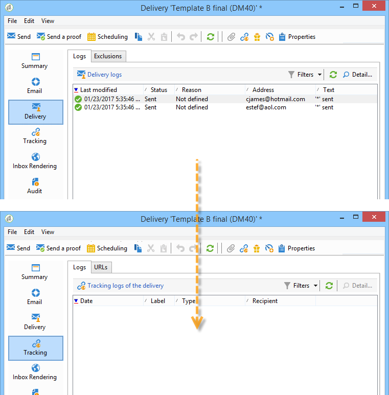

# Het resultaat {#step-8--analyzing-the-result} analyseren

Nadat de testleveringen zijn verzonden, kunt u controleren naar welke ontvanger(s) zij zijn verzonden en of zij al dan niet zijn geopend.

* Om te weten te komen welke ontvangers zijn gericht, open een levering via het campagnesdashboard en klik **[!UICONTROL Delivery]** tabel.

   

* Als u wilt weten of de levering is geopend, gaat u naar het tabblad **[!UICONTROL Tracking]**.

   

* Ben met andere levering vergelijkbaar.

   

In ons voorbeeld heeft levering B de hoogste open snelheid gehaald. Dit betekent dat inhoud B wordt gebruikt voor de uiteindelijke levering.

