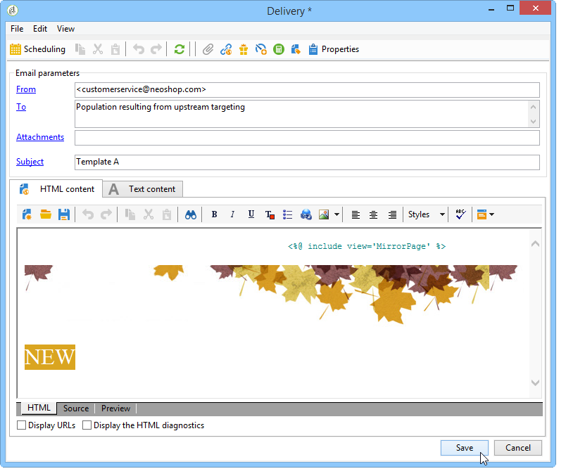

# De leveringen in de workflow configureren {#step-4--configuring-the-deliveries-in-the-workflow}

Eenmaal [populaties worden gecreëerd](a-b-testing-uc-population-samples.md), kunt u de leveringen configureren. In dit geval, laten de eerste twee leveringen u toe om verschillende inhoud naar populatie A en B te verzenden. De derde levering is de levering die terugvalt: het wordt verzonden naar de ontvangers die niet tot A of B behoren. De inhoud ervan wordt berekend met behulp van een script en is gelijk aan A of B, afhankelijk van welke score de hoogste open snelheid heeft behaald. We moeten een wachtperiode configureren voor de derde levering, om het resultaat van de leveringen A en B te achterhalen. Daarom omvat de derde levering een **[!UICONTROL Wait]** activiteit.

1. Ga naar de **[!UICONTROL Split]** activiteit en koppel de overgang voor populatie A aan één van de e-mailleveringen reeds in het werkschema.

   

1. Dubbelklik op de levering om deze te openen.
1. Selecteer de sjabloon voor levering A in de vervolgkeuzelijst.

   

1. Klikken **[!UICONTROL Continue]** om de levering te bekijken, dan sparen het.

   

1. De overgang van de **[!UICONTROL Split]** activiteit bestemd voor populatie B tot de tweede e-maillevering.

   

1. Open de levering en selecteer het malplaatje in levering B, dan sparen de levering.

   

1. Koppel de overgang voor de resterende bevolking aan de **[!UICONTROL Wait]** activiteit.

   

1. Open de **[!UICONTROL Wait]** en configureer een wachttijd van 5 dagen.

   

1. De koppeling **[!UICONTROL Wait]** aan de **[!UICONTROL JavaScript code]** activiteit.

   

U kunt nu het script maken. [Meer informatie](a-b-testing-uc-script.md).
