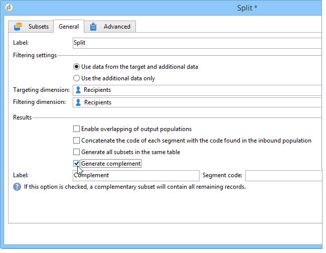

# Bezig met configureren van populatiemonsters {#step-2--configuring-population-samples}

## Het vormen van de activiteit van de Vraag {#configuring-the-query-activity}

* Dubbelklik op de activiteit **[!UICONTROL Query]**.

   

* Klik op de koppeling **[!UICONTROL Edit query]** en selecteer de ontvangers die u als doel wilt instellen.

   

* Koppel de **[!UICONTROL Query]** activiteit aan **[!UICONTROL Split]** activiteit.

   

## De splitsingsactiviteit {#configuring-the-split-activity} configureren

Met deze activiteit kunt u verschillende populaties maken: degene die levering A ontvangt, degene die levering B ontvangt, en de resterende populatie. Door willekeurige selectie te gebruiken, kunt u zich richten op slechts een deel van de populatie van elke levering.

1. Bezig met maken van populatie A:

   * Dubbelklik op de activiteit **[!UICONTROL Split]**.

      

   * Wijzig in het bestaande tabblad het label in populatie A.

      

   * Selecteer de optie **[!UICONTROL Limit the selected records]**.

      

   * Klik op de koppeling **[!UICONTROL Edit]**, selecteer **[!UICONTROL Activate random sampling]** en klik op **[!UICONTROL Next]**.

      

   * Stel de drempel in op 10% en klik op **[!UICONTROL Finish]**.

      

1. Bezig met maken van populatie B:

   * Klik **[!UICONTROL Add]** om een nieuw lusje voor populatie B tot stand te brengen.

      

   * Beperk de bevolking tot 10% zoals eerder.

      

1. Creëren van de resterende populatie:

   * Ga naar het tabblad **[!UICONTROL General]**. 

      

   * Selecteer **[!UICONTROL Generate complement]**.

      

   * Wijzig het label om aan te geven dat deze populatie geen A of B bevat en klik op **[!UICONTROL OK]** om de activiteit te sluiten.

      
