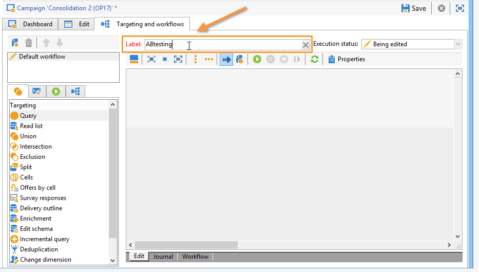

# Een targetingworkflow maken {#step-1--creating-a-targeting-workflow}

U moet uw workflow maken op het tabblad **[!UICONTROL Targeting and Workflows]** van een campagne. Het bestaat uit een **[!UICONTROL Query]** activiteit, een **[!UICONTROL Split]** activiteit verbonden met twee **[!UICONTROL Email delivery]** activiteiten, een **[!UICONTROL Wait]** activiteit, een **[!UICONTROL JavaScript code]** activiteit, en een **[!UICONTROL Delivery]** activiteit.

1. Als u dit nog niet hebt gedaan, creeer een campagne (voor meer op dit, verwijs naar [deze sectie](../../campaign/using/setting-up-marketing-campaigns.md#creating-a-campaign)).

   

1. Ga naar het tabblad **[!UICONTROL Targeting and Workflows]**. 

   

1. Wijzig het label van de bestaande workflow of klik op **[!UICONTROL Add]** om een nieuwe workflow te maken (zie [deze sectie](../../campaign/using/marketing-campaign-deliveries.md#selecting-the-target-population) voor meer informatie).

   

1. Gebruik de muis om activiteiten naar het werkstroomdiagram te slepen, inclusief een **[!UICONTROL Query]** (**[!UICONTROL Target]** tab), een **[!UICONTROL Split]** (**[!UICONTROL Target]** tab), twee **[!UICONTROL Email deliveries]** (**[!UICONTROL Deliveries]** tab), een **[!UICONTROL Wait]** activiteit (**[!UICONTROL Flow Control]** tab), een **[!UICONTROL JavaScript code]** activiteit (**[!UICONTROL Actions]** tab) en een **[!UICONTROL Delivery]** activiteit (**[!UICONTROL Actions]** tabblad).

U kunt nu de bevolkingssteekproeven vormen. [Meer info](a-b-testing-uc-population-samples.md).
