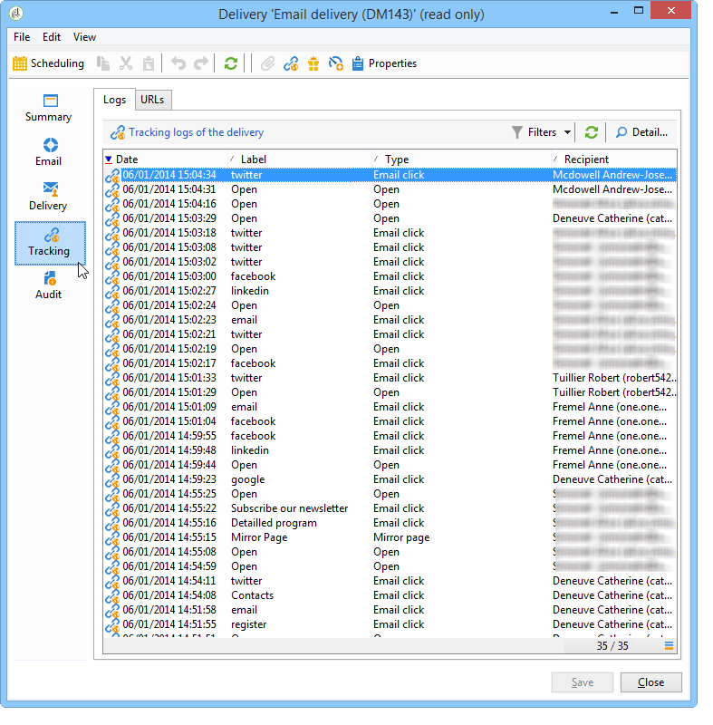

# De trackinglogboeken openen{#accessing-the-tracking-logs}

Wanneer de levering is verzonden en het volgen geactiveerd, is het **[!UICONTROL Tracking]** technische werkschema verantwoordelijk voor het terugwinnen van de het volgen gegevens. Deze wordt standaard per uur uitgevoerd.

Deze informatie wordt weergegeven op het **[!UICONTROL Tracking]** tabblad van het profiel van ontvangers voor wie de levering bestemd is, zoals in het volgende voorbeeld:

Het is ook toegankelijk via het **[!UICONTROL Tracking]** lusje van de levering.

>[!NOTE]
>
>Als u het **[!UICONTROL Tracking]** tabblad van een levering niet ziet, betekent dit dat het bijhouden van gegevens niet is geactiveerd. Zie [deze sectie](../../delivery/using/how-to-configure-tracked-links.md).
