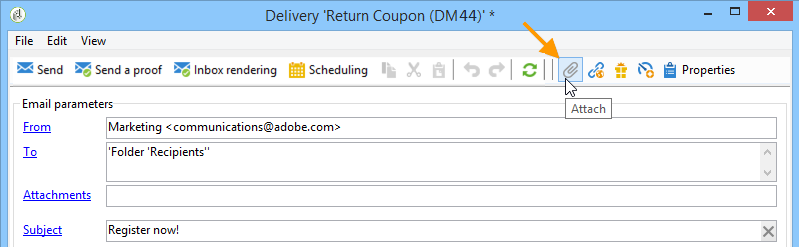
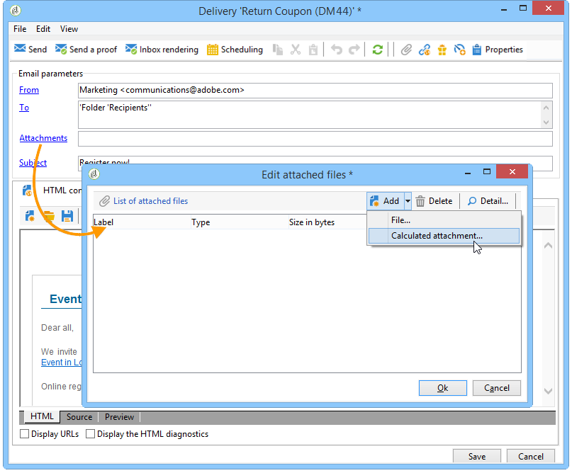
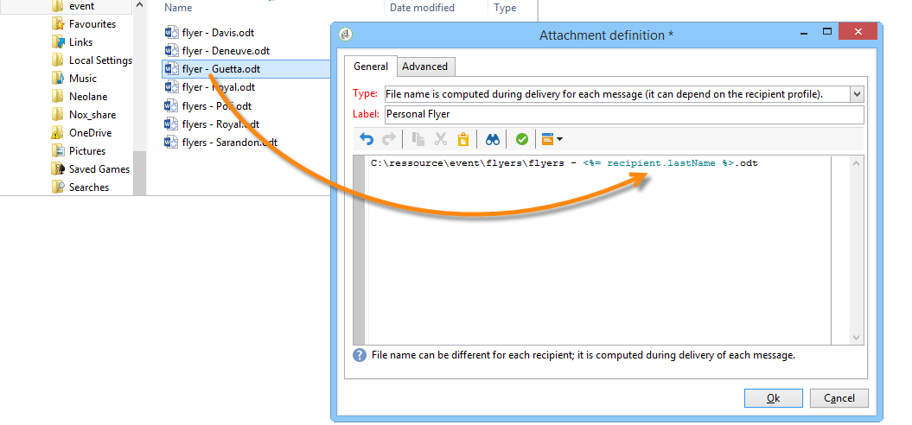

# Bestanden bijvoegen{#attaching-files}

## E-mailbijlagen {#about-email-attachments}

U kunt een of meer bestanden bijvoegen bij een e-maillevering. Er zijn twee mogelijke gevallen:

* Selecteer een bestand en koppel het op dezelfde manier aan de levering.
* Pas de inhoud van de bijlage aan voor elke ontvanger. In dit geval moet u een **berekende bijlage** maken: de naam van de gehechtheid wordt berekend op het tijdstip van levering voor elk bericht afhankelijk van de ontvanger. U kunt de inhoud ook personaliseren en converteren naar PDF-indeling op het moment van levering als u de optie **Variabel digitaal afdrukken** hebt geselecteerd.

>[!NOTE]
>
>Dit type van configuratie wordt over het algemeen uitgevoerd in de leveringsmalplaatjes. Zie [Informatie over sjablonen](../../delivery/using/about-templates.md)voor meer informatie.

## Een lokaal bestand bijvoegen {#attaching-a-local-file}

Volg onderstaande stappen om een lokaal bestand aan een levering te koppelen.

>[!NOTE]
>
>U kunt meerdere bestanden aan een levering koppelen. Bijlagen kunnen elke indeling hebben, inclusief de zipped-indeling.

1. Klik op de **[!UICONTROL Attachments]** koppeling.
1. Klik op de **[!UICONTROL Add]** knop.
1. Klik **[!UICONTROL File...]** om het bestand te selecteren dat aan de levering moet worden gekoppeld.

   

U kunt het bestand ook rechtstreeks slepen en neerzetten in het **[!UICONTROL Attachments]** leveringsveld of het **[!UICONTROL Attach]** pictogram gebruiken op de werkbalk van de wizard voor levering.

Als het bestand is geselecteerd, wordt het direct naar de server geüpload om beschikbaar te zijn op het moment van levering. De naam wordt weergegeven in het **[!UICONTROL Attachments]** veld.

## Een berekende bijlage maken {#creating-a-calculated-attachment}

Wanneer u een berekende gehechtheid creeert, kan de naam van de gehechtheid tijdens analyse of levering van elk bericht worden berekend en kan van de ontvanger afhangen. Het kan ook worden gepersonaliseerd en naar PDF worden geconverteerd.

Voer de volgende stappen uit om een gepersonaliseerde bijlage te maken:

1. Klik op de **[!UICONTROL Attachments]** koppeling.
1. Klik op de **[!UICONTROL Add]** knop en selecteer **[!UICONTROL Calculated attachment]**.
1. Selecteer het type berekening in de **[!UICONTROL Type]** vervolgkeuzelijst:

De volgende opties zijn beschikbaar:

* **Bestandsnaam wordt opgegeven bij het maken van de leveringssjabloon**
* **De inhoud van het bestand wordt gepersonaliseerd en naar PDF geconverteerd tijdens de levering van elk bericht**
* **De bestandsnaam wordt berekend tijdens de leveringsanalyse (deze kan niet afhankelijk zijn van het ontvangende profiel)**
* **De bestandsnaam wordt berekend op het moment van levering voor elke ontvanger (deze kan afhankelijk zijn van de ontvanger)**

### Een lokaal bestand bijvoegen {#attach-a-local-file}

Als de bijlage een lokaal bestand is, selecteert u de optie: **[!UICONTROL File name is specified when creating the delivery template]**. Het bestand wordt lokaal geselecteerd en geüpload naar de server. Voer de onderstaande stappen uit:

1. Selecteer in het **[!UICONTROL Local file]** veld het bestand dat u wilt uploaden.
1. Geef zo nodig het label op. Het label vervangt de bestandsnaam bij weergave in een berichtensysteem. Als er niets is opgegeven, wordt standaard de bestandsnaam gebruikt.

   

1. Selecteer indien nodig de optie **[!UICONTROL Upload file on the server]** en klik vervolgens **[!UICONTROL Update on server]** om de overdracht te starten.

   

   Het bestand is vervolgens beschikbaar op de server die moet worden gekoppeld aan de verschillende leveringen die op basis van deze sjabloon zijn gemaakt.

### Een gepersonaliseerd bericht bijvoegen {#attach-a-personalized-message}

Met deze optie **[!UICONTROL The file content is personalized and converted into PDF format at the time of delivery for each message]** kunt u een bestand met verpersoonlijkingsvelden selecteren, zoals de achternaam en voornaam van de bedoelde ontvanger.

Voor dit type van gehechtheid, pas de volgende configuratiestappen toe:

1. Selecteer het bestand dat u wilt uploaden.

   >[!NOTE]
   >
   >Het bronbestand moet in LiveOffice worden gemaakt. De instantie moet worden gevormd in overeenstemming met de eerste vereisten die in [deze sectie](../../installation/using/before-starting.md)worden gedetailleerd.

1. Geef zo nodig het label op.
1. Selecteer **[!UICONTROL Upload file on the server]** en klik vervolgens **[!UICONTROL Update on server]** om de overdracht te starten.
1. U kunt een voorvertoning weergeven. Selecteer een ontvanger om dit te doen.

   

1. Analyseer uw levering en begin het.

   Elke ontvanger ontvangt een gepersonaliseerde PDF die bij de levering is gevoegd.

   

### Een berekend bestand bijvoegen {#attach-a-calculated-file}

U kunt de naam van de bijlage berekenen tijdens de voorbereiding van de levering. Selecteer de optie om dit te doen **[!UICONTROL The file name is calculated during delivery analysis (it cannot depend on the recipient)]**.

>[!NOTE]
>
>Deze optie wordt alleen gebruikt wanneer de levering wordt verzonden door een extern proces of een workflow.

1. Geef het label op dat u op de bijlage wilt toepassen.
1. Geef het toegangspad van het bestand en de exacte naam ervan op in het definitievenster.

   >[!CAUTION]
   >
   >Het bestand moet aanwezig zijn op de server.

   

1. Analyseer en start de levering.

   De berekening van de bestandsnaam kan worden weergegeven in het analyselogbestand.

   

### Een gepersonaliseerd bestand bijvoegen {#attach-a-personalized-file}

Als u de bijlage selecteert, kunt u de optie kiezen **[!UICONTROL The file name is calculated during delivery for each recipient (it can depend on the recipient)]**. Vervolgens kunt u persoonlijke gegevens van ontvangers toewijzen met de naam van het bestand dat u wilt verzenden.

>[!NOTE]
>
>Deze optie wordt alleen gebruikt wanneer de levering wordt verzonden door een extern proces of een workflow.

1. Geef het label op dat u op de bijlage wilt toepassen.
1. Geef het toegangspad van het bestand en de exacte naam ervan op in het definitievenster. Als de bestandsnaam gepersonaliseerd is, kunt u de velden Aanpassing gebruiken voor de relevante waarden.

   

   >[!CAUTION]
   >
   >Het bestand moet aanwezig zijn op de server.

1. Analyseer en start de levering.

   In het onderstaande voorbeeld is de naam van het bijgevoegde bestand zoals gedefinieerd met de samenvoegvelden.

   

### Bijlageinstellingen {#attachment-settings}

Voor de eerste twee opties kunt u kiezen **[!UICONTROL Upload file on the server]** door de juiste optie te selecteren. Met de **[!UICONTROL Update the file on the server]** koppeling kunt u beginnen met uploaden.

Een bericht geeft aan dat het bestand naar de server is geüpload:

Voor een wijziging van het bestand wordt een waarschuwingsbericht weergegeven:

Op het **[!UICONTROL Advanced]** tabblad kunt u geavanceerde opties definiëren voor bijgevoegde bestanden:

* U kunt filteropties definiëren om te voorkomen dat het bijgevoegde bestand naar alle ontvangers wordt verzonden. De optie **[!UICONTROL Enable filtering of recipients who will receive the attachment]** activeert een invoerveld dat wordt gebruikt om een ontvankelijk selectiescript te bepalen, dat in JavaScript moet zijn ingegaan.
* U kunt de naam van het bestand in een script opnemen om het bestand aan te passen.

   Voer uw tekst in het venster in en gebruik de velden voor personalisatie die beschikbaar zijn in de vervolgkeuzelijst. In het volgende voorbeeld, wordt filename gepersonaliseerd om de datum van vandaag en de naam van de ontvanger te bevatten.

   
