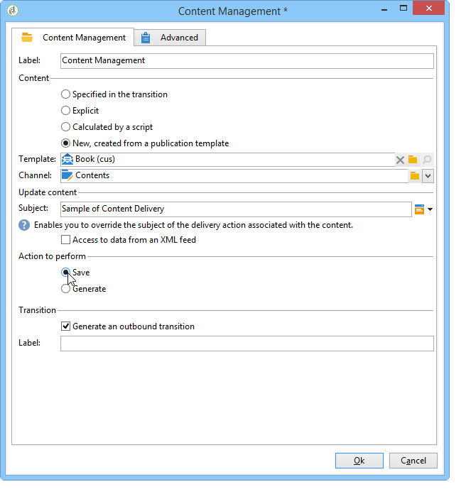
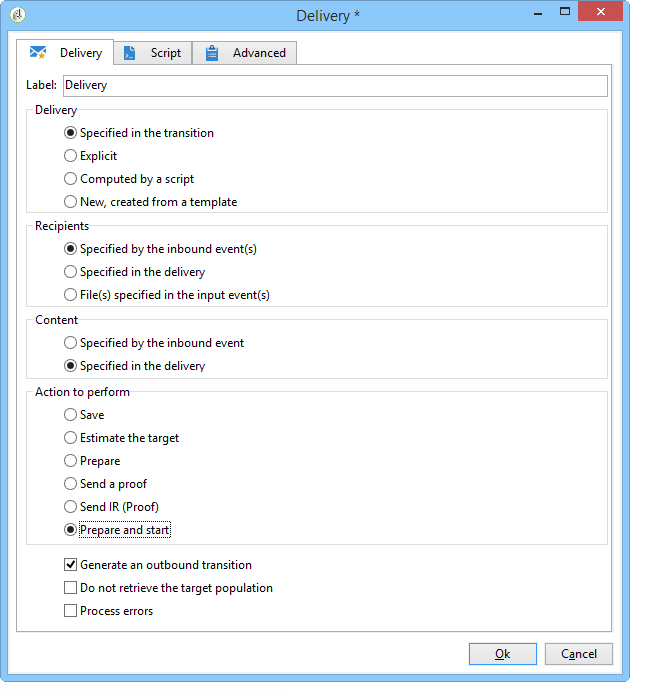

# Automatiseren met workflows{#automating-via-workflows}


## Inhoudsbeheeractiviteiten {#content-management-activity}

Het maken, bewerken en publiceren van inhoud kan worden geautomatiseerd met behulp van een workflow die via de Adobe Campaign-clientinterface is geconfigureerd.

De **Inhoudsbeheer** activiteit is toegankelijk via de **[!UICONTROL Tools]** werkbalk van het werkstroomdiagram.

Activiteiteneigenschappen worden in vier stappen onderverdeeld:

* **[!UICONTROL Content]** : kunt u bestaande inhoud invoeren of inhoud maken.
* **[!UICONTROL Update content]** : Hiermee kunt u het onderwerp van de inhoud wijzigen of de inhoud bijwerken via een XML-gegevensstroom.
* **[!UICONTROL Action to execute]** : Hiermee kunt u inhoud opslaan of genereren.
* **[!UICONTROL Transition]** : Hiermee kunt u kiezen of u een uitvoerovergang wilt genereren en er een naam voor wilt opgeven.


### Inhoud {#content}

* **Door de overgang opgegeven**

   De te gebruiken inhoud is eerder gemaakt. Processen hebben betrekking op de inhoudinstantie die door de binnenkomende gebeurtenis wordt doorgegeven. De inhoud-id wordt benaderd via de variabele &quot;contentId&quot; van de gebeurtenis.

* **Expliciet**

   Hiermee kunt u eerder gemaakte inhoud kiezen.

* **Berekend door een script**

   Hiermee selecteert u een inhoudsinstantie op basis van een JavaScript-sjabloon. Met de code die moet worden geëvalueerd, kunt u de inhoud-id ophalen.

* **Nieuw, gemaakt via een publicatiesjabloon**

   Hiermee maakt u nieuwe inhoud via een publicatiesjabloon. De instantie content wordt opgeslagen in de gevulde map &quot;String&quot;.

### De inhoud bijwerken {#update-the-content}

* **Onderwerp**

   Hiermee kunt u het onderwerp van de leveringsactie tijdens het publiceren wijzigen.

* **Toegang tot de gegevens van een XML-feed**

   De inhoud wordt bijgewerkt vanuit een XML-feed van een externe bron. Er moet een URL worden ingevoerd voordat gegevens kunnen worden gedownload.

   Een XSL-opmaakmodel kan worden gebruikt om de inkomende XML-gegevens te transformeren.

### Uit te voeren handeling {#action-to-execute}

* **Opslaan**

   Hiermee slaat u de gemaakte of gewijzigde inhoud op. De id van de opgeslagen inhoud wordt doorgegeven in de variabele &quot;contentId&quot; van de uitgaande gebeurtenis.

* **Genereren**

   Hiermee genereert u de uitvoerbestanden voor elk van de transformatiesjablonen met een publicatie van het type &quot;Bestand&quot;. De uitgaande overgang wordt geactiveerd voor elk geproduceerd dossier, met de volgende parameters: de id van de inhoud die is opgeslagen in de variabele &quot;contentId&quot; en de bestandsnaam in de variabele &quot;filename&quot;.

### Transition {#transition}

De **Een uitvoerovergang genereren** kunt u een uitvoerovergang toevoegen aan de **[!UICONTROL Content management]** activiteit om een nieuwe activiteit met werkschemauitvoering te verbinden. Nadat u deze optie hebt ingeschakeld, voert u een label voor de overgang in.

## Voorbeelden {#examples}

### Automatisch inhoud maken en leveren {#automating-content-creation-and-delivery}

In het volgende voorbeeld worden het maken en leveren van een inhoudsblok geautomatiseerd.


De inhoud wordt geconfigureerd via de activiteit &quot;Inhoudsbeheer&quot;:


Er wordt een nieuwe instantie van de inhoud gemaakt via het publicatiemodel en de map met de inhoudstekenreeks.

In ons voorbeeld hebben we het bezorgingsonderwerp overbelast. In plaats van de in de **[!UICONTROL Delivery]** sjabloon.

De inhoud wordt automatisch ingevuld door een XML-feed die afkomstig is van de ingevoerde URL:

```
<?xml version='1.0' encoding='ISO-8859-1'?>
<book name="Content automation test" date="2008/06/08" language="eng" computeString="Content automation test">
  <section id="1" name="Introduction">
    <page>Introduction to input forms.</page>
  </section>
</book>
```

De gegevensindeling komt niet overeen met het gegevensschema dat is ingevoerd in de publicatiesjabloon (**focus:boek** in ons voorbeeld); de **`<section>`** moet worden vervangen door de **`<chapter>`** element. We moeten de stijlpagina &quot;cus:book-workflow.xsl&quot; toepassen om de benodigde wijzigingen aan te brengen.

Broncode van de gebruikte XSLT-stijlpagina:

```
<?xml version="1.0" encoding="utf-8"?>
<xsl:stylesheet version="1.0" xmlns:xsl="http://www.w3.org/1999/XSL/Transform">
 <xsl:output indent="yes" method="xml"  encoding="ISO-8859-1"/>

 <xsl:template match="text()|@*"/>

  <xsl:template match="*">
    <xsl:variable name="element.name" select="name(.)"/>
    <xsl:element name="{$element.name}">
      <xsl:copy-of select="text()|@*"/>
      <xsl:apply-templates/>
    </xsl:element>
  </xsl:template>

  <xsl:template match="book">
  <book name="test">
     <xsl:apply-templates/>
    <book>
 </xsl:template>

  <xsl:template match="section">
    <chapter>
      <xsl:for-each select="@*">
        <xsl:copy-of select="."/>
      </xsl:for-each>
       <xsl:apply-templates/>
    </chapter>
  </xsl:template>
  
</xsl:stylesheet>
```

De laatste actie van de activiteit is het opslaan van het inhoudsexemplaar en doorgaan naar de volgende taak.

De gerichte acties worden uitgevoerd via de **Query** activiteit.

An **AND-join** Er is activiteit toegevoegd om ervoor te zorgen dat de levering pas wordt gestart als het zoeken naar doelen en het bijwerken van de inhoud zijn voltooid.

De leveringsactie wordt gevormd via **Aflevering** activiteit:


Er wordt een nieuwe leveringsactie gemaakt op basis van een sjabloon.

De leveringssjabloon van de activiteit wordt gebruikt om de transformatiesjablonen van de publicatiesjabloon te selecteren. Bij het genereren van inhoud wordt rekening gehouden met alle HTML- en tekstsjablonen zonder leveringssjablonen of met sjablonen waarnaar wordt verwezen met dezelfde sjabloon als de activiteit.

Het te leveren doel wordt ingevoerd via de binnenkomende gebeurtenis.

De inhoud van de levering wordt via de binnenkomende gebeurtenis gevuld.

De laatste stap tot het voltooien van de activiteit is het voorbereiden en dan de levering lanceren.

### Inhoud maken voor latere publicatie {#creating-content-and-publishing-it-later}

In dit voorbeeld wordt een inhoudsblok gemaakt en wordt de bestandspublicatie na een bepaalde tijdvertraging gestart.


De eerste **Inhoudsbeheer** maakt een instantie van de inhoud.



>[!NOTE]
>
>De **[!UICONTROL Publication]** tabblad van het venster met transformatiesjablonen moet worden gevuld met de locatie van het te genereren doel.

Een wachtende activiteit wordt toegevoegd om de volgende overgang voor een week te pauzeren.


De inhoud wordt tijdens deze periode handmatig ingevoerd.

De volgende taak start het genereren van inhoud.


De te publiceren inhoud wordt ingevoerd via de inkomende overgang.

De laatste actie bestaat uit het genereren van deze inhoud door de publicatiedirectory te forceren.

De **JavaScript-code** de activiteit wint de volledige naam van elk geproduceerd dossier terug.


### De levering en de inhoud ervan maken {#creating-the-delivery-and-its-content}

In dit voorbeeld wordt hetzelfde concept gebruikt als in het eerste voorbeeld, alleen wordt de actie voor levering in de eerste stap gemaakt.


De eerste **Levering maken** De taak leidt tot de leveringsactie.

Met de vorkactiviteit kunt u de doelberekening starten en de inhoudsinstantie parallel maken.

Zodra de taken zijn uitgevoerd, activeert EN-toets doos **Aflevering** taak om de eerder gemaakte levering van inhoud en het richten te lanceren.



De te starten leveringsactie wordt via de overgang gevuld.

Het te leveren doel wordt ingevoerd via de binnenkomende gebeurtenis.

De inhoud van de levering wordt via de binnenkomende gebeurtenis gevuld.

De laatste actie van de activiteit is het voorbereiden en lanceren van de levering.

### Inhoud importeren vanuit FTP {#importing-content-from-ftp}

Als uw leveringsinhoud beschikbaar is in een HTML-bestand dat zich op FTP- of SFTP-servers bevindt, kunt u deze inhoud gemakkelijk laden in Adobe Campaign-leveringen. Zie [dit voorbeeld](../../workflow/using/loading-delivery-content.md).

### Inhoud importeren uit de Amazon Simple Storage Service (S3)-connector {#importing-content-from-amazon-simple-storage-service--s3--connector}

Als uw leveringsinhoud zich op de emmers van de Dienst van de Eenvoudige Opslag van Amazon (S3) bevindt, kunt u deze inhoud in Adobe Campaign leveringen gemakkelijk laden. Zie [dit voorbeeld](../../workflow/using/loading-delivery-content.md).

## Halfautomatische update {#semi-automatic-update}

Inhoudsgegevens kunnen worden bijgewerkt in de modus &quot;semi-automatisch&quot;. De gegevens worden via een URL hersteld via een XML-feed.

De activering van gegevensherstel wordt handmatig uitgevoerd via het invoerformulier.

Het doel is een **editBtn** type **`<input>`** in het formulier. Dit besturingselement bestaat uit een bewerkingszone en een knop om de verwerking te starten.

In de bewerkingszone kunt u variabele gegevens vullen die worden gebruikt om de URL van de XML-feed met gegevens te maken die moeten worden opgehaald.

De knop voert het **GetAndTransform** SOAP-methode gevuld onder de map **`<input>`** tag.

De controleverklaring is als volgt:

```
<input type="editbtn" xpath="<path>">
  <enter>
    <soapCall name="GetAndTransform" service="ncm:content">
      <param exprIn="<url>" type="string"/>
      <param exprIn="'xtk:xslt|<style sheet>'" type="string"/>
      <param type="DOMElement" xpathOut="<output path>"/>
    </soapCall>
  </enter>
</input>
```

De **GetAndTransform** methode moet worden gedeclareerd in het kader van de **`<enter>`** van het **`<input>`** tag. Deze tag gebruikt als parameters de URL voor het herstellen van XML-gegevens van een dynamisch geconstrueerde expressie. De tweede parameter van de functie is optioneel en verwijst naar een opmaakmodel dat wordt gebruikt voor een tussenliggende transformatie wanneer de inkomende XML-gegevens niet in dezelfde indeling staan als de inhoud.

De uitvoer werkt de inhoud bij op basis van het pad dat in de laatste parameter is ingevoerd.

**Voorbeeld**: Om dit voorbeeld te illustreren, beginnen we met het schema &quot;cus:book&quot;.

Er wordt een half-automatisch invoerformulier voor het bewerken van updates toegevoegd:


```
<input label="File name" type="editbtn" xpath="/tmp/@name">
  <enter>
    <soapCall name="GetAndTransform" service="ncm:content">
      <param exprIn="'https://myserver.adobe.com/incoming/' + [/tmp/@name] + '.xml'" type="string"/>
      <param exprIn="'xtk:xslt|cus:book-workflow.xsl'" type="string"/>
      <param type="DOMElement" xpathOut="."/>
    </soapCall>
  </enter>
</input>
```

In de bewerkingszone kunt u de naam invoeren van het bestand dat moet worden opgehaald. De URL wordt samengesteld op basis van bijvoorbeeld deze naam: https://myserver.adobe.com/incomin/data.xml

De indeling van de gegevens die moeten worden opgehaald, is dezelfde als in voorbeeld 1 van workflowautomatisering. We gebruiken de stijlpagina &#39;cus:book-workflow.xsl&#39; die in dit voorbeeld wordt weergegeven.

Het resultaat van het uitvoeren van een taak is dat de instantie content wordt bijgewerkt met het pad &#39;.&#39;.
