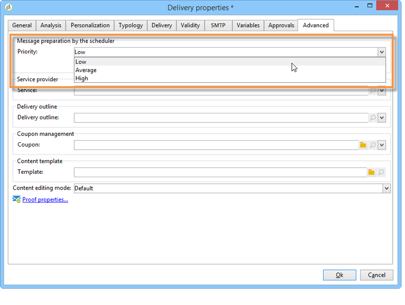

# Communicatiekanalen{#communication-channels}

Met Adobe Campaign kunt u kanaalcampagnes verzenden, waaronder e-mails, SMS, pushmeldingen en directe mails, en de doeltreffendheid van deze campagnes meten aan de hand van verschillende speciale rapporten. Deze berichten worden ontworpen en verzonden door leveringen, en kunnen voor elke ontvanger worden gepersonaliseerd.

De kernfuncties omvatten het richten, het bepalen en het personaliseren van berichten, de uitvoering van mededelingen, en de bijbehorende operationele rapporten.

In het kader van het promotieinitiatief Campaign v8 is de documentatie van Campaign Classic gereorganiseerd. Algemene functies zijn nu alleen beschikbaar in de documentatieset van Campagne v8.

>[!BEGINTABS]

>[!TAB  Communicatie kanaaldocumentatie ]

Meer over communicatiekanalen leren, verwijs naar de [ documentatie van de Campagne v8 ](https://experienceleague.adobe.com/docs/campaign/campaign-v8/send/gs-message.html?lang=nl-NL){target=_blank}.

{target=_blank}

>[!TAB  inhoud en publiek van de Levering ]

Leer de belangrijkste stappen met betrekking tot het maken van de levering, de inhoud en het publiek in de documentatie van Campagne v8:

* [ creeer de levering ](https://experienceleague.adobe.com/docs/campaign/campaign-v8/send/create-message.html?lang=nl-NL#create-the-delivery){target="_blank"}: Leer hoe te om één-schot enige levering tot stand te brengen.
* [ bepaal de inhoud ](https://experienceleague.adobe.com/docs/campaign/campaign-v8/send/create-message.html?lang=nl-NL#content-of-the-delivery){target="_blank"}: Vorm de leveringsinhoud specifiek voor elk kanaal.
* [ specificeer het publiek ](https://experienceleague.adobe.com/docs/campaign/campaign-v8/send/create-message.html?lang=nl-NL#target-population){target="_blank"}: Bepaal verscheidene types van doel: belangrijkste publiek, proefdoel, zaadadressen en controlegroepen.

>[!TAB  Bevestiging van de levering en het verzenden ]

Raadpleeg de volgende pagina&#39;s voor meer informatie over de validatie van de levering, het verzenden en de aanbevolen procedures in de documentatie van Campagne v8:

* [ bevestigt de levering ](https://experienceleague.adobe.com/docs/campaign/campaign-v8/send/create-message.html?lang=nl-NL#validate-the-delivery){target="_blank"}: Leer hoe te om de levering te bevestigen alvorens het naar het belangrijkste doel te verzenden.
* [ verzend de levering ](https://experienceleague.adobe.com/docs/campaign/campaign-v8/send/create-message.html?lang=nl-NL#configuring-and-sending-the-delivery){target="_blank"}: Vorm de leveringsmontages en bepaal hoe te om uw berichten te verzenden.
* [ beste praktijken van de Levering ](https://experienceleague.adobe.com/docs/campaign/campaign-v8/send/delivery-best-practices.html?lang=nl-NL){target="_blank"}: Raadpleeg de beste praktijken met betrekking tot de leveringsmogelijkheden van de Campagne.

>[!ENDTABS]

De volgende instellingen gelden specifiek voor Campaign Classic. Voor andere leveringsmontages, verwijs naar de [ documentatie van de Campagne v8 ](https://experienceleague.adobe.com/docs/campaign/campaign-v8/send/gs-message.html?lang=nl-NL){target="_blank"}.

+++ **Analyse van de Levering**

**verbeter de prestaties van de leveringsanalyse**

Als u de voorbereiding van de levering wilt versnellen, controleert u de optie **[!UICONTROL Prepare the delivery parts in the database]** voordat u de analyse start.

Wanneer deze optie wordt toegelaten, wordt de levering voorbereiding uitgevoerd direct binnen het gegevensbestand, dat de analyse kan beduidend versnellen.

Deze optie is momenteel alleen beschikbaar als aan de volgende voorwaarden is voldaan:

* De levering moet een e-mail zijn. De andere kanalen worden momenteel niet ondersteund.
* U moet niet midsourcing of extern verpletteren, slechts bulklevering gebruiken die type verplettert. U kunt de routering controleren die wordt gebruikt op het tabblad **[!UICONTROL General]** van **[!UICONTROL Delivery properties]** .
* U kunt geen populatie richten die uit een extern dossier komt. Voor één levering klikt u op de koppeling **[!UICONTROL To]** in de **[!UICONTROL Email parameters]** en controleert u of de optie **[!UICONTROL Defined in the database]** is geselecteerd. Voor een levering die in een workflow wordt gebruikt, controleert u of de ontvangers **[!UICONTROL Specified by the inbound event(s)]** op het tabblad **[!UICONTROL Delivery]** zijn.
* U moet een PostSQL-database gebruiken.

**vorm de analyseprioriteit**

Wanneer de levering onderdeel is van een campagne, biedt het tabblad **[!UICONTROL Advanced]** een extra optie. Zo kunt u de verwerkingsvolgorde voor leveringen in dezelfde campagne ordenen.

Elke levering wordt geanalyseerd voordat deze wordt verzonden. De duur van de analyse is afhankelijk van het extractiebestand van de levering. Hoe groter de grootte van het bestand, des te langer de analyse duurt, waardoor de volgende leveringen wachten.

Met de opties voor de **[!UICONTROL Message preparation by the scheduler]** kunt u prioriteit geven aan de leveringsanalyse in een campagneworkflow.

Als een levering te groot is, is het beter om een lage prioriteit aan het toe te wijzen om de analyse van andere werkschemaleveringen te vermijden vertragen.

>[!NOTE]
>
>Om ervoor te zorgen dat de grotere leveringsanalyses de vooruitgang van uw werkschema&#39;s niet vertragen, kunt u hun uitvoeringen plannen door **[!UICONTROL Schedule execution for a time of low activity]** te tikken.

+++

+++ **Levering die** verzendt

**vorm opnieuw probeert**

Tijdelijk ongeleverde berichten toe te schrijven aan a **Zacht** of **Genegeerde** fout zijn onderworpen aan automatisch opnieuw proberen. De types en de redenen van de leveringsmislukking worden voorgesteld in deze [ sectie ](understanding-delivery-failures.md#delivery-failure-types-and-reasons).

>[!IMPORTANT]
>
>Voor ontvangen of hybride installaties, als u aan [ Uitgebreide MTA ](sending-with-enhanced-mta.md) hebt bevorderd, worden de retry montages in de levering niet meer gebruikt door Campagne. De zachte stuitpogingen en de tijdsduur tussen hen worden bepaald door Verbeterde MTA gebaseerd op het type en de strengheid van de stuiteringsreacties die van het e-maildomein van het bericht terugkomen.

Voor on-premise installaties en ontvangen/hybride installaties die de erfenis MTA van de Campagne gebruiken, wijst de centrale sectie van het **[!UICONTROL Delivery]** lusje voor leveringsparameters erop hoeveel herpogingen de dag na de levering en de minimumvertraging tussen herpogingen zouden moeten worden uitgevoerd.

Door gebrek, zijn vijf herpogingen gepland voor de eerste dag van de levering met een minimuminterval van één uur uitgespreid over de 24 uren van de dag. Elke dag opnieuw proberen wordt geprogrammeerd na die datum en tot de leveringstermijn, die is gedefinieerd op het tabblad **[!UICONTROL Validity]** . Zie [ bepalen de geldigheidsperiode ](#defining-validity-period).

**bepaal de geldigheidsperiode**

Wanneer de levering is gestart, kunnen de berichten (en eventuele nieuwe pogingen) worden verzonden tot de leveringstermijn. Dit wordt aangegeven in de leveringseigenschappen, via het tabblad **[!UICONTROL Validity]** .

* In het veld **[!UICONTROL Delivery duration]** kunt u de limiet voor algemene leveringspogingen invoeren. Dit betekent dat Adobe Campaign de berichten verzendt die op de begindatum beginnen, en dan, voor berichten die een fout slechts terugkeren, regelmatig, configureerbare herpogingen worden uitgevoerd tot de geldigheidsgrens wordt bereikt.

  U kunt ook datums opgeven. Selecteer **[!UICONTROL Explicitly set validity dates]** om dit te doen. In dit geval kunt u ook de tijd opgeven op basis van de uiterste datum voor levering en geldigheid. De huidige tijd wordt standaard gebruikt, maar u kunt deze rechtstreeks wijzigen in het invoerveld.

  >[!IMPORTANT]
  >
  >Voor ontvangen of hybride installaties, als u aan [ Verbeterde MTA ](sending-with-enhanced-mta.md) hebt bevorderd, zal het **[!UICONTROL Delivery duration]** plaatsen in uw e-mailleveringen van de Campagne slechts als reeks aan **3.5 dagen of minder** worden gebruikt. Als u een waarde definieert die hoger is dan 3,5 dagen, wordt hiermee geen rekening gehouden.

* **grens van de Geldigheid van middelen**: Het **[!UICONTROL Validity limit]** gebied wordt gebruikt voor geuploade middelen, hoofdzakelijk voor de spiegelpagina en beelden. De bronnen op deze pagina zijn gedurende een beperkte tijd geldig (om schijfruimte te besparen).

  De waarden op dit gebied kunnen in de eenheden worden uitgedrukt die in [ worden vermeld deze sectie ](../../platform/using/adobe-campaign-workspace.md#default-units).

+++

<!--

   Learn how to create a one-shot single delivery. You can create other types of deliveries to build your use cases. 

For more information about the different types of deliveries and how to create them, refer to the [Campaign v8 documentation](https://experienceleague.adobe.com/docs/campaign/campaign-v8/send/create-message.html?lang=nl-NL){target="_blank"}. 

>[!NOTE]
>
>Adobe Campaign offers a set of tools to monitor your deliverability and optimize email sending. Learn more in [this section](about-deliverability.md).

Delivery sending can be automated by preparing a delivery and/or sending it in the process of a workflow. For more on delivery-type activities in workflows, refer to [this section](../../workflow/using/about-action-activities.md).

Adobe Campaign offers the following delivery channels:

1. **Email channel**: email deliveries let you send personalized emails to the target population. Refer to [About email channel](about-email-channel.md).
1. **Direct mail channel**: direct mail deliveries let you generate an extraction file which contains data on the target population. Refer to [About direct mail channel](about-direct-mail-channel.md).
1. **Mobile channel**: deliveries on mobile channels let you send personalized SMS or LINE messages to the target population. Refer to [SMS channel](sms-channel.md).
1. **Mobile application channel**: mobile app deliveries let you send notifications to iOS and Android systems. Refer to the [Mobile app channel](about-mobile-app-channel.md) chapter.

   Other channels are described on [this section](#other-channels).

   >[!NOTE]
   >
   >The number of available channels depends on your contract. Please check your license agreement.

Deliveries can be carried out **online** (via email, one of the mobile channels and push notifications), and **offline** (direct mail channel).

Depending on the channel, delivery modes can be:

* Direct mass delivery via Adobe Campaign (default mode for email channel).
* External delivery via a specialist operator who is given the output file generated by the delivery assistant (default mode for direct mail channel).

External accounts are configured via the **[!UICONTROL Administration > Platform > External accounts]** node. This configuration should be performed by expert users only.

## Email deliveries {#email-deliveries}

The [Email channel](about-email-channel.md) is one of the core channels in Adobe Campaign, allowing you to schedule and send personalized emails to specific targets.

You can send different types of emails:

* Single-send emails: emails that you can send once to a defined target. They are usually used to promote a specific content that would be prepared and sent only once (newsletter, promotional email, etc.).
* Recurring emails: in a campaign, send the same email regularly and aggregate each send and its reports on a periodic basis. The same email is sent, but usually to a different target, based on the eligible target for the day of the send. A common example is a birthday email. For more on this, refer to [Recurring deliveries](../../workflow/using/recurring-delivery.md).
* Transactional emails: unitary emails that are triggered based on your customers' behavior. Refer to [Transactional messaging](../../message-center/using/about-transactional-messaging.md).

To learn about delivery usage and recommendations, consult Campaign [Delivery best practices](delivery-best-practices.md).

For more on the different types of deliveries, refer to [this section](#types-of-deliveries).

## Mobile deliveries {#mobile-deliveries}

Adobe Campaign allows you to deliver [SMS](sms-channel.md) and [LINE](line-channel.md) messages on mobiles.

For SMS messages, you can create, modify, and personalize messages in text format only. You can also preview your SMS messages before they are sent.

For LINE messages, you can send text or images and links.

To deliver SMS or LINE messages to a mobile phone you need:

* An external account configured on the **[!UICONTROL Mobile (SMS)]** channel or on the **[!UICONTROL LINE]** channel. 
* An SMS or LINE delivery template that is correctly linked to this external account.

## Push notifications {#push-notifications}

Adobe Campaign allows you to send personalized and segmented [push notifications](about-mobile-app-channel.md) on iOS and Android mobile devices, through dedicated apps. Once configuration and integration steps have been performed, iOS and Android deliveries can be created and sent. You can also design rich notifications with images or videos.

## Direct mail {#direct-mail}

[Direct mail](about-direct-mail-channel.md) is an offline channel that allows you to personalize and generate the file required by direct mail providers. It gives you the possibility to mix online and offline channels in your customer journeys.

Online channels allow you to create your messages (email, SMS, mobile app delivery, etc.) and send them to your audience directly from Adobe Campaign. With offline channels, it is different. When you prepare a direct mail delivery, Adobe Campaign generates a file including all the targeted profiles and the chosen contact information (postal address for example). You will then be able to send this file to your direct mail provider who will take care of the actual sending.

## Other channels {#other-channels}

Adobe Campaign offers Telephone delivery template, which is used to create external deliveries. Using this channel implies you set up dedicated methodologies to process output files. Configuration steps are the same as for [Direct mail channel](about-direct-mail-channel.md).

>[!NOTE]
>
>The Telephone channel is not available out-of-the-box. Its implementation requires Adobe Consulting or an Adobe Partner to be engaged. Please reach out to your Adobe representative for more information.

In addition, 'Other' type deliveries use a specific technical template which does not execute a process: this lets them manage marketing actions executed outside of the Adobe Campaign platform.

This channel has no specific mechanism. It is a generic channel that has its own external account routing option, delivery template type and campaign workflow activity, just like any other communication channel available in Adobe Campaign.

This channel is designed for descriptive purposes only, for example to define deliveries for which you want to keep a trace of the target of a campaign performed in a tool other than Adobe Campaign.

## Types of deliveries{#types-of-deliveries}

There are three types of delivery objects in Campaign:

### Single delivery {#single-delivery}

A **delivery** is a standalone delivery object that is executed once. It can be duplicated, prepared again, but as long as it is in its final state (canceled, stopped, finished), it cannot be reused.

Deliveries can be created either from the list of deliveries, or within a workflow via a [Delivery](../../workflow/using/delivery.md) activity.

Workflows also provide specific delivery activities according to the type of channel you want to use. For more on these activities, refer to [this section](../../workflow/using/cross-channel-deliveries.md).

### Recurring delivery {#recurring-delivery}

A **recurring delivery** lets you create a new delivery each time the activity is executed. This avoids you having to create a new delivery for recurring tasks.

As an example, if you run this type of activity once a month, you will end up with 12 deliveries after a year.

Recurring deliveries are created within workflows via the [Recurring delivery activity](../../workflow/using/recurring-delivery.md). An example of this activity being used is presented in this section: [Creating a recurring delivery in a targeting workflow](../../workflow/using/sending-a-birthday-email.md#creating-a-recurring-delivery-in-a-targeting-workflow).

### Continuous delivery {#continuous-delivery}

A **continuous delivery** lets you add new recipients to an existing delivery, which avoids having to create a new delivery each time it is executed.

If an information in the delivery changes (content, name, etc.), a new delivery object is created at the delivery execution. If no information was changed, the same delivery object is reused and the delivery and tracking logs are added in the same object.

As an example, if you run this type of activity once a month, you will end up with a single delivery after a year (provided you did not make any change to the delivery).

Continuous deliveries are created within workflows via the [Continuous delivery activity](../../workflow/using/continuous-delivery.md).-->
