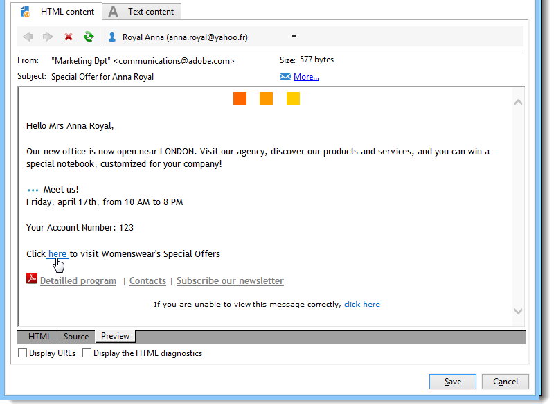

# Voorwaardelijke inhoud{#conditional-content}

Door voorwaardelijke inhoudsgebieden te vormen, kunt u dynamische verpersoonlijking tot stand brengen die op het profiel van de ontvanger bijvoorbeeld wordt gebaseerd. Tekstblokken en/of afbeeldingen worden vervangen wanneer aan een bepaalde voorwaarde wordt voldaan.

## Voorwaarden in een e-mail gebruiken {#using-conditions-in-an-email}

In het onderstaande voorbeeld leert u hoe u een boodschap kunt maken die dynamisch is gepersonaliseerd op basis van het geslacht en de belangen van de ontvanger.

* Weergave met &quot;Mr&quot; of &quot;Mej.&quot; afhankelijk van de waarde van het **[!UICONTROL Gender]** veld (M of F) in de gegevensbron,
* Persoonlijke vergadering van een nieuwsbrief of een promotieaanbod volgens de aangegeven of geconstateerde belangen:

   * Rente 1 — > Blok 1
   * Rente 2 — > Blok 2
   * Rente 3 — > Blok 3
   * Rente 4 — > Blok 4

Voer de volgende stappen uit om voorwaardelijke inhoud te maken op basis van de waarde van een veld:

1. Klik op het verpersoonlijkingspictogram en selecteer **[!UICONTROL Conditional content > If]**.

   

   De verpersoonlijkingselementen worden opgenomen in het berichtlichaam. U moet hen nu vormen.

1. Vul vervolgens de parameters van de expressie **if** in.

   Dit doet u als volgt:

   * Selecteer het eerste element van de expressie **`<field>`**(dit element wordt standaard gemarkeerd tijdens het invoegen van de expressie **if** ) en klik op het verpersoonlijkingspictogram om het te vervangen door het testveld.

      

   * Vervangen door **`<value>`** de waarde van het veld waaraan aan de voorwaarde wordt voldaan. Deze waarde moet tussen aanhalingstekens staan.
   * Geef de inhoud op die moet worden ingevoegd wanneer aan de voorwaarde wordt voldaan. Dit kan tekst, een afbeelding, een formulier, een hypertekstkoppeling enzovoort zijn.

      

1. Klik op het **[!UICONTROL Preview]** tabblad om de inhoud van het bericht weer te geven op basis van de ontvanger van de zending:

   * Een ontvanger selecteren waarvoor de voorwaarde waar is:

      

   * Een ontvanger selecteren waarvoor de voorwaarde niet waar is:

      

U kunt andere gevallen toevoegen en verschillende inhoud definiëren op basis van de waarden van een of meer velden. Om dit te doen, gebruik **[!UICONTROL Conditional content > Else]** en **[!UICONTROL Conditional content > Else if]**. Deze expressies worden op dezelfde manier geconfigureerd als de expressie **if** .


>[!CAUTION]
>
>Als u de JavaScript-syntaxis wilt respecteren, moeten de tekens **%> &lt;%** worden verwijderd nadat u **Else** en **Else if** hebt toegevoegd.

Klik **[!UICONTROL Preview]** en selecteer een ontvanger om de voorwaardelijke inhoud weer te geven.



## Meertalige e-mail maken {#creating-multilingual-email}

In het onderstaande voorbeeld leert u hoe u een meertalige e-mail kunt maken. De inhoud wordt in de ene of de andere taal weergegeven, afhankelijk van de voorkeurstaal van de ontvanger.

1. Maak een e-mail en selecteer de doelpopulatie. In dit voorbeeld wordt de voorwaarde voor het weergeven van de ene of de andere versie gebaseerd op de **taalwaarde** van het profiel van de ontvanger. In dit voorbeeld zijn deze waarden ingesteld op **EN**, **FR**, **ES**.
1. Klik in de HTML-inhoud voor e-mail op het **[!UICONTROL Source]** tabblad en plak de volgende code:

   ```
   <% if (language == "EN" ) { %>
   <DIV id=en-version>Hello <%= recipient.firstName %>,</DIV>
   <DIV>Discover your new offers!</DIV>
   <DIV><a href="https://www.adobe.com/products/en">www.adobe.com/products/en</A></FONT></DIV><%
    } %>
   <% if (language == "FR" ) { %>
   <DIV id=fr-version>Bonjour <%= recipient.firstName %>,</DIV>
   <DIV>Découvrez nos nouvelles offres !</DIV>
   <DIV><a href="https://www.adobe.com/products/fr">www.adobe.com/products/fr</A></DIV><%
    } %>
    <% if (language == "ES" ) { %>
   <DIV id=es-version><FONT face=Arial>
   <DIV>Olà <%= recipient.firstName %>,</DIV>
   <DIV>Descubra nuestros nuevas ofertas !</DIV>
   <DIV><a href="https://www.adobe.com/products/es">www.adobe.com/products/es</A></DIV>
   <% } %>
   ```

1. Test e-mailinhoud op het **[!UICONTROL Preview]** tabblad door ontvangers met verschillende voorkeurstalen te selecteren.

   >[!NOTE]
   >
   >Aangezien er geen alternatieve versie is gedefinieerd in de e-mailinhoud, moet u de doelpopulatie filteren voordat u de e-mail verzendt.
