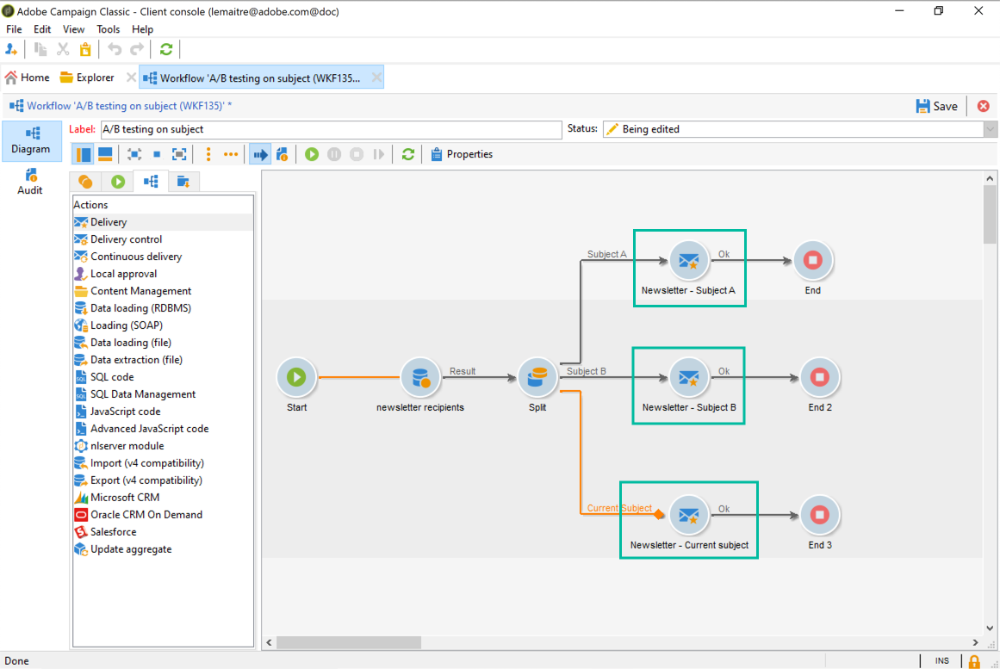

# A/B-tests configureren {#configuring-a-b-testing}

In deze sectie wordt beschreven hoe u een workflow bouwt om A/B-tests uit te voeren.

1. Creeer een nieuw werkschema dan vormen een [Vraag](../../workflow/using/query.md) activiteit om de gewenste bevolking te richten.

1. Voeg een [Gesplitste ](../../workflow/using/split.md) activiteit toe om de doelpopulatie in veelvoudige ondergroepen te verdelen.

1. Open de activiteit, dan vorm elke ondergroep volgens uw behoeften. Voor meer op hoe te om een **[!UICONTROL Split]** activiteit te vormen, verwijs naar deze sectie.

   In dit voorbeeld willen we twee nieuwe onderwerpen testen voor een nieuwsbrief door ze allemaal te presenteren aan 10 procent van de doelgroep.

   

1. Voeg een overgang toe om de nieuwsbrief met het huidige onderwerp naar de resterende bevolking te sturen. Hiervoor activeert u de optie **[!UICONTROL Generate complement]** op het tabblad **[!UICONTROL General]**.

   

1. Voeg voor elke subset de versie van de levering toe die u wilt testen.

   

U kunt de workflow nu starten. Zodra de leveringen zijn verzonden, zult u het gedrag van de drie ondergroepen in de leveringslogboeken kunnen volgen, om te zien welk onderwerp het meest succesvol is geweest.

Met workflows kunt u ook uw processen automatiseren door automatisch de variant te identificeren die beter presteerde en deze vervolgens naar de resterende populatie te verzenden. Raadpleeg voor meer informatie deze [use case](../../delivery/using/a-b-testing-use-case.md).
