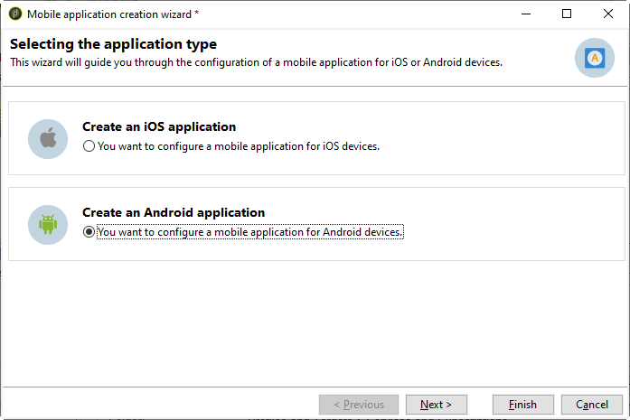

# Configuratiestappen voor Android

Nadat het pakket is geïnstalleerd, kunt u de instellingen voor uw Android-app definiëren in Adobe Campaign Classic.

>[!NOTE]
>
>Als u wilt weten hoe u uw app voor iOS kunt configureren en hoe u een levering voor iOS kunt maken, raadpleegt u deze [sectie](configuring-the-mobile-application.md).

De belangrijkste stappen zijn:

1. [De externe Android-account configureren](#configuring-external-account-android)
1. [De Android-service configureren](#configuring-android-service)
1. [De mobiele app maken in Campagne](#creating-android-app)
1. [Het app-schema uitbreiden met aanvullende gegevens](#extend-subscription-schema)

Dan kunt u [een Android-rijk bericht maken](create-notifications-android.md).

## Externe Android-account configureren {#configuring-external-account-android}

Voor Android zijn twee connectors beschikbaar:

* De V1 schakelaar die één verbinding per kind MTA toestaat.
* De V2-connector die gelijktijdige verbindingen met de FCM-server mogelijk maakt om de doorvoer te verbeteren.

Voer de volgende stappen uit om te kiezen welke aansluiting u wilt gebruiken:

1. Ga naar **[!UICONTROL Administration > Platform > External accounts]**.
1. Selecteer **[!UICONTROL Android routing]** externe rekening.
1. In de **[!UICONTROL Connector]** tab, vult de **[!UICONTROL JavaScript used in the connector]** veld:

   Voor Android V2: https://localhost:8080/nms/jsp/androidPushConnectorV2.js

   >[!NOTE]
   >
   > U kunt het ook configureren als volgt: https://localhost:8080/nms/jsp/androidPushConnector.js, maar u wordt aangeraden versie 2 van de connector te gebruiken.

   

1. Voor Android V2 is er één aanvullende parameter beschikbaar in het configuratiebestand van de Adobe Server (serverConf.xml):

   * **maxGCMConnectPerChild**: Maximale limiet van parallelle HTTP-aanvragen voor de FCM die door elke onderliggende server worden geïnitieerd (standaard 8).

## Een Android-service configureren {#configuring-android-service}

 [Leer hoe u een Android-service configureert in video](https://experienceleague.adobe.com/docs/campaign-classic-learn/getting-started-with-push-notifications-for-android/configuring-an-android-service-in-campaign.html?lang=en#configuring-an-android-service-and-creating-an-android-mobile-application-in-campaign)

1. Ga naar de **[!UICONTROL Profiles and Targets > Services and subscriptions]** knoop en klik **[!UICONTROL New]**.

   

1. Een **[!UICONTROL Label]** en **[!UICONTROL Internal name]**.
1. Ga naar de **[!UICONTROL Type]** veld en selecteer **[!UICONTROL Mobile application]**.

   >[!NOTE]
   >
   >De standaardwaarde **[!UICONTROL Subscriber applications (nms:appSubscriptionRcp)]** doeltoewijzing is gekoppeld aan de tabel met ontvangers. Als u een andere doelafbeelding wilt gebruiken, moet u een nieuwe doeltoewijzing maken en deze invoeren in het dialoogvenster **[!UICONTROL Target mapping]** van de dienst. Raadpleeg voor meer informatie over het maken van doeltoewijzingen de [deze sectie](../../configuration/using/about-custom-recipient-table.md).

   

1. Klik vervolgens op de knop **[!UICONTROL Add]** om het toepassingstype te selecteren.

   

1. Maak uw Android-toepassing. Raadpleeg [deze sectie](configuring-the-mobile-application-android.md#creating-android-app) voor meer informatie.

## De mobiele Android-toepassing maken {#creating-android-app}

Nadat u de service hebt gemaakt, moet u nu uw Android-toepassing maken:

1. Klik vanuit de nieuwe service op de knop **[!UICONTROL Add]** om het toepassingstype te selecteren.

   

1. Selecteren **[!UICONTROL Create an Android application]** en voert u een **[!UICONTROL Label]**.

   

1. Zorg ervoor dat **[!UICONTROL Integration key]** wordt gedefinieerd in Adobe Campaign en in de toepassingscode via de SDK. Raadpleeg [deze sectie](integrating-campaign-sdk-into-the-mobile-application.md) voor meer informatie.

   >[!NOTE]
   >
   > De **[!UICONTROL Integration key]** is volledig aanpasbaar met tekenreekswaarde, maar moet exact hetzelfde zijn als de waarde die in de SDK is opgegeven.

1. Selecteer **[!UICONTROL API version]**: HTTP v1 of HTTP (verouderd). Deze configuraties worden beschreven in [deze sectie](#select-api-version)

1. Vul de **[!UICONTROL Firebase Cloud Messaging the Android connection settings]** velden.

1. Klik op **[!UICONTROL Finish]** en vervolgens op **[!UICONTROL Save]**. Uw Android-toepassing kan nu worden gebruikt in Campaign Classic.

Standaard slaat Adobe Campaign een toets op in het dialoogvenster **[!UICONTROL User identifier]** (@userKey) in het veld **[!UICONTROL Subscriber applications (nms:appSubscriptionRcp)]** tabel. Met deze sleutel kunt u een abonnement koppelen aan een ontvanger. Als u aanvullende gegevens wilt verzamelen (zoals een complexe afstemmingssleutel), moet u de volgende configuratie toepassen:

### Selecteer de API-versie{#select-api-version}

Nadat u de service en een nieuwe mobiele toepassing hebt gemaakt, moet u de mobiele toepassing configureren, afhankelijk van de gekozen API-versie.

* **HTTP v1** de configuratie wordt gedetailleerd in [deze sectie](configuring-the-mobile-application-android.md#android-service-httpv1).
* **HTTP (verouderd)** de configuratie wordt gedetailleerd in [deze sectie](configuring-the-mobile-application-android.md#android-service-http).

#### HTTP v1-API configureren{#android-service-httpv1}

Voer de volgende stappen uit om de HTTP v1 API-versie te configureren:

1. In uw **[!UICONTROL Mobile application creation wizard]** venster, selecteert u **[!UICONTROL HTTPV1]** in de **[!UICONTROL API version]** vervolgkeuzelijst.

1. Klikken **[!UICONTROL Load project json file to extract project details...]** om uw JSON-sleutelbestand rechtstreeks te laden. Voor meer informatie over het uitpakken van uw JSON-bestand raadpleegt u [deze pagina](https://firebase.google.com/docs/admin/setup#initialize-sdk).

   U kunt ook handmatig de volgende gegevens invoeren:
   * **[!UICONTROL Project Id]**
   * **[!UICONTROL Private Key]**
   * **[!UICONTROL Client Email]**

   

1. Klikken **[!UICONTROL Test the connection]** om te controleren of uw configuratie correct is en of de marketingserver toegang heeft tot de FCM.

   >[!CAUTION]
   >
   >Voor de implementatie van middelmatige bronnen **[!UICONTROL Test connection]** niet controleert of de MID-server toegang heeft tot de FCM-server.

   

1. Als optie kunt u de inhoud van een pushbericht verrijken met wat **[!UICONTROL Application variables]** indien nodig. Deze zijn volledig aanpasbaar en een deel van de berichtlading wordt verzonden naar het mobiele apparaat.

1. Klik op **[!UICONTROL Finish]** en vervolgens op **[!UICONTROL Save]**. Uw Android-toepassing kan nu worden gebruikt in Campaign Classic.

Hieronder vindt u de namen van FCM-ladingen om uw pushmelding verder aan te passen:

| Berichttype | Configureerbaar berichtelement (FCM-ladenaam) | Configureerbare opties (FCM-ladenaam) |
|:-:|:-:|:-:|
| gegevensbericht | N.v.t. | validate_only |
| meldingsbericht | title, body, android_channel_id, icon, sound, tag, color, click_action, image, ticker, sticky, visibility, notification_priority, notification_count   | validate_only |

 
 

#### HTTP-API (verouderd) configureren{#android-service-http}

Voer de volgende stappen uit om de HTTP-versie (verouderd) te configureren:

1. In uw **[!UICONTROL Mobile application creation wizard]** venster, selecteert u **[!UICONTROL HTTP (legacy)]** in de **[!UICONTROL API version]** vervolgkeuzelijst.

1. Voer de **[!UICONTROL Project key]** die door de ontwikkelaar van de mobiele toepassing werd verstrekt.

1. Als optie kunt u de inhoud van een pushbericht verrijken met wat **[!UICONTROL Application variables]** indien nodig. Deze zijn volledig aanpasbaar en een deel van de berichtlading wordt verzonden naar het mobiele apparaat.

   In het volgende voorbeeld voegen we **titel**, **imageURL** en **iconURL** om uitgebreide pushmeldingen te maken en de toepassing de afbeelding, titel en het pictogram te geven die binnen het bericht moeten worden weergegeven.

   

1. Klik op **[!UICONTROL Finish]** en vervolgens op **[!UICONTROL Save]**. Uw Android-toepassing kan nu worden gebruikt in Campaign Classic.

Hieronder vindt u de namen van FCM-ladingen om uw pushmelding verder aan te passen:

| Berichttype | Configureerbaar berichtelement (FCM-ladenaam) | Configureerbare opties (FCM-ladenaam) |
|:-:|:-:|:-:|
| gegevensbericht | N.v.t. | dryRun |
| meldingsbericht | title, body, android_channel_id, icon, sound, tag, color, click_action   | dryRun |

 

## Het schema appsubscriptionRcp uitbreiden {#extend-subscription-schema}

 [Leer hoe u het schema appsubscriptionRcp in video kunt uitbreiden](https://experienceleague.adobe.com/docs/campaign-classic-learn/getting-started-with-push-notifications-for-android/extending-the-app-subscription-schema.html?lang=en#extending-the-app-subscription-schema-to-personalize-push-notifications)

U moet het dialoogvenster **appsubscriptionRcp** om nieuwe extra gebieden te bepalen om parameters van app in het gegevensbestand van de Campagne op te slaan. Deze velden worden bijvoorbeeld gebruikt voor personalisatie. Dit doet u als volgt:

1. Een extensie maken van de **[!UICONTROL Subscriber applications (nms:appsubscriptionRcp)]** en definieert u de nieuwe velden. Meer informatie over schema-extensies vindt u in [deze pagina](../../configuration/using/about-schema-edition.md)

1. De toewijzing definiëren in het dialoogvenster **[!UICONTROL Subscription parameters]** tab.

   >[!CAUTION]
   >
   >Zorg ervoor dat de configuratienamen in het dialoogvenster **[!UICONTROL Subscription parameters]** zijn dezelfde als de mobiele toepassingscode. Zie [deze sectie](integrating-campaign-sdk-into-the-mobile-application.md).
