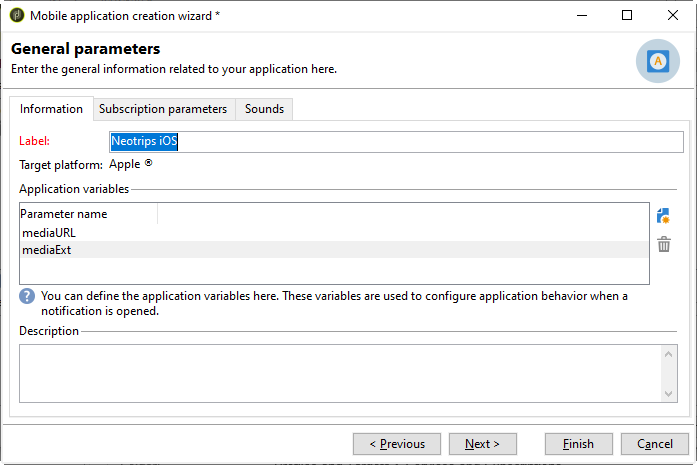
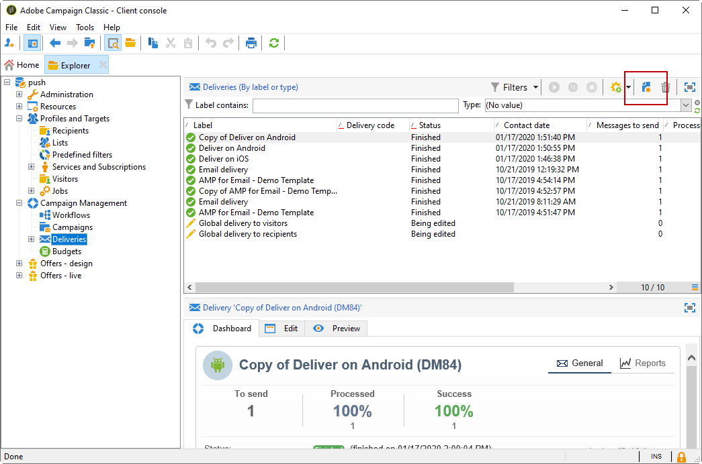

# De mobiele toepassing configureren in Adobe Campagne {#configuring-the-mobile-application-in-adobe-campaign}

U vindt onder een configuratiemonster een product dat is gebaseerd op een bedrijf dat pakketten voor online feestdagen verkoopt. Zijn mobiele toepassing (Neotrips) is beschikbaar aan zijn klanten in twee versies: Neotrips voor Android en Neotrips voor iOS. Om de mobiele toepassing in de Campagne van Adobe te vormen, moet u:

* Maak een **[!UICONTROL Mobile application]** tekstinformatieservice voor de mobiele toepassing Neotrips.
* Voeg de iOS- en Android-versies van de toepassing toe aan deze service.
* Maak een levering voor zowel iOS als Android.

>[!NOTE]
>
>Ga naar het **[!UICONTROL Subscriptions]** tabblad van de service om de lijst met abonnees van de service weer te geven, dat wil zeggen alle personen die de toepassing op hun mobiele telefoon hebben geïnstalleerd en ermee hebben ingestemd meldingen te ontvangen.

## De mobiele toepassing configureren met iOS {#configuring-the-mobile-application-ios}

>[!CAUTION]
>
>De toepassing moet zijn geconfigureerd voor pushacties voordat deze kan worden geïntegreerd in de Adobe Campagne SDK.
>
>Indien dit niet het geval is, gelieve [deze pagina](https://developer.apple.com/library/archive/documentation/NetworkingInternet/Conceptual/RemoteNotificationsPG/)te raadplegen.

### Stap 1:Het pakket installeren {#installing-package-ios}

1. Open de wizard voor het importeren van pakketten vanuit **[!UICONTROL Tools > Advanced > Package import...]** de Adobe Campagne-clientconsole.

   

1. Selecteer **[!UICONTROL Install a standard package]**.

1. Controleer in de lijst die wordt weergegeven **[!UICONTROL Mobile App Channel]**.

   

1. Klik **[!UICONTROL Next]** en vervolgens **[!UICONTROL Start]** om de pakketinstallatie te starten.

   Nadat de pakketten zijn geïnstalleerd, wordt op de voortgangsbalk **100%** weergegeven. In de installatielogboeken ziet u het volgende bericht: **[!UICONTROL Installation of packages successful]**.

   

1. **[!UICONTROL Close]** het installatievenster.

### Stap 2: Externe iOS-account configureren {#configuring-external-account-ios}

Voor iOS zijn twee connectors beschikbaar:

* De binaire iOS-connector verzendt berichten op de verouderde binaire APNS-server.
* De iOS HTTP/2-connector verzendt berichten naar de HTTP/2 APNS.

Voer de volgende stappen uit om te kiezen welke aansluiting u wilt gebruiken:

1. Ga naar **[!UICONTROL Administration > Platform > External accounts]**.
1. Selecteer de **[!UICONTROL iOS routing]** externe account.
1. Vul op het **[!UICONTROL Connector]** tabblad het **[!UICONTROL Access URL of the connector]** veld in:

   Voor iOS HTTP2: http://localhost:8080/nms/jsp/iosHTTP2.jsp

   

   >[!NOTE]
   >
   > U kunt het ook configureren als volgt: https://localhost:8080/nms/jsp/ios.jsp, maar u wordt aangeraden versie 2 van de connector te gebruiken.

1. Klik **[!UICONTROL Save]**.

Uw iOS-connector is nu geconfigureerd. U kunt uw service gaan maken.

### Stap 3: iOS-service configureren {#configuring-ios-service}

1. Ga naar het **[!UICONTROL Profiles and Targets > Services and subscriptions]** knooppunt en klik **[!UICONTROL New]**.

   

1. Definieer een **[!UICONTROL Label]** en een **[!UICONTROL Internal name]**.
1. Ga naar het **[!UICONTROL Type]** veld en selecteer **[!UICONTROL Mobile application]**.

   >[!NOTE]
   >
   >De standaarddoelafbeelding is gekoppeld aan de tabel met ontvangers. **[!UICONTROL Subscriber applications (nms:appSubscriptionRcp)]** Als u een verschillende doelafbeelding wilt gebruiken, moet u een nieuwe doelafbeelding tot stand brengen en het ingaan op het **[!UICONTROL Target mapping]** gebied van de dienst. Voor meer bij het creëren van doelafbeelding, verwijs naar de gids [van de](../../configuration/using/about-custom-recipient-table.md)Configuratie.

   

1. Klik vervolgens op de **[!UICONTROL Add]** knop om het toepassingstype te selecteren.

   

1. Het volgende venster wordt weergegeven. Selecteer **[!UICONTROL Create an iOS application]** en begin door het **[!UICONTROL Label]** in te voeren.

   

1. U kunt desgewenst ook de inhoud van een pushbericht verrijken met andere inhoud **[!UICONTROL Application variables]** . Deze zijn volledig aanpasbaar en een deel van de berichtlading wordt verzonden naar het mobiele apparaat.
In het volgende voorbeeld voegen we **mediaURl** en **mediaExt** toe om uitgebreide pushmeldingen te maken en geven we de toepassing vervolgens de afbeelding weer die binnen het bericht moet worden weergegeven.

   

1. Op het **[!UICONTROL Subscription parameters]** tabblad kunt u de toewijzing definiëren met een extensie van het **[!UICONTROL Subscriber applications (nms:appsubscriptionRcp)]** schema.

   >[!NOTE]
   >
   >Zorg ervoor dat u niet hetzelfde certificaat gebruikt voor de ontwikkelingsversie (sandbox) en de productieversie van de toepassing.

1. Op het **[!UICONTROL Sounds]** tabblad kunt u opgeven welk geluid moet worden afgespeeld. Klik **[!UICONTROL Add]** en vul **[!UICONTROL Internal name]** gebied dat de naam van het dossier moet bevatten ingebed in de toepassing of de naam van het systeemgeluid.

1. Klik **[!UICONTROL Next]** om de ontwikkeltoepassing te configureren.

1. Zorg ervoor dat dit ook **[!UICONTROL Integration key]** is gedefinieerd in de Adobe-campagne en in de toepassingscode via de SDK. Raadpleeg voor meer informatie: Campagne SDK [integreren in de mobiele toepassing](#integrating-campaign-sdk-into-the-mobile-application). Met deze integratietoets, die specifiek is voor elke toepassing, kunt u de mobiele toepassing koppelen aan het Adobe Campagne-platform.

   >[!NOTE]
   >
   > De eigenschap **[!UICONTROL Integration key]** is volledig aanpasbaar met tekenreekswaarde, maar moet exact hetzelfde zijn als de waarde die in de SDK is opgegeven.

1. Selecteer een van de pictogrammen uit de doos in het **[!UICONTROL Application icon]** veld om de mobiele toepassing in uw service aan te passen.

1. Klik op de **[!UICONTROL Enter the certificate...]** koppeling en selecteer vervolgens het verificatiecertificaat en voer het wachtwoord in dat door de ontwikkelaar van de mobiele toepassing is opgegeven. U kunt klikken **[!UICONTROL Test the connection]** om er zeker van te zijn dat dit gelukt is.

   >[!NOTE]
   >
   >Apple vereist verschillende certificaten voor ontwikkelings- en productieversies van dezelfde mobiele toepassing. U moet de twee afzonderlijke toepassingen configureren in Adobe Campaign.

   

1. Klik **[!UICONTROL Next]** om de productietoepassing te configureren en dezelfde stappen te volgen als hierboven beschreven.

   

1. Klik **[!UICONTROL Finish]**. Uw iOS-toepassing kan nu worden gebruikt in Campaign Classic.

### Stap 4: Een rijke melding voor iOS maken {#creating-ios-delivery}

Met iOS 10 of hoger is het mogelijk om rijke meldingen te genereren. Adobe Campagne kan meldingen verzenden met behulp van variabelen waarmee het apparaat een uitgebreide melding kan weergeven.

U moet nu een nieuwe levering maken en deze koppelen aan de mobiele toepassing die u hebt gemaakt.

1. Ga naar **[!UICONTROL Campaign management]** > **[!UICONTROL Deliveries]**.

1. Klik **[!UICONTROL New]**.

   

1. Selecteer **[!UICONTROL Deliver on iOS (ios)]** in de **[!UICONTROL Delivery template]** drop-down. Voeg een **[!UICONTROL Label]** object toe aan uw levering.

1. Klik **[!UICONTROL To]** om de populatie te bepalen die moet worden gericht. Standaard wordt de **[!UICONTROL Subscriber application]** doeltoewijzing toegepast. Klik **[!UICONTROL Add]** om de eerder gemaakte service te selecteren.

   

1. Selecteer in het **[!UICONTROL Target type]** venster **[!UICONTROL Subscribers of an iOS mobile application (iPhone, iPad)]** en klik op **[!UICONTROL Next]**.

1. Selecteer in de **[!UICONTROL Service]** vervolgkeuzelijst eerst de eerder gemaakte service, daarna de toepassing waarvoor u een toepassing wilt maken en klik op **[!UICONTROL Finish]**.
Het **[!UICONTROL Application variables]** wordt automatisch toegevoegd afhankelijk van wat tijdens de configuratiestappen werd toegevoegd.

   

1. Bewerk uw uitgebreide melding.

   

1. Schakel het **[!UICONTROL Mutable content]** vakje in het meldingsvenster voor bewerkingen in zodat de mobiele toepassing media-inhoud kan downloaden.

1. Klik en verzend uw levering. **[!UICONTROL Save]**

De afbeelding en webpagina moeten in de pushmelding worden weergegeven wanneer deze worden ontvangen op de mobiele iOS-apparaten van de abonnees.

## De mobiele toepassing configureren met Android {#configuring-the-mobile-application-android}

### Stap 1:Het pakket installeren {#installing-package-android}

1. Open de wizard voor het importeren van pakketten vanuit **[!UICONTROL Tools > Advanced > Package import...]** de Adobe Campagne-clientconsole.

   

1. Selecteer **[!UICONTROL Install a standard package]**.

1. Controleer in de lijst die wordt weergegeven **[!UICONTROL Mobile App Channel]**.

   

1. Klik **[!UICONTROL Next]** en vervolgens **[!UICONTROL Start]** om de pakketinstallatie te starten.

   Nadat de pakketten zijn geïnstalleerd, wordt op de voortgangsbalk **100%** weergegeven. In de installatielogboeken ziet u het volgende bericht: **[!UICONTROL Installation of packages successful]**.

   

1. **[!UICONTROL Close]** het installatievenster.

### Stap 2: Externe Android-account configureren {#configuring-external-account-android}

Voor Android zijn twee connectors beschikbaar:

* De V1 schakelaar die één verbinding per kind MTA toestaat.
* De V2-connector die gelijktijdige verbindingen met de FCM-server mogelijk maakt om de doorvoer te verbeteren.

Voer de volgende stappen uit om te kiezen welke aansluiting u wilt gebruiken:

1. Ga naar **[!UICONTROL Administration > Platform > External accounts]**.
1. Selecteer de **[!UICONTROL Android routing]** externe account.
1. Vul op het **[!UICONTROL Connector]** tabblad het **[!UICONTROL JavaScript used in the connector]** veld in:

   Voor Android V2: https://localhost:8080/nms/jsp/androidPushConnectorV2.js

   >[!NOTE]
   >
   > U kunt het ook configureren als volgt: https://localhost:8080/nms/jsp/androidPushConnector.js, maar u wordt aangeraden versie 2 van de connector te gebruiken.

   

1. Voor Android V2 is er één extra parameter beschikbaar in het configuratiebestand van Adobe Server (serverConf.xml):

   * **maxGCMConnectPerChild**: Maximale limiet van parallelle HTTP-aanvragen voor de FCM die door elke onderliggende server worden geïnitieerd (standaard 8).

### Stap 3: Android-service configureren {#configuring-android-service}

1. Ga naar het **[!UICONTROL Profiles and Targets > Services and subscriptions]** knooppunt en klik **[!UICONTROL New]**.

   

1. Definieer een **[!UICONTROL Label]** en een **[!UICONTROL Internal name]**.
1. Ga naar het **[!UICONTROL Type]** veld en selecteer **[!UICONTROL Mobile application]**.

   >[!NOTE]
   >
   >De standaarddoelafbeelding is gekoppeld aan de tabel met ontvangers. **[!UICONTROL Subscriber applications (nms:appSubscriptionRcp)]** Als u een verschillende doelafbeelding wilt gebruiken, moet u een nieuwe doelafbeelding tot stand brengen en het ingaan op het **[!UICONTROL Target mapping]** gebied van de dienst. Voor meer bij het creëren van doelafbeelding, verwijs naar de gids [van de](../../configuration/using/about-custom-recipient-table.md)Configuratie.

   

1. Klik vervolgens op de **[!UICONTROL Add]** knop om het toepassingstype te selecteren.

   

1. Selecteer **[!UICONTROL Create an Android application]**.

   

1. Voer een **[!UICONTROL Label]** waarde in.

1. Zorg ervoor dat dit ook **[!UICONTROL Integration key]** is gedefinieerd in de Adobe-campagne en in de toepassingscode via de SDK. Raadpleeg voor meer informatie: Campagne SDK [integreren in de mobiele toepassing](#integrating-campaign-sdk-into-the-mobile-application).

   >[!NOTE]
   >
   > De eigenschap **[!UICONTROL Integration key]** is volledig aanpasbaar met tekenreekswaarde, maar moet exact hetzelfde zijn als de waarde die in de SDK is opgegeven.

1. Selecteer een van de pictogrammen uit de doos in het **[!UICONTROL Application icon]** veld om de mobiele toepassing in uw service aan te passen.

1. Voer de verbindingsinstellingen van de toepassing in: Voer de projectsleutel in die door de ontwikkelaar van de mobiele toepassing is opgegeven.

1. U kunt desgewenst ook de inhoud van een pushbericht verrijken met andere inhoud **[!UICONTROL Application variables]** . Deze zijn volledig aanpasbaar en een deel van de berichtlading wordt verzonden naar het mobiele apparaat.

   In het volgende voorbeeld voegen we een **titel**, **imageURL** en **iconURL** toe om uitgebreide pushmeldingen te maken. Vervolgens krijgen de toepassing de afbeelding, titel en het pictogram te zien die binnen het bericht worden weergegeven.

   

1. Klik **[!UICONTROL Finish]** dan **[!UICONTROL Save]**. Uw Android-toepassing kan nu worden gebruikt in Campaign Classic.

Standaard slaat Adobe Campagne een sleutel op in het veld **[!UICONTROL User identifier]** (@userKey) van de **[!UICONTROL Subscriber applications (nms:appSubscriptionRcp)]** tabel. Met deze sleutel kunt u een abonnement koppelen aan een ontvanger. Als u aanvullende gegevens wilt verzamelen (zoals een complexe afstemmingssleutel), moet u de volgende configuratie toepassen:

1. Maak een extensie van het **[!UICONTROL Subscriber applications (nms:appsubscriptionRcp)]** schema en definieer de nieuwe velden.
1. Definieer de toewijzing op het **[!UICONTROL Subscription parameters]** tabblad.
   >[!CAUTION]
   >
   >Zorg ervoor dat de configuratienamen op het **[!UICONTROL Subscription parameters]** tabblad gelijk zijn aan die in de code van de mobiele toepassing. Raadpleeg de [Integrating Campaign SDK in de sectie over mobiele toepassingen](#integrating-campaign-sdk-into-the-mobile-application) .

### Stap 4: Android-berichten maken {#creating-android-delivery}

U moet nu een nieuwe levering maken en deze koppelen aan de mobiele toepassing die u hebt gemaakt.

1. Ga naar **[!UICONTROL Campaign management]** > **[!UICONTROL Deliveries]**.

1. Klik **[!UICONTROL New]**.

   

1. Selecteer **[!UICONTROL Deliver on Android (android)]** in de **[!UICONTROL Delivery template]** drop-down. Voeg een **[!UICONTROL Label]** object toe aan uw levering.

1. Klik **[!UICONTROL To]** om de populatie te bepalen die moet worden gericht. Standaard wordt de **[!UICONTROL Subscriber application]** doeltoewijzing toegepast. Klik **[!UICONTROL Add]** om de eerder gemaakte service te selecteren.

   

1. Selecteer Abonnees van een mobiele Android-toepassing in het **[!UICONTROL Target type]** venster en klik op **[!UICONTROL Next]**.

1. Selecteer in de **[!UICONTROL Service]** vervolgkeuzelijst eerst de eerder gemaakte service en vervolgens de toepassing en klik op **[!UICONTROL Finish]**.
Het **[!UICONTROL Application variables]** wordt automatisch toegevoegd afhankelijk van wat tijdens de configuratiestappen werd toegevoegd.

   

1. Bewerk uw uitgebreide melding.

   

1. Klik en verzend uw levering. **[!UICONTROL Save]**

De afbeelding en webpagina moeten worden weergegeven in het pushbericht wanneer deze worden ontvangen op de mobiele Android-apparaten van de abonnees.

