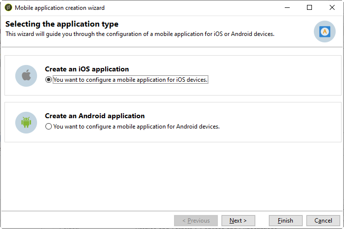

# Configuratiestappen voor iOS {#configuring-the-mobile-application-in-adobe-campaign-ios}

Nadat het pakket is geïnstalleerd, kunt u de iOS-toepassingsinstellingen definiëren in Adobe Campaign Classic.

>[!NOTE]
>
>Raadpleeg deze [sectie](../../delivery/using/configuring-the-mobile-application-android.md)voor informatie over het configureren van uw app voor Android en over het maken van een levering voor Android.

## Externe iOS-account configureren {#configuring-external-account-ios}

Voor iOS verzendt de iOS HTTP/2-connector meldingen naar de HTTP/2 APNs.

Om deze schakelaar te vormen, volg deze stappen:

1. Ga naar **[!UICONTROL Administration > Platform > External accounts]**.
1. Select the **[!UICONTROL iOS routing]** external account.
1. Vul op het **[!UICONTROL Connector]** tabblad het **[!UICONTROL Access URL of the connector]** veld in met de volgende URL: ```http://localhost:8080/nms/jsp/iosHTTP2.jsp```

   >[!NOTE]
   >
   > Vanaf Campaign versie 20.3 is de verouderde binaire iOS-connector van iOS afgeschaft. Als u deze connector gebruikt, moet u uw implementatie dienovereenkomstig aanpassen. [Meer informatie](https://helpx.adobe.com/campaign/kb/migrate-to-apns-http2.html)

   

1. Klik op **[!UICONTROL Save]**.

Uw iOS-connector is nu geconfigureerd. U kunt uw service gaan maken.

## iOS-service configureren {#configuring-ios-service}

>[!CAUTION]
>
>De toepassing moet zijn geconfigureerd voor pushacties VOORDAT deze wordt geïntegreerd in de SDK van Adobe Campaign.
>
>Indien dit niet het geval is, gelieve [deze pagina](https://developer.apple.com/documentation/usernotifications)te raadplegen.

1. Ga naar het **[!UICONTROL Profiles and Targets > Services and subscriptions]** knooppunt en klik **[!UICONTROL New]**.

   

1. Define a **[!UICONTROL Label]** and an **[!UICONTROL Internal name]**.
1. Ga naar het **[!UICONTROL Type]** veld en selecteer **[!UICONTROL Mobile application]**.

   >[!NOTE]
   >
   >De standaarddoelafbeelding is gekoppeld aan de tabel met ontvangers. **[!UICONTROL Subscriber applications (nms:appSubscriptionRcp)]** Als u een verschillende doelafbeelding wilt gebruiken, moet u een nieuwe doelafbeelding tot stand brengen en het ingaan op het **[!UICONTROL Target mapping]** gebied van de dienst. Voor meer bij het creëren van doelafbeelding, verwijs naar de gids [van de](../../configuration/using/about-custom-recipient-table.md)Configuratie.

   

1. Klik vervolgens op de **[!UICONTROL Add]** knop om het toepassingstype te selecteren.

   

1. Maak uw iOS-ontwikkelings- en -productieprogramma&#39;s. Raadpleeg deze [sectie](../../delivery/using/configuring-the-mobile-application.md#creating-ios-app) voor meer informatie.

## iOS mobiele toepassing maken {#creating-ios-app}

Nadat u de service hebt gemaakt, moet u nu uw iOS-toepassing maken:

1. Klik vanuit de nieuwe service op de **[!UICONTROL Add]** knop om het toepassingstype te selecteren.

   

1. Het volgende venster wordt weergegeven. Selecteer **[!UICONTROL Create an iOS application]** en begin door het **[!UICONTROL Label]** in te voeren.

   

1. U kunt desgewenst ook de inhoud van een pushbericht verrijken met andere inhoud **[!UICONTROL Application variables]** . Deze zijn volledig aanpasbaar en een deel van de berichtlading wordt verzonden naar het mobiele apparaat.
In het volgende voorbeeld voegen we **mediaURl** en **mediaExt** toe om uitgebreide pushmeldingen te maken en geven we de toepassing vervolgens de afbeelding weer die binnen het bericht moet worden weergegeven.

   

1. Op het **[!UICONTROL Subscription parameters]** tabblad kunt u de toewijzing definiëren met een extensie van het **[!UICONTROL Subscriber applications (nms:appsubscriptionRcp)]** schema.

   >[!NOTE]
   >
   >Zorg ervoor dat u niet hetzelfde certificaat gebruikt voor de ontwikkelingsversie (sandbox) en de productieversie van de toepassing.

1. Op het **[!UICONTROL Sounds]** tabblad kunt u opgeven welk geluid moet worden afgespeeld. Klik **[!UICONTROL Add]** en vul **[!UICONTROL Internal name]** gebied dat de naam van het dossier moet bevatten ingebed in de toepassing of de naam van het systeemgeluid.

1. Klik **[!UICONTROL Next]** om de ontwikkeltoepassing te configureren.

1. Zorg ervoor dat dit in Adobe Campaign en in de toepassingscode via de SDK **[!UICONTROL Integration key]** is gedefinieerd. Raadpleeg voor meer informatie: [Campagne SDK integreren in de mobiele toepassing](../../delivery/using/integrating-campaign-sdk-into-the-mobile-application.md). Met deze integratietoets, die specifiek is voor elke toepassing, kunt u de mobiele toepassing koppelen aan het Adobe Campaign-platform.

   >[!NOTE]
   >
   > De eigenschap **[!UICONTROL Integration key]** is volledig aanpasbaar met tekenreekswaarde, maar moet exact hetzelfde zijn als de waarde die in de SDK is opgegeven.

1. Selecteer een van de pictogrammen uit de doos van het **[!UICONTROL Application icon]** gebied om mobiele toepassing in uw dienst te personaliseren.

1. Selecteer het **[!UICONTROL Authentication mode]**. U kunt de verificatiemodus altijd later wijzigen op het **[!UICONTROL Certificate]** tabblad van uw mobiele toepassing.
   * **[!UICONTROL Certificate-based authentication]**: Klik **[!UICONTROL Enter the certificate...]** dan uw p12 sleutel selecteren en ga het wachtwoord in dat door de mobiele toepassingsontwikkelaar werd verstrekt.
   * **[!UICONTROL Token-based authentication]**: Vul de verbindingsinstellingen in **[!UICONTROL Key ID]**, **[!UICONTROL Team ID]** en **[!UICONTROL Bundle ID]** selecteer uw p8-certificaat door op **[!UICONTROL Enter the private key]**. For more on **[!UICONTROL Token-based authentication]**, refer to [Apple documentation](https://developer.apple.com/documentation/usernotifications/setting_up_a_remote_notification_server/establishing_a_token-based_connection_to_apns).

   >[!NOTE]
   >
   > Adobe raadt u aan **[!UICONTROL Token-based authentication]** voor uw iOS-configuratie te gebruiken, omdat deze verificatiemodus beter is beveiligd en niet aan certificaatvervaldatum is gebonden.

   

1. U kunt klikken **[!UICONTROL Test the connection]** om er zeker van te zijn dat dit gelukt is.

1. Klik **[!UICONTROL Next]** om de productietoepassing te configureren en dezelfde stappen te volgen als hierboven beschreven.

   

1. Klik op **[!UICONTROL Finish]**.

Uw iOS-toepassing kan nu worden gebruikt in Campaign Classic.

## Een rijke melding voor iOS maken {#creating-ios-delivery}

Met iOS 10 of hoger is het mogelijk om rijke meldingen te genereren. Adobe Campaign kan meldingen verzenden met behulp van variabelen waarmee het apparaat een uitgebreide melding kan weergeven.

U moet nu een nieuwe levering maken en deze koppelen aan de mobiele toepassing die u hebt gemaakt.

1. Ga naar **[!UICONTROL Campaign management]** > **[!UICONTROL Deliveries]**.

1. Klik op **[!UICONTROL New]**.

   

1. Selecteer **[!UICONTROL Deliver on iOS (ios)]** in de **[!UICONTROL Delivery template]** drop-down. Voeg een **[!UICONTROL Label]** object toe aan uw levering.

1. Klik **[!UICONTROL To]** om de populatie te bepalen die moet worden gericht. Standaard wordt de **[!UICONTROL Subscriber application]** doeltoewijzing toegepast. Klik **[!UICONTROL Add]** om de eerder gemaakte service te selecteren.

   

1. Selecteer in het **[!UICONTROL Target type]** venster **[!UICONTROL Subscribers of an iOS mobile application (iPhone, iPad)]** en klik op **[!UICONTROL Next]**.

1. Selecteer in de **[!UICONTROL Service]** vervolgkeuzelijst eerst de eerder gemaakte service, daarna de toepassing waarvoor u een toepassing wilt maken en klik op **[!UICONTROL Finish]**.
Het **[!UICONTROL Application variables]** wordt automatisch toegevoegd afhankelijk van wat tijdens de configuratiestappen werd toegevoegd.

   

1. Bewerk uw uitgebreide melding.

   

1. Schakel het **[!UICONTROL Mutable content]** vakje in het meldingsvenster voor bewerkingen in zodat de mobiele toepassing media-inhoud kan downloaden.

1. Klik en verzend uw levering. **[!UICONTROL Save]**

De afbeelding en webpagina moeten in de pushmelding worden weergegeven wanneer deze worden ontvangen op de mobiele iOS-apparaten van de abonnees.


